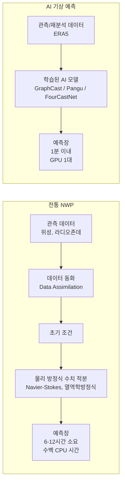
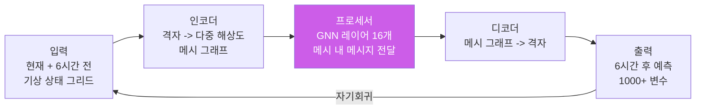
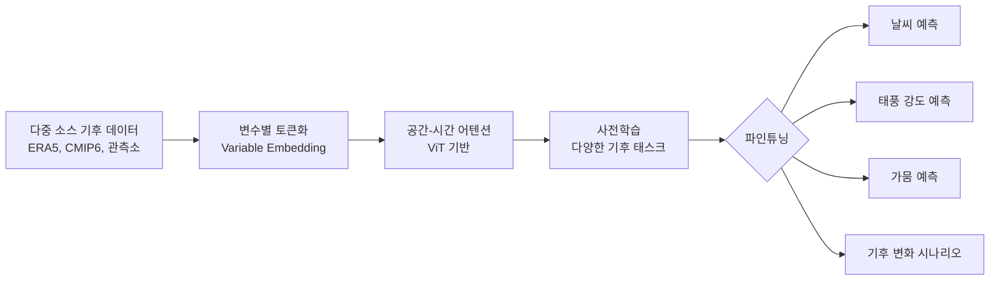
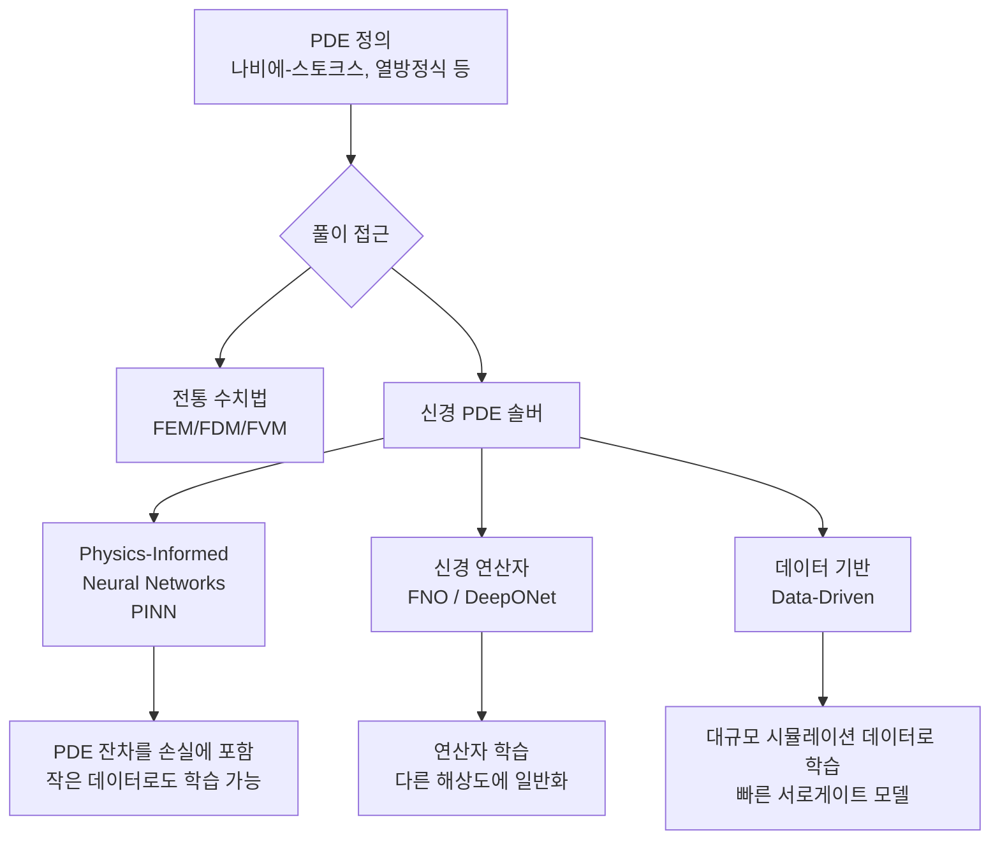
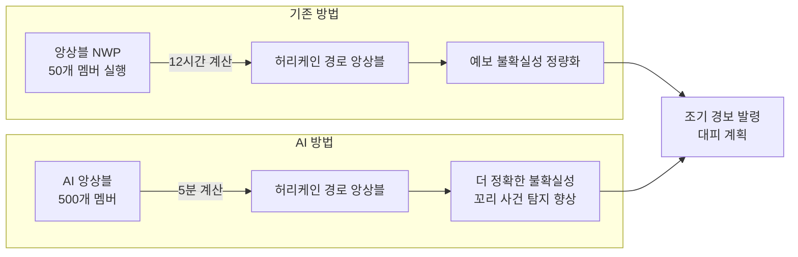
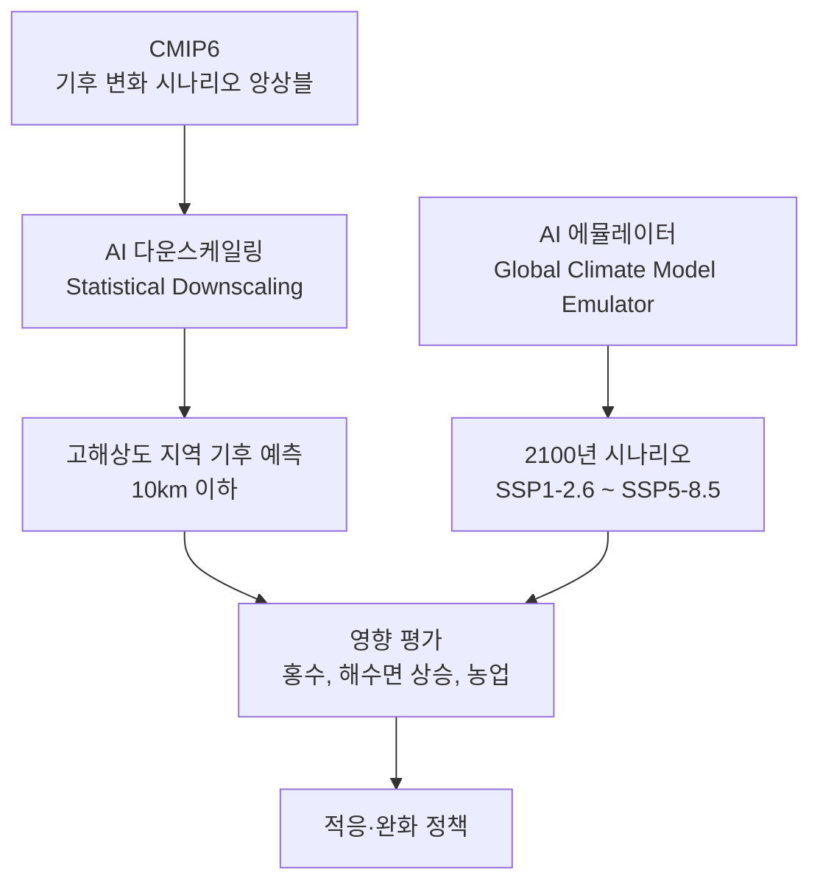

# AI 기후 모델링

## 개요

AI 기후 모델링은 기계학습, 그래프 신경망(GNN), 신경 편미분방정식(Neural PDE) 솔버를 결합해 대기·해양·지면 시스템의 상태를 예측하고 시뮬레이션하는 기술이다. 전통적 수치 기상 예측(NWP, Numerical Weather Prediction)은 물리 방정식을 이산화(discretization)해 슈퍼컴퓨터로 수치 적분한다. AI 모델은 대규모 재분석 데이터(reanalysis data)에서 패턴을 학습해 수치 모델보다 수백 배 빠르게 예측을 생성한다.

**실용적 의미**: 허리케인 경로 예측, 극한 폭염 조기 경보, 농업 기상 예측, 에너지 수요 예측, 기후 변화 시나리오 탐색이 훨씬 빠르고 저렴하게 가능해진다.

주요 응용:
- **단기 날씨 예측** (1-10일): 전통 NWP 수준 정확도를 1/1000 비용으로
- **계절 예측** (1-6개월): 몬순, 엘니뇨 조기 탐지
- **극한 날씨 이벤트**: 허리케인, 폭염, 대홍수 조기 경보
- **기후 변화 시뮬레이션**: 2100년까지의 시나리오 앙상블

## 핵심 아이디어

### 전통 NWP vs AI 기상 예측

**ERA5**: ECMWF(유럽 중기예보센터)의 기상 재분석 데이터셋. 1940년대부터 현재까지의 전 지구 대기 상태를 31km 해상도, 1시간 간격으로 복원한 데이터. AI 기상 모델 학습의 표준 데이터셋이다.

### 왜 AI가 빠른가

전통 NWP는 편미분방정식(PDE)을 작은 격자에서 수치 적분하므로 연산량이 격자 크기에 반비례해 기하급수적으로 증가한다. AI 모델은 이 PDE의 해(solution)를 근사하는 함수를 학습한다. 추론은 단순한 행렬 곱셈이므로 100-1000배 빠르다.

## 주요 AI 기후 모델

### GraphCast (DeepMind/Google, 2023)

그래프 신경망(Graph Neural Network) 기반 전 지구 날씨 예측 모델. Nature에 게재된 논문에서 ECMWF의 HRES(High-Resolution Deterministic Forecast) 예측 대비 1500개 기상 변수 중 90%에서 더 정확한 예측을 보고했다.

**GraphCast 아키텍처:**

- **격자 -> 그래프 매핑**: 전 지구를 0.25° 격자(약 28km)로 표현, 12단계 다중 해상도 이코사헤드론(icosahedron) 메시로 변환
- **자기회귀 롤아웃**: 6시간 스텝을 반복해 10일 예측 생성
- **훈련 데이터**: ERA5 1979-2016 (4,000만 시간 이상)

### Pangu-Weather (Huawei, 2023)

3D 지구 Transformer 아키텍처를 사용한 AI 날씨 모델. Nature에 게재됐으며 24시간 예측에서 ECMWF HRES를 능가한다고 보고했다. 특히 태풍 경로 예측에서 강점을 보인다.

**Pangu-Weather의 혁신:**
- **계층적 Transformer**: 수직 기압 레벨을 3D로 처리
- **다중 스케일 리드타임**: 1, 3, 6, 24시간 각각 별도 모델로 앙상블 (오류 누적 방지)

### FourCastNet (NVIDIA, 2022)

적응형 푸리에 신경 연산자(Adaptive Fourier Neural Operator, AFNO)를 기반으로 한 고해상도 기상 예측 모델. 0.25° 해상도에서 초당 수 테라바이트 데이터를 처리하는 속도를 강조했다.

### ClimaX (Microsoft/UCLA, 2023)

**기후 AI의 파운데이션 모델**을 지향. 다양한 기후 데이터셋에서 사전학습한 후 특정 예측 작업(태풍 강도, 가뭄 예측 등)에 파인튜닝할 수 있다. Vision Transformer 기반으로 시공간 변수를 변수별 토큰으로 처리한다.

**ClimaX의 차별점:**
- 불균일하고 희소한 관측 데이터 처리 가능
- 계절 예측, 다운스케일링, 기후 프로젝션 등 다양한 태스크에 적용
- 소수샷(few-shot) 적응 가능

### Aurora (Microsoft, 2024)

130M 파라미터 기상 파운데이션 모델. 기상, 공기질, 해양 파랑 예측을 통합하는 것을 목표로 한다. 다양한 해상도와 변수 세트에 적응할 수 있는 유연성을 특징으로 한다.

## 신경 PDE 솔버 (Neural PDE Solvers)

전통 수치 해석이 풀기 어려운 편미분방정식을 딥러닝으로 근사하는 기법이다. 기후 모델링 외에도 유체역학, 구조 해석, 금융 파생상품 가격 결정 등 넓은 분야에 적용된다.

### FNO (Fourier Neural Operator, 2020)

푸리에 공간에서 전역 합성곱 연산을 수행해 임의 해상도에서 PDE를 풀 수 있다. Navier-Stokes 방정식의 서로게이트 모델로 수치 해석 대비 1000배 이상 빠른 추론을 보고했다.

**기후 응용**: 대기 대순환 모델(GCM)의 특정 물리 과정(대류, 구름 형성)을 FNO로 대체하는 "신경 기후 서로게이트(neural climate surrogate)" 연구가 활발히 진행 중이다.

### PINN (Physics-Informed Neural Networks)

손실 함수에 PDE 잔차(residual)를 포함해 물리 법칙을 위반하지 않도록 학습한다. 관측 데이터가 희박한 경우에도 물리 제약으로 외삽(extrapolation) 성능을 유지한다.

## 극한 날씨 예측 가속

**ECMWF AIFS (Artificial Intelligence Forecasting System)**: ECMWF가 개발 중인 AI 앙상블 예측 시스템. 기존 ENS(앙상블) 대비 50배 빠른 속도로 더 많은 앙상블 멤버를 실행해 희귀 극한 이벤트(꼬리 확률 사건)의 예측 정확도를 높인다.

**허리케인 강도 급증(Rapid Intensification)**: 24시간 내 30kt 이상 강도 증가. 전통 NWP가 예측하기 어려운 현상이다. AI 모델들이 이 분야에서 개선을 보이고 있다.

## 기후 변화 시나리오 생성

**다운스케일링(Downscaling)**: 전 지구 기후 모델(GCM)의 저해상도 출력(100km+)을 지역 규모(10km 이하)로 세밀화한다. 딥러닝 기반 통계적 다운스케일링(Super-Resolution GAN 계열)이 전통 방법을 대체하고 있다.

**ClimateNet**: 기후 이벤트(열대 사이클론, 대기강(atmospheric river), 기압골) 감지를 위한 딥러닝 벤치마크 데이터셋.

## 주요 데이터셋 및 인프라

| 데이터셋 | 기관 | 설명 | 크기 |
|---------|------|------|------|
| ERA5 | ECMWF | 전 지구 기상 재분석 1940-현재 | ~5PB |
| CMIP6 | 세계기후연구프로그램 | 기후 변화 시나리오 앙상블 | 수PB |
| NOAA GFS | NOAA | 전 지구 예측 시스템 출력 | 지속 생성 |
| Climate TRACE | 민간 컨소시엄 | AI 기반 온실가스 배출량 추적 | |
| WeatherBench 2 | Google | AI 날씨 예측 벤치마크 | |

## 실제 사례

### ECMWF + Google/Microsoft 파트너십
세계 최고 기상 예보 기관 ECMWF가 GraphCast 개발에 협력하고, AIFS 시스템에 AI를 통합하는 전략적 전환을 발표했다. 2025년부터 AI 예측을 공식 예보에 통합하기 시작했다.

### NVIDIA Earth-2 플랫폼
NVIDIA는 Earth-2라는 기후 디지털 트윈 플랫폼을 발표했다. CorrDiff(확산 모델 기반 다운스케일링)를 이용해 전 지구 GCM 출력을 25km에서 2km 해상도로 상세화한다. [교차검증 필요: 상용 출시 및 검증 현황]

### Google DeepMind GraphCast 운영 배포
2023년 GraphCast는 ECMWF의 MARS 데이터 플랫폼에서 실시간 예측을 생성하기 시작했다. 기상청 및 재난 대응 기관이 활용 중이다.

### Climate TRACE (온실가스 배출 추적)
위성 데이터와 AI를 이용해 전 세계 섹터별 온실가스 배출량을 국가 보고 없이 독립적으로 추정한다. Al Gore가 공동 설립한 프로젝트로 철강, 시멘트, 석유·가스 시설의 배출량을 개별 추적한다.

### 한국기상청 AI 기상 예측
한국기상청은 AI 기반 초단기 강수 예측(RADAR 기반)과 AI 태풍 경로 예측 모델을 운영 도입했다. 2023년부터 AI 모델 예측 결과를 공식 예보에 활용하기 시작했다.

## 한계 및 트레이드오프

| 항목 | 내용 |
|------|------|
| 분포 외 일반화 | AI 모델은 학습 데이터 범위를 벗어난 기후 상태(미래 기후 변화)에서 성능이 불확실 |
| 물리 일관성 | AI 예측이 에너지·질량 보존 등 물리 법칙을 위반하는 경우 발생 |
| 앙상블 불확실성 | AI 모델의 예측 불확실성 정량화가 아직 전통 NWP 앙상블 수준에 미치지 못함 |
| 희귀 사건 | 훈련 데이터에 거의 없는 극한 이벤트 예측 성능이 제한적 |
| 해석 가능성 | "왜 이 예측이 나왔는가"를 물리적으로 설명하기 어려움 |
| 검증 어려움 | 기후 변화 시나리오는 수십 년 후에야 검증 가능 |

## 오픈 과학 이슈

- **모델 공개**: GraphCast, FourCastNet, ClimaX 등 주요 AI 기상 모델이 오픈소스로 공개됐다. 이는 기상 데이터 민주화와 글로벌 기상 예측 역량 강화에 기여한다.
- **기상 데이터 접근성**: ERA5 등 주요 데이터셋이 무료로 공개돼 있으나, 실시간 고해상도 상업 위성 데이터는 비용이 높다.
- **기후 정의**: AI 기상 예측의 혜택이 기술 인프라가 취약한 개발도상국에도 공평하게 전달돼야 한다.

## 관련 문서

- [[graph-neural-networks]] - GraphCast의 기반이 되는 GNN 기술
- [[neural-pde-solvers]] - 신경 PDE 솔버 상세
- [[ai-sustainability-optimization]] - 기후 AI와 지속 가능성 최적화
- [[ai-agriculture-farming]] - 기후 예측과 농업의 연계
- [[time-series-forecasting]] - 기후 시계열 예측 방법론
- [[transformer-architecture]] - Pangu-Weather, ClimaX의 기반 아키텍처
