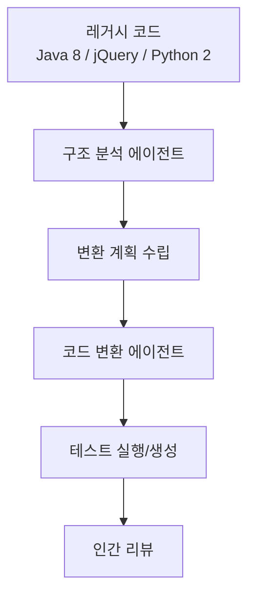

# AI 코드 마이그레이션

레거시 코드베이스를 새 언어, 프레임워크, API 버전으로 AI 에이전트가 자율 변환하는 대규모 리팩토링 패턴.

## 대표 시나리오

| 마이그레이션 | 도전 |
|-------------|------|
| Java -> Kotlin | 널 안전성, 확장 함수 |
| Python 2 -> 3 | print/unicode/bytes |
| React Class -> Hooks | 상태 관리 패턴 전환 |
| REST -> GraphQL | 스키마 설계, 리졸버 |
| 프레임워크 버전 업 | 브레이킹 체인지 대응 |

## [[coding-agent|코딩 에이전트]]의 강점

파일 단위 변환은 LLM이 잘 수행하지만, **프로젝트 전체 일관성**(import 경로, 네이밍 컨벤션)은 에이전트 루프가 필요하다. [[ai-coding-agent-era|AI 코딩 에이전트]]의 장기 실행 패턴과 연결.

## 관련 문서

- [[coding-agent]] -- 코딩 에이전트
- [[ai-coding-agent-era]] -- AI 코딩 에이전트 시대
- [[ai-test-generation]] -- AI 테스트 생성
