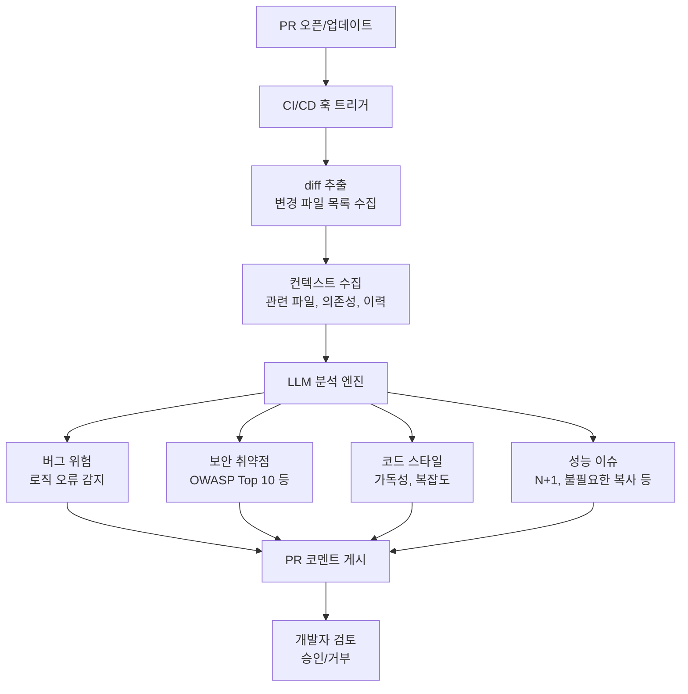
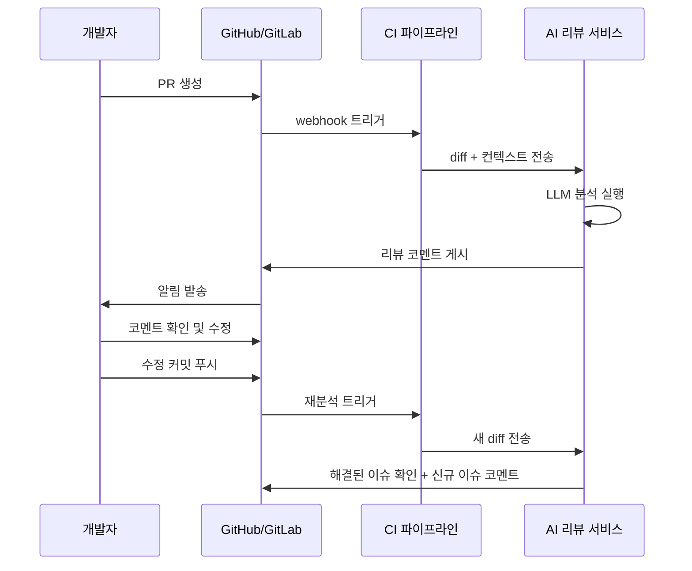

# AI 코드 리뷰 자동화 (AI Code Review Automation)

## 개요

AI 코드 리뷰 자동화는 LLM 기반 분석 도구를 CI/CD 파이프라인에 통합하여 PR(Pull Request) 단위로 코드 품질, 보안 취약점, 논리 오류를 자동으로 검출하고 개선 제안을 생성하는 패턴이다.

전통적인 정적 분석 도구(ESLint, SonarQube 등)가 규칙 기반의 고정된 패턴을 검출하는 데 그쳤다면, LLM 기반 리뷰는 코드의 의도와 맥락을 파악하여 의미론적 수준의 피드백을 제공할 수 있다. [[coding-agent|코딩 에이전트]] 기술과 결합하면 PR 설명 생성, 리뷰 코멘트 작성, 제안된 수정 코드 자동 커밋까지 자동화 범위를 확장할 수 있다. [[ai-code-review-tools|AI 코드 리뷰 도구]]는 이 패턴의 구체적 구현체들이다.

## 아키텍처: PR 단위 분석 파이프라인



## 핵심 기능 영역

### 1. 정적 분석과 LLM 분석의 역할 분담

두 접근법은 상호 보완적이다. 하나가 다른 하나를 대체하는 것이 아니라 계층적으로 결합해야 한다.

| 분석 유형 | 정적 분석 도구 | LLM 분석 |
|----------|--------------|---------|
| 구문 오류 | 빠르고 정확 | 불필요 (중복) |
| 코드 스타일 | 규칙 기반 | 맥락 기반 설명 가능 |
| 보안 취약점 | 패턴 매칭 | 비즈니스 로직 결합 취약점 |
| 로직 버그 | 제한적 | 강점 (의도 파악) |
| 성능 문제 | 제한적 | 알고리즘 수준 분석 |
| 문서화 품질 | 불가 | 강점 |

### 2. 컨텍스트 윈도우 관리

LLM 리뷰의 핵심 도전은 대형 PR의 diff가 컨텍스트 윈도우를 초과할 수 있다는 점이다.

- **청크 분할**: 파일 단위로 분할하여 순차 분석
- **요약 컨텍스트**: 대형 파일은 심볼 수준 요약만 전달
- **변경 우선**: diff가 큰 PR은 가장 중요한 변경 파일을 우선 분석
- **증분 분석**: 이전 리뷰 결과를 캐시하여 새 커밋의 변경분만 재분석

### 3. 심각도 분류와 액션 제안

고품질 AI 리뷰는 단순 문제 나열이 아닌 심각도 분류와 구체적인 수정 코드를 함께 제공한다.

```
[CRITICAL] 보안: 사용자 입력을 SQL 쿼리에 직접 보간 (SQL 인젝션 취약점)
           수정: 파라미터화된 쿼리 또는 ORM 사용 권장

[WARNING]  성능: 루프 내부에서 DB 쿼리 실행 (N+1 문제 가능성)
           수정: 관련 데이터를 루프 외부에서 일괄 조회 후 딕셔너리로 매핑

[INFO]     가독성: 함수 길이가 80라인 초과
           제안: 단일 책임 원칙에 따라 3개 함수로 분리 가능
```

## CI/CD 통합 패턴



## 대표 도구

| 도구 | 방식 | CI/CD 통합 | 강점 |
|------|------|-----------|------|
| CodeRabbit | LLM 기반 | GitHub/GitLab Actions | PR 요약, 체계적 리뷰 |
| Greptile | 코드베이스 인덱스 + LLM | GitHub | 프로젝트 전체 맥락 이해 |
| Sourcery | 정적 + AI | GitHub/GitLab/Bitbucket | 리팩토링 자동 제안 |
| Amazon CodeGuru | ML 기반 | AWS CodePipeline | Java/Python 전문화 |
| GitHub Copilot for PRs | LLM | GitHub native | PR 요약 생성 |

## 설계 원칙

**노이즈 최소화**: AI 리뷰는 너무 많은 코멘트를 생성하면 개발자가 피로해져 모두 무시하게 된다. 중요 이슈에만 집중하고 INFO 수준 피드백은 접기 기능을 활용한다.

**긍정적 강화 포함**: 문제점만 나열하지 않고 잘 작성된 코드에도 코멘트를 남기면 팀 문화 개선에 도움이 된다.

**학습 가능한 설정**: 팀별로 자주 무시하는 규칙 유형을 학습하여 점진적으로 노이즈를 줄이는 피드백 루프가 필요하다.

**비블로킹 원칙**: AI 리뷰 실패가 배포 블로킹이 되어서는 안 된다. AI 리뷰는 보조 채널이며 인간 리뷰를 대체하지 않는다.

## 한계

- 대규모 리팩토링 PR에서 변경 의도를 오해할 수 있다
- 도메인 특화 비즈니스 규칙을 이해하지 못한다
- 테스트 커버리지나 통합 동작은 정적 분석만으로 평가할 수 없다
- AI 리뷰 코멘트 자체에 오류나 잘못된 제안이 포함될 수 있다

## 관련 문서

- [[ai-code-review-tools|AI 코드 리뷰 도구]] - 구체적 도구 카탈로그
- [[coding-agent|코딩 에이전트]] - 리뷰 자동화를 수행하는 에이전트 기술
- [[ai-pair-programming|AI 페어 프로그래밍]] - 개발 단계에서의 AI 협업 패턴
- [[agentic-engineering|에이전틱 엔지니어링]] - 에이전트 기반 소프트웨어 개발
