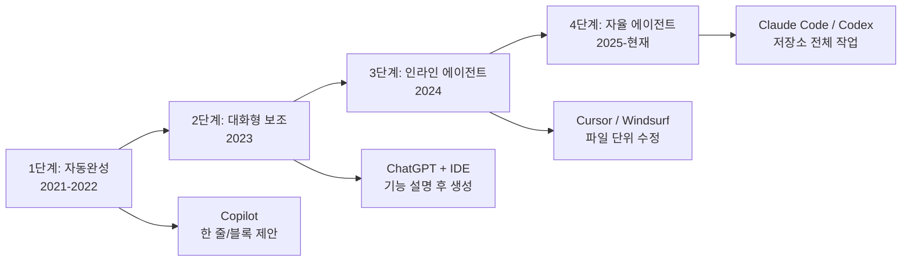
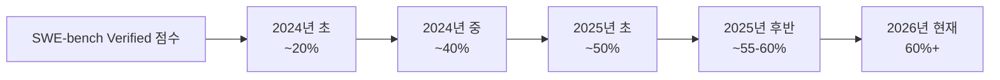

# AI 코딩 에이전트 시대 (The AI Coding Agent Era)

## 개요

2021년 GitHub Copilot의 등장으로 시작된 AI 코딩 보조 시대는 2025-2026년을 기점으로 자율 에이전트 시대로 전환되고 있다. 자동완성 수준의 코드 제안에서, 멀티 파일에 걸친 기능 전체를 자율적으로 구현하고, 테스트를 작성하고, 버그를 수정하며, PR을 생성하는 수준으로 역할이 근본적으로 확장되었다.

이 전환은 소프트웨어 엔지니어의 역할을 "코드를 직접 작성하는 사람"에서 "AI 에이전트를 지시하고 검토하는 오케스트레이터"로 변화시키고 있다. [[coding-agent]]가 핵심 기술 패턴을 다루고, [[claude-code]]가 이 시대의 대표적 도구 사례를 보여준다.

## 코딩 AI의 진화 단계

## 자율 에이전트의 핵심 역량

2025년 이후 등장한 자율 코딩 에이전트가 기존 도구와 다른 점:

**멀티 파일 편집:**
- 하나의 기능 요청이 10개 이상의 파일 수정을 수반할 때 일관된 변경 적용
- 파일 간 임포트, 타입 정의, 인터페이스 변경을 추적하고 동기화

**도구 사용:**
- 터미널 명령 실행 (빌드, 테스트, 린트)
- 파일 시스템 탐색 및 수정
- 브라우저 사용 (문서 조회, API 테스트)
- Git 작업 (브랜치 생성, 커밋, PR 생성)

**자기 수정 루프:**
- 테스트 실패 -> 원인 분석 -> 코드 수정 -> 재실행을 자율 반복
- 빌드 오류, 린트 경고를 스스로 해결

**컨텍스트 이해:**
- 코드베이스 전체 구조와 패턴을 파악한 상태에서 일관된 스타일로 코드 생성
- PR 설명, 이슈 컨텍스트를 읽고 의도를 이해

## Copilot에서 자율 에이전트로의 전환 비교

| 차원 | Copilot 시대 | 자율 에이전트 시대 |
|------|-------------|------------------|
| 작업 단위 | 함수/블록 | 기능/태스크 전체 |
| 사람의 역할 | 코드 작성자 | 지시자 + 검토자 |
| 컨텍스트 | 현재 파일 | 저장소 전체 |
| 도구 접근 | 없음 | 터미널, 파일, 브라우저 |
| 자율성 | 없음 (제안만) | 높음 (스스로 실행) |
| 피드백 루프 | 사람이 수동 | 에이전트가 자동 |

## SWE-bench로 본 진보

SWE-bench는 실제 GitHub 이슈를 에이전트가 자율적으로 해결하는 능력을 측정하는 벤치마크다.

이 점수는 소프트웨어 엔지니어링 작업의 상당 부분을 에이전트가 처리할 수 있음을 의미하지만, 아직 복잡한 아키텍처 결정이나 요구사항 해석은 인간이 필요하다.

## 엔지니어의 역할 변화

자율 에이전트 시대에 소프트웨어 엔지니어에게 더 중요해지는 역량:

**지시 능력 (Prompting / Direction):**
- 요구사항을 명확하고 검증 가능한 형태로 기술하는 능력
- 에이전트가 실패할 때 원인을 파악하고 재지시하는 디버깅 능력

**검토 능력 (Review):**
- AI 생성 코드의 논리적 오류, 보안 취약점, 성능 문제를 빠르게 감지
- "작동하는 코드"와 "올바른 코드"를 구분하는 안목

**아키텍처 판단:**
- 에이전트가 확장하기 쉬운 올바른 추상화와 구조를 설계하는 능력
- 에이전트에게 무엇을 위임할지, 직접 할지 판단

## 주의해야 할 패턴

**Vibe Coding의 위험:**
막연히 에이전트에게 기능을 요청하고 결과를 검토 없이 배포하는 관행. 코드가 작동하는 것처럼 보이지만 엣지케이스, 보안 취약점, 기술 부채가 빠르게 누적된다.

**컨텍스트 오염:**
에이전트에게 너무 많은 파일을 한 번에 보여주면 집중력이 분산되고 일관성이 떨어지는 결과가 나올 수 있다.

**과도한 자율화:**
프로덕션 배포, 데이터베이스 마이그레이션, 외부 서비스 API 호출이 포함된 작업은 인간의 명시적 승인 게이트가 필요하다.

## 관련 문서

- [[coding-agent]] - 코딩 에이전트의 기술적 패턴과 설계 원칙
- [[claude-code]] - Claude Code 에이전트 상세 분석
- [[ai-devops-cicd]] - 코딩 에이전트와 CI-CD 파이프라인 통합
- [[agentic-engineering]] - 에이전틱 엔지니어링 전반 개념
