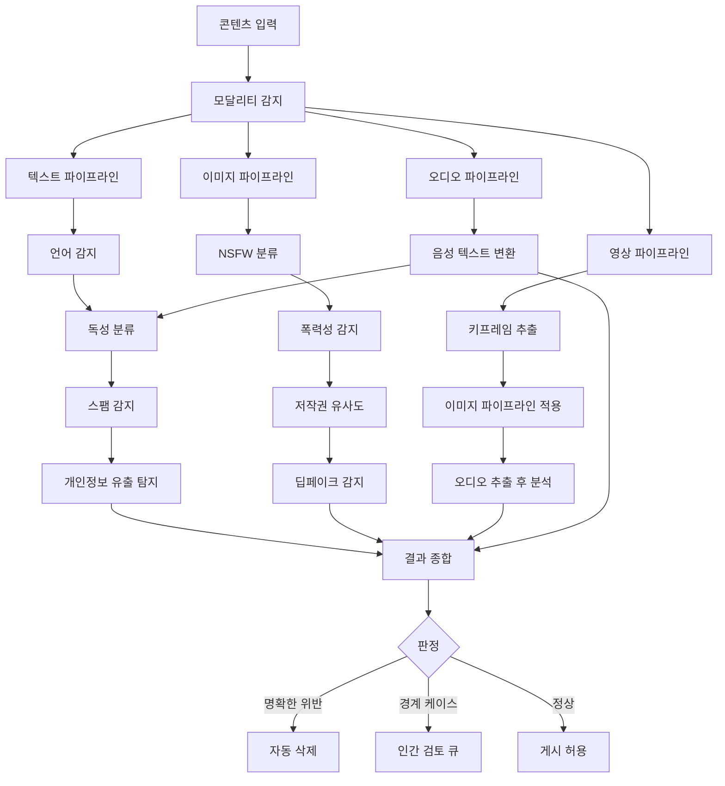
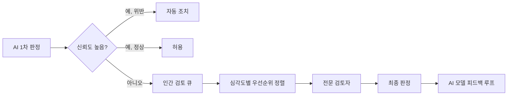

# AI 콘텐츠 모더레이션 (AI Content Moderation)

## 개요

AI 콘텐츠 모더레이션은 텍스트, 이미지, 영상, 오디오 등 다양한 형태의 콘텐츠를 자동으로 분류하고 플랫폼 정책 위반 여부를 판단하는 시스템이다. 수억 명이 사용하는 소셜 플랫폼에서 인간만으로 콘텐츠를 검토하는 것은 물리적으로 불가능하므로, AI 기반 자동화가 필수 인프라가 되었다.

[[ai-safety-gap-2026]] 관점에서 이 시스템은 단순한 분류기를 넘어 사회적 가치와 플랫폼 정책을 실시간으로 집행하는 중요한 역할을 한다. [[constitutional-classifiers]]는 이러한 모더레이션 시스템의 이론적 기반을 제공한다.

## 멀티모달 분류 파이프라인

## 분류 카테고리 체계

콘텐츠 위반은 심각도와 맥락에 따라 계층적으로 분류된다.

**절대 금지 (Zero-Tolerance):**
- 아동 성착취 콘텐츠 (CSAM)
- 테러리즘 선동 및 조직 관련 콘텐츠
- 실제 폭력 행위 영상

**맥락 의존적 판단 필요:**
- 성인 콘텐츠 (플랫폼 정책에 따라 허용 범위 상이)
- 혐오 발언 (풍자/비판과 구분 필요)
- 자해/자살 관련 (예방 정보 vs. 조장)
- 허위 정보 (시사성, 명확성 정도)

**정책 위반:**
- 스팸 및 조작된 참여 유도
- 지식재산권 침해
- 개인정보 무단 공개

## 딥페이크 감지

2026년 현재 딥페이크 콘텐츠가 급증하면서 전문 감지 모델이 콘텐츠 모더레이션의 핵심 구성요소로 자리잡았다.

**감지 신호:**

| 신호 | 설명 |
|------|------|
| 얼굴 일관성 | 프레임 간 얼굴 텍스처/조명의 비자연스러운 변화 |
| 생체 신호 | 눈 깜빡임 패턴, 맥박 색변화 부재 |
| 출처 메타데이터 | C2PA 표준 콘텐츠 출처 정보 확인 |
| 주파수 분석 | GAN 생성물에서 나타나는 특유의 고주파 패턴 |

C2PA(Content Provenance and Authenticity) 표준이 2025년부터 주요 플랫폼에 도입되어, 콘텐츠의 생성 도구와 변경 이력을 서명으로 추적하는 인프라가 갖춰지고 있다.

## 인간-AI 협업 모더레이션

순수 자동화는 오탐(false positive)으로 인한 정당한 표현 억압, 미탐(false negative)으로 인한 유해 콘텐츠 유포 양쪽 리스크가 있다. 성숙한 시스템은 명확한 케이스는 AI가 처리하고, 불확실한 케이스는 숙련된 인간 검토자에게 전달하는 하이브리드 구조를 사용한다.

## 구현 시 고려사항

**편향(Bias) 문제:**
- 특정 언어/방언, 문화적 맥락에서 모더레이션 품질 격차 발생
- 소수 집단 표현이 다수 집단보다 높은 오탐율을 보이는 경향
- 정기적 편향 감사(bias audit)와 다양한 언어/문화 학습 데이터 확보 필요

**투명성:**
- 삭제/차단 결정에 대한 이의 제기(appeal) 메커니즘 필수
- EU DSA(Digital Services Act) 등 규제가 알고리즘 투명성을 요구하고 있음

**속도와 정확도의 트레이드오프:**
- 빠른 자동 판정 vs. 느리지만 정확한 인간 검토
- 바이럴 초기 단계에 개입하려면 속도가 중요

## 관련 문서

- [[ai-safety-gap-2026]] - AI 안전성과 콘텐츠 정책의 연결
- [[constitutional-classifiers]] - 규칙 기반 분류기 설계 원칙
- [[alignment-faking]] - AI가 모더레이션 정책을 우회하려는 패턴
