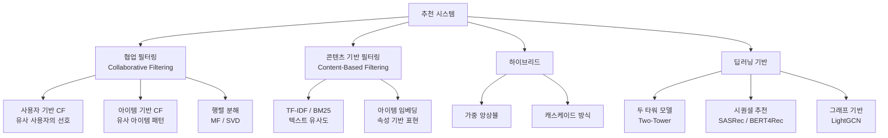
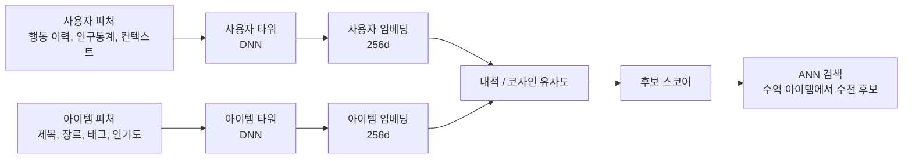
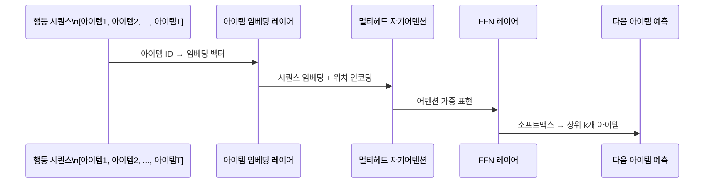
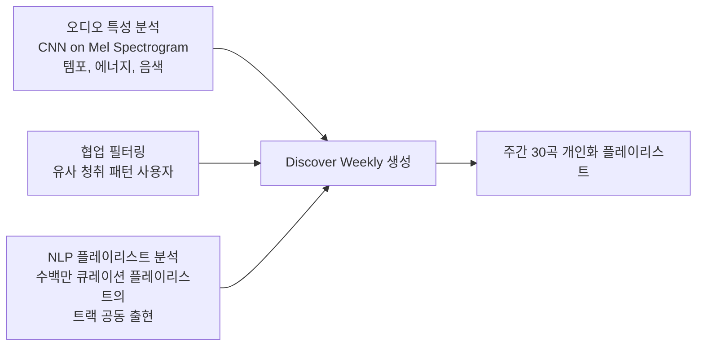

# AI 콘텐츠 추천 시스템

## 개요

콘텐츠 추천 시스템(content recommendation system)은 사용자의 행동 이력과 선호도를 분석해 관련성 높은 콘텐츠를 자동으로 선별해 제시하는 AI 시스템이다. Netflix의 영화 추천, YouTube의 다음 동영상, Spotify의 플레이리스트, 뉴스 피드 등이 대표 사례다.

추천 시스템은 정보 과부하(information overload) 문제를 해결하는 핵심 인프라다. 콘텐츠가 수억 개인 플랫폼에서 사용자가 직접 탐색하는 것은 불가능하다. 추천 엔진이 사용자 참여(engagement)와 플랫폼 가치를 직결시킨다.

**Netflix의 데이터**: 넷플릭스에서 재생되는 콘텐츠의 약 80%가 추천 시스템을 통해 발견된다. 추천 알고리즘이 연간 10억 달러 이상의 가치를 창출한다고 추산.

## 추천 시스템 분류

---

## 1. 협업 필터링 (Collaborative Filtering)

### 핵심 아이디어

"나와 비슷한 사용자가 좋아한 것을 나도 좋아할 것이다." 개별 아이템의 속성을 몰라도, 사용자-아이템 상호작용 행렬에서 패턴을 찾아 추천한다.

**명시적(explicit) vs. 암묵적(implicit) 피드백**:
- 명시적: 별점 평가, 좋아요 - 수집하기 어렵지만 의도가 명확
- 암묵적: 클릭, 재생, 구매, 체류 시간 - 풍부하지만 "봤다"가 곧 "좋아한다"가 아님

### 행렬 분해 (Matrix Factorization)

사용자-아이템 상호작용 행렬 $R \in \mathbb{R}^{m \times n}$을 두 저차원 행렬로 분해한다.

$$R \approx U \cdot V^T, \quad U \in \mathbb{R}^{m \times k}, V \in \mathbb{R}^{n \times k}$$

$U$는 사용자 임베딩, $V$는 아이템 임베딩. 내적(dot product)이 예상 평점이 된다.

**ALS (Alternating Least Squares)**: U를 고정하고 V를 최적화, V를 고정하고 U를 최적화하는 교대 반복. 대규모 분산 처리에 적합해 Spark의 기본 MF 알고리즘.

---

## 2. 두 타워 모델 (Two-Tower Model)

### 아키텍처

대규모 추천 시스템의 사실상 표준 후보 생성 아키텍처다. [[two-tower-model]] 개념 페이지 참조.

**핵심 특성**:
- **독립 인코딩**: 두 타워가 독립적으로 임베딩을 계산하므로, 아이템 임베딩을 오프라인으로 미리 계산해 저장 가능 → 추론 시 ANN(Approximate Nearest Neighbor) 검색만 필요
- **확장성**: 수억 개 아이템에 대해 실시간 내적 계산이 아닌 벡터 검색으로 수십ms 내 처리 가능

**Google YouTube의 Two-Tower DNN (2019)**: 유튜브 추천의 후보 생성 단계에서 검증된 구조. 수십억 사용자 × 수억 동영상 규모에서 운영.

---

## 3. 트랜스포머 기반 시퀀셜 추천

### SASRec (Self-Attentive Sequential Recommendation)

사용자의 행동 시퀀스를 트랜스포머로 처리한다.

**인과적 마스킹(causal masking)**: 위치 t의 예측은 t 이전 아이템만 볼 수 있도록 마스킹. 자기회귀(autoregressive) 방식으로 다음 아이템을 예측.

### BERT4Rec

BERT의 마스크드 언어 모델(MLM)을 추천에 적용. 시퀀스 중 일부 아이템을 마스킹하고 예측하도록 학습. 양방향 어텐션으로 더 풍부한 시퀀스 표현 학습.

---

## 4. Netflix, Spotify, YouTube 패턴 분석

### Netflix: 다중 단계 랭킹 + 맥락 인식

**넷플릭스 추천 파이프라인**:
1. **후보 생성**: 협업 필터링, 행렬 분해, 세션 기반 추천으로 수천 개 후보
2. **랭킹**: 시청 완료율, 재시청률, 클릭률 예측을 결합한 복합 모델
3. **맥락 조정**: 주말 저녁 vs. 점심시간, 혼자 vs. 같이 볼 가능성 반영
4. **다양성 보장**: 알고리즘 점수만 반영하면 너무 비슷한 콘텐츠가 몰림 → MMR(Maximal Marginal Relevance) 등으로 다양성 확보

**썸네일 A/B 테스팅**: 넷플릭스는 같은 콘텐츠에 수십 개 썸네일을 만들어 사용자별 클릭률이 높은 썸네일을 개인화하여 제공. 썸네일 개인화만으로도 클릭률이 크게 개선.

### Spotify: 오디오 분석 + 협업 필터링 + NLP

**Discover Weekly의 비결**: 단순 콘텐츠 기반도 협업 필터링도 아닌, 수백만 개의 사용자 생성 플레이리스트를 NLP적으로 분석해 트랙 간 "문맥적 유사성"을 학습. 같은 플레이리스트에 자주 같이 등장하는 트랙은 유사한 것으로 간주.

### YouTube: 다단계 필터링 + 강화학습

**YouTube 추천 아키텍처의 핵심 진화**:

- **2016년 딥뉴럴네트워크**: 후보 생성(MF 대체) + 랭킹(DNN) 분리 구조 공개
- **2019년 Two-Tower**: 대규모 확장성을 위한 Two-Tower 후보 생성
- **강화학습 도입**: 즉각적 클릭률뿐만 아니라 시청 시간, 사용자 만족도, 장기 참여 최적화. 단기 clickbait와 장기 가치의 균형을 RL로 학습

---

## 5. A/B 테스팅 및 실험 설계

### 추천 시스템 실험의 고유한 어려움

**네트워크 효과**: 사용자 A에게 다른 추천을 보여주면 A의 행동이 변하고, 이것이 B에게 보여줄 추천에도 영향 (협업 필터링 특성상)

**노출 편향(exposure bias)**: 모델이 추천한 것만 클릭 기회를 얻고, 추천하지 않은 아이템의 진짜 선호도는 알 수 없음

**장기 효과 측정**: 추천 품질이 사용자의 6개월 뒤 만족도에 미치는 영향을 단기 A/B로 측정하기 어려움

### 오프라인 평가 지표

| 지표 | 설명 | 한계 |
|------|------|------|
| NDCG (Normalized Discounted Cumulative Gain) | 순위 고려한 추천 품질 | 오프라인 평가가 온라인 성과와 불일치 빈번 |
| Hit Rate@K | 상위 K개 안에 실제 클릭 아이템 포함률 | 노출 편향에 취약 |
| Precision@K / Recall@K | 상위 K개의 정밀도/재현율 | 다양성 미고려 |

**오프라인 평가의 한계**: 오프라인 지표와 실제 온라인 A/B 결과가 일치하지 않는 경우가 많다. 최종 검증은 온라인 A/B 테스트가 필수. [[ab-testing]] 참조.

---

## 6. 다양성, 공정성, 신선함 제어

### 알고리즘적 다양성 vs. 개인화

순수하게 높은 예측 점수만으로 목록을 채우면 매우 비슷한 아이템이 반복 노출된다.

**MMR (Maximal Marginal Relevance)**: 각 아이템을 추가할 때 관련성과 이미 선택된 아이템과의 다양성을 함께 고려.

$$\text{score}(i) = \lambda \cdot \text{relevance}(i) - (1-\lambda) \cdot \max_{j \in S} \text{similarity}(i, j)$$

$\lambda = 1$이면 순수 관련성, $\lambda = 0$이면 순수 다양성.

### 신선함 (Freshness) 강제

인기 아이템만 추천하면 신규 아이템이 추천될 기회가 없어 냉각 시작(cold start) 문제가 반복된다.

- **시간 가중치**: 최근 인터랙션에 높은 가중치
- **신규 아이템 탐색 예산**: 추천 슬롯 일부를 명시적으로 신규 아이템에 할당
- **UCB (Upper Confidence Bound)**: 탐색-활용 균형을 위한 밴딧(bandit) 접근

---

## 한계 및 트레이드오프

### 인기 편향 (Popularity Bias)

협업 필터링은 인기 아이템에 더 많은 인터랙션 데이터가 있어 더 잘 학습되고, 결국 더 많이 추천된다. 롱테일(long-tail) 아이템은 추천 기회를 잃는다.

### 프라이버시 vs. 개인화 품질

더 많은 행동 데이터를 수집할수록 개인화 품질이 높아지지만, 프라이버시 침해 우려도 커진다. 연합학습([[federated-learning]])과 차등 프라이버시가 대안이지만 성능 손실이 있다.

### 필터 버블과 사회적 영향

유튜브 등 소셜 미디어 추천이 사용자를 극단적 콘텐츠로 유도하는 "래빗홀(rabbit hole)" 현상이 사회적 문제로 부상했다. 참여 최적화 추천이 건강한 정보 소비와 충돌하는 윤리적 딜레마.

---

## 관련 문서

- [[two-tower-model]] - 두 타워 아키텍처 상세
- [[recommendation-systems]] - 추천 시스템 이론
- [[ab-testing]] - 추천 실험 설계
- [[ai-personalization-engines]] - 추천을 넘어선 전체 개인화 시스템
- [[user-modeling]] - 사용자 표현 학습
