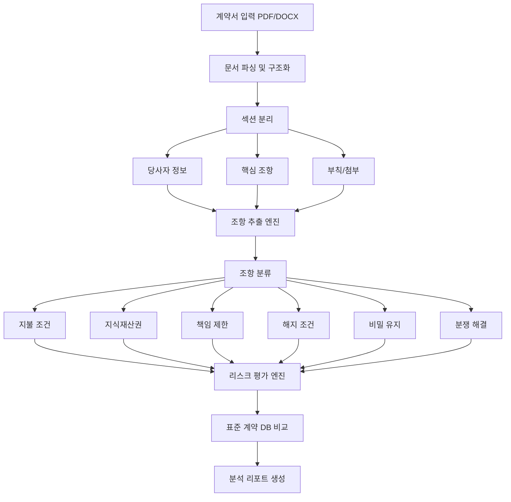
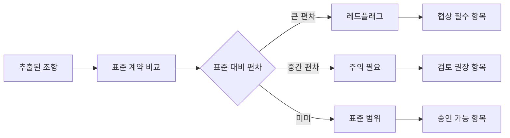

# AI 계약서 분석 (AI Contract Analysis)

## 개요

AI 계약서 분석은 LLM이 계약 문서를 읽고 주요 조항을 추출하고, 불리하거나 비표준적인 조항을 식별하며, 법적 리스크를 평가하는 패턴이다. 기업 법무팀이 수백 페이지의 계약서를 검토하는 데 걸리던 수 시간에서 수 일의 작업을 수 분으로 단축할 수 있다.

[[rag-pipeline]]을 통해 이전 계약서, 판례, 업계 표준 조항 데이터베이스를 실시간으로 참조하며, [[ai-legal]] 도메인의 더 넓은 법률 AI 생태계와 맞닿아 있다.

## 계약서 분석 파이프라인

## 핵심 분석 기능

### 조항 추출 및 정규화

계약서에서 추출하는 주요 조항 유형:

| 조항 유형 | 추출 항목 | 리스크 신호 |
|-----------|-----------|-------------|
| 지불 조건 | 금액, 기일, 지연 이자율 | 높은 지연 이자, 짧은 지불 기간 |
| 책임 제한 | 배상 한도, 면책 범위 | 아측 책임은 무제한, 상대방 제한 |
| 해지 조건 | 사유, 통지 기간, 위약금 | 일방적 해지권, 과도한 위약금 |
| IP 소유권 | 귀속 주체, 라이선스 범위 | 용역 결과물 IP 귀속 불명확 |
| 비밀 유지 | 대상 정보, 존속 기간 | 기간 제한 없는 NDA |
| 분쟁 해결 | 준거법, 관할 법원/중재 | 상대방에게 유리한 관할 |

### 리스크 식별 및 분류

**레드플래그 예시:**
- 면책 조항이 아측의 과실까지 포함
- 자동 갱신 조항에 해지 통지 기간이 매우 짧음 (30일 미만)
- IP 귀속 조항이 모호하여 핵심 기술 소유권 분쟁 가능성
- 손해배상 상한이 계약 금액보다 낮음

## RAG 기반 표준 계약 비교

단순히 조항을 읽는 것을 넘어, 축적된 계약서 데이터베이스와 비교하는 것이 AI 계약 분석의 차별점이다.

**비교 데이터 소스:**
- 업계 표준 계약 템플릿 (ISDA, NEC, FIDIC 등)
- 자사 과거 계약서 아카이브
- 공개된 법원 판결에서 추출한 문제 조항 패턴
- 법무 팀이 축적한 협상 이력

비교를 통해 "이 조항은 업계 표준 대비 어느 방향으로 얼마나 벗어났는가"를 정량적으로 표현하고, 과거 유사 계약에서 해당 조항이 어떻게 협상됐는지 참고 사례를 제공한다.

## 계약 검토 보고서 구조

자동 생성되는 계약 분석 리포트의 표준 구조:

1. **요약 (Executive Summary)**: 계약의 핵심 조건과 총 리스크 수준을 1페이지로 요약
2. **당사자 및 기간**: 계약 당사자, 효력 발생일, 기간, 갱신 조건
3. **재무 조건**: 계약 금액, 지불 일정, 위약금 구조
4. **리스크 매트릭스**: 레드/옐로/그린 플래그를 조항별로 정리한 표
5. **협상 권고**: 수정이 필요한 조항과 제안 대안 문구
6. **누락 조항**: 업계 표준에는 있으나 이 계약서에 없는 보호 조항

## 한계와 주의사항

AI 계약 분석은 강력하지만 법적 조언을 대체하지 않는다.

- AI의 조항 해석이 특정 관할 법원의 판례와 다를 수 있음
- 계약서의 비공식 보완 합의(side agreement)는 분석 불가
- 업계별 관행 차이를 완전히 반영하기 어려움
- 최종 법적 판단은 반드시 법무 전문가가 검토해야 함

실무에서는 AI를 "1차 검토 및 이슈 플래깅 도구"로 활용하고, 중요 계약은 법무팀이 AI 리포트를 기반으로 심층 검토하는 하이브리드 워크플로우가 권장된다.

## 관련 문서
- [[ai-financial-analysis]] -- AI 금융 분석 에이전트

- [[rag-pipeline]] - 계약서 지식베이스 구축 및 검색 파이프라인
- [[ai-legal]] - 법률 AI의 더 넓은 생태계
- [[ai-customer-support]] - 유사한 문서 이해 + RAG 패턴의 다른 적용
