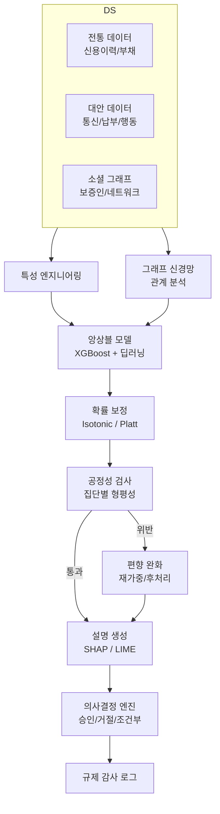
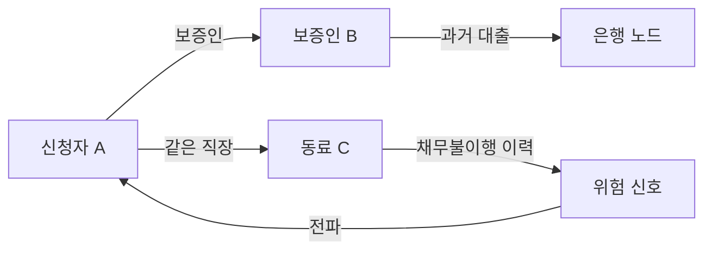
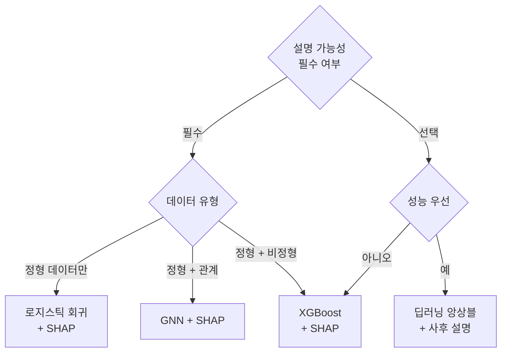

# AI 신용 평가 (AI Credit Scoring)

## 개요

AI 신용 평가는 대출 신청자의 채무 불이행 위험을 머신러닝 모델로 예측하는 시스템이다. 전통적인 FICO 스코어 방식이 신용 이력, 부채 비율, 상환 기록 등 좁은 범위의 정형 데이터에 의존했다면, AI 기반 접근은 대안 데이터(alternative data), 그래프 관계, 행동 패턴을 통합해 더 넓은 모집단을 대상으로 세밀한 리스크 측정이 가능하다.

금융 포용(financial inclusion) 측면에서 특히 중요한데, 신용 이력이 없는 신규 사회 진입자나 개발도상국 소비자도 스코어링 대상으로 편입할 수 있기 때문이다. 단, 모델이 과거 사회적 편향을 학습할 위험이 있어 공정성 제약과 설명 가능성이 핵심 설계 요소로 부상했다.

## 시스템 아키텍처



위 흐름에서 전통 데이터와 대안 데이터가 병렬로 입력되고, 그래프 관계 정보는 별도 GNN (Graph Neural Network) 경로로 처리된 후 앙상블에 합산된다. 공정성 검사를 통과하지 못한 결과는 편향 완화 루프를 거쳐 재처리된다.

## 주요 컴포넌트

### 1. 대안 데이터 (Alternative Data)

전통 신용 데이터만으로는 "씬 파일(thin-file)" 고객을 평가할 수 없다. 대안 데이터는 이 공백을 메운다.

| 데이터 유형 | 구체 예시 | 신호 의미 |
|------------|---------|----------|
| 통신 납부 | 휴대폰 요금 정기 납부 여부 | 의무 이행 습관 |
| 유틸리티 | 전기/수도 연체 이력 | 현금 흐름 관리 능력 |
| 전자상거래 | 쇼핑 패턴, 반품률 | 충동성/계획성 지표 |
| 지리 데이터 | 거주지 안정성, 이동 패턴 | 고용/생활 안정성 |
| 앱 사용 | 가계부 앱 사용 빈도 | 재무 관심도 |
| 소셜 네트워크 | 연결된 지인의 신용도 | 사회적 자본 |

대안 데이터 활용 시 개인정보 동의, 데이터 품질, 프라이버시 침해 위험을 반드시 평가해야 한다.

### 2. 그래프 ML (Graph Machine Learning)

개인의 신용 위험은 연결된 네트워크의 영향을 받는다. 보증인 관계, 동일 직장 동료, 지인 네트워크에서 채무 불이행이 전파되는 패턴이 관찰된다.



GNN은 이웃 노드 특성을 집계(aggregation)하여 노드 임베딩을 생성한다. GraphSAGE (Graph SAmple and aggreGatE)나 Graph Attention Network (GAT)가 자주 사용된다.

$h_v^{(k)} = \sigma\left(W^{(k)} \cdot \text{AGGREGATE}\left(\{h_u^{(k-1)} : u \in \mathcal{N}(v)\}\right)\right)$

여기서 $\mathcal{N}(v)$는 노드 $v$의 이웃 집합, $W^{(k)}$는 $k$번째 레이어의 가중치다.

### 3. 공정성 제약 (Fairness Constraints)

신용 평가 모델이 인종, 성별, 나이 등 보호 속성(protected attribute)에 따라 차별적 결과를 낼 경우 법적·윤리적 문제가 발생한다. 미국의 Equal Credit Opportunity Act (ECOA), EU의 AI Act 등이 공정성 요건을 법제화하고 있다.

주요 공정성 지표:

- **통계적 동등(Demographic Parity)**: 집단 간 승인율 차이가 허용 범위 내
  $|P(\hat{Y}=1|A=0) - P(\hat{Y}=1|A=1)| \leq \epsilon$

- **균등화된 오즈(Equalized Odds)**: 집단 간 TPR(True Positive Rate)과 FPR(False Positive Rate)이 동일
  $P(\hat{Y}=1|Y=1, A=0) = P(\hat{Y}=1|Y=1, A=1)$

- **교정(Calibration)**: 동일한 예측 점수에서 집단별 실제 채무 불이행 확률이 동일

공정성 지표들은 서로 상충(trade-off)하는 경우가 많다. 예를 들어 통계적 동등과 균등화된 오즈를 동시에 만족하는 것은 수학적으로 불가능한 경우가 있다(Chouldechova, 2017).

편향 완화 전략:
- **전처리(Pre-processing)**: 훈련 데이터 재샘플링, 특성 변환
- **학습 중(In-processing)**: 공정성 제약을 손실 함수에 추가 ($L = L_{acc} + \lambda \cdot L_{fair}$)
- **후처리(Post-processing)**: 집단별 임계값(threshold) 조정

### 4. 설명 가능성 (Explainability)

규제 당국과 소비자 모두 "왜 거절됐는지" 알 권리를 갖는다. GDPR Article 22, ECOA Adverse Action Notice 등이 의사결정 근거 제공을 의무화한다.

**SHAP (SHapley Additive exPlanations)**:
게임 이론의 샤플리 값을 기반으로 각 특성이 예측에 기여한 양을 계산한다.

$\phi_i = \sum_{S \subseteq F \setminus \{i\}} \frac{|S|!(|F|-|S|-1)!}{|F|!} [f(S \cup \{i\}) - f(S)]$

SHAP 출력 예시:
```
신용 스코어 예측: 650 (거절 임계 680)

주요 감점 요인:
- 최근 90일 연체 이력:  -45점
- 신용 이용률 85%:      -30점
- 신용 거래 기간 6개월: -20점

주요 가점 요인:
- 안정적 납부 이력 2년: +35점
- 소득 대비 부채 낮음:  +10점
```

**LIME (Local Interpretable Model-agnostic Explanations)**: 예측 주변 로컬 구간에서 선형 모델로 근사하여 설명 생성.

### 5. 규제 준수 (Regulatory Compliance)

| 규제 | 지역 | 핵심 요건 |
|------|------|---------|
| Equal Credit Opportunity Act (ECOA) | 미국 | 거절 시 부정적 조치 통지 의무 |
| Fair Credit Reporting Act (FCRA) | 미국 | 소비자의 오류 정정 요청권 |
| GDPR Article 22 | EU | 자동화된 의사결정에 대한 이의 제기권 |
| EU AI Act (고위험 AI) | EU | 인간 감독, 투명성, 정확성 요건 |
| 신용정보법 | 한국 | 개인 신용정보 처리 동의 및 보호 |

규제 감사 로그에는 다음 항목이 포함되어야 한다: 예측 입력 특성, 모델 버전, 공정성 지표 스냅샷, 설명 근거, 심사자 ID.

## 모델 선택 가이드



실무에서는 XGBoost / LightGBM 기반 앙상블이 성능과 설명 가능성의 균형점으로 가장 널리 사용된다. 딥러닝은 비정형 데이터(문서, 텍스트)가 풍부할 때 유리하다.

## 실제 사례

### Upstart (미국 핀테크)
전통 FICO 스코어 외에 1,600개 이상의 특성(교육 수준, 직업 이력 등)을 활용하는 AI 모델을 사용한다. 기존 모델 대비 채무 불이행률 75% 감소를 주장하며, 특히 씬 파일 고객 승인률을 높였다.

### Branch (아프리카/아시아 마이크로파이낸스)
스마트폰 사용 패턴, 문자 메시지 메타데이터(수신/발신 빈도), 앱 설치 목록을 대안 데이터로 활용한다. 신용 이력이 없는 개발도상국 사용자를 대상으로 소액 대출 심사를 자동화했다.

### 국내 인터넷 전문 은행
카카오뱅크, 케이뱅크 등은 통신 납부 이력, 간편결제 데이터를 금융 데이터와 결합한 대안 신용평가 모델을 운영한다. 2022년 금융위원회의 대안신용평가 가이드라인에 따라 운용된다.

## 성능 평가 지표

- **AUC-ROC**: 임계값에 독립적인 판별력 측정. 신용 평가에서 0.72~0.80이 일반적 목표
- **Kolmogorov-Smirnov (KS) 통계**: 우량/불량 고객 분포 분리 정도
- **Gini 계수**: AUC 기반 파생 지표. Gini = 2 * AUC - 1
- **Population Stability Index (PSI)**: 훈련/배포 데이터 분포 편차 모니터링

```python
from sklearn.metrics import roc_auc_score
import numpy as np

def ks_statistic(y_true, y_pred_proba):
    """Kolmogorov-Smirnov 통계량 계산"""
    pos_proba = y_pred_proba[y_true == 1]
    neg_proba = y_pred_proba[y_true == 0]
    pos_sorted = np.sort(pos_proba)
    neg_sorted = np.sort(neg_proba)
    # KS = max(CDF_positive - CDF_negative) 차이
    from scipy.stats import ks_2samp
    ks_stat, _ = ks_2samp(pos_sorted, neg_sorted)
    return ks_stat
```

## 한계 및 윤리적 고려사항

### 역사적 편향의 재생산
AI 모델이 과거 차별적 대출 관행으로 오염된 데이터를 학습하면 편향을 그대로 재생산한다. 예를 들어 특정 지역에 대한 대출 거절률이 높았던 역사적 패턴이 우편번호 특성에 반영될 수 있다.

### 대안 데이터의 프라이버시 침해
스마트폰 데이터, 소셜 그래프 등을 활용하는 것은 정보 주체의 동의 없는 감시로 이어질 위험이 있다. 동의의 범위와 데이터 보관 기간에 대한 명확한 정책이 필요하다.

### 모델 드리프트 (Model Drift)
경제 환경 변화(금리 인상, 경기 침체)로 훈련 시점의 데이터 분포가 배포 시점과 달라질 수 있다. PSI 모니터링과 정기 재훈련 파이프라인이 필수다.

### 채리 피킹 (Cherry-picking) 위험
AI 모델이 수익성 높은 고객만 선별하는 방향으로 최적화될 경우 금융 포용이라는 사회적 목표와 충돌한다.

## 관련 문서

- [[ai-fraud-detection]] - 신용 평가와 함께 작동하는 금융 사기 탐지 시스템
- [[fairness-ml]] - 머신러닝 공정성 지표 및 편향 완화 기법
- [[explainable-ai]] - SHAP, LIME 등 설명 가능 AI 기법 총정리
- [[ai-anomaly-detection]] - 신용 평가와 연계되는 이상 거래 탐지
- [[graph-neural-networks]] - GNN 기반 관계 분석 기법
- [[regulatory-ai]] - AI 시스템의 규제 준수 프레임워크
