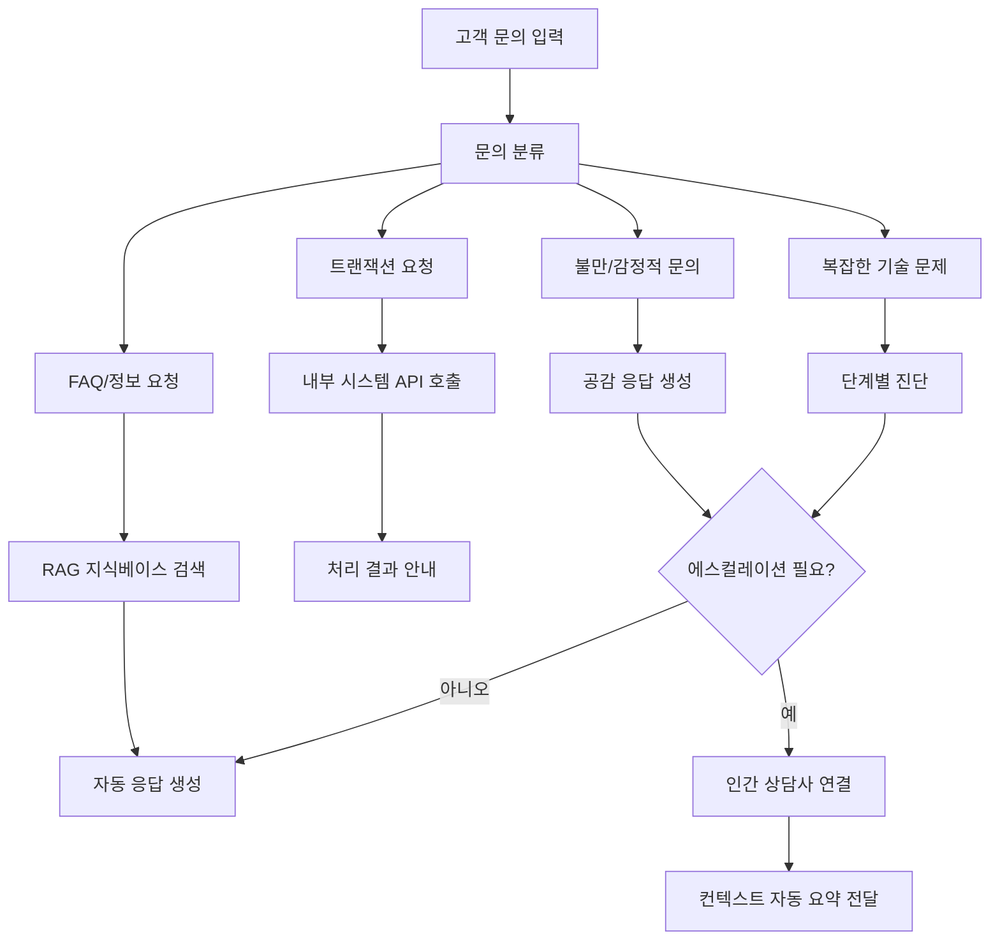
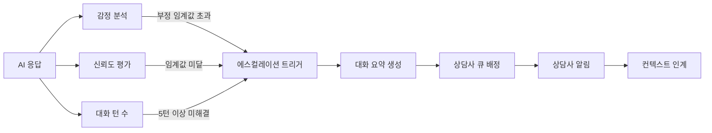

# AI 고객 지원 자동화 (AI Customer Support Automation)

## 개요

AI 고객 지원 자동화는 LLM 기반 에이전트가 고객 문의의 1차 응대를 처리하고, 해결 불가 케이스를 인간 상담사에게 적절히 에스컬레이션(escalation)하는 패턴이다. 단순 FAQ 챗봇과 달리 컨텍스트를 유지하며 복잡한 문의도 처리하고, 필요 시 내부 시스템과 연동하여 실제 업무를 수행한다.

[[rag-pipeline]]을 통해 최신 제품 정보, 정책 문서, 과거 케이스를 실시간으로 조회하며, [[agent-workflow-patterns]]의 도구 사용 패턴으로 주문 조회, 환불 처리, 계정 관리 등의 액션을 직접 수행한다.

## 고객 지원 에이전트 아키텍처

## 1차 자동 처리 패턴

**처리 가능한 문의 유형:**

| 유형 | 예시 | 자동화 수준 |
|------|------|-------------|
| 배송 조회 | "내 주문은 어디에 있나요?" | 완전 자동 |
| 반품/환불 신청 | "환불 요청하고 싶어요" | 정책 확인 후 자동 처리 |
| 비밀번호 재설정 | "로그인이 안 돼요" | 자동 링크 발송 |
| 제품 사양 문의 | "이 제품 배터리 용량은?" | RAG 검색 후 응답 |
| 구독 변경 | "플랜을 업그레이드하고 싶어요" | 옵션 안내 + 처리 |

**처리 불가 케이스 (인간 에스컬레이션):**
- 법적 분쟁 가능성이 있는 문의
- 감정이 극도로 고조된 고객
- 명확한 정책이 없는 예외 상황
- 보안/사기 의심 케이스

## 에스컬레이션 로직

에스컬레이션 시 AI는 다음을 자동으로 준비한다:

1. **대화 요약**: 고객이 원하는 것, 시도한 해결책, 현재 상황을 3-5줄로 요약
2. **고객 이력**: CRM에서 가져온 과거 문의, 구매 이력, VIP 여부
3. **제안 해결책**: AI가 시도하려 했던 다음 단계
4. **감정 온도계**: 현재 고객의 감정 상태 표시

이를 통해 상담사는 처음부터 다시 시작하지 않고 맥락을 이어받아 대응할 수 있다.

## 지식베이스 연동 (RAG 활용)

고객 지원 AI의 품질은 지식베이스의 품질에 직결된다.

**효과적인 지식베이스 구성:**
- **정책 문서**: 환불, 보증, 배송 정책 등 (버전 관리 필수)
- **제품 매뉴얼**: 자주 묻는 기술 문제와 해결책
- **과거 케이스**: 해결된 유사 케이스를 벡터화하여 유사 문의 시 참조
- **실시간 공지**: 서비스 장애, 프로모션, 정책 변경 사항

RAG 검색 결과는 날짜와 출처를 함께 제공하여, AI가 오래된 정보를 확신하며 응답하는 환각(hallucination)을 최소화한다.

## 성과 지표

AI 고객 지원 자동화 도입 시 추적할 핵심 지표:

- **자동 해결율 (Containment Rate)**: 인간 개입 없이 해결된 문의 비율 - 목표 50-70%
- **첫 번째 응답 시간 (FRT)**: 자동화 후 평균 수 초로 단축 가능
- **고객 만족도 (CSAT)**: 자동 응답에 대한 만족도 별도 추적
- **에스컬레이션 품질**: 상담사가 컨텍스트를 재확인하는 빈도

## 관련 문서

- [[rag-pipeline]] - 지식베이스 검색 증강 생성 파이프라인
- [[agent-workflow-patterns]] - 에이전트 도구 사용 및 워크플로우 패턴
- [[ai-incident-response]] - 내부 장애 대응과의 유사 패턴 비교
