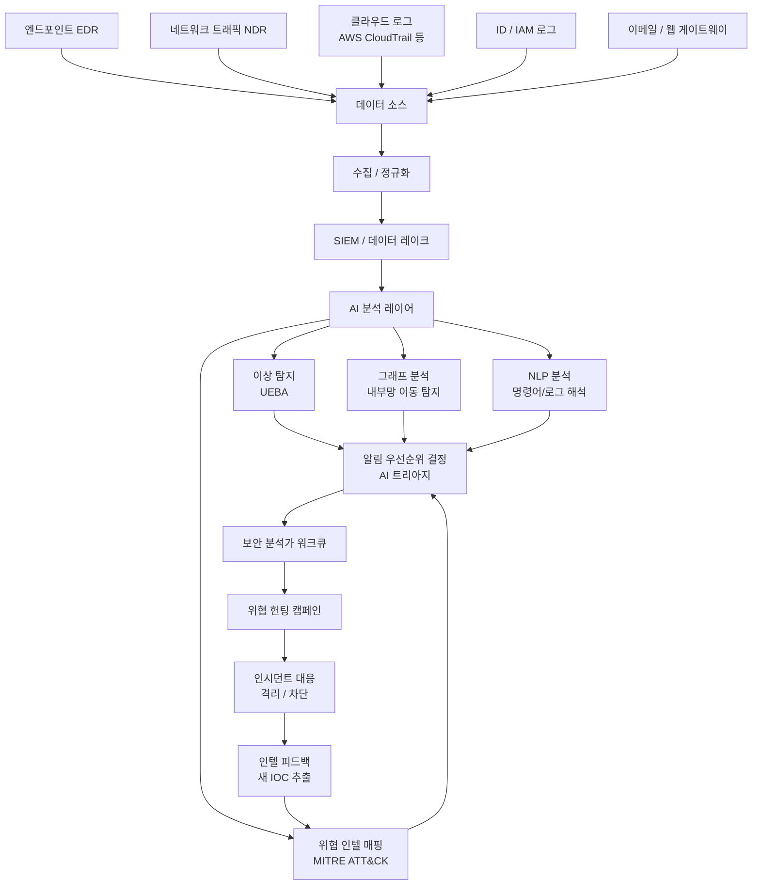
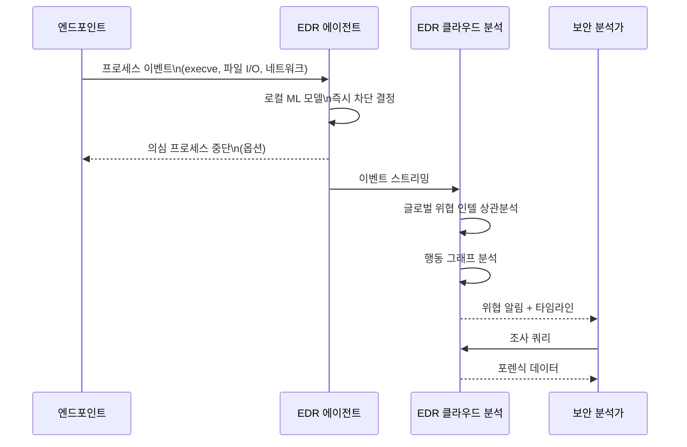
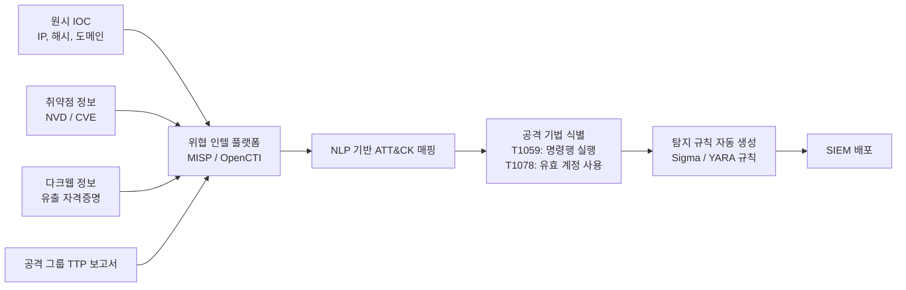

# AI 사이버 위협 헌팅

## 개요

위협 헌팅(threat hunting)은 자동화된 보안 도구가 놓친 알려지지 않은 위협(unknown unknowns)을 사람이 적극적으로 찾아내는 보안 활동이다. AI는 이 과정에서 두 가지 역할을 한다.

1. **신호 증폭**: 방대한 로그와 이벤트에서 인간 분석가가 주목해야 할 패턴을 자동으로 식별
2. **가설 생성**: 위협 인텔리전스와 과거 사례를 기반으로 "공격자가 다음에 할 행동" 예측

전통적인 보안 도구(시그니처 기반 안티바이러스, 규칙 기반 SIEM)는 알려진 위협에 강하지만, 제로데이(zero-day), APT(Advanced Persistent Threat), 내부자 위협(insider threat)에는 취약하다. AI 기반 위협 헌팅은 이 갭을 메운다.

## 전체 파이프라인

---

## 1. SIEM 및 EDR 통합

### SIEM (Security Information and Event Management)

SIEM은 조직 전체의 보안 이벤트를 중앙 수집하고 상관 분석하는 플랫폼이다. AI는 SIEM의 두 핵심 문제를 해결한다.

**알림 피로(alert fatigue)**: 대기업 SIEM은 하루 수백만 개의 알림을 생성한다. 보안팀이 모두 검토하기 불가능하여 중요 알림이 매몰된다. AI 트리아지(triage) 모델이 알림을 위험도로 순위를 매기고 false positive를 필터링한다.

**상관 규칙의 한계**: 수작업으로 작성된 상관 규칙은 알려진 패턴에만 동작한다. ML 기반 이상 탐지는 규칙에 없는 새로운 공격 패턴을 발견할 수 있다.

### EDR (Endpoint Detection and Response)

엔드포인트(PC, 서버)의 모든 프로세스 실행, 파일 변경, 네트워크 연결, 레지스트리 수정을 기록한다. AI 분석 포인트:

- **프로세스 트리 이상**: `cmd.exe` → `powershell.exe` → `WMI 원격 실행` 같은 비정상 부모-자식 프로세스 체인
- **파일리스 악성코드(fileless malware)**: 파일을 디스크에 쓰지 않고 메모리에서만 실행. 프로세스 행동 패턴으로만 탐지 가능
- **LOLBins (Living off the Land Binaries)**: 합법적 시스템 도구(`certutil`, `regsvr32`)를 공격에 악용하는 기법. 도구 자체는 정상이므로 **사용 맥락** 분석이 필요

---

## 2. UEBA (User and Entity Behavior Analytics)

UEBA는 사용자와 엔티티(서버, 애플리케이션)의 행동 기준선(baseline)을 학습하고 이탈을 탐지한다. 내부자 위협과 계정 탈취에 특히 효과적이다.

### 행동 기준선 모델링

**UEBA 주요 시나리오**:

| 시나리오 | 탐지 신호 | 위협 유형 |
|---------|----------|---------|
| 새벽 대용량 다운로드 | 평소 9-6시 근무 → 새벽 2시 대규모 파일 접근 | 내부자 데이터 유출 |
| 비정상 로그인 위치 | 서울 로그인 후 30분 내 런던 로그인 | 계정 탈취 |
| 권한 상승 후 이상 접근 | 일반 직원 계정이 DB 서버 직접 쿼리 | 내부 권한 남용 / 침해 |
| 대량 삭제 활동 | 평소 없던 파일 대량 삭제 | 사보타주 / 랜섬웨어 준비 |

---

## 3. 위협 인텔리전스 자동화 및 MITRE ATT&CK 매핑

### MITRE ATT&CK 프레임워크

MITRE ATT&CK는 공격자의 전술(tactics), 기법(techniques), 절차(procedures)를 체계화한 지식 베이스다. AI는 수집된 위협 데이터를 ATT&CK 매트릭스에 자동으로 매핑해 분석가가 "공격의 어느 단계에 있는가"를 빠르게 파악하게 돕는다.

**NLP의 역할**: 사이버 위협 인텔리전스 보고서는 비구조화 텍스트로 작성된다. NER(Named Entity Recognition)과 관계 추출(relation extraction) 모델이 보고서에서 IOC(Indicators of Compromise), TTP, 공격 그룹 정보를 자동 추출해 ATT&CK로 매핑한다.

### 위협 헌팅 가설 자동 생성

LLM을 활용한 위협 헌팅 가설 생성은 새로운 활용 패턴이다.

> "이 조직의 환경 + 최신 위협 인텔리전스를 기반으로 가장 가능성 높은 공격 경로 5가지와 각각의 탐지 쿼리를 생성하라"

분석가가 직접 가설을 생각하는 데 드는 시간을 줄이고, 자동 생성된 SIEM 쿼리로 탐지 커버리지를 확장한다.

---

## 4. 이상 탐지 모델 패턴

사이버 보안 이상 탐지는 [[ai-anomaly-detection]]의 특화 응용이다.

### 타임시리즈 이상 탐지

네트워크 트래픽, 로그인 횟수, API 호출 등 시계열 데이터의 이상을 탐지한다.

- **LSTM/Transformer 기반 예측**: 다음 T 시점 값을 예측하고, 실제값과의 잔차가 크면 이상
- **Isolation Forest**: 고차원 공간에서 이상점을 효율적으로 격리
- **OCSVM (One-Class SVM)**: 정상 데이터만으로 학습한 경계 밖을 이상으로 분류

### 내부망 이동(Lateral Movement) 탐지

공격자가 초기 침입 지점에서 내부망을 횡단하며 가치 있는 자산에 접근하는 과정이다.

**그래프 기반 탐지**: 내부망 연결(어떤 호스트가 어떤 호스트에 접속하는가)을 그래프로 표현하면, 비정상적 연결 패턴(새로운 엣지, 단시간 내 많은 새 노드 접속)이 이동 경로로 나타난다.

---

## 5. AI 기반 알림 트리아지 및 조사 자동화

보안 운영 센터(SOC)의 가장 큰 병목은 알림 검토 시간이다. AI는 다음 방식으로 이를 가속한다.

### 자동 트리아지

- **알림 클러스터링**: 동일 캠페인에서 발생한 알림을 하나의 인시던트로 묶기
- **컨텍스트 자동 수집**: 알림 발생 시 관련 로그, 자산 정보, 위협 인텔 자동 조회
- **우선순위 점수**: 자산 중요도 × 취약도 × 위협 심각도 조합 점수

### LLM 보조 조사

최근 Copilot for Security(Microsoft), Google SecOps Gemini 같은 제품이 보안 분석가의 자연어 질문에 답하는 형태로 제공된다.

- `"이 알림의 공격 기법은 무엇이고, 유사한 과거 인시던트가 있었는가?"`
- `"이 IP의 과거 활동 요약을 보여줘"`
- `"이 프로세스 트리에서 의심스러운 지점과 다음 조사 단계를 제안해줘"`

LLM은 보안 지식을 가진 주니어 분석가처럼 동작하며, 시니어 분석가의 판단을 지원한다.

---

## 한계 및 트레이드오프

### 고급 공격자 대응의 어려움

AI 탐지 시스템에 대한 전술적 회피(evasion)는 이미 공격 킬체인의 일부가 됐다. Adversarial ML 기법으로 모델을 우회하거나, 행동을 기준선과 구분하기 어렵게 천천히 움직이는 "슬로우 앤 로우(slow and low)" 전략 등.

### 데이터 과부하 vs. 저로깅 딜레마

로그를 많이 수집할수록 탐지 커버리지가 올라가지만 스토리지 비용과 분석 부하가 폭증한다. 조직마다 가치 있는 데이터소스를 선별하는 데이터 전략이 필요하다.

### 모델 설명 가능성 vs. 법적 대응

사이버 보안 사고 대응에서 "AI가 의심스럽다고 했다"는 것만으로는 법적 조치, 직원 징계, 외부 신고가 불가능하다. 인간 분석가의 판단이 반드시 개입돼야 한다.

### 비용

EDR + SIEM + AI 분석 플랫폼의 완전한 스택은 대기업 수준 보안 예산이 필요하다. 중소기업은 MSSP(Managed Security Service Provider)를 통해 AI 기반 탐지를 서비스로 소비하는 모델이 현실적.

---

## 관련 문서

- [[ai-anomaly-detection]] - 이상 탐지 기법 심화
- [[ai-aiops-log-analysis]] - AIOps 로그 분석과의 연계
- [[ai-network-monitoring]] - 네트워크 트래픽 모니터링
- [[ai-fraud-detection]] - 사기 탐지와의 공통 기법
- [[ai-incident-response]] - AI 기반 인시던트 대응 자동화
