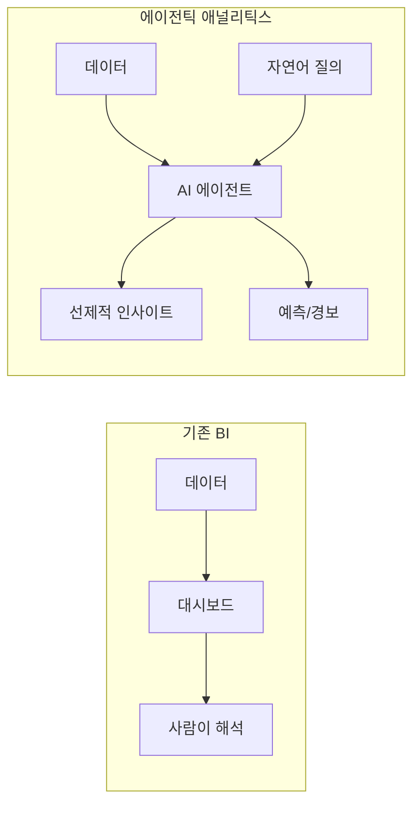

# AI 데이터 분석 & 에이전틱 애널리틱스

## 개요

AI 데이터 분석은 대화형 자연어 인터페이스가 전통적인 대시보드 BI(Business Intelligence)를 대체하는 패러다임 전환을 가리킨다. [[ai-finance|AI 금융]]과 [[ai-healthcare|AI 헬스케어]]에서 에이전틱 애널리틱스 도입이 특히 빠르다. 사용자가 SQL이나 차트 빌더를 다룰 필요 없이 자연어로 질문하면 즉시 인사이트, 차트, 예측을 받을 수 있다. 2026년 글로벌 AI 지출이 3,000억 달러를 초과할 것으로 IDC가 전망하는 가운데, [[enterprise-ai-adoption|엔터프라이즈 AI 도입]]이 가속화하고 있다, 데이터 분석은 AI 투자의 핵심 영역으로 부상했다.

에이전틱 애널리틱스는 여기서 한 단계 더 나아가, [[agentic-ai-production|AI 에이전트]]가 스스로 데이터를 탐색하고, 가설을 세우고, 분석을 수행하고, 이상 징후를 사전에 알려주는 자율적 분석 패턴을 의미한다. 인간이 "무엇을 볼지" 지시하던 기존 모델에서 AI가 "무엇을 봐야 하는지" 선제적으로 제안하는 모델로 전환된다.

## 핵심 개념

### 5대 트렌드 (2026)

**1. 에이전틱 AI 분석의 부상**
자율 시스템이 독립적으로 분석 워크플로우를 계획, 실행, 검증한다. Snowflake가 Anthropic과 **2억 달러 규모 파트너십**을 발표하여 엔터프라이즈 데이터 플랫폼의 에이전틱 역량을 강화한 것이 대표적 사례다.

**2. 자연어-SQL(NL2SQL) 변환 표준화**
자연어 인터페이스가 대시보드를 대체한다. Salesforce가 2025년 8월 NL2SQL 기업 **Waii를 인수**한 것이 시장의 방향성을 보여준다. SQL 작성 없이 분석 접근성이 대폭 확대되며, 비기술 직군도 데이터 기반 의사결정에 직접 참여할 수 있게 된다.

**3. 예측 분석의 대규모화**
과거 데이터 중심에서 미래 중심으로 전환된다. 예측 분석 시장은 2025년 **174.9억 달러**에서 2034년 **1,002억 달러**(CAGR 21.4%)로 성장이 전망된다. 클라우드 기반 예측 솔루션만 2032년 **741.8억 달러**에 달할 전망이다. 수요 예측, 이탈 방지, 사기 탐지 등이 특화 프로젝트에서 조직 전반의 워크플로우로 확산된다.

**4. 실시간 및 엣지 분석**
데이터를 중앙 웨어하우스 대신 소스에서 직접 처리하여 레이턴시를 시간 단위에서 밀리초 단위로 단축한다. 기존의 일/주 단위 배치 리포트가 실시간 인사이트 스트림으로 대체된다.

**5. 데이터 메시 및 분산 애널리틱스**
중앙집중식 데이터 웨어하우스에서 도메인 소유권 기반 분산 모델로 전환되면서, 각 도메인 팀이 자체 데이터 프로덕트를 관리하되 거버넌스 규칙은 중앙에서 강화한다.

**6. 거버넌스 우선 AI 분석**
EU AI Act 등으로 설명 가능성, 감사 가능성, 투명성이 의무화된다. 현대적 플랫폼은 데이터 리니지 추적, SQL 투명성, 역할 기반 접근 제어, 감사 로그, 자동화된 GDPR/SOC2/HIPAA 컴플라이언스를 내장해야 한다.

### 대시보드 vs 대화형 분석

## 기술 상세

### 에이전틱 분석 아키텍처

에이전틱 애널리틱스 시스템은 다음 구성요소로 이루어진다.

- **자연어 인터페이스**: 사용자 질의를 SQL 또는 분석 코드로 변환
- **데이터 커넥터**: 다양한 데이터 소스(DB, API, 파일)에 대한 통합 접근
- **분석 에이전트**: 자율적 데이터 탐색, 가설 생성, 이상 탐지 수행
- **시각화 엔진**: 인사이트에 적합한 차트/표를 자동 선택하여 렌더링
- **설명 가능성 레이어**: 분석 과정과 결론에 대한 근거 제시

### 시장 규모

| 지표 | 수치 | 출처 |
|------|------|------|
| DSAI 세그먼트 성장률 (2024) | 38.6% | Gartner |
| 분석 플랫폼 시장 (2025) | 486억 달러 (CAGR 15.5%) | - |
| 예측 분석 시장 (2025->2034) | 174.9억 -> 1,002억 달러 | CAGR 21.4% |
| 클라우드 예측 솔루션 (2032) | 741.8억 달러 | - |
| BFSI 예측 분석 매출 (2024) | 39.9억 달러 | - |
| AI 소프트웨어 지출 증가율 | 전체 소프트웨어 시장 대비 50% 빠름 | - |

### 엔터프라이즈 준비 과제

- **AI 리터러시 강화**: 조직 구성원의 AI 분석 도구 활용 역량 교육
- **데이터 거버넌스 현대화**: 데이터 품질, 접근 권한, 감사 추적 체계 정비. 데이터 리니지, SQL 투명성, 역할 기반 접근 제어 필수
- **FinOps 실행**: AI 분석 인프라의 비용 최적화 및 ROI 측정
- **셀프서비스 민주화**: 로코드/노코드 플랫폼으로 조직 전반의 데이터 분석 접근성 확대
- **자동 리포트 생성**: 데이터에서 내러티브를 자동 생성하는 AI 리포트 제너레이터 수요 급증 (월 1,000회 이상 검색)

## 관련 문서

- [[deepeval]] -- LLM 평가 프레임워크
- [[ai-hot-topics-2026-04]] -- 2026년 AI 핫토픽 종합
