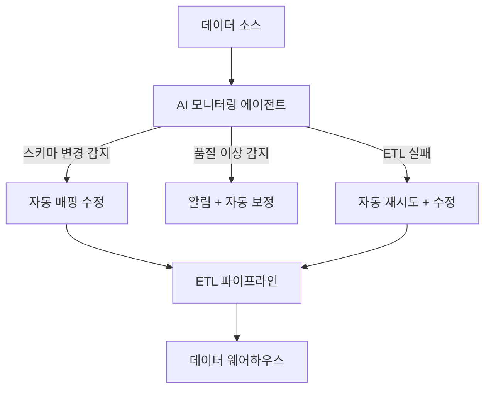
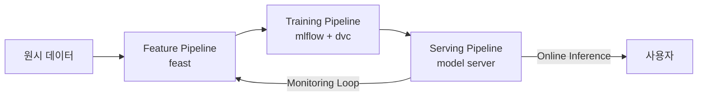
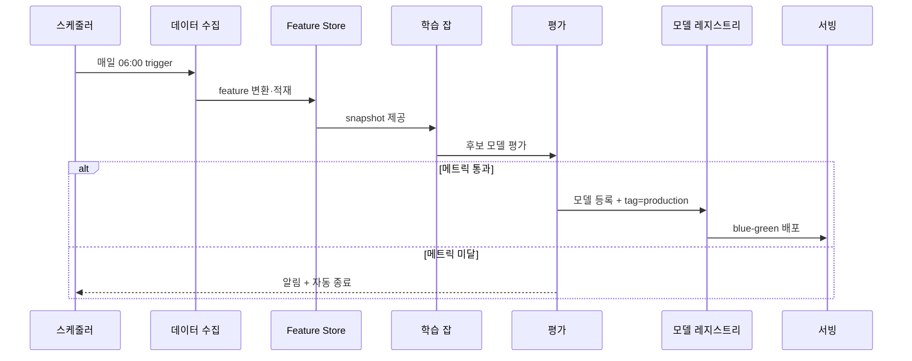

# AI 데이터 파이프라인 자동화

스키마 변경 감지, ETL 오류 자동 수정, 데이터 품질 모니터링을 AI 에이전트가 자율 처리하는 DataOps 패턴. ML/AI 시스템의 학습·서빙은 결국 **신선하고 신뢰 가능한 데이터 파이프라인** 위에 서 있고, 그 파이프라인의 운영 부담을 LLM·에이전트에게 위임하는 흐름이다. 사람이 조율하던 자연어 작업(스키마 매핑, 이상 탐지 룰 작성, 장애 대응 메뉴얼)을 에이전트가 대신 처리해 데이터 신뢰성과 처리량을 동시에 확보한다.

## 자매 개념과의 차이

| 개념 | 영역 |
|------|------|
| [[ai-workflow-automation]] | **비즈니스 프로세스** (이메일, CRM, 승인 등 사람의 업무 흐름) |
| **ai-data-pipeline-automation** (이 페이지) | **데이터 인프라** (수집, 변환, 검증, ML feature/모델 산출) |

같은 "AI가 자동화한다"는 어휘를 쓰지만, 후자는 [[feast]] 같은 feature store, [[mlflow]] 같은 모델 저장소, 데이터 웨어하우스가 일차 청중이다.

## 오케스트레이터 카탈로그

데이터 파이프라인의 뼈대는 오케스트레이터다. 2026년 시점 주요 선택지를 정리하면:

| 도구 | 패러다임 | 핵심 추상화 | 강점 |
|------|----------|-------------|------|
| **Apache Airflow** | 워크플로우 중심 | DAG, Task, Operator, Sensor | 가장 광범위한 생태계, 엔터프라이즈 표준 |
| **Prefect 3** | Python 함수 중심 | Flow, Task, Deployment, Work Pool | 순수 Python, 동적 런타임 |
| **Dagster** | 자산(Asset) 중심 | Asset, Job, Schedule, Sensor | 데이터 리니지/품질 검증 일등시민 |
| **Kestra** | YAML 선언형 | Flow, Task, Trigger | 마이크로서비스 아키텍처, 멀티 언어 |
| **Mage AI** | 노트북 + 파이프라인 | Block, Pipeline | 데이터 분석가 친화 UI |

### Airflow
DAG가 일차 추상화. Task(=Operator 인스턴스)가 노드, 의존성이 엣지가 된다. TaskFlow API로 Python 함수 데코레이터 기반 작성도 지원하며, XCom으로 태스크 간 통신, Variables/Params로 설정 주입, Sensors로 외부 조건 대기. Executor 종류(Celery/Kubernetes/Local)에 따라 분산 전략이 달라진다.

### Prefect 3
Prefect의 표어 그대로 *"Python 함수를 프로덕션 데이터 파이프라인으로 변환한다"*. DSL이나 YAML 없이 `@flow` / `@task` 데코레이터만으로 워크플로우를 정의하고, runtime에 동적으로 task를 생성할 수 있다. Deployment 단위로 Work Pool에 배포해 단일 프로세스부터 Kubernetes까지 동일한 코드를 실행.

### Dagster
"Asset"(테이블, ML 모델 등 논리 데이터 단위)을 일차 시민으로 둔다. Asset 간 의존성이 곧 데이터 리니지이며, Asset Check로 품질 검증을 같은 정의 안에서 표현. Schedule(주기) + Sensor(이벤트) + Partitions(증분)로 다양한 실행 패턴을 자연스럽게 지원하고, Resources와 IO Managers로 환경별 구성을 분리한다.

## AI가 자동화하는 영역

| 영역 | 수동 작업 | AI 자동화 |
|------|----------|----------|
| 스키마 변경 | 수동 매핑 수정 | LLM이 변경 감지 + 매핑 제안 |
| 데이터 품질 | 규칙 기반 검증 | 이상 탐지 + 자동 보정 |
| ETL 오류 | 온콜 대응 | 에이전트 자동 진단 + 수정 |
| 문서화 | 수동 카탈로그 | 자동 리니지 추적 + 설명 생성 |
| 자연어 정의 | YAML/Python 직접 작성 | "매일 오전 6시 X 테이블에서 Y로 옮겨줘" 식의 자연어 → 파이프라인 |

### LLM 활용 패턴 상세

1. **데이터 품질 자동 검사**: 컬럼 통계(null 비율, 분포)를 시계열로 보면서 LLM이 "지난 7일 평균 대비 null이 4배 증가" 같은 이상을 자연어로 보고. Great Expectations / Soda Core 룰을 LLM이 자동 생성.
2. **스키마 진화 적응**: 업스트림 테이블에 컬럼이 추가/삭제되면 LLM이 다운스트림 SQL을 분석해 호환되는 변환을 제안. 이름 유사도 + 타입 + 샘플값을 보고 매핑.
3. **자연어 → 파이프라인**: 분석가가 "지난달 결제 데이터를 BigQuery에서 Snowflake로 매일 동기화" 라고 지시하면 dbt 모델 + Airflow DAG 초안 자동 생성.
4. **장애 자동 진단**: Airflow 태스크 실패 시 로그 + 코드 + 의존 데이터 통계를 RAG로 모아 LLM이 원인 가설과 재시도 전략 제시.
5. **자연어 SQL → 운영 쿼리**: 비숙련 사용자의 질의를 안전한 SQL로 변환 + 비용 한도 + RBAC 적용.

## ML 특화 파이프라인 3분류

- **Feature Pipeline**: 원시 이벤트 → feature 변환 → [[feast]] online/offline store 적재. Materialization 잡이 주기적으로 실행.
- **Training Pipeline**: feature snapshot → 학습 → [[mlflow]] 모델 등록 → [[dvc]] 데이터 버전 고정. 평가 메트릭이 임계치 이상이면 자동 승격.
- **Serving Pipeline**: 모델 배포 ([[model-serving]]), shadow traffic, A/B 테스트, 추론 결과 모니터링 → 데이터 드리프트 탐지 시 재학습 트리거.

## 종단 사례: 자동 재학습 루프

이 루프 위에 AI 에이전트는 다음을 담당한다:

- 수집 단계 실패 → 로그 분석 후 retryable/non-retryable 판단
- feature drift 감지 → 학습 trigger 자체를 동적으로 결정
- 평가 미달 시 하이퍼파라미터 후보 제안 (HPO 직전 단계)

## 한계와 위험 요소

- **메타데이터 일관성**: 오케스트레이터·feature store·모델 레지스트리·BI 도구 간 메타데이터 정합성 유지가 어려움. OpenLineage/Marquez 같은 표준이 정착 중이지만 미완성.
- **비용 추적**: 클라우드 데이터 웨어하우스 쿼리 비용, 학습 GPU 비용, 추론 호출 비용을 파이프라인 단위로 귀속시키기 위해 별도 FinOps 통합 필요.
- **의존성 변경 영향 분석**: 한 모델의 입력 feature가 바뀌면 다운스트림 대시보드/모델까지 전파 분석이 필요. 자동화는 가능하지만 정확도 한계.
- **에이전트 오작동**: 자동 수정/배포가 잘못된 결정을 내리면 데이터 오염이 광범위하게 퍼짐. 위험도가 높은 액션(스키마 변경, 모델 승격)은 휴먼 승인 게이트 유지.
- **재현성**: 자동 결정의 입력(컨텍스트, 프롬프트, LLM 버전)을 어떻게 박제할지에 대한 합의된 규약이 아직 없음. [[ml-reproducibility]] 원칙 차원에서 미해결.
- **데이터 권한 누수**: LLM이 분석 과정에서 PII가 포함된 샘플 행을 보게 되는 위험. 데이터 마스킹/합성 데이터 단계가 사전 필요.

## 관련 문서

- [[ai-workflow-automation]] -- 비즈니스 프로세스 자동화 (자매 개념)
- [[agent-workflow-patterns]] -- 에이전트 워크플로우 패턴
- [[ai-devops-cicd]] -- AI DevOps
- [[ai-incident-response]] -- AI 장애 대응
- [[feast]] -- Feature Store
- [[mlflow]] -- MLflow
- [[dvc]] -- DVC (데이터/파이프라인 버전 관리)
- [[model-serving]] -- 모델 서빙
- [[feature-engineering]] -- 특성 공학
- [[multi-agent-orchestration]] -- 멀티 에이전트 오케스트레이션
- [[agentic-rag]] -- 에이전틱 RAG
- [[ml-reproducibility]] -- ML 재현성
