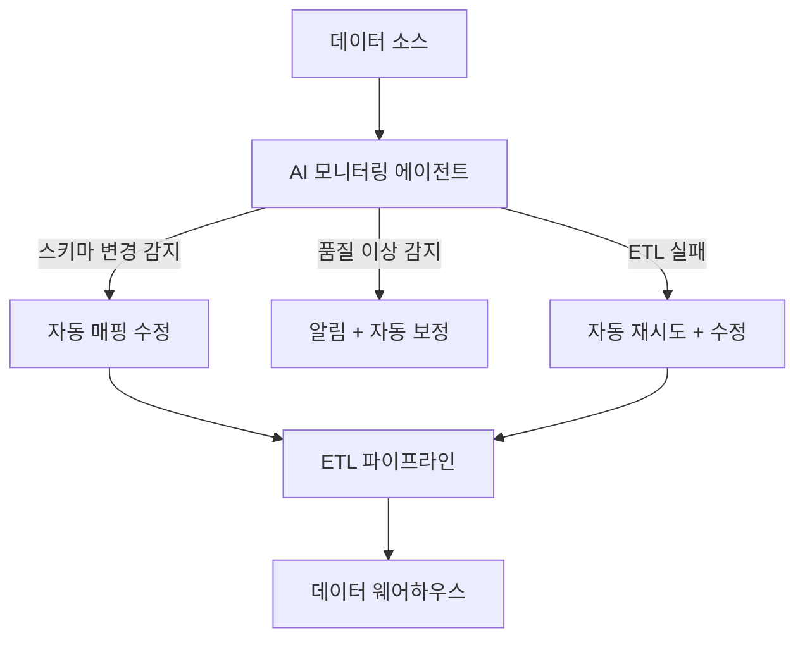

# AI 데이터 파이프라인 자동화

스키마 변경 감지, ETL 오류 자동 수정, 데이터 품질 모니터링을 AI 에이전트가 자율 처리하는 DataOps 패턴. 수동 파이프라인 관리의 반복적 부담을 줄이고 데이터 신뢰성을 높인다.

## AI가 자동화하는 영역

| 영역 | 수동 작업 | AI 자동화 |
|------|----------|----------|
| 스키마 변경 | 수동 매핑 수정 | LLM이 변경 감지+매핑 제안 |
| 데이터 품질 | 규칙 기반 검증 | 이상 탐지 + 자동 보정 |
| ETL 오류 | 온콜 대응 | 에이전트 자동 진단+수정 |
| 문서화 | 수동 카탈로그 | 자동 리니지 추적 |

## 관련 문서

- [[agent-workflow-patterns]] -- 에이전트 워크플로우 패턴
- [[ai-devops-cicd]] -- AI DevOps
- [[ai-incident-response]] -- AI 장애 대응
