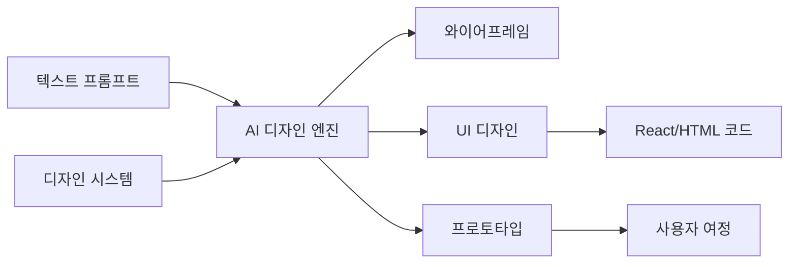

# AI 디자인 도구 (UI/UX 생성)

## 개요

AI 디자인 도구는 텍스트 프롬프트로 와이어프레임, UI 디자인, 인터랙티브 프로토타입을 수분 내에 생성하는 도구 카테고리다. [[ai-image-generation|AI 이미지 생성]]과 깊이 연결되어 있다. 2026년 현재 Figma Make, Google Stitch, Flowstep, UX Pilot 등이 시장을 주도하며, 기존 디자인 시스템과의 연동, 프로덕션 코드 내보내기, 멀티스크린 사용자 여정 자동 생성이 핵심 경쟁 축이다.

기존 디자인 워크플로우에서 와이어프레임 작성에 수일이 걸리던 것이 단일 프롬프트로 5-15개 연결된 스크린을 생성하는 수준으로 단축되었다. 비디자이너도 UI를 직접 만들 수 있는 민주화 효과와 함께, [[enterprise-ai-adoption|엔터프라이즈 AI 도입]] 측면에서 개발 생산성을 크게 높이고 있다, 디자이너는 반복 작업에서 벗어나 전략적 UX 의사결정에 집중할 수 있게 되었다. [[ai-video-generation|AI 비디오 생성]]과 결합하여 완전한 멀티미디어 디자인 파이프라인이 가능해지고 있다.

## 핵심 개념

### 주요 도구 현황 (2026)

| 도구 | 핵심 기능 | 특징 | 가격 |
|------|---------|------|------|
| Figma Make | 텍스트 -> UI 생성 | Figma 네이티브 통합, 디자인 시스템 인식 | Figma 요금제 포함 |
| Google Stitch 2.0 | AI 네이티브 캔버스 | 음성 명령 지원, 완전 무료 | 무료 |
| Flowstep | 멀티스크린 생성 | 완전한 사용자 여정 자동 생성, Figma 복사 | 유료 |
| UX Pilot | 예측 히트맵 | 접근성 검증, 자동 설계 검토 | 유료 |
| Motiff | 프로덕션 코드 내보내기 | React/HTML 내보내기, 디자인 시스템 정렬 | 유료 |
| Visily | 스케치 -> 디지털 | 팀 협업, 테마 생성 | 유료 |
| Magic Patterns | 커스텀 디자인 시스템 | 기존 패턴 학습, Tailwind/React 코드 | 유료 |
| Banani | 텍스트 -> 다중 스크린 | MCP 통합, Figma 레이어 유지 | 유료 |

### 3대 역량 축

**텍스트-to-UI 생성**: 자연어 프롬프트로 UI 컴포넌트와 레이아웃을 직접 생성한다. 디자인 시스템 토큰을 인식하여 브랜드 일관성을 유지하며, 접근성 기준(WCAG)을 자동 반영한다.

**멀티스크린 프로토타이핑**: 단일 프롬프트로 5-15개 연결된 스크린을 생성하여 완전한 사용자 여정을 자동 구성한다. Flowstep과 Stitch 2.0이 이 영역을 주도한다.

**프로덕션 코드 내보내기**: 생성된 디자인을 React, HTML, Tailwind CSS 등 프로덕션 준비 코드로 직접 내보낸다. Motiff와 Magic Patterns은 "개발자가 광범위한 리팩토링 없이 직접 구현"할 수 있는 수준의 코드를 제공한다.

## 기술 상세

### 디자인 시스템 통합

AI 디자인 도구의 핵심 도전은 기존 디자인 시스템과의 정합성이다. 단순히 새 디자인을 생성하는 것이 아니라, 조직의 기존 패턴을 학습하고 일관되게 적용해야 한다. 도구별 접근법이 다르다:

- **Figma Make**: 기존 Figma 라이브러리의 디자인 컨텍스트를 자동 인식하여 컴포넌트를 생성
- **Magic Patterns**: 커스텀 디자인 시스템 업로드를 지원하며, Shadcn, Mantine, Chakra UI, Tailwind, Radix Themes 등 주요 UI 프레임워크와 매칭. Chrome 확장으로 기존 UI를 캡처하여 적용 가능
- **UX Pilot**: Figma 플러그인으로 기존 컴포넌트를 임포트하고 커스텀 모델을 학습

### 코드 내보내기 품질 비교

| 도구 | 출력 포맷 | 프로덕션 준비도 |
|------|---------|---------------|
| Flowstep | React, TypeScript, Tailwind CSS | 1:1 코드 내보내기, 엔지니어 즉시 사용 가능 |
| v0 by Vercel | Next.js, shadcn/ui | 원클릭 Vercel 배포, 에이전틱 기능(웹 검색/디버깅) |
| Magic Patterns | Tailwind, React, Vue | 커스텀 디자인 시스템 반영 |
| Motiff | React, HTML | 프로덕션 레벨, 디자인 시스템 정렬 |
| Google Stitch | HTML, CSS | 클린 구조, 모던 웹 표준 |
| Uizard | HTML, CSS | 기본 수준 |

### 워크플로우 포지셔닝

2026년의 실용적 접근법은 도구 간 역할 분담이다. Stitch가 0-to-1 아이디에이션 단계(수분 내 10개 컨셉 생성)를 지배하고, Figma가 1-to-100 정교화 단계(프로덕션 준비, 브랜드 일관성)를 담당한다. AI UI 도구를 사용하는 팀은 수동 와이어프레이밍 대비 피처 출시 속도가 40-60% 향상되는 것으로 보고된다.

### 가격대

| 도구 | 가격 | 무료 티어 |
|------|------|---------|
| Google Stitch 2.0 | 무료 | 월 350회 생성 |
| Visily | $14/에디터/월 | 있음 |
| Flowstep | $15/월 | 있음 |
| Figma Make | $20/월 (Full 패키지) | 제한적 |
| Uizard | $19/월 | 있음 |
| UX Pilot | $19/월 | 있음 |
| Magic Patterns | ~$20/월 | 있음 |
| Banani | $20/월 | 월 20크레딧 + 일일 리필 (~170/월) |

대부분 연간 결제 시 30-40% 할인이 적용된다.

### 주요 도구별 차별점

**Figma Make**: Figma 네이티브 통합이 최대 강점. Claude 기반으로 동작하며, Supabase 백엔드 통합으로 프로토타입에서 작동하는 웹앱까지 생성 가능. Figma MCP 서버 지원으로 에이전틱 도구와의 연동도 가능하다.

**Google Stitch 2.0**: 2026년 3월 전면 개편. 무한 캔버스, 컨텍스트 인식 디자인 에이전트, 즉석 프로토타이핑을 갖춘 AI 네이티브 디자인 도구. 스탠다드/실험적 듀얼 AI 모드를 지원하며, 이미지/스케치/음성 입력을 구조화된 디자인으로 변환한다.

**Flowstep**: 무한 캔버스에서 전체 플로우를 한 번에 생성하는 접근법이 디자이너에게 가장 자연스럽다는 평가. Figma로의 직접 복사-붙여넣기(Cmd+C/V) 지원과 React/TypeScript/Tailwind CSS 1:1 코드 내보내기가 핵심.

**v0 by Vercel**: 프로덕션 코드 생성에 특화. shadcn/ui 기반 Next.js 컴포넌트를 생성하며, 웹 검색/라이브 사이트 검사/자동 디버깅 등 에이전틱 기능을 갖추고 원클릭 Vercel 배포를 지원한다.

## 관련 문서

- [[google-stitch]] -- Google Stitch AI 디자인 도구
- [[interactive-explanations]] -- 인터랙티브 설명 패턴
