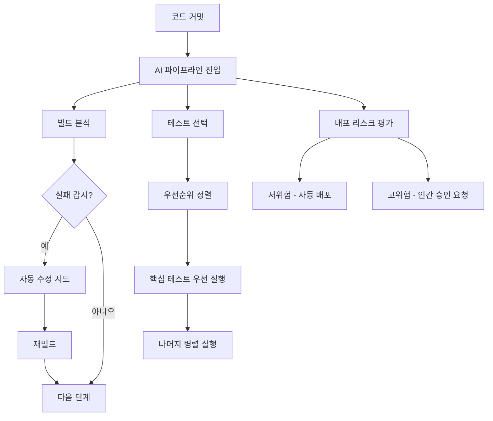
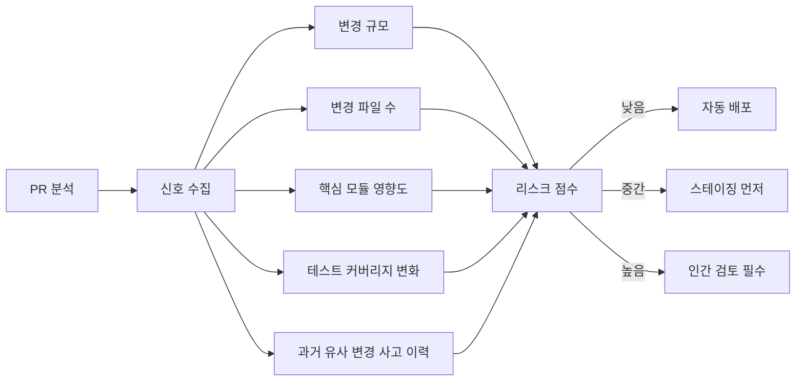

# AI 기반 DevOps/CI-CD

## 개요

AI 기반 DevOps/CI-CD는 LLM과 ML 모델을 소프트웨어 배포 파이프라인에 통합하여 빌드 실패 자동 수정, 테스트 우선순위 최적화, 배포 리스크 예측 등을 자동화하는 패턴이다. 전통적인 CI-CD는 사전에 정의된 규칙과 스크립트에 의존하지만, AI를 접목하면 컨텍스트를 이해하고 과거 이력에서 학습하는 적응형 파이프라인이 가능해진다.

[[coding-agent]]가 코드를 작성하고, [[ai-test-generation]]이 테스트를 생성하며, AI 기반 CI-CD가 이를 검증하고 배포하는 전 과정이 하나의 자율 루프를 형성하는 방향으로 2026년 현재 빠르게 진화 중이다.

## 핵심 기능 영역

## 빌드 자기 치유 (Self-Healing Builds)

빌드 자기 치유는 CI 파이프라인이 실패했을 때 원인을 자동으로 진단하고 수정을 시도하는 메커니즘이다.

**주요 치유 패턴:**

- **의존성 충돌 해결**: 패키지 버전 충돌을 LLM이 분석하고 호환 버전을 제안하거나 자동 적용
- **환경 드리프트 감지**: 로컬 환경과 CI 환경 간 차이를 식별하고 설정 동기화
- **Flaky 테스트 격리**: 반복 실행에서 간헐적으로 실패하는 테스트를 통계적으로 감지하고 격리
- **린트/포맷 자동 수정**: 코드 스타일 오류를 파이프라인 내에서 자동 교정 후 재커밋

치유 시도는 보통 3회 이내로 제한하며, 한계를 넘으면 담당자에게 알림을 전송하고 실패 컨텍스트 리포트를 첨부한다.

## 테스트 우선순위 최적화

전체 테스트 스위트를 매번 실행하면 대규모 프로젝트에서 수십 분에서 수 시간이 걸린다. AI 기반 테스트 선택은 다음 신호를 조합해 실행할 테스트를 동적으로 결정한다.

| 신호 | 설명 |
|------|------|
| 변경 파일 범위 | 수정된 파일과 직접 연관된 테스트 우선 |
| 과거 실패 이력 | 이 코드 경로에서 자주 실패했던 테스트 우선 |
| 코드 커버리지 맵 | 변경된 라인을 실행하는 테스트만 선택 |
| PR 컨텍스트 | PR 설명, 연결된 이슈를 읽어 관련 테스트 추론 |

결과적으로 전체 테스트의 20-30%만 실행하면서도 95% 이상의 결함 탐지율을 달성하는 사례가 보고되고 있다.

## 배포 리스크 예측

## 실무 도입 패턴

**단계적 접근 권장:**

1. **관찰 모드**: 기존 파이프라인 데이터를 수집하고 AI가 예측만 하되 실행은 사람이 결정
2. **보조 모드**: AI가 제안하고 사람이 원클릭 승인
3. **자율 모드**: 저위험 구간(의존성 업데이트, 문서 변경)은 완전 자동화

**주의 사항:**
- AI 수정 시도는 반드시 롤백 가능한 방식으로 적용 (Git 커밋 or 브랜치 생성)
- 자동 배포 범위를 명확히 문서화하고 팀 합의 필요
- 치유 액션 감사 로그(audit log)는 규정 준수를 위해 필수

## 주요 도구 생태계

2026년 기준 주목할 만한 도구들:

- **GitHub Actions + Copilot 통합**: PR 컨텍스트 기반 자동 수정 제안
- **Harness AI**: 배포 리스크 예측 및 카나리 배포 자동화
- **BuildPulse**: Flaky 테스트 탐지 전문 SaaS
- **Launchable**: ML 기반 테스트 선택 최적화

## 관련 문서
- [[ai-security-scanning]] -- AI 보안 취약점 스캐닝

- [[coding-agent]] - 코드 생성 에이전트와 CI-CD 통합
- [[ai-test-generation]] - AI 기반 테스트 자동 생성
- [[ai-incident-response]] - 장애 감지 및 자동 대응
- [[agent-workflow-patterns]] - 에이전트 워크플로우 패턴
