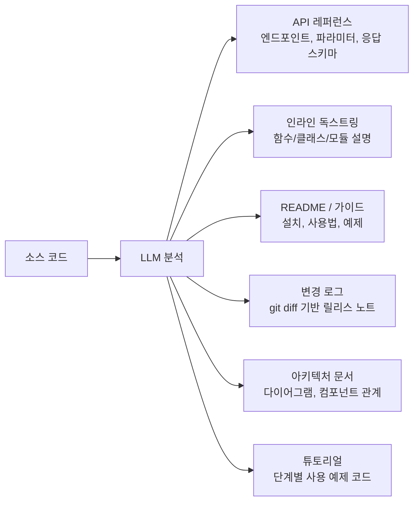
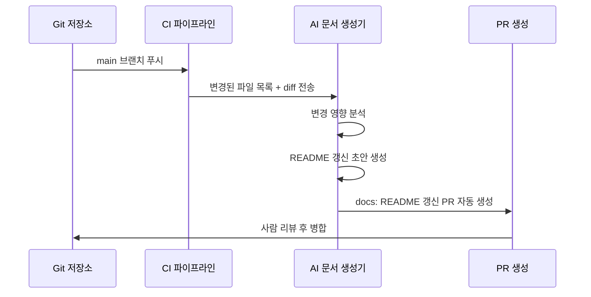
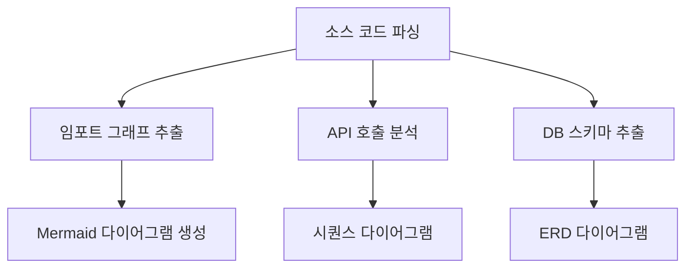

# AI 문서 생성 자동화 (AI Documentation Generation)

## 개요

AI 문서 생성 자동화는 LLM이 소스 코드, diff, 주석을 분석하여 API 레퍼런스, README, 인라인 독스트링, 변경 로그(changelog)를 자동으로 생성하고 갱신하는 패턴이다.

개발자가 가장 미루는 작업이 문서 작성이고, 문서가 없거나 코드와 불일치하는 것이 소프트웨어 프로젝트의 만성적 문제다. AI는 코드를 직접 읽어 정확하고 일관된 문서를 생성할 수 있으며, 코드가 변경될 때마다 CI 파이프라인에서 자동으로 갱신하도록 구성할 수 있다. [[coding-agent|코딩 에이전트]]의 파일 읽기/쓰기 능력이 이 패턴을 실현 가능하게 하며, [[agentic-engineering|에이전틱 엔지니어링]] 관점에서는 문서 생성이 코드 생성과 대칭적인 에이전트 태스크로 취급된다.

## 자동화 대상 문서 유형



## API 레퍼런스 자동 생성

OpenAPI(Swagger) 스펙 기반 API 문서가 가장 성숙한 자동화 영역이다. LLM은 다음 정보를 코드에서 추출한다.

- 엔드포인트 경로와 HTTP 메서드
- 쿼리 파라미터, 경로 파라미터, 요청 바디 스키마
- 응답 코드별 스키마와 예시 값
- 인증 방식과 권한 요구사항
- 에러 케이스와 에러 메시지

FastAPI나 Pydantic 같은 프레임워크는 타입 힌트에서 스키마를 자동 추출하는 기능이 내장되어 있고, LLM은 여기에 자연어 설명, 사용 예시, 주의사항을 보강한다.

## README 자동 갱신 패턴

README는 정적인 문서가 아니라 코드베이스와 함께 진화해야 한다. AI 기반 갱신 파이프라인의 트리거 이벤트:

| 이벤트 | README 갱신 영역 |
|--------|---------------|
| 새 기능 병합 | Features 섹션에 항목 추가 |
| 의존성 변경 | Installation/Requirements 섹션 |
| API 변경 | Usage 예제, API 레퍼런스 |
| 설정 파일 변경 | Configuration 섹션 |
| 릴리스 태그 | 버전 뱃지, Changelog 링크 |



## 독스트링 자동 생성

함수 시그니처와 구현을 분석하여 독스트링을 생성할 때, 단순 반복 설명이 아닌 실제 유용한 정보를 담도록 프롬프트를 설계해야 한다.

**나쁜 독스트링** (AI가 흔히 생성하는 저품질 예시):
```python
def add(a: int, b: int) -> int:
    """두 숫자를 더합니다."""  # 함수명에서 이미 알 수 있는 정보
    return a + b
```

**좋은 독스트링** (맥락과 주의사항 포함):
```python
def calculate_shipping_fee(weight_kg: float, destination_zone: int) -> int:
    """
    무게와 배송 구역에 따라 배송비를 계산한다.

    Args:
        weight_kg: 소포 무게 (킬로그램). 0.1kg 단위로 올림 처리.
        destination_zone: 배송 구역 코드 (1-5). 1이 가장 가까운 구역.

    Returns:
        배송비 (원화 정수). 부가세 미포함.

    Raises:
        ValueError: weight_kg가 0 이하이거나 destination_zone이 1-5 범위 밖일 때.

    Note:
        50kg 초과 화물은 이 함수 대신 calculate_freight_fee()를 사용해야 한다.
    """
```

AI가 좋은 독스트링을 생성하려면 프롬프트에 "Args/Returns/Raises/Note 섹션을 포함하고, 자명한 내용은 생략하며, 주의사항과 대안이 있으면 명시하라"는 지시가 필요하다.

## 아키텍처 문서와 다이어그램 자동화

LLM은 코드베이스를 파싱하여 컴포넌트 간 의존성 그래프를 추출하고 Mermaid 다이어그램으로 변환할 수 있다.



이 접근법은 코드가 실제 아키텍처의 단일 진실 공급원(single source of truth)이 되게 하며, 문서와 코드의 불일치를 원천 차단한다.

## 변경 로그 자동 생성

git diff와 커밋 히스토리를 분석하여 사용자 친화적인 릴리스 노트를 생성한다.

**입력**: git log + diff 사이의 커밋 메시지와 파일 변경
**출력**: 사용자 관점으로 재구성된 변경 사항 목록

AI는 "feat: add user export to CSV"라는 기술적 커밋 메시지를 "사용자 데이터를 CSV 파일로 내보낼 수 있습니다"로 자연어 변환한다. 파괴적 변경(breaking change)을 감지하여 BREAKING CHANGE 섹션을 자동으로 추가하는 것도 가능하다.

## 문서 품질 유지

자동 생성된 문서가 시간이 지남에 따라 코드와 불일치하는 것을 방지하는 전략:

- **CI 검사**: PR 빌드에서 독스트링 없는 public API를 오류로 처리
- **링크 유효성 검사**: 문서 내 내부/외부 링크 자동 확인
- **버전 불일치 감지**: 독스트링의 버전 언급과 실제 코드 버전 비교
- **주기적 재생성**: 주요 릴리스마다 전체 API 문서 재생성

## 한계

- 비즈니스 로직의 "왜"는 코드에서 추론하기 어렵다 - 인간이 작성해야 하는 결정적 맥락
- 예제 코드가 실제 동작 환경을 반영하지 못할 수 있다
- 지나치게 긴 자동 생성 독스트링이 코드 가독성을 해칠 수 있다
- 다국어 지원 문서 생성은 번역 일관성 유지가 어렵다

## 관련 문서

- [[coding-agent|코딩 에이전트]] - 문서 생성 자동화를 실행하는 에이전트 기술
- [[agentic-engineering|에이전틱 엔지니어링]] - 에이전트 기반 소프트웨어 개발 패턴
- [[ai-pair-programming|AI 페어 프로그래밍]] - 문서 작성과 함께 진행되는 협업 패턴
- [[ai-code-review-automation|AI 코드 리뷰 자동화]] - 문서 품질도 검토하는 자동 리뷰
