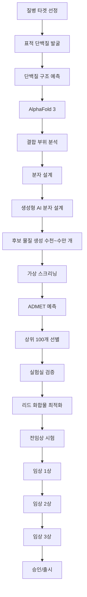
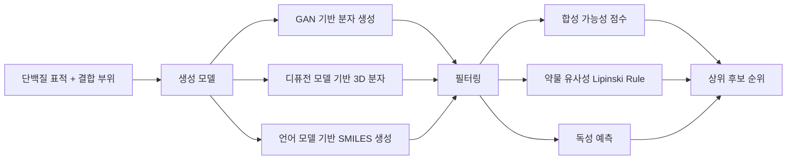

# AI 신약 개발 2026 (AI Drug Discovery 2026)

## 개요

AI를 활용한 신약 개발은 2024-2026년 사이 결정적 전환점을 맞았다. 이전까지 AI는 표적 발굴(target identification)이나 화합물 스크리닝(compound screening) 단계에 주로 활용되었지만, 2026년 현재 AI로 설계된 분자가 실제 임상 시험(clinical trial) 단계에 진입하는 사례가 다수 나타나고 있다. 평균 10-15년에 2.6조 원이 소요되는 신약 개발 과정을 AI가 근본적으로 가속하는 현실적 가능성이 열리고 있다.

[[ai-scientific-discovery]] 분야에서 신약 개발은 가장 뚜렷한 성과가 나타나는 영역이며, [[ai-healthcare]] 인프라와 긴밀히 연결된다.

## AI 신약 개발 파이프라인

## AlphaFold 3와 그 영향

DeepMind의 AlphaFold 3 (2024년 발표)는 단백질 구조 예측을 넘어 단백질-소분자 결합, 단백질-DNA, 단백질-RNA 복합체 구조까지 예측하는 능력을 갖추었다.

**AlphaFold 3의 핵심 진전:**
- 기존 AlphaFold 2가 단백질 서열 -> 구조 예측에 집중했다면, AF3는 **결합 복합체 구조** 예측으로 범위 확장
- 리간드(ligand, 약물 후보 소분자)와 단백질의 결합 형태를 직접 예측 가능
- 이전에 계산 화학적 방법으로 수 주가 걸리던 도킹(docking) 시뮬레이션을 수 분으로 단축

**실무 영향:**
- 구조가 밝혀지지 않은 단백질 표적도 분석 가능 -> 표적 가능 단백질 우주 확장
- 구조 기반 약물 설계(SBDD)의 전제 조건인 단백질 구조를 실험 없이 확보

## 생성형 AI를 활용한 분자 설계

**주요 지표 자동 예측:**

| 지표 | 의미 | 예측 모델 |
|------|------|-----------|
| ADMET | 흡수/분배/대사/배출/독성 | 그래프 신경망 |
| hERG 독성 | 심장 독성 위험 | 분류 모델 |
| 용해도 | 약물의 물 용해도 | 회귀 모델 |
| BBB 투과성 | 혈뇌 장벽 통과 여부 | 이진 분류 |
| 합성 접근성 | 실험실 합성 가능성 | SA 점수 |

## 임상 시험 AI 적용

2026년 시점에 주목할 또 다른 변화는 임상 시험 설계와 운영에도 AI가 깊이 들어왔다는 점이다.

**환자 모집 최적화:**
- EHR(전자의무기록) 분석으로 임상 조건에 맞는 환자 자동 스크리닝
- 탈락 위험이 높은 환자 조기 감지

**바이오마커 발굴:**
- 어떤 환자 그룹이 약물에 반응할지 예측하는 바이오마커를 오믹스 데이터에서 AI가 탐색
- 정밀 의학(precision medicine) 임상 설계를 지원

**안전성 신호 조기 감지:**
- 임상 데이터의 이상 신호를 조기에 감지하여 심각한 부작용 발생 전 개입

## 2026년 현재 성과 사례

- **Insilico Medicine**: AI 설계 분자가 특발성 폐섬유증(IPF) 대상 임상 2상 진행 중 (2024년 진입)
- **Recursion Pharmaceuticals**: 고처리량 세포 이미징 데이터와 ML을 결합, 다수 파이프라인 임상 진입
- **AbSci**: AI 항체 설계로 임상 후보 물질 도출 기간을 18개월에서 수 주로 단축 주장

## 한계와 과제

- **실험실-임상 갭**: AI 예측 우수 후보물질이 실제 임상에서 실패하는 비율은 여전히 높음
- **데이터 품질**: 편향된 학습 데이터로 인한 예측 오류 위험
- **규제 불확실성**: AI 발견 신약에 대한 FDA/EMA의 심사 기준이 아직 정립 중
- **해석 가능성**: 생성 모델이 "왜 이 분자를 제안했는지" 설명하기 어려움

## 관련 문서

- [[ai-scientific-discovery]] - 과학 발견 전반에 적용되는 AI의 패턴
- [[ai-healthcare]] - 의료 AI 인프라와 규제 환경
- [[rag-pipeline]] - 생물의학 문헌 검색 증강 분석
