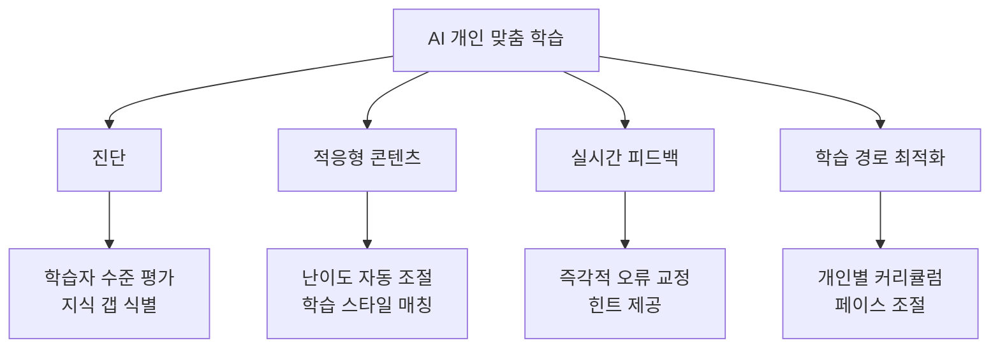

# AI in Education

2026년 교육 분야의 AI 도입이 임계점을 넘었다. 학생 86%가 AI를 사용하고 교사 83%(K-12)가 생성형 AI를 활용하는 가운데, 미국 31개 주에서 134개 AI 교육 법안이 제출되며 규제 프레임워크도 급속히 형성되고 있다.

## 개요

AI 교육 시장은 2025년 $7.57억에서 2034년 $1,123억으로 성장이 전망된다(CAGR 29.9%). 핵심 전환은 AI가 단순 보조 도구에서 **개인 맞춤 튜터**로 진화하고 있다는 점이다. Harvard 물리학 연구에 따르면 AI 튜터를 사용한 학생은 전통 수업 대비 2배 이상의 학습 효율을 보였고, Macquarie 대학에서는 시험 성적 10% 향상, 통과율 15% 증가가 관측되었다.

## 핵심 활용 영역

### 개인 맞춤 학습 (Personalized Learning)

AI가 각 학생의 이해도, 학습 속도, 선호 학습 방식을 실시간으로 분석하여 맞춤형 학습 경험을 제공한다. Stanford 교육학 교수의 표현대로 "AI는 한 명의 교사가 각 학생과 35개의 고유한 대화를 생성하도록 지원"한다.

### AI 튜터링

대학 수준에서 AI 사용률이 2024년 66%에서 2025년 92%로 급증했다. Microsoft 365 Copilot을 활용한 자기주도학습은 265% 증가를 기록했다.

| 활용 분야 | 사용 비율 |
|-----------|-----------|
| 정보 수집 | 53% |
| 브레인스토밍 | 51% |
| 이미지 생성 | 31% |
| 음악/사운드 | 16% |
| 코딩 | 15% |

### 교사 지원 및 행정 효율화

교사들은 AI를 통해 주당 평균 5.9시간을 절약하고 있다.

- **K-12 교사**: 83%가 생성형 AI 활용
- **고등교육 교수진**: 22%가 정기적 사용
- **교육 리더**: 47%가 매일 사용

주요 활용: 수업 자료 생성, 평가 문항 작성, 성적 분석, 학부모 커뮤니케이션 초안, 개별 학습 계획 수립

### 평가 및 학습 분석

AI 기반 평가 시스템은 단순 채점을 넘어 학습자의 사고 과정을 분석하고, 형성 평가(formative assessment)를 통한 지속적 피드백을 제공한다.

## 시장 현황

| 연도 | 시장 규모 | CAGR |
|------|-----------|------|
| 2025 | $7.57억 | 38.4% |
| 2029 | $302.8억 | 41.4% |
| 2034 | $1,123억 | 29.9% |

인기 도구: ChatGPT(66%), Grammarly(25%), Microsoft Copilot(25%)

## 국가별 AI 교육 인식

| 국가 | AI 긍정 평가 비율 |
|------|-------------------|
| 중국 | 83% |
| 인도네시아 | 80% |
| 태국 | 77% |
| 캐나다 | 40% |
| 미국 | 39% |
| 네덜란드 | 36% |

아시아 국가들의 AI 교육 긍정률이 서구 국가 대비 약 2배 높은 점이 주목할 만하다.

## 규제 동향

### 미국 주별 AI 교육 법안 (2026)

31개 주에서 134개 법안이 제출되었으며, 세 가지 핵심 축을 중심으로 규제가 형성되고 있다.

**1. 학생 데이터 보호**
- 캘리포니아 AB 1159: 학생 데이터의 AI 모델 훈련 사용 금지
- 아이다호 SB 1227: AI 도구의 데이터 프라이버시 요건 설정 + AI가 교사를 대체 불가 규정
- 버몬트 HB 650: 에듀테크 제공업체의 연간 프라이버시 인증 의무화

**2. AI 사용 범위 및 투명성**
- 오클라호마 SB 1734: 교사 감독 하의 AI 사용만 허용, 고위험 결정 사용 금지
- 뉴욕 A 9190: 9학년 이상에서만 AI 교실 사용 허용

**3. AI 리터러시 및 졸업 요건**
- 조지아 SB 179: 2031-2032년부터 컴퓨터과학(AI 포함) 고등학교 졸업 필수과목 지정
- 미시시피 SB 2294: 2029-2030년부터 신흥기술(AI) 교육 크레딧 요구

## 도전 과제

### 교육 격차와 훈련 부족

- 교육자 45%가 AI 교육을 받지 못한 상태
- AI 훈련을 제공하는 교육구(district)는 26%에 불과
- 학생 58%가 AI 관련 지식 부족 자가 평가

### AI 과의존과 학문적 진정성

- 학생 30% 이상이 AI에 높은 의존도
- 33%가 AI 사용 관련 표절 의혹 경험
- 비판적 사고력과 독립적 문제 해결 능력 약화 우려

### 형평성 문제

AI 도구 접근성의 불균형이 기존 교육 격차를 심화시킬 위험이 있으며, 성별 격차(여성 30% vs 남성 21%가 AI 사용에 압도감)도 관측된다.

## 관련 페이지

- [[enterprise-ai-adoption|엔터프라이즈 AI 도입]]
- [[ai-regulation-us|AI 규제 (미국)]]
- [[prompt-engineering|프롬프트 엔지니어링]]
- [[small-language-models|소형 언어 모델]]

## 참고 자료

- [OECD Digital Education Outlook 2026](https://www.oecd.org/en/publications/oecd-digital-education-outlook-2026_062a7394-en.html)
- [DemandSage: AI in Education Statistics](https://www.demandsage.com/ai-in-education-statistics/)
- [MultiState: How States Are Regulating AI in Education](https://www.multistate.us/insider/2026/4/9/how-states-are-regulating-ai-in-education-this-legislative-session)
