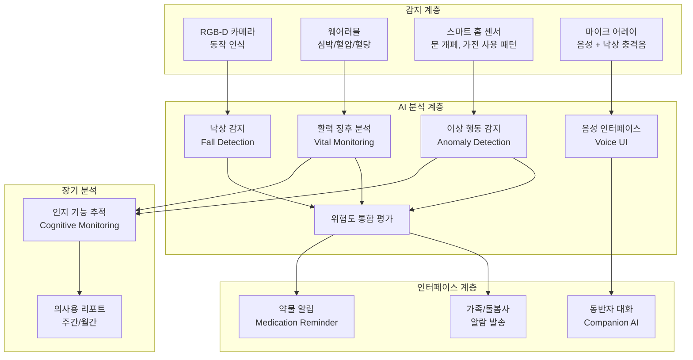
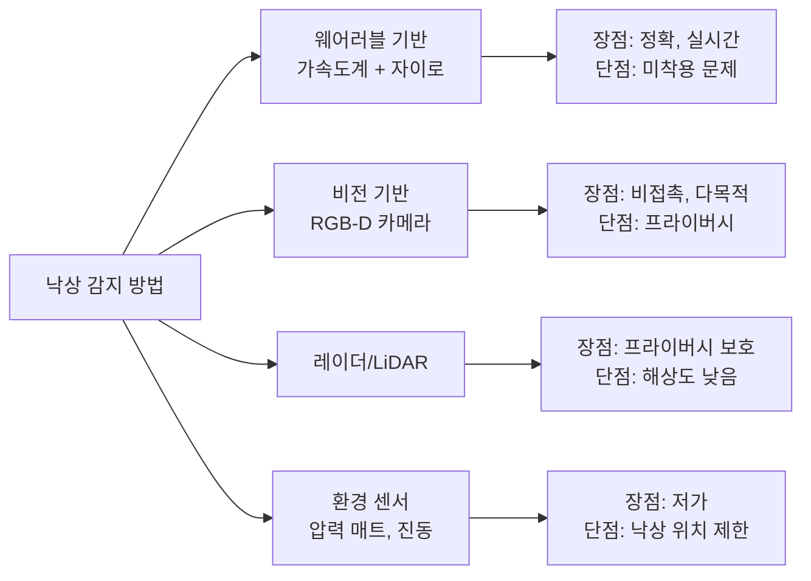
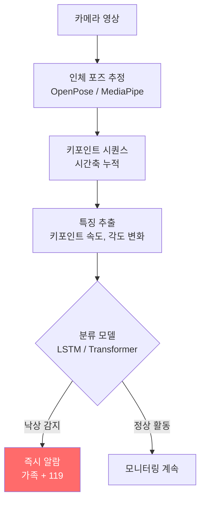
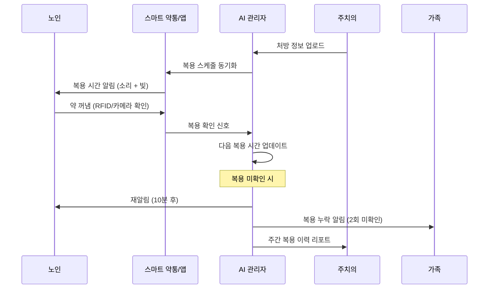
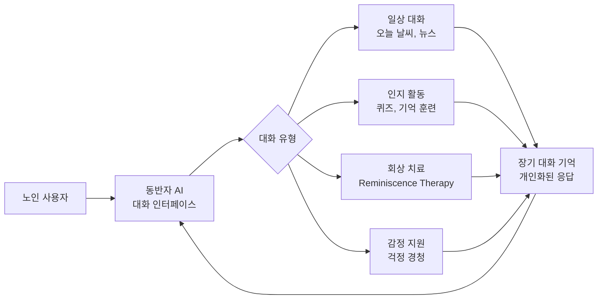
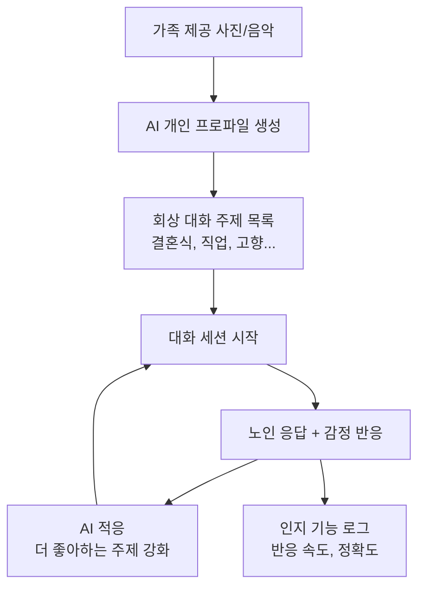
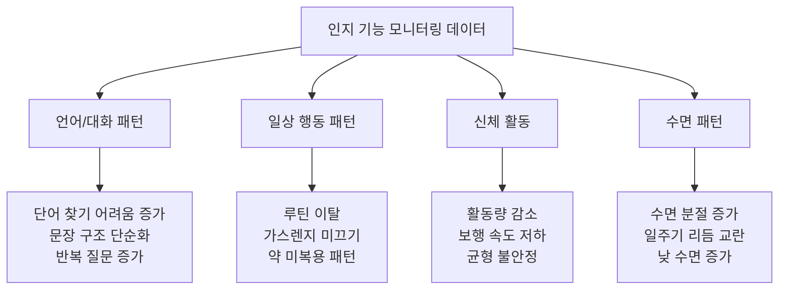
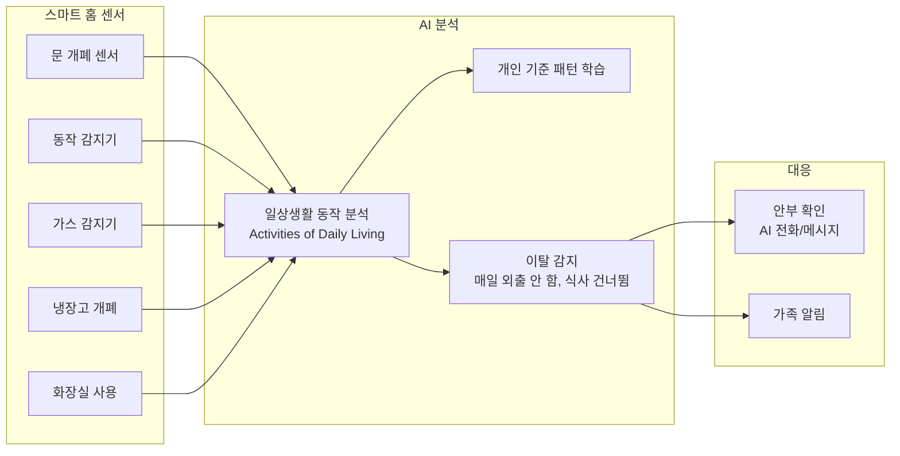
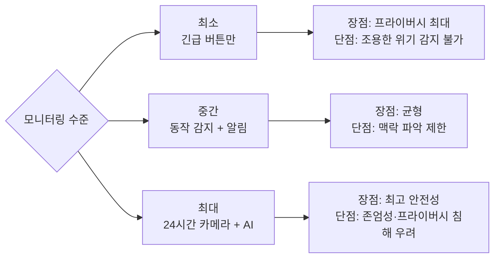

# AI 노인 돌봄

## 개요

AI 노인 돌봄은 고령자가 더 안전하고 독립적으로 생활할 수 있도록 지원하는 AI 기술 응용 영역이다. 전 세계 65세 이상 인구가 2050년까지 약 16억 명에 달할 것으로 예상되는 가운데, 돌봄 인력 부족과 의료비 급증이 사회적 과제로 부상하고 있다. AI는 24시간 모니터링, 이상 감지, 사회적 교감을 자동화해 돌봄의 품질과 범위를 확장한다.

핵심 응용 영역:
- **안전 모니터링**: 낙상 감지, 이상 행동 패턴 경보
- **건강 관리**: 약물 복용 확인, 활력 징후 추적
- **인지 보조**: 치매 조기 감지, 일상 루틴 지원
- **사회적 교감**: 동반자 챗봇, 원격 가족 연결
- **자립 생활(Aging in Place)**: 스마트 홈 통합, 이동 보조

## 핵심 아이디어

### 노인 돌봄 AI 스택

## 낙상 감지 (Fall Detection)

낙상은 65세 이상 외상 사망의 주요 원인이다. 낙상 후 빠른 발견이 생존율을 크게 높인다.

### 감지 기술 비교

### 비전 기반 낙상 감지 파이프라인

**낙상 구분 기준:**
- 수직 방향 가속 급증 (>2g)
- 중심 고도 급격한 하강
- 충격 후 자세 복원 없음 (1-2분 이상 눕거나 움직임 없음)

**Apple Watch 낙상 감지**: watchOS의 낙상 감지 기능은 손목 가속도계와 자이로스코프를 결합해 낙상을 감지하고, 60초 이내 응답이 없으면 비상 연락처와 119에 자동 연락한다. 이 기능은 실제로 여러 생명을 구한 사례가 보고됐다.

## 약물 관리 AI

약물 복용 오류는 노인 입원의 주요 원인 중 하나다. 복잡한 다약제(polypharmacy) 환경에서 AI가 복용 스케줄 관리를 돕는다.

**AI 약물 관리 기능:**
- 약통 열림/닫힘 + 약 꺼냄 여부 감지 (RFID, 무게 센서, 카메라)
- 복용 이력 자동 기록
- 약-약 상호작용 실시간 체크
- 리필 필요 시점 자동 알림
- 의료진에게 복용 순응도(adherence) 리포트 발송

**주요 제품:** Pillsy, Hero, Pillo Health 등 스마트 약통이 있으며, Amazon Alexa 기반 음성 약물 알림 기능도 있다.

## 동반자 AI (Companion Chatbot)

노인 고독은 흡연과 동등한 건강 위험 요인으로 연구들이 보고한다. 동반자 AI는 사회적 교감 욕구를 부분적으로 충족한다.

### 회상 치료 (Reminiscence Therapy)

치매 노인에게 과거 기억을 자극하는 대화가 인지 기능 유지에 도움이 된다는 근거 기반 치료법이다. AI는 가족이 제공한 사진, 음악, 개인 이야기를 기반으로 맞춤형 회상 대화를 이끌어낼 수 있다.

**주요 사례:**
- **PARO 로봇 (일본)**: 물개 형태의 사회적 로봇. 치매 노인의 불안 감소와 사회적 교감 향상에 효과가 임상 연구로 확인됐다.
- **ElliQ (Intuition Robotics)**: 탁상형 동반자 AI 기기. 대화, 날씨 안내, 가족 영상통화 연결을 한 기기에서 제공한다. 뉴욕주 정부와 파트너십을 맺어 노인 가정에 배포됐다.

## 인지 모니터링 (Cognitive Monitoring)

치매 조기 발견은 진행 속도를 늦추는 개입을 가능하게 한다. AI는 일상 데이터에서 인지 기능 저하의 미묘한 신호를 감지한다.

### 인지 모니터링 신호 유형

**디지털 인지 스크리닝 테스트:**
- MoCA(몬트리올 인지 평가) AI 기반 자동화
- 시계 그리기 테스트(Clock Drawing Test)의 컴퓨터 비전 분석
- 음성 유창성 테스트 자동 채점

**DementiaBank**: 치매 환자의 대화 녹음 데이터베이스. LLM을 이용해 "Cookie Theft" 그림 설명 대화에서 인지 저하를 감지하는 연구들이 발표되고 있다. [교차검증 필요: 실제 임상 진단 정확도 데이터]

## 스마트 홈 통합

**일상생활 동작(ADL) 분석 예시:**
- "냉장고를 오늘 한 번도 열지 않았음" → 식사 여부 확인
- "화장실 사용이 평소보다 3배 증가" → 건강 이상 신호
- "아침 루틴이 30분 지연됨" → 웰니스 체크인

## 실제 사례

### Amazon Alexa Together
가족 구성원이 멀리서 노인의 Alexa 사용 패턴을 모니터링하는 서비스. 활동 알림(노인이 Alexa를 마지막으로 사용한 시간), 긴급 도움 요청 기능, 낙상 감지 알람을 제공한다.

### CarePredict
AI 기반 노인 행동 분석 플랫폼. 손목 착용 센서와 실내 센서를 결합해 24시간 활동 패턴을 분석하고 건강 이상 조기 경보를 제공한다. 일상 활동 변화로 UTI(요로 감염), 낙상 위험, 우울증을 조기에 감지한다고 보고한다. [교차검증 필요: 임상 검증 데이터]

### Embodied Moxie (인지 보조 로봇)
주의력결핍 장애가 있는 아이를 위해 개발됐지만, 경도 인지 장애 노인을 위한 인지 재활 응용도 탐색 중이다. 대화형 로봇이 목표 설정, 루틴 완료, 사회적 기술 연습을 돕는다.

### SingHealth (싱가포르) AI 낙상 예방 시스템
싱가포르 공공 병원들이 병실 카메라와 AI를 이용한 낙상 예방 시스템을 도입했다. 환자가 침대 난간을 내리거나 일어나려는 동작을 AI가 감지해 간호사에게 알린다.

### 국내 사례: SKT NUGU 케어콜
SK텔레콤의 NUGU 기반 AI 돌봄 전화 서비스. 독거 노인에게 매일 전화해 안부를 확인하고, 이상 응답 시 지자체 복지사에게 연결한다. 수십만 노인에게 서비스를 제공한 것으로 보고된다.

## 기술 트레이드오프

### 프라이버시 vs 안전의 균형

노인 당사자의 선호와 가족의 안전 우려가 충돌하는 경우가 많다. "부모님은 카메라를 원하지 않지만 자녀는 걱정된다"는 전형적인 딜레마다.

| 항목 | 내용 |
|------|------|
| 기술 친숙도 장벽 | 많은 노인이 스마트 기기 사용에 어려움을 겪음 |
| 오탐 피로 | 잦은 오탐 알람은 가족과 돌봄사의 피로를 유발 |
| 인터넷 의존성 | 연결 끊김 시 모든 모니터링 기능 중단 |
| 사생활 낙인 | "감시받는다"는 느낌이 노인의 존엄성에 영향 |
| 의존성과 자립 | 과도한 AI 보조가 스스로 문제를 해결하는 능력을 퇴화시킬 수 있음 |

## 윤리 이슈

- **자율성 존중**: 모니터링 시스템 사용 여부는 노인 당사자가 결정해야 한다. 인지 기능 저하 시 대리 의사결정 기준이 필요하다.
- **존엄성**: 신체 활동(화장실 사용 등)의 모니터링은 인간 존엄성과 상충할 수 있다.
- **데이터 소유권**: 수집된 행동 데이터의 소유권과 2차 활용(보험, 연구) 동의 필요.
- **알고리즘 편향**: 특정 인종·문화의 행동 패턴이 "이상"으로 잘못 분류될 위험.
- **돌봄 노동자 대체**: AI 도입이 돌봄 노동자의 직업을 빼앗는다는 우려 vs 인력 부족 해소.

## 관련 문서

- [[ai-mental-health]] - 노인 정신 건강 특화 AI
- [[ai-anomaly-detection]] - 이상 행동 감지 알고리즘
- [[wearable-ai]] - 웨어러블 AI 센서 기술
- [[ai-accessibility-tools]] - 노인 접근성 도구
- [[time-series-anomaly-detection]] - 시계열 이상 감지 방법
