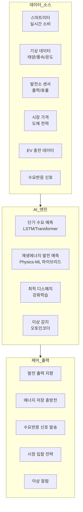
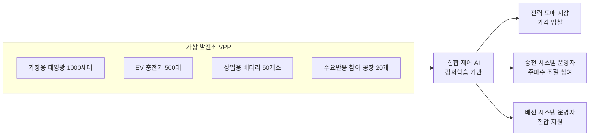

# AI 에너지 그리드 관리

## 개요

AI 에너지 그리드 관리(AI Energy Grid Management)는 전력 공급망 전반에 걸쳐 머신러닝과 최적화 알고리즘을 적용하여 에너지의 효율적 생산, 전송, 배분을 실현하는 응용 분야다. 태양광·풍력 등 간헐적 재생에너지의 비중이 높아질수록 수요와 공급의 실시간 균형을 유지하는 것이 더욱 복잡해지며, AI가 이 복잡성을 처리하는 핵심 도구로 부상했다.

현대 전력 그리드는 중앙집중식 대형 발전소에서 수십만 개의 분산 에너지 자원(DER, Distributed Energy Resources)이 공존하는 복잡계로 진화하고 있다. 가정용 태양광 패널, 전기차 배터리, 상업용 에너지 저장 장치, 수요 반응(demand response) 프로그램 참여 기기 등이 실시간으로 그리드에 영향을 미친다. AI 없이는 이 복잡계를 안정적으로 운영하는 것이 불가능에 가깝다.

## 핵심 아이디어

에너지 그리드 관리의 근본 문제는 **전력은 저장이 어렵다**는 물리적 제약에서 비롯된다. 생산량과 소비량이 항상 일치해야 하며, 불균형이 발생하면 주파수(frequency) 편차가 생기고 심각한 경우 정전(blackout)으로 이어진다.

AI는 이 문제를 세 가지 시간 지평에서 공략한다:

- **장기(수주-수개월)**: 발전 설비 유지보수 일정 최적화, 신규 설비 투자 계획
- **중기(수일-수시간)**: 수요-공급 예측 기반 발전 디스패치 계획
- **단기(수분-실시간)**: 주파수 조절, 전압 유지, 비상 대응



이 다이어그램은 실시간 데이터 수집부터 제어 명령 출력까지의 AI 에너지 그리드 관리 파이프라인을 보여준다.

## 주요 응용 영역

### 수요 예측

전력 수요 예측은 에너지 그리드 관리의 기초다. 수요를 정확히 예측해야 그에 맞는 발전량을 사전에 계획할 수 있다.

**예측 변수:**
- 기상 조건(온도, 습도, 일사량): 냉난방 수요에 직접 영향
- 시간적 패턴: 요일, 시간대, 계절, 공휴일
- 경제 활동 지표: 산업 생산, GDP
- 이벤트: 스포츠 경기, 방송 일정(TV 시청률과 전력 수요 상관관계)
- EV 보급률: 전기차 충전이 저녁 피크 수요를 증폭

**딥러닝 접근법:**

LSTM(Long Short-Term Memory)과 Transformer 계열 모델이 단기 수요 예측에서 뛰어난 성능을 보인다. 특히 계층적 예측(hierarchical forecasting)이 중요하다. 국가 수준 예측을 각 지역, 변전소, 피더(feeder) 단위로 하향 분해하거나, 반대로 개별 수요를 집계(bottom-up)하는 방식을 사용한다.

```python
# 단기 전력 수요 예측 예시 (PyTorch 기반 LSTM)
import torch
import torch.nn as nn

class PowerDemandLSTM(nn.Module):
    def __init__(self, input_size: int, hidden_size: int, output_horizon: int):
        super().__init__()
        self.lstm = nn.LSTM(input_size, hidden_size, num_layers=2, batch_first=True)
        self.fc = nn.Linear(hidden_size, output_horizon)  # 다단계 예측

    def forward(self, x: torch.Tensor) -> torch.Tensor:
        # x: (batch, seq_len, features)
        lstm_out, _ = self.lstm(x)
        # 마지막 타임스텝 출력으로 미래 예측
        return self.fc(lstm_out[:, -1, :])
```

### 재생에너지 발전 예측

태양광(PV)과 풍력은 날씨에 따라 출력이 크게 변동한다. 정확한 발전량 예측 없이는 예비력(reserve capacity)을 과도하게 준비해야 하므로 비용이 증가한다.

**태양광 발전 예측:**
- 수치기상예측(NWP, Numerical Weather Prediction) 데이터를 ML 모델로 후처리
- 스카이 이미지(sky camera) + CNN으로 구름 이동 단기 예측
- 위성 이미지 분석으로 광역 일사량 예측

**풍력 발전 예측:**
- 풍속-전력 변환 곡선(power curve) 모델링
- 물리 기반 모델(CFD, 전산유체역학) + ML 하이브리드
- 공간 상관성: 인근 기상 관측소 데이터를 GNN으로 통합

### 분산 에너지 자원(DER) 통합

분산 에너지 자원 관리 시스템(DERMS, Distributed Energy Resource Management System)은 수천~수만 개의 소규모 에너지 자원을 집합적으로 제어한다.

**가상 발전소(VPP, Virtual Power Plant):**
VPP는 AI가 분산된 소규모 발전·저장·수요 자원을 마치 하나의 대형 발전소처럼 운용하는 개념이다. 가정용 태양광, 배터리, EV, 상업용 냉동 시스템 등을 통합하여 전력 시장에 집합적으로 참여한다.



### 마이크로그리드(Microgrid) 관리

마이크로그리드(microgrid)는 주 그리드와 연결될 수 있지만 독립적으로도 운영 가능한 소규모 에너지 시스템이다. 도서 지역, 군사 기지, 대학 캠퍼스, 산업 단지 등에서 활용된다.

AI가 마이크로그리드에서 해결하는 문제:

1. **에너지 관리 최적화**: 태양광, 배터리, 소형 발전기, 수요 사이의 실시간 균형
2. **고립 운전(island mode) 전환**: 주 그리드 장애 시 자동 분리 및 내부 균형 유지
3. **재연결**: 주 그리드와 재동기화 시 위상 동기화
4. **수명 최적화**: 배터리 충방전 패턴을 AI가 관리하여 배터리 수명 극대화

### 에너지 가격 최적화

전력 도매 시장에서 AI는 가격 예측과 입찰 전략 수립에 활용된다.

**전력 시장 AI 활용:**
- **가격 예측(price forecasting)**: 수요-공급 예측, 연료 비용, 탄소 가격, 혼잡 패턴을 통합한 도매 가격 예측
- **최적 입찰**: 발전 자원의 가용성, 예측 가격, 리스크를 고려한 최적 입찰량·가격 결정
- **배터리 차익거래**: 저가 시간대에 충전, 고가 시간대에 방전하는 에너지 저장 최적화

수요 반응(demand response)에서는 AI가 산업·상업 소비자에게 피크 시간대 수요 감소를 자동으로 요청하고, 참여 인센티브를 최적화한다.

## 주요 기술 컴포넌트

### 강화학습 기반 디스패치 최적화

에너지 디스패치 결정은 순차적이고 상태 의존적(state-dependent)이며 불확실성이 높다는 특성 때문에 강화학습(reinforcement learning)이 잘 맞는다.

**상태 공간**: 현재 수요, 발전 가용성, 배터리 충전량, 시장 가격, 날씨 예측
**행동 공간**: 각 발전 유닛의 출력 레벨, 배터리 충방전 명령, 수요반응 신호
**보상 함수**: 운영 비용 최소화 + 탄소 배출 페널티 - 신뢰도 위반 페널티

DeepMind는 Google 데이터센터 냉각 최적화에 강화학습을 적용하여 냉각 에너지 사용량을 40% 줄이는 성과를 달성했으며, 이 기술이 전력 그리드 최적화로 확장되고 있다.

### 이상 감지 및 고장 예측

그리드 장비(변압기, 차단기, 케이블)의 고장을 사전에 감지하면 정전을 예방하고 유지보수 비용을 절감할 수 있다.

**오토인코더(Autoencoder) 기반 이상 감지:**
정상 운전 데이터로 학습된 오토인코더가 입력 데이터를 재구성할 때, 재구성 오차가 높으면 이상 징후로 판단한다. 라벨링된 고장 데이터가 없어도 학습할 수 있다는 장점이 있다.

**변압기 건전성 모니터링:**
- 부분 방전(PD, Partial Discharge) 신호 분석
- 용해 가스 분석(DGA, Dissolved Gas Analysis)에서 고장 유형 패턴 인식
- 열화상(thermal imaging) + 비전 AI로 과열 감지

### 그리드 엣지 AI(Grid Edge AI)

스마트미터, 변전소 컨트롤러, 인버터 등 그리드 엣지(edge) 기기에 AI를 탑재하면 클라우드 통신 없이도 실시간 제어가 가능하다.

**엣지 AI 적용 이점:**
- 통신 지연 없는 밀리초 단위 응답
- 개인 정보 보호(소비 데이터 외부 미전송)
- 연결 장애 시에도 독립 운전 가능

**경량화 요구사항:**
엣지 기기의 제한된 컴퓨팅 자원에서 실행되어야 하므로 모델 경량화([[model-quantization]], [[knowledge-distillation]])가 필수다.

## 실제 사례

### Google - 풍력 예측

Google은 DeepMind AI를 활용하여 텍사스 풍력 발전 포트폴리오의 36시간 전 발전량을 예측한다. 예측 정확도 향상으로 전력 시장에서의 발전 스케줄 가치가 20% 향상되었다.

### Tesla - Virtual Power Plant (South Australia)

Tesla는 호주 사우스오스트레일리아(South Australia)에서 4,000가구의 Powerwall 배터리를 VPP로 통합하여 전력 시장에 참여한다. AI가 실시간 전력 가격과 그리드 상태를 모니터링하여 각 가정의 배터리 충방전을 자동으로 최적화한다.

### Next Kraftwerke - 유럽 VPP

Next Kraftwerke(독일)는 유럽 전역 12,000개 이상의 분산 에너지 자원을 VPP로 운영한다. AI 기반 예측과 입찰 최적화로 발전 자원 운영자의 수익을 극대화한다.

### Enel - 그리드 디지털화

이탈리아 Enel은 전 세계 배전망에 AI 기반 모니터링을 도입했다. 고장 위치 자동 감지, 자동 재구성(self-healing grid) 등으로 정전 시간을 크게 단축했다.

### Octopus Energy - Kraken 플랫폼

영국 Octopus Energy의 Kraken 플랫폼은 AI를 사용하여 시간대별 전력 가격에 따라 고객의 EV 충전, 온수기 가동 시간을 자동으로 최적화한다. 고객에게는 저렴한 요금을, 그리드에는 피크 수요 분산 효과를 제공한다.

## 한계와 트레이드오프

### 예측 불확실성

기상 이변, 사회적 이벤트, 설비 고장 등 예측 모델이 학습하지 못한 사건이 발생하면 예측 성능이 급격히 저하된다. 특히 극단적 기상 이변이 잦아지면서 역사적 패턴에 기반한 모델의 한계가 부각된다.

**대응 방안:**
- 앙상블 예측으로 불확실성 정량화
- 확률적 예측(probabilistic forecasting)으로 신뢰 구간 제공
- 다양한 시나리오를 반영한 예비력 계획

### 사이버보안 취약성

AI로 자동화된 그리드 제어 시스템은 사이버 공격의 표적이 된다. 적대적 공격(adversarial attack)으로 예측 모델을 속이거나, 제어 명령에 악성 입력을 주입하면 광역 정전을 유발할 수 있다.

**실제 사례:** 2021년 플로리다 올즈마 수처리 시설 해킹 시도처럼, 인프라 제어 시스템 해킹은 현실적 위협이다.

### 데이터 개인정보

스마트미터가 15분 단위로 수집하는 소비 데이터는 개인의 생활 패턴(재택 여부, 취침 시간, 가전 사용)을 노출한다. AI 분석이 고도화될수록 프라이버시 침해 우려가 커진다.

### 그리드 안정성과 자동화 트레이드오프

고도로 자동화된 AI 제어 시스템에서 알고리즘 오류나 모델 실패 시 인간이 빠르게 개입하기 어렵다. "플래시 크래시(flash crash)" 유형의 그리드 불안정이 발생할 수 있다.

### 규제 및 시장 설계 지연

전력 시장 규제는 중앙집중식 대형 발전소를 전제로 설계되어 있어, VPP나 분산 에너지 자원의 시장 참여를 제한한다. AI 기술의 가능성이 규제 변화 속도를 앞지르는 경우가 많다.

## 실무 적용 관점

에너지 그리드 AI 시스템 구현 시 고려사항:

1. **도메인 지식 통합**: 전력 계통 운영 원칙(N-1 안전 기준, 주파수 규정 등)을 AI 모델에 제약 조건으로 반영하는 것이 순수 데이터 기반보다 신뢰성이 높다.

2. **설명 가능성 요구**: 에너지 그리드 운영자는 AI의 제어 결정 이유를 이해해야 한다. 블랙박스 모델보다 설명 가능한 AI(Explainable AI)가 운영자 신뢰와 규제 승인 측면에서 유리하다.

3. **단계적 자동화**: 완전 자동화보다 인간-루프(human-in-the-loop) 구조로 시작하여 점진적으로 자동화 범위를 확대한다.

4. **디지털 트윈**: 그리드 디지털 트윈([[digital-twin]])을 구축하여 실제 배포 전 AI 전략을 시뮬레이션으로 검증한다.

5. **백업 로직**: AI 시스템 장애 시 작동하는 규칙 기반(rule-based) 백업 제어 로직을 반드시 유지한다.

## 관련 문서

- [[time-series-forecasting]] - 전력 수요 및 발전량 예측 모델
- [[ai-sustainability-optimization]] - ESG 목표 달성을 위한 에너지 최적화
- [[reinforcement-learning]] - 에너지 디스패치 최적화의 핵심 알고리즘
- [[digital-twin]] - 그리드 디지털 트윈을 통한 시뮬레이션 기반 검증
- [[ai-predictive-maintenance]] - 그리드 설비 고장 예측과 예지 유지보수
