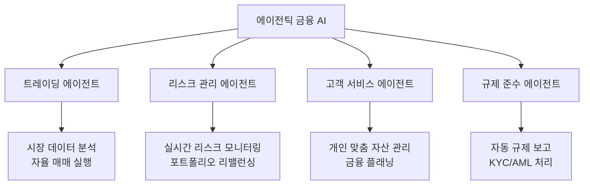

# AI in Finance / Agentic Fintech

2026년 금융 산업은 단순 자동화를 넘어 자율적 의사결정이 가능한 에이전틱 AI 시대로 진입했다. Goldman Sachs의 Claude 기반 자율 에이전트, Lloyds의 전면 AI 배포, OpenAI의 Hiro Finance 인수 등 대형 기관과 빅테크가 금융 AI 경쟁에 본격 돌입한 양상이다.

## 개요

금융 산업은 AI 도입이 가장 빠른 섹터 중 하나다. 2026년의 핵심 전환점은 규칙 기반 자동화에서 **에이전틱 AI** -- 목표를 설정하면 스스로 판단하고 실행하는 자율 에이전트 -- 로의 이동이다. 이는 [[agentic-ai-production|에이전틱 AI 프로덕션]] 패러다임이 금융이라는 고규제 산업에서 실제로 작동하기 시작했음을 의미한다.

## 주요 적용 영역

### 자율 금융 에이전트

- **Goldman Sachs**: Anthropic Claude 기반의 자율 에이전트를 투자 리서치, 리스크 분석, 고객 대응에 배포
- **Lloyds Banking Group**: 2026년 전 사업부에 AI를 전면 배포하여 고객 서비스, 사기 탐지, 내부 운영을 통합 자동화
- **OpenAI Hiro Finance 인수**: ChatGPT에 개인 재무 계획 기능을 통합하기 위해 AI 개인재무 스타트업을 인수. 단순 챗봇을 넘어 실제 자산 관리와 금융 플래닝 지원을 목표

### 사기 탐지 및 리스크 관리

AI 기반 사기 탐지는 금융 AI에서 가장 성숙한 영역이다. 실시간 거래 모니터링, 이상 패턴 감지, 합성 신원(synthetic identity) 사기 차단에서 기존 규칙 기반 시스템 대비 탐지율과 오탐률 모두 개선을 보인다.

| 영역 | 기존 방식 | AI 기반 방식 |
|------|-----------|-------------|
| 사기 탐지 | 규칙 기반, 사후 분석 | 실시간 행동 패턴 분석, 예측적 차단 |
| 신용 평가 | 정적 신용점수 | 대안 데이터 포함 동적 평가 |
| 리스크 관리 | 주기적 보고 | 실시간 포트폴리오 모니터링 |
| KYC/AML | 수동 서류 검토 | 자동화된 신원 확인 + 지속 모니터링 |

### 개인 맞춤 금융 서비스

AI가 개인의 소비 패턴, 소득 흐름, 생애 주기를 분석하여 맞춤형 금융 조언을 제공하는 "하이퍼 개인화" 서비스가 확산 중이다. 기존에 고액 자산가 전용이던 웰스 매니지먼트 서비스가 일반 사용자에게까지 확대되는 민주화 효과가 나타나고 있다.

### RegTech (규제 기술)

금융 규제의 복잡성과 변화 속도에 대응하기 위한 AI 기반 규제 기술이 빠르게 성장 중이다.

- 규제 변경 사항 자동 추적 및 영향 분석
- 자동화된 규제 보고서 생성
- 실시간 규제 준수 모니터링
- 크로스보더 거래의 다중 관할권 규제 대응

## 리스크와 도전 과제

### 자율 에이전트의 법적 책임

AI 에이전트가 자율적으로 계약을 체결하거나 거래를 실행할 때의 법적 책임 소재가 불명확하다. 법원은 아직 자율 에이전트 행동에 대한 책임을 명확히 규정하지 못한 상태이며, 이는 [[ai-legal|AI 법률 산업]]의 핵심 쟁점이기도 하다.

### 모델 리스크

금융 의사결정에 AI를 사용할 때의 모델 리스크 -- 편향된 학습 데이터, 블랙박스 의사결정, 시장 급변 시 예측 실패 -- 는 금융 안정성에 시스템적 위험을 초래할 수 있다.

### 데이터 프라이버시

금융 데이터의 민감성으로 인해 [[ai-cybersecurity-defensive|AI 사이버보안]]과의 교차점이 중요해지고 있다. GenAI 도구 사용 시 고객 데이터 유출 리스크가 주요 우려 사항이다.

## 시장 동향

금융 AI 시장은 에이전틱 AI, 임베디드 금융, 실시간 결제, 탈중앙화 금융(DeFi) 등의 트렌드와 결합하며 급성장 중이다. 빅테크(OpenAI, Anthropic)와 전통 금융 기관 간의 협업과 경쟁이 동시에 진행되고 있으며, 이는 금융 서비스의 근본적 재편을 예고한다.

## 관련 페이지

- [[agentic-ai-production|에이전틱 AI 프로덕션]]
- [[enterprise-ai-adoption|엔터프라이즈 AI 도입]]
- [[ai-cybersecurity-defensive|AI 사이버보안 (방어적 AI)]]
- [[ai-legal|AI 법률 산업]]
- [[multi-agent-orchestration|멀티 에이전트 오케스트레이션]]

## 참고 자료

- [TechCrunch: OpenAI buys Hiro Finance](https://techcrunch.com/2026/04/13/openai-has-bought-ai-personal-finance-startup-hiro/)
- [WEF: Banking enters the agentic era](https://www.weforum.org/stories/2026/02/banking-enters-the-agentic-era-and-other-finance-news-to-know/)
- [Innowise: Fintech trends 2026](https://innowise.com/blog/fintech-trends/)
