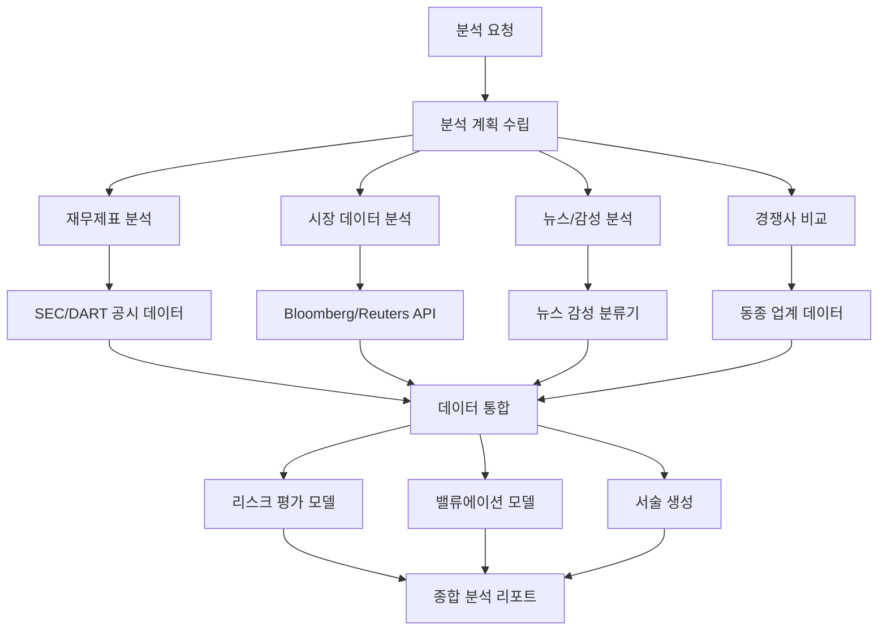
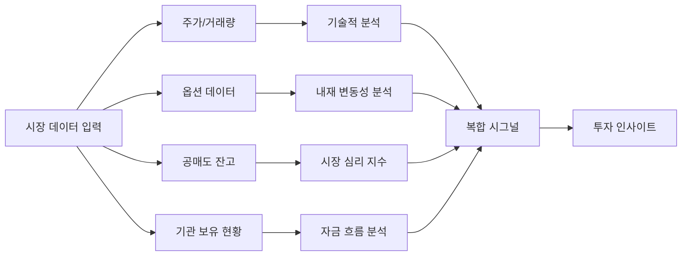

# AI 금융 분석 에이전트 (AI Financial Analysis Agent)

## 개요

AI 금융 분석 에이전트는 재무제표, 시장 데이터, 뉴스, 거시경제 지표 등 이질적인 데이터 소스를 통합하여 투자 판단, 신용 평가, 리스크 관리에 필요한 인사이트를 생성하는 에이전트 시스템이다. 전통적인 금융 분석이 특화된 데이터 소스와 도구를 개별적으로 다루었다면, AI 에이전트는 이를 통합하고 자연어로 질의하며 자동으로 리포트를 생성한다.

[[ai-finance]] 도메인의 핵심 응용 사례이며, [[agent-workflow-patterns]]의 도구 사용 패턴과 병렬 처리 패턴이 대규모 금융 데이터 분석에 직접 적용된다.

## 금융 분석 에이전트 아키텍처

## 재무제표 자동 분석

**처리 가능한 재무 문서:**
- 손익계산서 (Income Statement)
- 재무상태표 (Balance Sheet)
- 현금흐름표 (Cash Flow Statement)
- 사업보고서 MD&A 섹션

**자동 산출 지표:**

| 지표 분류 | 산출 항목 |
|-----------|-----------|
| 수익성 | ROE, ROA, EBITDA 마진, 순이익률 |
| 유동성 | 유동비율, 당좌비율, 현금 전환 주기 |
| 부채 | 부채비율, 이자 보상 배율, 순부채/EBITDA |
| 성장성 | YoY 매출 성장률, EPS 성장 추세 |
| 효율성 | 재고 회전율, 매출채권 회전율 |

AI는 단순 계산을 넘어 "이 회사의 유동비율이 3년 연속 하락하고 있으며, 업계 평균 대비 낮아지고 있다"는 맥락적 해석을 제공한다.

## 시장 데이터 통합 분석

## 에이전트 기반 실시간 모니터링

단일 분석 요청을 넘어 에이전트는 지속적 모니터링 임무를 수행할 수 있다.

**모니터링 시나리오:**

- **어닝 서프라이즈 감지**: 컨센서스 대비 실적 발표 즉시 분석하고 담당자에게 요약 발송
- **뉴스 임팩트 평가**: 기업 관련 주요 뉴스 발생 시 재무적 영향 범위 즉시 추정
- **리스크 임계값 알림**: 포트폴리오의 특정 지표가 사전 설정 임계값을 벗어나면 경보
- **규제 변경 추적**: SEC/금감원 공시 변경 사항을 모니터링하고 영향 분석

## 신용 분석 적용

기업 대출 심사에서 AI 에이전트의 역할:

1. **자동 재무 분석**: 신청 기업의 재무제표에서 핵심 지표 자동 추출
2. **업계 벤치마킹**: 동종 업계 기업과 재무 지표 비교
3. **부정 신호 탐지**: 회계 조작 가능성을 나타내는 이상 패턴 (Beneish M-Score 등) 자동 계산
4. **리스크 등급 제안**: 수집된 데이터를 종합한 신용 등급 초안과 근거 제시

이 과정에서 AI는 심사 담당자의 분석 시간을 90% 이상 단축하지만, 최종 승인/거절은 인간이 결정한다.

## 규제 및 컴플라이언스 고려사항

금융 AI는 일반 도메인보다 엄격한 규제를 받는다.

- **모델 설명 가능성 (Explainability)**: EU AI Act, FINRA 규정은 AI 투자 권고의 근거 설명을 요구
- **백테스팅 요건**: 투자 전략에 사용된 모델은 충분한 기간의 역사적 데이터로 검증 필요
- **시장 조작 방지**: AI가 내부 정보를 학습하거나 시세 조종으로 해석될 수 있는 패턴 생성 금지
- **개인정보 보호**: 개인 투자자 데이터는 GDPR/개인정보보호법 준수 하에 처리

## 관련 문서

- [[ai-finance]] - 금융 AI 전반의 생태계와 주요 플레이어
- [[agent-workflow-patterns]] - 병렬 데이터 수집 및 통합 에이전트 패턴
- [[rag-pipeline]] - 재무 문서 검색 증강 분석
- [[ai-contract-analysis]] - 유사한 문서 분석 패턴의 법률 도메인 적용
