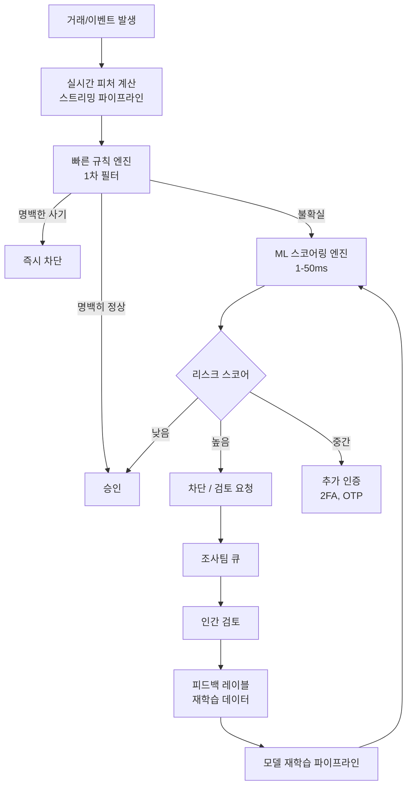
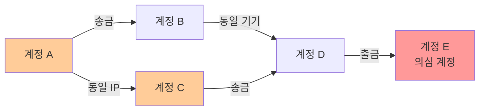
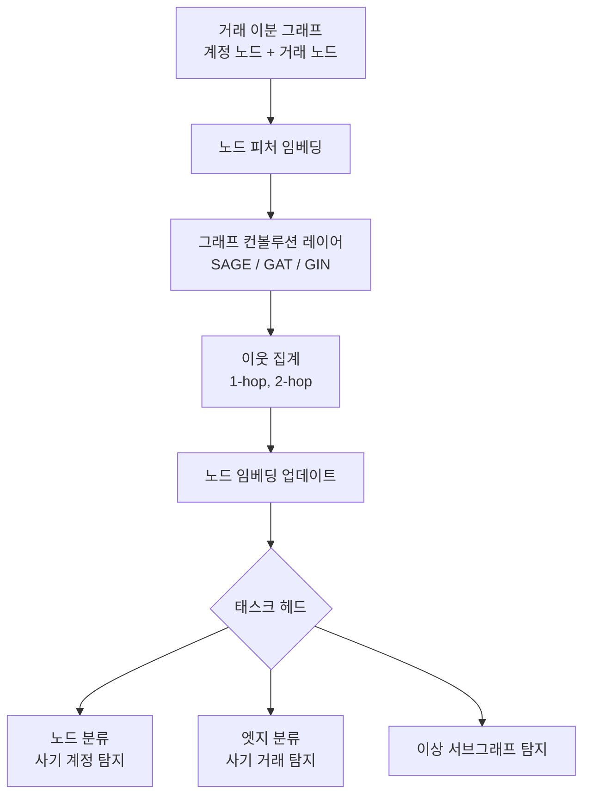
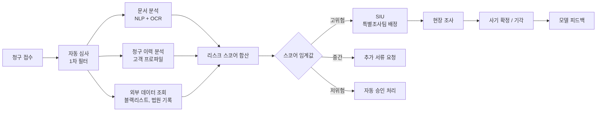
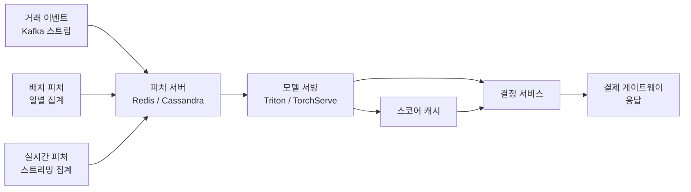

# AI 사기 탐지 시스템

## 개요

사기 탐지(fraud detection)는 AI가 실질적 비즈니스 가치를 가장 확실히 증명한 응용 영역 중 하나다. 신용카드 거래, 보험 청구, 계정 탈취, 자금세탁(AML) 등 다양한 도메인에서 ML 기반 사기 탐지는 규칙 기반 시스템 대비 탐지율과 오탐율 모두에서 우수한 성과를 보인다.

핵심 과제는 두 가지 긴장 관계에 있다.

1. **탐지율(recall) vs. 정밀도(precision)**: 사기를 놓치면 직접 손실이 발생하고, 정상 거래를 차단하면 고객 이탈이 발생한다.
2. **실시간성 vs. 모델 복잡도**: 결제 승인은 100-300ms 내에 결정해야 하지만, 복잡한 모델은 더 정확하다.

이 트레이드오프를 관리하는 것이 프로덕션 사기 탐지 시스템 설계의 핵심이다.

## 시스템 아키텍처 개요

이 다이어그램은 규칙 기반 1차 필터와 ML 스코어링의 계층 구조, 인간 검토를 통한 피드백 루프를 보여준다.

---

## 1. 거래 사기 탐지 (Transaction Fraud)

### 피처 엔지니어링

거래 사기 탐지의 품질은 피처 설계에 크게 의존한다. 원시 거래 데이터에서 의미 있는 신호를 추출하는 것이 핵심이다.

| 피처 카테고리 | 예시 |
|--------------|------|
| 거래 자체 | 금액, 통화, 가맹점 카테고리(MCC), 시간 |
| 속도 피처(velocity) | 최근 1분/10분/1시간/24시간 거래 횟수, 누적 금액 |
| 지리 피처 | 거래 위치, 이전 거래와의 거리, 비정상적 위치 변화 |
| 행동 패턴 | 사용자의 평균 거래 금액 대비 편차, 야간 거래 여부 |
| 장치 피처 | 기기 지문(device fingerprint), 신규 기기 여부 |
| 관계 피처 | 가맹점 사기 이력, 네트워크 연결 |

**스트리밍 집계**: 속도 피처는 실시간 스트리밍 처리(Apache Kafka + Flink/Spark Streaming)로 계산한다. 거래 발생 시점에 최근 N개 거래의 집계를 밀리초 내에 조회해야 한다.

### 클래스 불균형 문제

실제 사기 거래는 전체의 0.01-0.5% 수준으로 극도로 불균형하다. 이를 다루는 기법:

- **SMOTE (Synthetic Minority Oversampling Technique)**: 소수 클래스 합성 샘플 생성
- **클래스 가중치 조정**: 손실 함수에서 사기 클래스에 높은 가중치 부여
- **임계값 조정(threshold tuning)**: 정밀도-재현율 트레이드오프를 비즈니스 비용에 맞게 조정
- **이상 탐지 프레이밍**: 사기를 이상(anomaly)으로 취급해 단일 클래스 학습([[ai-anomaly-detection]] 참조)

### 시간적 피처 드리프트 (Temporal Feature Drift)

사기 패턴은 지속적으로 진화한다. 탐지 모델의 성능이 시간에 따라 저하(concept drift)되므로:

- **챔피언-챌린저 배포**: 새 모델을 소량 트래픽으로 A/B 테스트 후 점진적 롤아웃
- **슬라이딩 윈도우 재학습**: 최근 N일 데이터로 주기적 재학습
- **온라인 학습**: 새 레이블이 들어올 때마다 모델 가중치 미세 조정

---

## 2. 그래프 신경망(GNN) 기반 사기 탐지

### 왜 그래프인가

개별 거래를 독립적으로 보면 놓치는 패턴이 있다. 계정, IP, 기기, 가맹점 사이의 **관계 구조**를 그래프로 모델링하면 링 사기(ring fraud), 머니뮬(money mule) 네트워크 같은 조직적 사기를 탐지할 수 있다.

이 그래프에서 E는 개별적으로는 정상처럼 보이지만, 네트워크 맥락에서 의심 계정 A, C와 2홉 내에 연결된다.

### GNN 아키텍처 패턴

**이분 그래프(bipartite graph)**: 계정 노드와 거래 노드를 분리한 이분 그래프로 모델링하면 "이 계정은 어떤 거래에 참여했는가"와 "이 거래에는 어떤 계정이 참여했는가"를 양방향으로 메시지 패싱.

**현실적 과제**: 금융 그래프는 수억 개 노드와 수십억 개 엣지를 가질 수 있다. 미니배치 그래프 학습(GraphSAGE 스타일 이웃 샘플링) 없이는 훈련 불가능.

**실제 사례**:
- **PayPal**: GNN 기반 계정 사기 탐지 시스템. 그래프 기반으로 조직적 사기 링 탐지
- **Alibaba**: AliGraph 플랫폼으로 대규모 이커머스 사기 탐지
- **Yelp**: 리뷰 사기 탐지에 GNN 적용 (YelpChi 데이터셋으로 공개 연구)

---

## 3. 보험 사기 탐지

### 보험 사기의 특성

보험 사기는 거래 사기와 다른 패턴을 갖는다.

- **조작된 손실 청구**: 실제 사고를 과장 청구, 또는 사고를 조작
- **쌓은 보험(policy stacking)**: 동일 사고로 여러 보험사에 중복 청구
- **협력 사기(organized fraud rings)**: 병원, 법률 사무소, 청구인이 공모
- **긴 잠복기**: 청구 처리에 수 주~수 개월이 걸려 실시간 탐지가 어려움

### 보험 사기 탐지 파이프라인

**SIU(Special Investigation Unit)**: 보험사 내 사기 조사 전문팀. AI 스코어링은 SIU의 업무 우선순위 결정에 사용된다.

**네트워크 분석**: 청구인-병원-법률대리인 관계를 그래프로 분석해 공모 링 탐지.

---

## 4. 계정 탈취(Account Takeover, ATO) 탐지

### ATO 패턴

공격자가 정상 사용자의 계정을 탈취하는 시나리오.

1. **크레덴셜 스터핑(credential stuffing)**: 다른 사이트에서 유출된 ID/PW 목록으로 자동 로그인 시도
2. **세션 하이재킹(session hijacking)**: 유효 세션 토큰 탈취 후 다른 IP에서 사용
3. **소셜 엔지니어링**: 피싱으로 인증 코드 획득

### 행동 생체인식(Behavioral Biometrics)

정적 인증(비밀번호)을 넘어 **행동 패턴**으로 지속적 인증을 구현한다.

- **타이핑 패턴(keystroke dynamics)**: 키 누르는 속도, 압력, 리듬
- **마우스 이동 패턴**: 이동 궤적, 가속도, 클릭 패턴
- **터치스크린 제스처**: 스크롤 속도, 탭 압력, 기기 기울기
- **탐색 패턴**: 페이지 방문 순서, 체류 시간

이 피처들로 기준선 프로파일을 만들고, 현재 세션과 유사도를 비교해 이상 세션을 탐지한다. 비밀번호를 알고 있어도 행동 패턴이 다르면 추가 인증을 요구한다.

---

## 5. 실시간 스코어링 인프라

### 지연 시간 요구사항

| 채널 | 허용 지연 | 접근 방식 |
|------|----------|-----------|
| 카드 결제 (온라인) | 100-300ms | 경량 모델 + 캐시 |
| 카드 결제 (오프라인 POS) | 50-100ms | 온디바이스 또는 엣지 |
| 계좌 이체 | 1-10초 | 더 복잡한 모델 허용 |
| 보험 청구 | 분~시간 | 앙상블 + 그래프 분석 |

### 모델 서빙 아키텍처

**피처 스토어(feature store)**: Feast, Tecton 같은 피처 스토어가 학습 시(오프라인)와 추론 시(온라인)의 피처를 동일하게 관리해 "훈련-서빙 불일치(training-serving skew)"를 방지한다.

**모델 캐싱**: 동일 계정의 반복 거래는 최근 스코어를 캐싱해 재계산 비용 절감. 단, TTL을 짧게 유지해 빠른 패턴 변화에 대응.

---

## 한계 및 트레이드오프

### 적대적 사기범(Adversarial Fraudsters)

사기범은 탐지 시스템에 적응한다. 모델이 공개되면 사기범이 모델을 우회하는 패턴을 학습한다. 모델 업데이트 주기와 사기 패턴 진화 속도의 군비 경쟁.

### 오탐(False Positive) 비용

정상 거래를 사기로 차단하면 고객 경험 훼손, 불만 및 이탈이 발생한다. 특히 해외 여행 중 거래, 고가 물품 구매 등은 오탐이 빈번하다. 정밀도-재현율 균형은 비즈니스 목표에 따라 도메인별로 다르게 설정해야 한다.

### 레이블 지연(Label Delay)

사기 여부는 청구 분쟁이 해결될 때까지 수 주~수 개월 후에야 확정된다. 이 지연 동안 수집된 데이터는 레이블 없이 축적되고, 모델은 구식 레이블로 재학습될 위험이 있다.

### 윤리 이슈

**인구통계 편향**: 특정 지역, 인종, 소득 계층에서 오탐률이 높으면 차별적 결과를 초래한다. 피처에 직접적 인구통계 변수를 포함하지 않더라도, 우편번호나 구매 패턴이 대리변수(proxy)가 될 수 있다.

**설명 가능성**: EU GDPR, 미국 FCRA 등 규제는 금융 결정에 대한 설명 의무를 부과한다. "알고리즘이 결정했다"는 답변은 법적으로 불충분하다. LIME, SHAP 같은 설명 가능 AI 도구가 컴플라이언스의 핵심이 된다.

---

## 관련 문서

- [[graph-neural-networks]] - GNN 아키텍처 상세
- [[ai-anomaly-detection]] - 이상 탐지 기법 심화
- [[ai-credit-scoring]] - 신용 평가 AI와의 연계
- [[ai-cyber-threat-hunting]] - 보안 맥락에서의 이상 탐지
- [[ai-network-monitoring]] - 네트워크 레벨 사기 트래픽 탐지
