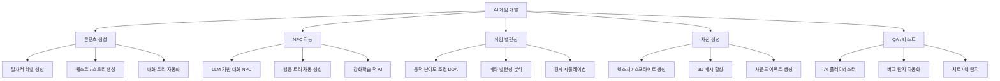
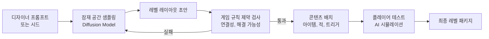
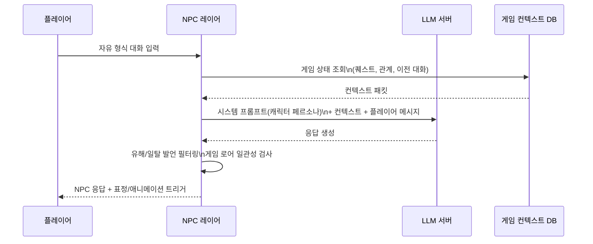
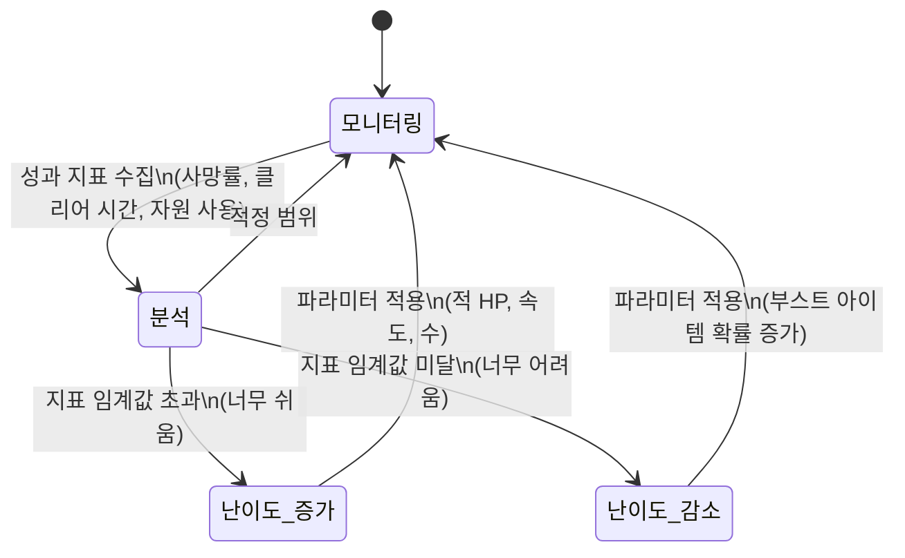
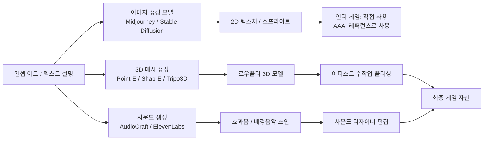
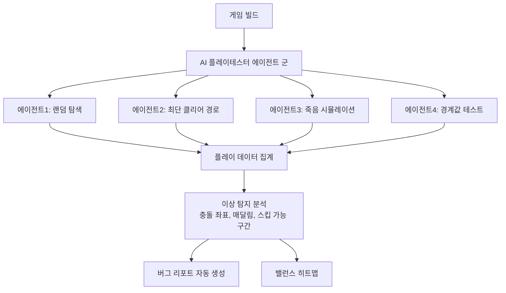
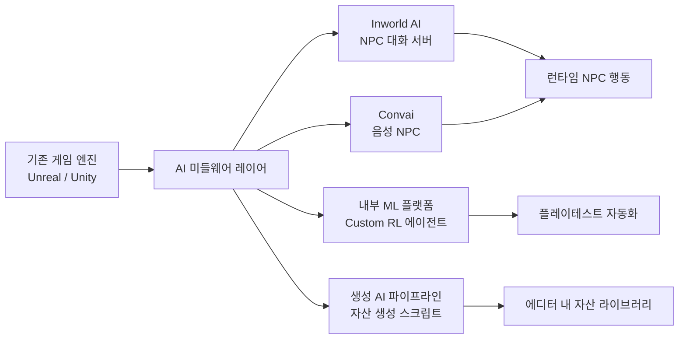

# AI 게임 개발 응용

## 개요

AI는 게임 개발의 거의 모든 단계에 침투했다. 콘텐츠 생성(절차적 레벨, 대화, 자산), 플레이어 경험 최적화(동적 난이도, 밸런싱), 테스트 자동화, 그리고 NPC(Non-Player Character) 행동 고도화까지 폭넓게 활용된다. 기존에 수십 명의 팀이 수개월에 걸쳐 수행하던 작업을 AI 파이프라인이 보조 또는 대체하고 있으며, 동시에 "AI가 게임을 만든다"는 과장 없이 실질적으로는 개발자의 생산성 배율기(productivity multiplier)로 자리매김하고 있다.

핵심 가치는 두 가지다. 첫째, **콘텐츠의 무한 확장 가능성**: 절차적 생성(procedural generation)으로 플레이어마다 다른 경험을 제공한다. 둘째, **품질과 밸런스의 자동화**: 플레이테스트 AI 에이전트가 수천 시간의 게임플레이 데이터를 생성해 밸런스 문제를 사전 탐지한다.

## 응용 영역 개요

위 다이어그램은 AI가 게임 개발 파이프라인 전 영역에 걸쳐 어떻게 분화하는지를 보여준다.

---

## 1. 절차적 콘텐츠 생성 (Procedural Content Generation, PCG)

### 개념

절차적 콘텐츠 생성이란 알고리즘이나 AI 모델을 사용해 게임 콘텐츠(레벨, 지형, 아이템, 스토리)를 런타임 또는 오프라인 파이프라인에서 자동으로 만들어 내는 기법이다. 전통적인 수작업 디자인의 대안이 아니라, **스케일 확장**의 수단이다.

### 접근 방식 비교

| 방식 | 설명 | 예시 |
|------|------|------|
| 규칙 기반 PCG | 미리 정의한 규칙(그래프, 템플릿)으로 조합 | Spelunky 레벨 생성 |
| 노이즈 함수 기반 | Perlin/Simplex 노이즈로 지형 생성 | Minecraft 월드 |
| 머신러닝 생성 | GAN(Generative Adversarial Network)/VAE/Diffusion으로 콘텐츠 생성 | AI Dungeon, 텍스처 합성 |
| LLM 기반 | 언어 모델로 퀘스트, 대화, 스토리 생성 | Inworld AI, Character.AI NPC |
| 강화학습 기반 | RL 에이전트가 플레이어 경험을 최적화하는 콘텐츠 생성 | 연구 단계 많음 |

### Diffusion 기반 레벨 생성 파이프라인

이 흐름은 생성 모델이 레벨 초안을 만들고, 게임 규칙 기반 검증기가 플레이어 경험 품질을 보장하는 두 단계 파이프라인이다. 생성 실패 시 재샘플링으로 반복한다.

### 실제 사례

- **No Man's Sky (Hello Games)**: 18경 개 이상의 행성을 절차적으로 생성. 문법(grammar) 기반 + 노이즈 기반 혼합 시스템 사용
- **Minecraft (Mojang)**: 청크 단위 Perlin 노이즈 지형 생성, 구조물 배치 규칙 레이어
- **Spelunky 2**: 연결 그래프 기반 방 조합으로 플레이 가능한 레벨 보장
- **AI Dungeon**: GPT 계열 LLM이 실시간 스토리 생성

---

## 2. NPC 대화 및 행동 지능

### LLM 기반 대화 NPC

전통적 NPC 대화는 분기 트리(dialogue tree)로 구현돼 있어 스크립트 범위 밖의 대화가 불가능했다. LLM 통합으로 NPC는 맥락을 기억하고 자유 형식 대화를 처리할 수 있게 됐다.

**핵심 과제**:
- **컨텍스트 윈도우 관리**: NPC 기억은 토큰 한계가 있어 중요 기억을 요약·선택하는 메모리 압축 전략이 필요
- **캐릭터 일관성**: 시스템 프롬프트만으로는 긴 대화에서 페르소나가 흐트러짐 - 파인튜닝 또는 RLHF가 더 강건한 해법
- **지연 시간(latency)**: 실시간 게임에서 LLM 응답 100-300ms는 허용 가능하나, 그 이상은 체감 품질 저하

### 강화학습 기반 적 AI

게임 적(enemy) AI에 [[reinforcement-learning]]을 적용하면 스크립트 없이 전략적으로 진화하는 대적자를 만들 수 있다. OpenAI의 Dota 2 Five, DeepMind의 StarCraft II AlphaStar가 대표 사례다.

- **자기 대전(self-play)**: 에이전트가 자신의 복사본과 대전해 인간 플레이어 수준을 초월하는 전략 습득
- **커리큘럼 학습(curriculum learning)**: 쉬운 시나리오에서 어려운 시나리오로 점진적 훈련
- **게임 내 적 적용 주의점**: 지나치게 강한 AI는 플레이어 경험을 해침. 의도적으로 제한된 역량 표현(bounded competence)이 필요

---

## 3. 게임 밸런싱

### 동적 난이도 조정 (Dynamic Difficulty Adjustment, DDA)

DDA는 플레이어의 실시간 성과 지표를 모니터링하고 게임 파라미터를 조정해 최적의 도전감(flow state)을 유지하는 기법이다.

**플로우 채널(flow channel)**: Mihaly Csikszentmihalyi의 개념을 게임에 적용 - 스킬과 챌린지가 균형을 이룰 때 몰입 상태 달성. DDA의 목적은 플레이어를 이 채널 안에 유지하는 것.

### 메타 밸런싱 분석

멀티플레이어 게임의 캐릭터/무기/덱 밸런싱은 방대한 플레이어 데이터 분석으로 이루어진다.

- **승률 분석**: 각 캐릭터/빌드의 ELO 대 승률 상관관계
- **사용률 vs. 승률 매트릭스**: 고사용-저승률(underpowered), 저사용-고승률(sleeper) 아이템 탐지
- **클러스터링**: 플레이어 빌드를 클러스터링해 메타 아크타입 자동 식별
- **인과 추론(causal inference)**: 패치 변경이 밸런스에 미치는 인과 효과 측정 (상관관계와 구분)

**Riot Games의 사례**: League of Legends에서 수백만 게임의 챔피언별 통계를 분석해 패치 우선순위를 결정하는 내부 시스템 운영.

---

## 4. AI 자산 생성

### 생성형 AI(Generative AI)의 자산 파이프라인 통합

### 실제 활용 패턴

**컨셉 생성 가속**: 아티스트가 10개 컨셉을 수작업으로 그리는 대신 100개 AI 컨셉 중 5개를 선택하고 폴리싱

**텍스처 변형**: 기존 자산의 스타일 변형(시즌 이벤트용 스킨 생성, 지역화 텍스처 등)

**NeRF(Neural Radiance Fields) / 3D 가우시안 스플래팅**: 실사 사진에서 3D 자산 재구성 - 소품, 배경 오브젝트 스캔에 활용

**보이스 클로닝(voice cloning)**: 주요 캐릭터 성우 녹음 후 AI 보이스 모델 학습 → 대사 추가/수정 시 스튜디오 재녹음 없이 처리 ([[ai-audio-voice-cloning]] 참조)

---

## 5. AI 기반 QA 및 플레이테스팅

### AI 플레이테스터

강화학습 에이전트나 스크립트 기반 봇이 인간보다 빠르게 게임을 플레이해 버그, 밸런스 이슈, 엣지 케이스를 탐지한다.

**Electronic Arts(EA)의 사례**: "Seed" 연구팀이 강화학습 에이전트로 FIFA 및 기타 EA 타이틀의 자동 QA 수행. 인간 QA 팀 대비 버그 탐지 coverage 대폭 확장.

### 치트 및 핵 탐지

멀티플레이어 게임의 치트 탐지는 [[ai-anomaly-detection]] 기법을 게임 특화 지표에 적용한다.

- **행동 프로파일링**: 에임 속도, 반응 시간, 이동 패턴의 통계적 이상 탐지
- **그래프 분석**: 아이템 더핑(duplication) 등 경제 이상은 거래 그래프 분석으로 탐지
- **모델 지속 업데이트**: 치터들은 탐지 모델에 적응하므로 지속적 모델 재훈련 필요 (적대적 게임 이론)

---

## 6. AAA 게임 통합 패턴

대형 게임 스튜디오가 AI를 통합하는 방식은 스타트업의 AI-first 접근과 다르다.

**주요 AI 미들웨어 제공사**:
- **Inworld AI**: 게임 NPC용 LLM 플랫폼. 캐릭터 메모리, 목표, 페르소나 관리
- **Convai**: 음성 기반 NPC 대화 + 아바타 애니메이션 동기화
- **Promethean AI**: 씬(scene) 자동 구성 도구 - 환경 자산 배치 자동화
- **NVidia ACE (Avatar Cloud Engine)**: 실시간 AI NPC 위한 클라우드 추론 인프라

---

## 한계 및 트레이드오프

### 기술적 한계

| 한계 | 설명 |
|------|------|
| 레이턴시 vs. 품질 | LLM 기반 NPC는 클라우드 추론이 필요해 네트워크 지연이 게임플레이에 영향 |
| 컨텍스트 일관성 | 긴 게임 세션에서 AI NPC의 기억/캐릭터 일관성 유지 어려움 |
| 결정론적 재현성 | 프로시저럴 생성 콘텐츠는 버그 재현이 어려움 (시드 관리 필요) |
| 지나친 최적화 | RL 에이전트가 플레이어 경험을 망치는 exploit 전략을 발견할 수 있음 |
| 생성 품질 분산 | 생성형 AI 자산은 품질이 일관되지 않아 큐레이션 비용 발생 |

### 윤리 이슈

**데이터 동의**: AI 학습에 플레이어 행동 데이터를 사용할 때 개인정보 동의 이슈 발생

**저작권 모호성**: AI 생성 자산의 저작권 귀속 문제 - 특히 기존 아트워크로 학습한 모델의 결과물

**직업 영향**: AI 자산 생성 도구의 확산으로 2D 아티스트, 레벨 디자이너 역할 변화. 단순 반복 작업은 줄어들지만 디렉션/품질 판단 역할은 오히려 중요해짐

**독성 콘텐츠 생성**: LLM NPC가 유해 발언을 생성할 위험 - 런타임 필터링 + 레드팀 테스트 필수

**과도한 참여 유도**: DDA 시스템이 플레이어의 참여 시간을 극대화하도록 최적화될 경우 건강한 게임 습관과 상충

---

## 관련 문서

- [[procedural-generation]] - 절차적 생성 개념 심화
- [[reinforcement-learning]] - RL 기반 에이전트 이론
- [[ai-audio-voice-cloning]] - NPC 음성 생성 응용
- [[ai-anomaly-detection]] - 치트 탐지에 적용되는 이상 탐지 기법
- [[ai-content-recommendation]] - 게임 내 콘텐츠 추천 시스템
