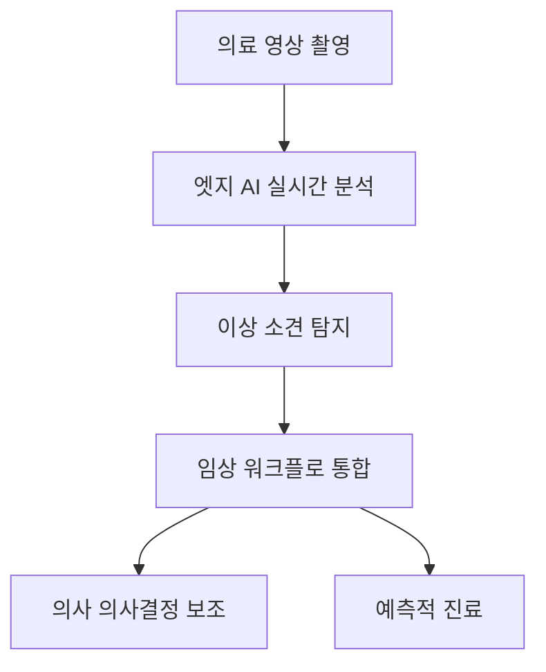
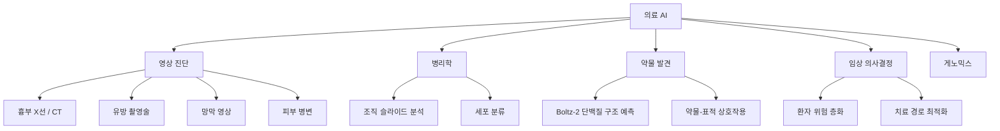

## 개요

의료 AI는 2026년 현재 FDA 승인 AI 알고리즘 400개를 돌파하며 임상 현장에서의 실질적 활용 단계에 접어들었다. [[ai-scientific-discovery|신약 설계를 위한 AI]]와 함께 바이오·헬스 AI의 핵심 축을 이룬다. 특히 엣지 AI를 탑재한 영상 장비가 클라우드 의존 없이 실시간 분석을 수행하고, 임상 워크플로에 직접 통합되면서 진단 정확도와 효율성이 크게 향상되고 있다. 의료 데이터의 90%가 영상으로 구성되어 있어, 의료 영상 AI는 헬스케어 AI의 핵심 축을 이룬다. [[enterprise-ai-adoption|엔터프라이즈 AI 도입]] 측면에서 병원 시스템 통합이 주요 과제이다.

## 핵심 개념

**엣지 AI 의료 영상**: 영상 장비 자체에 AI 추론 엔진을 탑재하여 촬영 즉시 분석 결과를 제공한다. 네트워크 지연 없이 실시간 진단 보조가 가능하며, 환자 데이터의 외부 전송 없이 프라이버시를 보호한다.

**오픈 웨이트 의료 AI 모델**: Google의 HAI-DEF(Health AI Developer Foundations) 프로젝트에서 MedGemma(의료 영상/텍스트 분석), TxGemma(치료학) 등 오픈 웨이트 모델을 공개하여 의료 AI 연구 접근성을 높이고 있다.

**예측적 진료(Predictive Care)**: 단순 진단을 넘어 질병 발생을 사전 예측하는 방향으로 패러다임이 전환 중이다. [[ai-data-analysis|에이전틱 애널리틱스]]가 이 예측 역량의 기반이 된다.

## 오픈 웨이트 의료 AI 생태계

Google HAI-DEF(Health AI Developer Foundations) 프로젝트가 의료 AI 연구 접근성을 선도하고 있다:

| 모델 | 용도 | 특징 |
|---|---|---|
| **MedGemma** | 의료 영상 + 텍스트 분석 | 방사선 영상, 병리 슬라이드, 임상 텍스트 통합 분석 |
| **TxGemma** | 치료학(Therapeutics) | 약물 반응 예측, 치료 계획 보조 |
| **Health Acoustic** | 음성 기반 진단 | 호흡기 질환 스크리닝 |

이 외에도 CheXpert(흉부 X선), MIMIC-CXR(ICU 영상) 등 대규모 공개 데이터셋 기반 연구가 확대되고 있다.

## 현황 (2026)

- FDA 승인 AI 알고리즘 **400개 이상** 돌파, 방사선과 영역 집중
- Google Health: 유방암 검출(Northwestern Medicine, NHS 협력), 폐암 스크리닝(Nature Medicine 검증), 방사선 치료 계획(Mayo Clinic 협력) 등 다수 임상 검증 진행
- 글로벌 접근성 확대: 결핵 흉부 X선 스크리닝(결핵 풍토병 국가), 당뇨 망막병증 검출(인도/태국), AI 초음파 산모 건강(의료 취약지)
- 휴대용 진단 장비에 AI 탑재 확산 -- 오지 및 의료 인프라 부족 지역에서의 활용도 급증
- ONNX Runtime, TensorFlow Lite 등을 활용한 경량 모델 최적화로 엣지 디바이스 배포 가속
- 의료 데이터의 **90%가 영상**으로 구성 -- 의료 영상 AI가 헬스케어 AI의 핵심 축

## 핵심 기술 동향

### 엣지 AI 영상 진단

클라우드 의존을 탈피한 온디바이스 추론이 확산 중이다:

- **촬영 즉시 분석**: 영상 장비 자체에 AI 추론 엔진을 탑재하여 촬영과 동시에 이상 소견 탐지
- **네트워크 독립**: 네트워크 지연 없이 실시간 진단 보조. 의료 인프라 부족 지역에서 특히 유효
- **프라이버시 보호**: 환자 데이터가 장비 밖으로 전송되지 않아 HIPAA 준수 부담 감소
- **최적화 기술**: ONNX Runtime, TensorFlow Lite, INT8/INT4 양자화로 경량 모델 배포

### 예측적 진료 (Predictive Care)

단순 진단(이미 발생한 질병 발견)을 넘어 **질병 발생 사전 예측**으로 패러다임이 전환 중이다:

- 영상 바이오마커 + 전자건강기록(EHR) 데이터 결합으로 위험군 사전 식별
- 시계열 영상 분석으로 질병 진행 궤적 예측
- 치료 반응 예측 모델로 개인화 치료 계획 최적화

### 연합학습 (Federated Learning)

환자 데이터를 기관 밖으로 전송하지 않고도 다기관 협업 학습이 가능한 기법이다:

- 각 병원이 로컬 데이터로 모델을 학습하고, 모델 파라미터만 중앙 서버와 교환
- HIPAA/GDPR 준수 부담을 구조적으로 해소
- 데이터 편향 문제 완화: 다양한 인구 집단 데이터로 모델 일반화 성능 향상
- Google Health, NVIDIA Clara 등이 의료 연합학습 플랫폼 주도

## 전망/과제

**규제와 검증**: AI 진단 도구의 임상 검증은 데이터셋 편향, 인구 집단별 성능 차이 등 해결해야 할 과제가 남아 있다. FDA 승인 절차의 속도와 사후 모니터링 체계 강화가 필요하다. EU AI Act에서 의료 AI는 **고위험 AI 시스템**으로 분류되어 추가 규제 대상이다.

**데이터 프라이버시**: 연합학습이 확대되고 있으나, HIPAA/GDPR 준수와 데이터 거버넌스 체계 구축이 동반되어야 한다. 엣지 AI 배포가 프라이버시 부담을 구조적으로 줄이는 대안으로 부상 중이다.

**임상 통합**: AI 도구가 기존 PACS(의료영상저장전송시스템)/EHR(전자건강기록) 시스템과 원활하게 통합되는 상호운용성(interoperability)이 대규모 채택의 핵심 조건이다. DICOM/HL7 FHIR 표준 준수가 필수이다.

**임상의 신뢰**: AI 도구의 설명 가능성(explainability)이 임상의 수용도에 직접적 영향을 미친다. 블랙박스 모델보다 Grad-CAM, SHAP 등으로 판단 근거를 시각화하는 설명 가능한 AI가 선호된다.

## 주요 적용 영역

### FDA 승인 현황 분포

FDA 승인 AI 알고리즘 400+개 중 방사선과가 가장 높은 비중을 차지한다. 심장학, 안과, 병리학 순으로 뒤를 잇는다. 2024-2026년 사이 승인 속도가 가속화되어 매년 100+개의 새로운 AI 의료기기가 승인되고 있다.

## 관련 문서

- [[ai-robotics-physical-ai]] - 로봇 수술 등 물리적 AI 적용
- [[enterprise-ai-adoption]] - 기업/기관의 AI 도입 현황
- [[eu-ai-act-enforcement]] - 고위험 AI 시스템으로서의 의료 AI 규제
- [[boltz-2]] - AI 약물 발견 (단백질 구조 예측)
