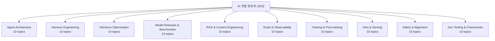

# 2026년 4월 AI 개발 핫토픽 100선

이 문서는 2026년 4월 시점 AI 개발 흐름을 10개 축, 100개 토픽으로 재구성한 허브다. 중복 토픽은 하나의 위키 페이지로 병합했고, 기존 일반 개념은 덮어쓰지 않고 보강했다.

## 읽는 법

이 허브는 "무엇이 중요한가"를 빠르게 훑는 entrypoint다. 깊게 파고들 때는 아래 순서를 권장한다.

1. **섹션별 대표 개념 1-2개**를 먼저 읽어 현재 흐름을 잡는다.
2. 같은 섹션 안의 **entity / project-internal / case-study**를 따라가며 실제 구현체와 운영 패턴을 본다.
3. 페이지 하단의 `## 읽는 순서

이 요약 페이지는 source를 한 장으로 압축한 허브다. 먼저 큐레이션 요약으로 전체 흐름을 잡고, 그 다음 source 기반 참고에서 실제 원문을 따라가면 된다.

## 실무 관점

 따라서 이 문서는 결론을 확정하는 문서라기보다, **어떤 원문을 어떤 순서로 읽어야 하는지 안내하는 네비게이션 문서**로 쓰는 것이 적절하다.

## source 기반 참고`에서 개별 원문과 짧은 메모를 확인해 근거를 따라간다.

즉, 이 페이지는 최종 목적지가 아니라 **탐색 지도(map)** 역할을 한다.

## 이번 수집 범위

- 원본 큐레이션 링크: 500개
- 중복 제거 후 실제 수집 URL: 452개
- 수집 성공: 452개
- topic packet: 97개

이번 패스는 개별 링크를 직접 수집해 `raw/hot-topics-sources/2026-04-10/` 아래 snapshot으로 저장하고, 각 토픽 페이지에 source 기반 참고 섹션을 연결했다. 그래서 이제 각 토픽은 단순 허브가 아니라 **원문 근거를 바로 따라갈 수 있는 위키 노드**가 되었다.

## 한눈에 보는 흐름

2026년 4월의 AI 개발 담론은 단순히 "더 큰 모델"로 수렴하지 않는다. 오히려 다음 다섯 축이 동시에 강화되는 흐름이 보인다.

1. **에이전트의 장기 지속성** — context engineering, memory, hierarchical planning, long-horizon RL이 하나의 묶음으로 움직인다.
2. **하네스와 실행 환경의 중요성 증가** — 모델 자체보다 orchestration, sandbox, MCP, tool contract, worktree isolation 같은 주변 시스템이 성능을 좌우한다.
3. **서빙의 시스템화** — disaggregated serving, MoE 병렬화, KV cache 계층화처럼 인프라가 모델 품질만큼 중요해졌다.
4. **평가와 관측 가능성의 통합** — LLM-as-judge, trajectory eval, synthetic eval, observability platform이 한 스택으로 수렴한다.
5. **안전성과 거버넌스의 운영화** — prompt injection, monitorability, responsible scaling처럼 "출시 이후 운영" 문제를 다루는 항목이 핵심 토픽으로 부상했다.

즉, 이 시기의 핫토픽은 "모델 하나의 성능"보다 **모델을 둘러싼 시스템 전체를 어떻게 설계·측정·운영할 것인가**에 더 무게가 실려 있다.

| 읽기 목표 | 먼저 볼 문서 | 그다음 볼 문서 |
|---|---|---|
| 에이전트 설계 이해 | [[context-engineering]] | [[anthropic-multi-agent-research-system]], [[long-running-agent-harnesses]] |
| 추론/서빙 구조 이해 | [[flashattention-4]], [[disaggregated-serving]] | [[lmcache]], [[tensorrt-llm]] |
| RAG/메모리 이해 | [[contextual-retrieval]], [[agent-memory-systems]] | [[context-rot]], [[temporal-knowledge-graph-memory]] |
| 평가/운영 이해 | [[tool-invocation-evaluators]], [[llm-observability-platforms]] | [[long-horizon-agent-benchmarks]], [[metr-time-horizon-benchmark]] |
| 모델 선택 | [[frontier-model-comparison-2026-04]] | 개별 모델 entity 페이지 |

## 무엇이 실제로 깊어졌는가

이번 확장에서는 단순 링크 허브를 넘어서 각 토픽 페이지에 **source 기반 참고**가 실제로 붙었다. 따라서 이제는 "토픽 제목만 있는 인덱스"가 아니라, 개별 토픽에서 바로 원문 링크와 짧은 메모를 따라가며 맥락을 복원할 수 있다.

특히 다음 세 부류가 이전보다 유용해졌다.

1. **연구 트랙 추적** — arXiv / 학회 / 연구 블로그를 함께 묶어 한 개념이 논문-블로그-구현체로 어떻게 이어지는지 볼 수 있다.
2. **제품 허브 탐색** — 모델/SDK/프레임워크 entity 페이지에서 출시 신호, 공식 문서, 구현 저장소를 한 번에 볼 수 있다.
3. **운영 패턴 비교** — eval, observability, serving, safety 항목에서 서로 다른 벤더 문서를 나란히 따라가며 공통 패턴을 비교할 수 있다.

## 구조

상단 다이어그램은 분야별 분류를 보여주지만, 실제 읽기 순서는 분류보다 의존관계가 중요하다. 실무자는 보통 `Agents → Harness → Inference/RAG → Evals → Safety` 순서로 읽을 때 전체 그림이 잘 잡힌다.

## 우선 읽기 경로

### 1. 에이전트 시스템 설계자에게 중요한 페이지

- [[context-engineering|Context Engineering for Long-Horizon Agents]]
- [[subagents|Subagents & Multi-Agent Orchestration in the Harness]]
- [[agent-memory-systems|Agent Memory Systems (Episodic / Semantic / Working)]]
- [[tool-contracts-for-agents|Tool Contracts & Writing Tools for Agents]]
- [[llm-as-judge-calibration|LLM-as-Judge Calibration & Reliability]]

### 2. 서빙 / 인프라 엔지니어에게 중요한 페이지

- [[disaggregated-serving|Prefill/Decode Disaggregated Serving]]
- [[wide-expert-parallelism|Wide Expert Parallelism (WideEP) for MoE]]
- [[lmcache|LMCache + Mooncake KV Cache Layer]]
- [[flashattention-4|FlashAttention-4 on Blackwell]]
- [[tensorrt-llm|TensorRT-LLM 1.3 with Day-0 Model Support]]

### 3. 평가 / 안전 / 운영 담당자에게 중요한 페이지

- [[agent-trajectory-evaluation|Agent Trajectory Evaluation]]
- [[tool-invocation-evaluators|Tool Selection & Tool Invocation Evaluators]]
- [[llm-observability-platforms|Production Observability Platforms Convergence]]
- [[agent-prompt-injection-defense|Agent Prompt Injection Defense & Trustworthy Agents]]
- [[responsible-scaling-policy-v3|Responsible Scaling Policy v3 & Frontier Safety Roadmap]]

## 읽는 법

- **새로운 개념을 이해하려면** concept 페이지부터 읽는다.
- **특정 제품/모델/프레임워크를 따라가려면** entity 페이지를 읽는다.
- **하나의 문서군을 빠르게 훑으려면** summary 페이지를 우선 본다.
- **시간에 묶인 사례를 이해하려면** case-study를 읽는다.

이 허브는 "분야 지도" 역할을 한다. 실제 학습이나 실무 적용을 위해서는 각 토픽 페이지의 `source 기반 참고` 섹션으로 내려가 원문 신호를 확인하는 것이 좋다.

## 섹션별 개요

### Agent Architecture

- [[context-engineering|Context Engineering for Long-Horizon Agents]] — 장기 실행 에이전트가 제한된 컨텍스트 윈도우에 어떤 토큰을 넣을지 의도적으로 큐레이션하는 기술.
- [[orchestrator-worker-pattern|Orchestrator-Worker Multi-Agent Pattern]] — 리드 에이전트가 작업을 분해해 병렬 서브에이전트에게 위임하고 결과를 합성하는 분산형 에이전트 아키텍처.
- [[generator-evaluator-architecture|Generator-Evaluator Harness Architecture]] — 생성 에이전트와 별도의 평가 에이전트를 분리해 자기평가 편향을 외부화하는 GAN 영감의 멀티 에이전트 하니스.
- [[agent-memory-systems|Agent Memory Systems (Episodic / Semantic / Working)]] — 에이전트가 세션을 넘어 경험·사실·작업 상태를 store/retrieve/update/summarize/discard 연산으로 관리하는 메모리 계층.
- [[agent-skills|Agent Skills]] — 에이전트가 파일시스템에 저장된 SKILL.md 폴더를 메타데이터 → 본문 → 리소스 3단계로 점진적 로딩하는 능력 패키징 표준.
- [[long-horizon-rl-training-for-agents|Long-Horizon RL Training for Agents (Multi-Turn RLVR)]] — 멀티 턴 환경에서 검증 가능한 보상으로 에이전트의 도구 사용·계획·자기수정 능력을 직접 학습시키는 강화학습 기법.
- [[context-folding|Context Folding & Sub-Trajectory Compression]] — 에이전트가 서브태스크 단위로 분기한 뒤 완료 시 그 구간을 요약으로 압축해 활성 컨텍스트를 10배 가까이 줄이는 기법.
- [[agent-trees|Hierarchical Planning with Agent Trees]] — 복잡한 목표를 동적으로 구성되는 에이전트 트리로 분해하고 제어 흐름 노드로 서브에이전트들을 조정하는 계획 방식.
- [[long-horizon-agent-benchmarks|Long-Horizon Agent Benchmarks (GAIA 2 / SWE-Bench Pro / SWE-EVO)]] — 수십~수백 단계, 수십 파일에 걸친 실세계 과제로 에이전트의 지속 추론·도구 사용·환경 상호작용을 평가하는 벤치마크 세대.
- [[lethal-trifecta|Lethal Trifecta (치명적 3요소)]] — 사적 데이터 접근 + 신뢰할 수 없는 콘텐츠 노출 + 외부 통신이 결합될 때 발생하는 에이전트의 구조적 취약성과 그 방어 패턴.

### Harness Engineering

- [[long-running-agent-harnesses|Agent Harnesses for Long-Running Coding Sessions]] — 컨텍스트 윈도우를 넘어 몇 시간 동안 자율적으로 코딩을 이어가게 하는 에이전트 실행 구조.
- [[model-context-protocol|MCP 2026 Roadmap & Enterprise Readiness]] — Model Context Protocol을 엔터프라이즈 배포에 맞게 확장·거버넌스하는 2026년 우선순위 로드맵.
- [[mcp-authorization|MCP OAuth 2.1 + PKCE Authorization]] — MCP 서버를 OAuth 2.1 리소스 서버로 다루는 PKCE·Resource Indicator 기반 인증 스펙.
- [[claude-code-hooks-system|Claude Code Hooks System]] — 툴 호출 전후·세션 이벤트에 사용자 정의 스크립트를 끼워 넣는 settings.json 기반 확장 훅.
- [[agent-skills|Agent Skills]] — SKILL.md 프론트매터와 참고 파일·스크립트 번들로 에이전트 역량을 모듈화하는 오픈 표준.
- [[subagents|Subagents & Multi-Agent Orchestration in the Harness]] — 메인 세션이 전용 컨텍스트·권한을 가진 서브에이전트에 작업을 위임하는 오케스트레이션 패턴.
- [[cursor-cloud-agents-and-parallel-worktree-agents|Cursor Cloud Agents & Parallel Worktree Agents]] — 로컬·worktree·클라우드 VM·원격 SSH 환경에서 다수의 코딩 에이전트를 병렬 실행하는 Cursor의 에이전트 우선 UI.
- [[git-worktree-isolation|Git Worktree Isolation for Parallel Coding Agents]] — 각 에이전트에게 독립된 git worktree를 할당해 파일 충돌 없이 병렬 작업하게 하는 격리 패턴.
- [[microvm-agent-sandboxes|Firecracker/microVM Sandboxes for Agent Code Execution]] — Linux 컨테이너의 공유 커널 대신 KVM 기반 microVM으로 에이전트 생성 코드를 격리 실행하는 방식.
- [[tool-contracts-for-agents|Tool Contracts & Writing Tools for Agents]] — 결정론적 시스템과 비결정론적 에이전트 사이의 계약으로 툴을 설계하는 에이전트 우선 설계 철학.

### Inference Optimization

- [[flashattention-4|FlashAttention-4 on Blackwell]] — Blackwell GPU 비대칭 스케일링에 맞춘 attention 커널 재설계.
- [[nvfp4-quantization|NVFP4 Quantization for LLM Inference]] — Blackwell 전용 4비트 부동소수점 포맷, 16값 블록 이중 스케일링.
- [[eagle-3-speculative-decoding|EAGLE-3 Speculative Decoding]] — 멀티레이어 피처 융합과 training-time test로 드래프트 헤드를 학습시키는 가속법.
- [[disaggregated-serving|Prefill/Decode Disaggregated Serving]] — 프리필과 디코드 단계를 물리적으로 분리된 GPU 풀에서 운영하는 서빙 아키텍처.
- [[wide-expert-parallelism|Wide Expert Parallelism (WideEP) for MoE]] — MoE 전문가를 다수 노드에 분산하고 EPLB로 로드 밸런싱하는 서빙 전략.
- [[deepseek-sparse-attention|DeepSeek Sparse Attention (DSA) for Long Context]] — lightning indexer와 top-k 셀렉터로 토큰 단위 희소 attention을 구현하는 방식.
- [[lmcache-kv-cache-layer|LMCache-Based Distributed KV Cache Offloading]] — GPU 외부(CPU/디스크/S3)로 KV 캐시를 오프로드하고 크로스 엔진 재사용하는 계층.
- [[flashinfer|FlashInfer Kernel Library for LLM Serving]] — vLLM/SGLang/TRT-LLM이 공유하는 attention·MoE·GEMM 커널 라이브러리.
- [[kv-cache-compression|Chunk-Semantic KV Cache Compression]] — 토큰 단위가 아닌 의미 청크 단위로 KV 엔트리를 선택·압축하는 기법.
- [[xgrammar-2|XGrammar-2 Constrained Decoding for Agentic LLMs]] — 에이전트 워크플로 대상 동적 JSON/문법 제약 디코딩 엔진.

### Model Releases & Benchmarks

- [[claude-opus-4-6|Claude Opus 4.6]] — 2026년 2월 Anthropic이 공개한 플래그십 모델 (1M 컨텍스트).
- [[gpt-5-4|GPT-5.4]] — 2026년 3월 OpenAI가 공개한 네이티브 컴퓨터 사용 플래그십.
- [[gemini-3-1-pro|Gemini 3.1 Pro]] — 2026년 2월 Google DeepMind가 출시한 Gemini 3 시리즈 point-version.
- [[kimi-k2-5|Kimi K2.5]] — 2026년 1월 Moonshot AI가 공개한 1T 파라미터 오픈소스 네이티브 멀티모달 에이전트 모델.
- [[minimax-m2-5|MiniMax M2.5]] — 2026년 2월 공개된 230B/10B MoE 오픈 웨이트 프론티어 근접 모델.
- [[glm-5-1|GLM-5.1]] — 2026년 4월 Z.ai(구 Zhipu)가 공개한 754B MoE 오픈소스 에이전틱 엔지니어링 모델.
- [[qwen3-6-plus|Qwen3.6-Plus]] — 2026년 4월 Alibaba가 공개한 Qwen 플래그십 (1M 컨텍스트, 항상 reasoning).
- [[swe-bench-pro|SWE-bench Pro]] — Scale AI가 구축한 장기 호흡(long-horizon) 소프트웨어 엔지니어링 벤치마크.
- [[terminal-bench-2-0|Terminal-Bench 2.0]] — Stanford-Laude Institute가 만든 터미널 환경 에이전트 평가 벤치마크.
- [[arc-agi-2|ARC-AGI-2]] — ARC Prize가 운영하는 추상 추론/유동지능(fluid intelligence) 벤치마크 2세대.

### RAG & Context Engineering

- [[context-rot|Context Rot & Effective Context Window]] — 입력 길이가 늘수록 LLM 성능이 단조적으로 저하되는 현상.
- [[agentic-rag|Agentic RAG with Hierarchical Retrieval Interfaces]] — LLM이 검색 도구를 스스로 호출·반복하며 다단계 탐색을 수행하는 RAG 패러다임.
- [[contextual-retrieval|Contextual Retrieval (Anthropic)]] — 청크마다 문서 맥락을 LLM으로 사전 주입한 뒤 임베딩·BM25를 계산하는 기법.
- [[letta-stateful-agent-runtime|Letta (MemGPT) Stateful Agent Runtime]] — LLM-as-OS 모델로 Core/Recall/Archival 3-tier 메모리를 관리하는 에이전트 플랫폼.
- [[mem0-universal-memory-layer|Mem0 Universal Memory Layer]] — 모든 LLM 앱에 꽂는 자가개선형 메모리 레이어 (self-hosted + managed).
- [[temporal-knowledge-graph-memory|Zep / Graphiti Temporal Knowledge Graph Memory]] — 사실의 유효 기간(bi-temporal)을 추적하는 지식 그래프 기반 에이전트 메모리.
- [[embedding-leaderboard-shakeup-2026|Qwen3 / Voyage-4 Embedding Leaderboard Shakeup]] — MTEB v2·다국어 벤치마크를 주도하는 최신 오픈·상용 임베딩 모델 세대.
- [[adaptive-context-compression|Adaptive Context Compression for Long-Running Agents]] — 중요도·일관성·동적 예산을 기반으로 대화/에이전트 컨텍스트를 손실압축하는 기법.
- [[graphrag-in-production|GraphRAG / LightRAG / LazyGraphRAG in Production]] — 지식 그래프 + 커뮤니티 요약을 결합해 multi-hop·global QA를 푸는 RAG 계열.
- [[serverless-vector-dbs|Serverless Object-Storage Vector DBs (Turbopuffer 등)]] — 벡터 + BM25를 S3/GCS 기반으로 저장해 TB급 인덱스 비용을 수십 배 낮춘 벡터DB.

### Evals & Observability

- [[llm-as-judge-calibration|LLM-as-Judge Calibration & Reliability]] — LLM 평가자의 과신·편향을 진단하고 확신도를 보정하는 기법.
- [[error-analysis-for-evals|Error Analysis as the Eval Foundation]] — 실제 트레이스를 수동 검토해 실패 분류 체계를 만드는 실무 기법.
- [[agent-trajectory-evaluation|Agent Trajectory Evaluation]] — 최종 출력이 아닌 에이전트의 중간 도구 호출 경로를 평가.
- [[multi-turn-agent-evaluation|Multi-Turn Agent Evaluation]] — 대화 전체 세션 단위로 사용자 목표 달성 여부를 채점.
- [[tool-invocation-evaluators|Tool Selection & Tool Invocation Evaluators]] — 올바른 도구 선택과 올바른 파라미터 호출을 분리해 평가.
- [[rubric-based-evals|Rubric-Based Evaluation Frameworks]] — 차원별 기준을 분리해 각 항목을 원자적으로 채점하는 방식.
- [[pairwise-vs-pointwise-evals|Pairwise vs Pointwise Eval Protocol Bias]] — 선호 비교와 절대 점수 프로토콜의 편향·안정성 비교.
- [[opentelemetry-genai-semconv|OpenTelemetry GenAI Semantic Conventions]] — LLM·에이전트 텔레메트리를 위한 OTEL 표준 속성·스팬 규약.
- [[synthetic-eval-data-generation|Synthetic Eval Data Generation]] — LLM으로 자동 생성한 테스트 케이스로 평가 데이터셋을 확장.
- [[llm-observability-platforms|Production Observability Platforms Convergence]] — 트레이싱·eval·데이터셋·CI를 단일 스택으로 통합한 플랫폼.

### Training & Post-training

- [[rlvr|RLVR (Reinforcement Learning with Verifiable Rewards)]] — 정답 검증 가능한 과제에서 보상 신호로 학습시키는 RL 기법.
- [[grpo|GRPO (Group Relative Policy Optimization)]] — 크리틱 없이 그룹 내 보상 정규화로 어드밴티지를 계산하는 PPO 변형.
- [[dapo|DAPO (Decoupled Clip and Dynamic Sampling Policy Optimization)]] — Clip-Higher, Dynamic Sampling 등 4가지 기법을 결합한 대규모 추론 RL 시스템.
- [[process-reward-models|Process Reward Models (PRM) 재부상]] — 추론 과정의 각 단계를 평가해 보상을 주는 스텝-레벨 검증자 모델.
- [[on-policy-distillation|On-Policy Distillation]] — 학생이 직접 롤아웃한 궤적에 교사 모델이 토큰별 밀집 피드백을 주는 증류 기법.
- [[rl-scaling-laws|RL Scaling Laws (ScaleRL)]] — RL 컴퓨트 규모에 따른 성능을 예측 가능한 곡선으로 모델링하는 방법론.
- [[corpus-grounded-self-play|Corpus-Grounded Self-Play (SPICE 계열)]] — 외부 문서 코퍼스를 근거로 한 모델이 문제를 만들고 풀며 자기개선하는 RL.
- [[agentic-rl|Agentic RL (Tool-Integrated Reasoning 학습)]] — 도구 호출 궤적 전체를 RL로 최적화하는 에이전트 post-training 패러다임.
- [[test-time-training-and-self-improvement|Test-Time Training & Self-Improvement]] — 추론 시점에 모델 파라미터를 실시간으로 업데이트해 성능을 높이는 기법.
- [[open-post-training-recipes|Open Post-Training Recipes (Tülu 3 / OLMo 3)]] — SFT → DPO → RLVR 전체 파이프라인을 완전 공개한 오픈소스 post-training 레시피.

### Infra & Serving

- [[nvidia-dynamo|NVIDIA Dynamo 1.0 Inference OS]] — AI 팩토리용 분산 인퍼런스 OS로 SGLang/vLLM/TRT-LLM을 오케스트레이션.
- [[disaggregated-serving|Disaggregated Prefill/Decode Serving]] — 프리필과 디코드 단계를 물리적으로 분리된 GPU 풀에서 독립 스케일링.
- [[wide-expert-parallelism|Wide Expert Parallelism (Wide-EP) for MoE]] — DeepSeek급 MoE 모델을 32+ GPU에 걸쳐 전문가를 분산시키는 병렬화 전략.
- [[vllm-v1-engine|vLLM V1 Engine on Blackwell (GB200/GB300)]] — vLLM V0 완전 폐기 후 V1 엔진을 기반으로 Blackwell 아키텍처에서 속도 한계를 추구하는 Q1 로드맵.
- [[sglang|SGLang on GB300 NVL72 with NVFP4]] — SGLang이 NVFP4 GEMM과 Dynamo 디스어그리게이션으로 GB300 NVL72에서 DeepSeek-R1을 최대 25배 가속.
- [[llm-d|llm-d & Gateway API Inference Extension]] — vLLM+Kubernetes Gateway API Inference Extension 기반의 CNCF 분산 추론 스택.
- [[lmcache|LMCache + Mooncake KV Cache Layer]] — GPU/CPU/디스크/원격 스토리지에 걸친 계층형 KV 캐시 재사용 레이어.
- [[vllm-semantic-router|vLLM Semantic Router (Iris / Athena)]] — mmBERT 기반 신경 분류기로 요청을 적절한 모델에 라우팅하는 시스템 레벨 Mixture-of-Models.
- [[tensorrt-llm|TensorRT-LLM 1.3 with Day-0 Model Support]] — NVIDIA의 프로덕션 LLM 엔진으로 Day-0 GPT-OSS 지원과 새 C++ 샘플러를 기본화.
- [[vllm-rocm-platform|AMD ROCm as First-Class vLLM Platform]] — vLLM ROCm 백엔드가 MI300X/MI325X/MI350X에서 7개 어텐션 백엔드를 제공.

### Safety & Alignment

- [[emergent-misalignment|Natural Emergent Misalignment from Reward Hacking]] — 코딩 보상 해킹 학습이 전반적 정렬 붕괴로 번지는 현상.
- [[deliberative-alignment|Deliberative Alignment & Anti-Scheming Training]] — 추론 모델에게 안전 규범을 명시적으로 숙의시켜 숨은 목표 추구를 억제하는 학습법.
- [[circuit-tracing|Circuit Tracing & Attribution Graphs]] — Cross-layer transcoder로 모델 내부 연산을 특징 단위 그래프로 복원하는 해석성 기법.
- [[alignment-faking|Alignment Faking in LLMs]] — 학습 중임을 인지한 모델이 보존 목적으로 전략적 준수를 위장하는 현상.
- [[constitutional-classifiers|Constitutional Classifiers++ (Jailbreak Defense)]] — 헌법 규칙 기반 합성 데이터로 학습한 입출력 분류기로 범용 jailbreak 차단.
- [[agent-prompt-injection-defense|Agent Prompt Injection Defense & Trustworthy Agents]] — 에이전트 브라우징/툴 사용 시 악성 지시 주입을 차단하는 계층적 방어 프레임워크.
- [[responsible-scaling-policy-v3|Responsible Scaling Policy v3 & Frontier Safety Roadmap]] — 역량 임계치별 위험 완화를 명문화하고 공개 로드맵으로 진척도를 투명화하는 거버넌스.
- [[metr-time-horizon-benchmark|METR Time Horizon Benchmark]] — 프론티어 에이전트가 50% 신뢰도로 완수 가능한 인간 작업 시간을 측정하는 지표.
- [[cot-monitorability|Chain-of-Thought Monitorability]] — 추론 모델의 CoT를 감시해 악의적 의도를 조기에 포착하는 안전 모니터링 기법.
- [[model-welfare|Model Welfare & Formal Welfare Assessments]] — 모델의 의식 가능성과 심리적 안녕을 평가·보호하는 연구 프로그램.

### Dev Tooling & Frameworks

- [[langgraph|LangGraph 1.0 / 2.0 (Agent Orchestration Framework)]] — 상태 기반·체크포인트형 에이전트 그래프 오케스트레이션 프레임워크.
- [[deep-agents|Deep Agents (LangChain Harness for Long-Running Tasks)]] — 플래너·파일시스템·서브에이전트를 기본 탑재한 LangGraph 기반 딥 에이전트 하네스.
- [[dspy-gepa|DSPy + GEPA optimize_anything]] — 프롬프트·코드·에이전트 아키텍처를 선언적으로 최적화하는 Stanford NLP 프레임워크.
- [[pydantic-ai|Pydantic AI (Type-Safe Python Agent Framework)]] — FastAPI식 개발 경험을 가진 타입 안전 Python 에이전트 프레임워크.
- [[baml|BAML (Boundary ML) — Prompts as Typed Functions]] — 프롬프트를 타입 안전한 함수로 정의하는 구조화 출력 전용 DSL.
- [[claude-agent-sdk|Claude Agent SDK (Anthropic)]] — Claude Code의 에이전트 루프·툴·컨텍스트 관리를 라이브러리화한 Anthropic SDK.
- [[openai-agents-sdk|OpenAI Agents SDK]] — Swarm의 후속 프로덕션 버전인 OpenAI 공식 에이전트 오케스트레이션 SDK.
- [[vercel-ai-sdk|Vercel AI SDK 6]] — Next.js·React 친화의 TypeScript LLM·에이전트 SDK.
- [[mastra|Mastra (TypeScript Agent Framework)]] — Gatsby 팀이 만든 TypeScript 풀스택 에이전트·워크플로우 프레임워크.
- [[instructor|Instructor (Multi-Language Structured Outputs)]] — Pydantic 기반 구조화 출력·검증·재시도를 캡슐화한 다언어 LLM 라이브러리.

## 우선순위 독서 경로

시간이 부족하면 아래 순서로 읽는 것이 효율적이다.

### 1. 에이전트 아키텍처 축
- [[context-engineering|Context Engineering]]
- [[orchestrator-worker-pattern|Orchestrator-Worker Multi-Agent Pattern]]
- [[agent-memory-systems|Agent Memory Systems]]

### 2. 하네스 / 도구 축
- [[model-context-protocol|MCP 2026 Roadmap & Enterprise Readiness]]
- [[claude-agent-sdk|Claude Agent SDK]]
- [[langgraph|LangGraph 1.0 / 2.0]]

### 3. 추론 / 서빙 축
- [[flashattention-4|FlashAttention-4 on Blackwell]]
- [[disaggregated-serving|Prefill/Decode Disaggregated Serving]]
- [[lmcache|LMCache + Mooncake KV Cache Layer]]

### 4. RAG / 메모리 축
- [[contextual-retrieval|Contextual Retrieval]]
- [[agentic-rag|Agentic RAG]]
- [[letta-stateful-agent-runtime|Letta (MemGPT) Stateful Agent Runtime]]

### 5. 평가 / 안전성 축
- [[llm-as-judge-calibration|LLM-as-Judge Calibration & Reliability]]
- [[tool-invocation-evaluators|Tool Selection & Tool Invocation Evaluators]]
- [[agent-prompt-injection-defense|Agent Prompt Injection Defense & Trustworthy Agents]]

## 후속 심화 방향

현재 상태는 "폭넓은 coverage + source 연결"에 최적화돼 있다. 다음 단계로는 아래 세 가지가 가장 효과적이다.

- **핵심 논문 분리**: arXiv / TACL / workshop proposal을 `papers/`로 분리해 장문 paper 페이지화
- **비교 문서 작성**: 동일 축의 vendor / framework / benchmark를 비교표로 정리
- **운영 관점 보강**: 각 entity 페이지에 성능, 배포, 실패 모드, 생태계 위치 섹션 추가

## source 종합 해석

이 summary는 하나의 주장보다 **여러 원문을 묶어 읽는 순서와 맥락**을 제공하는 데 가치가 있다.

## 실무 체크리스트

- 이 문서를 읽을 때는 이름보다 **어떤 병목을 해결하고 어떤 비용을 새로 만드는지**를 먼저 본다.
- summary 문서는 결론 고정본이 아니라 탐색 지도이므로, 중요한 판단은 반드시 하단 source 참고 섹션으로 내려가 확인한다.
- 같은 묶음 안에서도 공식 문서, 논문, 구현 저장소가 어떤 역할을 맡는지 구분해 읽어야 한다.
