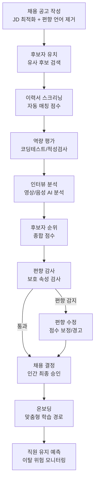
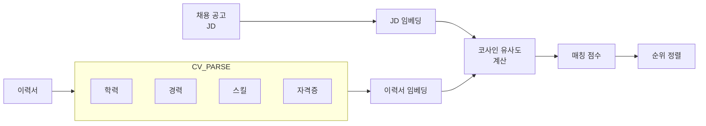
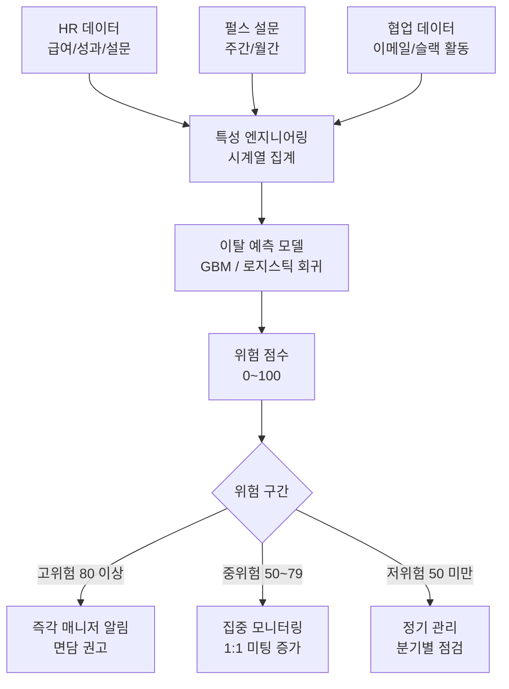

# AI HR/채용 (AI HR & Recruitment)

## 개요

AI는 채용 공고 작성부터 온보딩까지 HR(Human Resources) 전 주기에 걸쳐 활용된다. 핵심 적용 영역은 네 가지다: (1) **이력서 매칭** - 수천 건의 지원서에서 직무 적합 후보를 자동 스크리닝한다, (2) **인터뷰 분석** - 영상 면접에서 언어·비언어 신호를 분석한다, (3) **편향 감사** - 채용 과정의 보호 속성 기반 차별을 탐지한다, (4) **직원 유지 예측** - 이탈 가능성이 높은 직원을 사전에 식별한다.

AI 채용 도구는 효율성 향상과 동시에 차별 위험이라는 첨예한 윤리 문제를 동반한다. Amazon이 2018년 여성 지원자를 불리하게 평가하는 AI 채용 도구를 폐기한 사례는 편향의 현실적 위험을 보여준다. EU AI Act는 채용 AI를 "고위험(high-risk)" 시스템으로 분류하여 엄격한 투명성과 인간 감독을 요구한다.

## 채용 AI 파이프라인



## 주요 컴포넌트

### 1. 이력서 매칭 (Resume Matching)

이력서 매칭은 JD(Job Description)와 이력서의 의미론적 유사성을 계산하는 문제다. 단순 키워드 매칭을 넘어 역량의 의미적 유사성을 파악하는 임베딩 기반 접근이 표준이 됐다.



임베딩 기반 매칭 구현:
```python
from sentence_transformers import SentenceTransformer
import numpy as np
from dataclasses import dataclass

@dataclass
class MatchResult:
    candidate_id: str
    similarity_score: float
    matched_skills: list[str]
    missing_skills: list[str]

def match_resume_to_jd(
    jd_text: str,
    resume_text: str,
    model_name: str = "sentence-transformers/all-MiniLM-L6-v2"
) -> float:
    """JD와 이력서 간 의미론적 유사도 계산"""
    model = SentenceTransformer(model_name)
    jd_embedding = model.encode(jd_text, convert_to_numpy=True)
    resume_embedding = model.encode(resume_text, convert_to_numpy=True)

    # 코사인 유사도
    similarity = np.dot(jd_embedding, resume_embedding) / (
        np.linalg.norm(jd_embedding) * np.linalg.norm(resume_embedding)
    )
    return float(similarity)
```

스킬 갭 분석:
- JD에서 필수/우대 스킬 추출 (NER)
- 이력서에서 보유 스킬 추출
- 집합 비교로 누락 스킬 목록 생성

### 2. 인터뷰 분석 (Interview Analysis)

AI 기반 인터뷰 분석은 영상·음성 데이터에서 다양한 신호를 추출한다.

| 분석 차원 | 데이터 | 추출 특성 |
|---------|------|---------|
| 언어 | 음성 전사 텍스트 | 구조적 답변 완성도, 키워드 관련성 |
| 운율 | 음성 파형 | 말 속도, 멈춤 빈도, 억양 변화 |
| 표정 | 영상 프레임 | 감정 상태, 자신감 지표 |
| 시선 | 아이 트래킹 | 집중도, 불안 지표 |

**주의**: 표정·시선 분석은 과학적 타당성이 논쟁 중이며, EU AI Act에서 감정 추론 AI(emotion recognition AI)의 채용 사용을 규제한다. 언어 기반 분석이 가장 방어 가능하다.

AI STAR 방법론 채점:
```
면접 질문: "갈등 상황을 해결한 경험을 말해주세요"

S (Situation): 갈등 상황 구체성 점수
T (Task): 본인의 역할/책임 명확성 점수
A (Action): 취한 행동의 구체성/논리성 점수
R (Result): 결과의 정량화/학습 포인트 점수
```

### 3. 편향 감사 (Bias Audit)

채용 AI의 편향은 법적 위험(차별 소송, 규제 위반)과 비즈니스 위험(다양성 파괴, 우수 인재 이탈) 모두를 초래한다.

**편향 유형**:
- **역사적 편향**: 과거 고성과자 데이터를 학습하면, 과거에 채용 기회가 적었던 집단을 체계적으로 낮게 평가
- **대리 변수 편향(Proxy Bias)**: 우편번호, 대학명이 인종·소득 수준의 대리 변수로 작동
- **측정 편향**: 성별에 따라 인터뷰 채점 기준이 다르게 적용되는 역사적 데이터 오염

**공정성 지표 (채용 맥락)**:

| 지표 | 정의 | 기준 |
|------|------|------|
| 4/5 규칙 (EEOC Guideline) | 보호 집단의 합격률이 다수 집단의 80% 이상 | 미국 EEOC 법적 기준 |
| 통계적 동등 (Demographic Parity) | 집단별 합격률 동일 | 더 엄격한 요구 |
| 기회 균등 (Equal Opportunity) | 집단별 TPR 동일 | 자격자에게 공정한 기회 |

```python
def audit_selection_bias(
    candidates: list[dict],
    selected_ids: set[str],
    protected_attr: str
) -> dict:
    """선발 과정의 집단 간 공정성 분석"""
    groups = {}
    for candidate in candidates:
        group = candidate[protected_attr]
        if group not in groups:
            groups[group] = {"total": 0, "selected": 0}
        groups[group]["total"] += 1
        if candidate["id"] in selected_ids:
            groups[group]["selected"] += 1

    selection_rates = {
        g: d["selected"] / d["total"]
        for g, d in groups.items()
        if d["total"] > 0
    }
    max_rate = max(selection_rates.values())
    # 4/5 규칙 위반 여부 확인
    violations = {
        g: rate
        for g, rate in selection_rates.items()
        if rate < max_rate * 0.8
    }
    return {
        "selection_rates": selection_rates,
        "four_fifths_violations": violations,
        "is_compliant": len(violations) == 0
    }
```

### 4. 직원 유지 예측 (Employee Retention Prediction)

이탈 가능성이 높은 직원을 사전에 식별하고 선제적 조치를 취한다.

예측 특성(feature):
- 직속 관리자 변경 빈도
- 최근 급여 인상률 vs. 시장 평균
- 직무 만족도 설문 점수 추이
- 프로젝트 참여 빈도 및 역할
- 내부 지원 이력 (다른 부서/역할 지원)
- 동료 네트워크 활동 감소 패턴



**주의**: 직원 협업 데이터(이메일, 슬랙) 분석은 개인정보·감시 우려가 크다. 집계 수준(팀 단위) 분석과 직원 동의, 데이터 최소 수집 원칙이 필수다.

## 채용 AI의 규제 환경

| 규제/가이드라인 | 지역 | 핵심 요건 |
|--------------|------|---------|
| EU AI Act (고위험 AI) | EU | 채용 AI는 고위험 분류 - 투명성, 인간 감독, 편향 평가 의무 |
| NYC Local Law 144 (2023) | 뉴욕시 | 자동화 채용 도구 편향 감사 의무, 결과 공개 |
| Illinois AI Video Interview Act | 일리노이 | 영상 면접 AI 사용 전 지원자 고지 및 동의 |
| EEOC AI 가이드라인 | 미국 | 고용 차별법 적용 - AI 도구도 동등하게 적용 |
| GDPR / 개인정보보호법 | EU / 한국 | 자동화 의사결정 이의 제기권, 정보 주체 권리 |

뉴욕시 Local Law 144는 세계 최초로 채용 AI의 편향 감사(bias audit)를 법적 의무화한 사례다. 2023년 7월부터 자동화 채용 도구를 사용하는 고용주는 독립적인 제3자 감사 결과를 공개해야 한다.

## 실제 사례

### HireVue
영상 면접 AI 분석 플랫폼이다. 언어 내용, 발화 패턴을 분석하여 역량 점수를 산출한다. 2021년 표정 분석 기능을 일부 폐지했으며, 이후 언어 분석 중심으로 재편했다.

### Pymetrics
게임 기반 인지 능력 평가를 AI로 분석하는 플랫폼이다. 게임 수행 데이터에서 인지 특성을 추출하고, 직무별 성공 프로파일과 매칭한다. 공정성 알고리즘을 별도로 내장했다.

### LinkedIn Talent Insights
채용 시장 데이터 분석 플랫폼이다. 경쟁 기업 인력 구조, 특정 스킬 보유 인재 풀, 급여 벤치마크를 AI 분석으로 제공한다.

### 국내 사례
카카오, 삼성, LG 등 대기업들이 AI 기반 인적성 검사와 이력서 스크리닝을 도입했다. 금융결제원이 2023년 발표한 채용 AI 가이드라인이 국내 기준점 역할을 한다.

## 한계 및 윤리적 고려사항

### 역량 대용물의 한계
AI가 측정하는 것은 실제 역량이 아니라 역량의 대용물(proxy)이다. 문자 구사력, 면접 자신감이 높다고 직무 성과가 높다는 보장이 없다.

### 문화적 편향
특정 언어·문화권의 표현 방식을 "자신감 없음"으로 잘못 분류하는 문화적 편향이 내재할 수 있다. 인터뷰 분석 모델은 훈련 데이터의 문화적 다양성을 반드시 검토해야 한다.

### 스크리닝 자체가 만드는 병목
AI 스크리닝이 특정 학교·기업 출신을 과도하게 선호하면 채용 다양성이 오히려 줄어드는 역설적 결과가 발생한다.

### 자기실현 예측
이탈 예측 모델이 이탈 가능성이 높다고 분류한 직원에게 관리자가 거리를 두면, 그 직원이 실제로 이탈하는 악순환이 생긴다. 예측 결과 활용 방식에 대한 윤리 가이드라인이 필요하다.

## 관련 문서

- [[fairness-ml]] - 머신러닝 공정성 지표 및 편향 완화 기법
- [[bias-detection]] - AI 시스템의 편향 탐지 방법론
- [[document-classification]] - 이력서 분류에 적용되는 문서 분류 기법
- [[explainable-ai]] - 채용 결정의 설명 가능성 요구사항
- [[ai-anomaly-detection]] - 직원 행동 이상 탐지 연계
