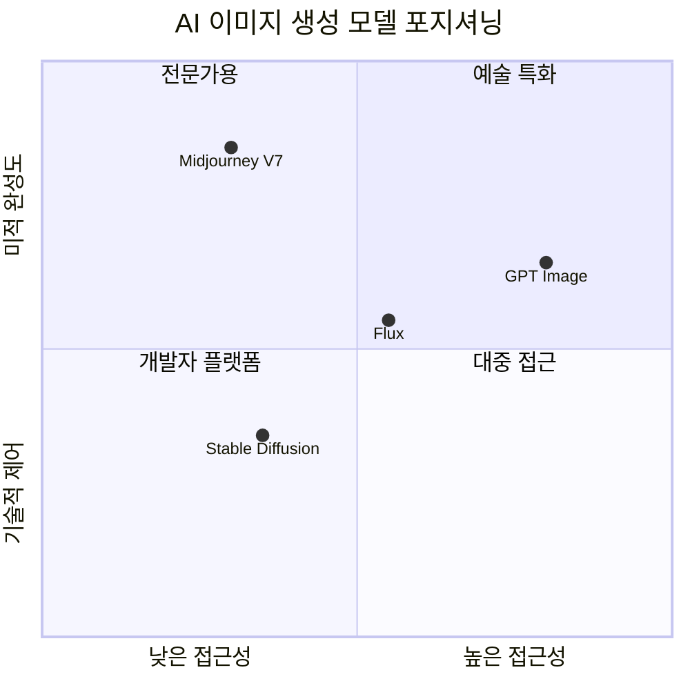

## 개요

2026년 AI 이미지 생성은 GPT Image 1.5, Midjourney V7, Stable Diffusion 3.5, Flux로 4강 구도가 형성되었다. [[ai-video-generation|AI 비디오 생성]]과 함께 멀티미디어 AI 콘텐츠 생성의 양대 축이다. 각 모델은 예술성(Midjourney), 접근성(GPT Image/DALL-E), 커스터마이징(Stable Diffusion), 사실성(Flux)으로 특화 영역을 확보하며 차별화 경쟁을 펼치고 있다. 텍스트 렌더링 정확도, 프롬프트 충실도, 상업적 라이선스 유연성이 핵심 경쟁 요소로 부상했다. [[ai-design-tools|AI 디자인 도구]]와의 통합으로 완성도 높은 UI/UX 워크플로우가 가능해진다.

## 핵심 개념

**디퓨전 모델(Diffusion Model)**: 노이즈를 점진적으로 제거하여 이미지를 생성하는 아키텍처. SD 3.5, Flux 등 대부분의 최신 모델이 이 방식을 기반으로 한다.

**LoRA/ControlNet 커스터마이징**: Stable Diffusion 생태계에서 소량의 데이터로 특정 스타일이나 캐릭터를 학습시키는 경량 미세조정 기법. 오픈소스 모델의 핵심 장점이다.

**프롬프트 충실도(Prompt Adherence)**: 사용자가 입력한 텍스트 프롬프트를 얼마나 정확하게 이미지에 반영하는지를 나타내는 지표. 복잡한 다중 요소 묘사, 공간 관계, 정확한 수량 등에서 Flux가 선도적이다.

## 현황 (2026)

### 모델별 비교

| 모델 | 특화 영역 | 가격 | 라이선스 | 텍스트 렌더링 |
|------|----------|------|---------|-------------|
| Midjourney V7 | 미적 완성도 | $10-$120/월 | 유료 구독 필수 | 약함 |
| GPT Image / DALL-E 3 | 접근성, 대화형 | 무료 티어 / $20/월 | ChatGPT 통합 | 우수 |
| Stable Diffusion 3.5 | 무제한 커스터마이징 | 무료 (오픈소스) | 커뮤니티 라이선스 | 약함 |
| Flux | 사실성, 프롬프트 충실도 | 무료~$0.06/장 | Apache 2.0 (Schnell) | 우수 |

### API 가격 비교

| 플랫폼 | 가격/이미지 | API 제공 |
|--------|-----------|---------|
| DALL-E 3 API | $0.04-$0.08 | OpenAI API |
| Flux Pro API | $0.04-$0.06 | Replicate, fal.ai 등 |
| Stability AI API | 크레딧 기반 | Stability API |
| Midjourney | 구독 기반 (API 제한적) | 공식 API 미공개 |

### 품질 영역별 평가

| 품질 기준 | 1위 | 설명 |
|----------|-----|------|
| 미적 완성도 | Midjourney V7 | 최소 프롬프트로 가장 세련된 결과물, 후처리 불필요 |
| 사실성 (포토리얼리즘) | Flux Pro | 자연스러운 조명, 피부 질감, 재질 표현 |
| 텍스트 렌더링 | DALL-E 3 / Flux | 이미지 내 텍스트를 정확하게 렌더링 |
| 프롬프트 충실도 | Flux | 복잡한 공간 관계와 정확한 수량 반영 |
| 커스터마이징 | Stable Diffusion | LoRA, ControlNet으로 무한 커스터마이징 |
| 사용 편의성 | DALL-E 3 | 대화형 인터페이스로 자동 프롬프트 보정 |

### 하드웨어 요구사항 (로컬 실행)

| 수준 | GPU | VRAM |
|------|-----|------|
| 최소 | NVIDIA RTX 3060 | 12 GB |
| 권장 | RTX 4070+ 또는 Apple M2/M3 Max | 16 GB+ |
| 클라우드 대안 | GPU 렌탈 | ~$0.20/시간 |

### 생성 속도

- **Flux Schnell**: 1-4 스텝으로 이미지 생성 (가장 빠름)
- **Stable Diffusion 3.5**: 1024x1024 기준 약 8-15초
- **Midjourney**: 큐 기반 (로컬 제어 불가)
- **DALL-E 3**: 클라우드 처리 (수 초)

## 전망/과제

**저작권 분쟁**: 학습 데이터의 저작권 문제는 여전히 미해결 상태이며, Midjourney, Stability AI 등이 관련 소송에 직면해 있다. 자발적 라이선싱 메커니즘에 대한 논의가 진행 중이다.

**상업적 활용**: 광고, 제품 디자인, 출판 등 상업 영역에서의 AI 이미지 활용이 증가하면서 [[deepfake-detection-c2pa]] 기반 출처 표시 요구가 강화되고 있다.

**오픈소스 vs. 폐쇄형**: Flux의 Apache 2.0 라이선스와 SD의 오픈소스 생태계가 상업적 대안을 제공하면서, 오픈소스 모델의 품질이 폐쇄형 모델에 근접하고 있다.

**용도별 최적 선택**:
- **마케팅/광고**: Midjourney (미적 완성도) + DALL-E 3 (텍스트 오버레이)
- **이커머스**: Stable Diffusion + LoRA (브랜드 일관성)
- **개발/프로토타이핑**: Flux 오픈 웨이트 (실시간 애플리케이션)
- **프라이버시 중요 환경**: 로컬 SD 또는 Flux 배포

## 관련 문서

- [[ai-video-generation]] - AI 비디오 생성 기술
- [[ai-audio-voice-cloning]] - AI 오디오 생성
- [[deepfake-detection-c2pa]] - 콘텐츠 인증과 출처 추적
