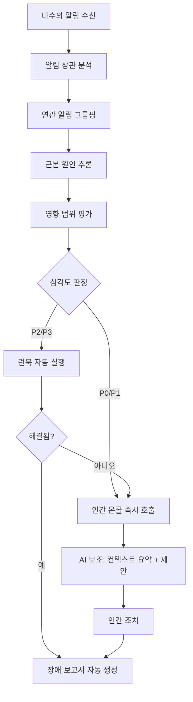
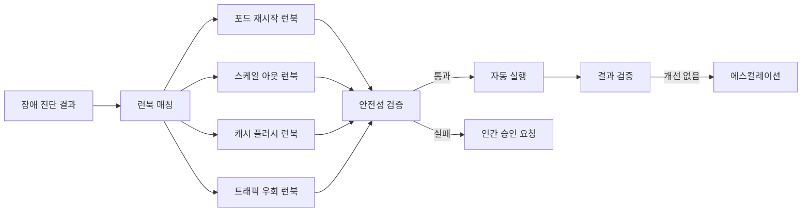

# AI 기반 장애 대응 (AI-Driven Incident Response)

## 개요

AI 기반 장애 대응은 서비스 장애 발생 시 알림 상관 분석(alert correlation), 근본 원인 추론(root cause analysis), 런북(runbook) 자동 실행을 AI가 보조하거나 직접 수행하는 패턴이다. 전통적인 온콜(on-call) 체계에서는 엔지니어가 새벽에 깨어나 수십 개의 알림을 직접 분류하고 대응해야 했지만, AI를 통해 초기 분류와 일부 자동 복구를 처리하는 방향으로 빠르게 전환되고 있다.

[[agent-workflow-patterns]]에서 다루는 오케스트레이터-워커 패턴이 장애 대응에 직접 적용되며, [[ai-devops-cicd]]의 빌드 자기 치유 개념이 런타임 장애 영역으로 확장된 형태로 볼 수 있다.

## 장애 대응 AI 파이프라인

## 알림 상관 분석 (Alert Correlation)

대규모 서비스에서는 단일 장애가 수십-수백 개의 알림을 동시에 발생시킨다. 예를 들어 데이터베이스 슬로우 쿼리 하나가 API 지연, 큐 적체, 캐시 실패, 헬스체크 실패 알림을 연쇄적으로 트리거한다.

**전통 방식의 문제:**
- 알림마다 개별 대응 시도 - 원인이 아닌 증상 치료
- 중복 조사로 MTTR(평균 복구 시간) 증가
- 야간 온콜 피로 누적

**AI 상관 분석 접근:**
- 시간적 근접성, 서비스 의존 그래프, 알림 내용 유사성을 함께 분석
- 연관된 알림을 하나의 인시던트로 묶고 최상위 원인 후보를 3-5개 제시
- 과거 유사 인시던트 이력과 매칭하여 해결책 우선순위 제안

## 자동 런북 실행

런북(runbook)은 특정 장애 유형에 대한 표준 대응 절차를 문서화한 것이다. AI는 이 런북을 코드화하고 컨텍스트에 맞게 선택적으로 실행한다.

**자동화 가능한 런북 예시:**

| 장애 유형 | 자동 액션 |
|-----------|-----------|
| 메모리 부족 | 불필요한 프로세스 종료 후 GC 강제 실행 |
| 디스크 풀 | 로그 로테이션 및 임시 파일 정리 |
| 특정 포드 장애 | 포드 재시작 (Kubernetes rollout restart) |
| 트래픽 스파이크 | HPA 최솟값 임시 상향 |
| DB 커넥션 풀 고갈 | 연결 수 임시 상향 및 장수 커넥션 종료 |

## 인간-AI 협업 모델

완전 자동화는 리스크가 따른다. 2026년 기준 성숙한 팀들은 다음 구분을 따른다.

**AI 단독 처리 적합 영역:**
- P3/P4 수준의 낮은 영향도 장애
- 패턴이 명확한 반복 장애
- 비프로덕션 환경 장애

**AI 보조 + 인간 결정 영역:**
- P1/P2 프로덕션 장애
- 처음 보는 오류 패턴
- 금융/의료 등 규제 대상 서비스

**인간 전담 영역:**
- P0 전사 서비스 중단
- 보안 침해 사고
- 데이터 손실 위험이 있는 복구 작업

## 장애 후 자동 보고서

AI는 장애 해결 후 다음 내용을 자동 생성한다:

- 타임라인: 알림 발생 시각, 감지, 조치, 복구 시각
- 영향 범위: 영향받은 사용자 수, 서비스, 지역
- 근본 원인 요약
- 취해진 조치와 결과
- 재발 방지 제안 항목 (TODO 형태)

장애 보고서를 Slack, Jira, Confluence 등에 자동 발행하는 통합이 2026년 현재 표준 패턴이 되고 있다.

## 관련 문서

- [[agent-workflow-patterns]] - 오케스트레이터-워커 패턴 기반 대응 설계
- [[ai-devops-cicd]] - CI-CD 파이프라인의 자기 치유와 연계
- [[agentic-engineering]] - 에이전트 기반 자동화의 일반 원칙
