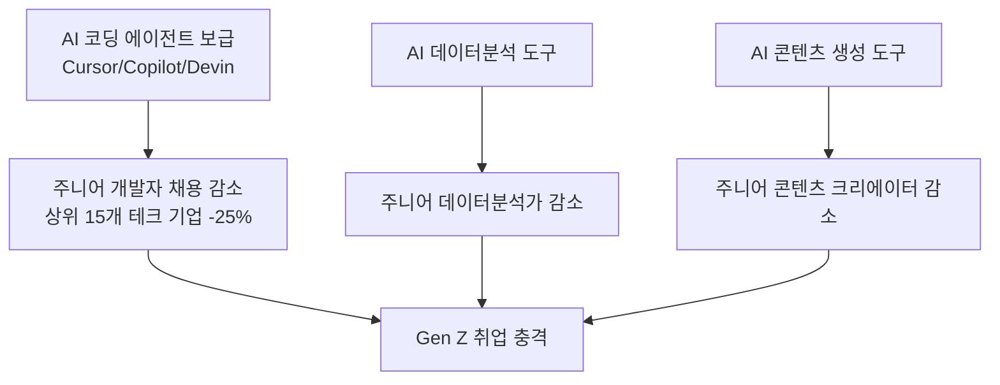
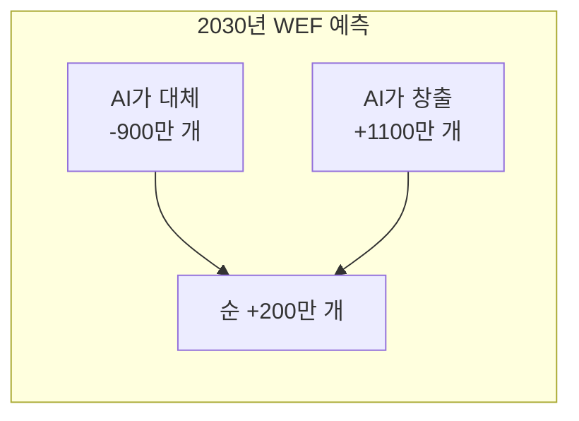
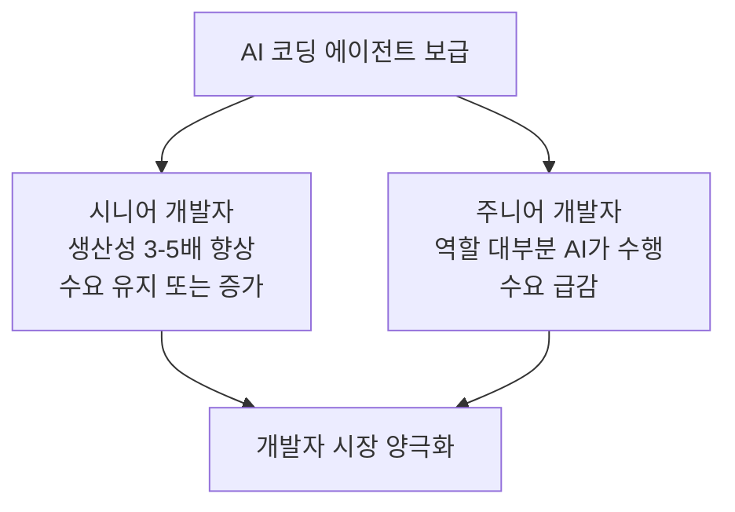
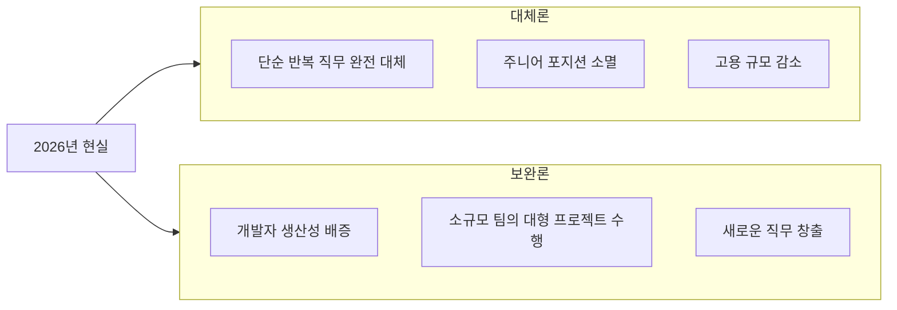

# AI 노동시장 영향 2026-04 - 순 일자리 감소와 구조 전환

## 개요

2026년 4월 골드만삭스·Axios 분석과 WEF(세계경제포럼) Future of Jobs 보고서를 종합하면, AI로 인한 노동시장 영향은 **단기(2026년 현재)와 장기(2030년)의 전망이 극명하게 엇갈린다**. 단기적으로는 미국에서 월 1.6만 개의 순 일자리 소멸이 관측되는 반면, WEF는 2030년까지 글로벌 순 200만 개 창출을 예측한다.

[[economic-displacement-ai]]와 [[ai-workforce-impact]] 개념 문서에서 AI 노동 대체 이론적 프레임워크를 참조하라.

## 2026년 4월 현황: 단기 지표

### 골드만삭스 미국 고용 분석

2026년 4월 골드만삭스 보고서의 핵심 수치:

| 지표 | 수치 |
|------|------|
| AI로 인한 월 일자리 대체 수 | 2.5만 개 |
| AI로 인한 월 일자리 창출 수 | 0.9만 개 |
| 월 순 일자리 변화 | **-1.6만 개** |
| 테크 기업 신규 입문자 채용 감소 (2023년 대비) | -25% |

미국 월 고용 변화 전체 규모(수백만 개 단위)에 비하면 작은 숫자이지만, 특정 직군에 집중되는 방식이 문제다.

### Gen Z 직격탄

Gen Z(1997-2012년생)가 집중적으로 타격받는 이유:

1. **진입 장벽 직종 집중**: AI가 가장 먼저 자동화하는 직무(주니어 코더, 주니어 분석가, 콘텐츠 제작)는 신입이 맡던 업무
2. **경험 획득 기회 감소**: 주니어로 경력을 쌓을 포지션 자체가 사라지면서 중급 개발자로 성장하는 경로가 단절
3. **학습 기간 불일치**: AI 도구가 이미 익숙한 밀레니얼 시니어 대비 Gen Z는 AI 활용 능력을 학교에서 충분히 학습하지 못함

상위 15개 테크 기업(Google, Meta, Amazon, Microsoft 등)의 신규 입문자 채용이 2023년 대비 25% 감소했다는 수치는 AI 코딩 도구([[cursor-3-2-release]], [[devin-2-0-release]] 등)의 보급이 가장 직접적 원인으로 분석된다.

## 장기 전망: WEF Future of Jobs 2030

WEF의 2026년 4월 발표 기준 2030년 예측:

**창출되는 직종 (WEF 예측):**
- AI 트레이너·프롬프트 엔지니어
- AI 시스템 감사자(auditor)
- AI 윤리 전문가
- 데이터 큐레이터
- 로봇 유지보수 기술자

**대체되는 직종 (WEF 예측):**
- 데이터 입력·처리 담당자
- 기초 회계·경리 직무
- 고객 서비스 상담원 (단순 문의)
- 기초 코딩·테스트 직무

### 단기 vs 장기 전망의 괴리

WEF의 장기 낙관 전망과 골드만삭스의 단기 부정 지표가 공존하는 이유:

1. **구조 조정 과도기**: 파괴되는 직종이 먼저 나타나고 새 직종은 늦게 형성됨
2. **지리적 불균형**: AI 창출 일자리는 기술 허브에 집중, 대체 일자리는 분산됨
3. **기술 습득 시간**: AI 도구를 효과적으로 활용하는 능력 형성에 수년 소요

## 개발자 시장 구체 분석

### 시니어 vs 주니어 양극화

**시니어 개발자 관점:**
- Cursor, Copilot, Devin 등을 활용해 1인이 3-5명 수준의 코드 생성 가능
- AI의 출력물을 검토·방향 제시·아키텍처 결정하는 역할이 오히려 강화
- 수요는 유지되되 더 높은 AI 활용 능력이 요구됨

**주니어 개발자 관점:**
- 단순 CRUD(Create, Read, Update, Delete) 구현, 버그 수정, 테스트 작성 등 AI가 충분히 수행
- 신규 채용 포지션이 줄어 "어떻게 시니어가 되는가"의 경로 자체가 불분명
- AI를 잘 활용하는 주니어 vs AI에 대체되는 주니어의 격차 확대

### AI 코딩 도구 기업의 역설

[[spacex-cursor-acquisition-option]]에서 다루는 Cursor 600억 달러 밸류에이션은 AI 코딩 도구 기업에게는 황금기다. 그러나 이들의 성장이 곧 개발자 일자리 감소를 가속화하는 역설적 구조가 형성되고 있다.

- AI 코딩 도구 기업의 투자 유치 = 도구 성능 향상
- 도구 성능 향상 = 주니어 개발자 대체 가속화
- 주니어 개발자 감소 = 시니어 개발자 공급 감소 (5-10년 후)

## 한국 시장 특수성

[[korea-ai-basic-act-2026]]에서 다루듯, 한국은 AI 기본법 시행과 함께 AI 산업을 육성하면서도 노동시장 충격에 대한 사회적 논의가 제한적이다.

한국 개발자 시장 현황:
- 카카오, 네이버 등 국내 대형 IT 기업의 AI 채용은 증가하지만 전통적 개발 직무 채용은 감소
- 스타트업 씬에서 AI 활용 1인 스타트업(AI-native startup) 증가
- 교육 기관의 AI 도구 활용 커리큘럼 전환이 미흡한 상황

## 보완 vs 대체: 진화하는 논쟁

경제학계의 핵심 논쟁: AI는 개발자를 **대체(substitution)**하는가, 아니면 **보완(augmentation)**하는가?

2026년 4월 현재 증거는 **단기 대체, 장기 보완**의 혼합 양상을 가리킨다. 직무 수준에서는 특정 주니어 직무가 대체되고 있지만, 산업 수준에서는 AI로 가능해진 새로운 소프트웨어 애플리케이션이 전체 소프트웨어 수요를 키우고 있다.

## 정책적 시사점

이 상황에 대응하는 주요 정책 방향:

1. **재교육(Reskilling) 프로그램**: AI 활용 능력을 기존 개발자와 취준생에게 제공
2. **소득 안전망 강화**: AI 전환 과도기 실업급여·재훈련 지원 확대
3. **교육 커리큘럼 개편**: 코딩 교육에서 AI 협업 코딩 교육으로 전환
4. **AI 도구 조세 논의**: AI 도구로 대체된 인건비에 준하는 세금 부과 (아직 실험적 단계)

## 왜 중요한가

2026년 4월의 노동시장 지표는 AI가 단순한 생산성 도구를 넘어 **고용 구조 자체를 재편**하고 있음을 보여준다. 월 1.6만 개의 미국 순 일자리 감소는 수치 자체보다 이것이 특정 연령·직무·기술 수준에 집중된다는 점이 더 중요하다. AI 코딩 에이전트 도구들([[cursor-3-2-release]], [[devin-2-0-release]], [[windsurf-2-0-release]])의 빠른 성능 향상은 이 트렌드를 더욱 가속화할 것으로 예상된다.

## 관련 문서

- [[economic-displacement-ai]] - AI 경제 대체 이론 프레임워크
- [[ai-workforce-impact]] - AI가 인력 구조에 미치는 영향 개론
- [[cursor-3-2-release]] - AI 코딩 도구 현황
- [[devin-2-0-release]] - 자율 소프트웨어 엔지니어 에이전트
- [[spacex-cursor-acquisition-option]] - AI 코딩 도구 투자 붐
- [[korea-ai-basic-act-2026]] - 한국의 AI 규제와 노동시장
