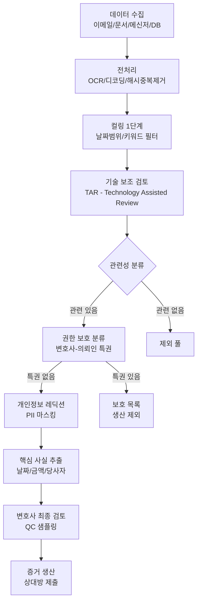
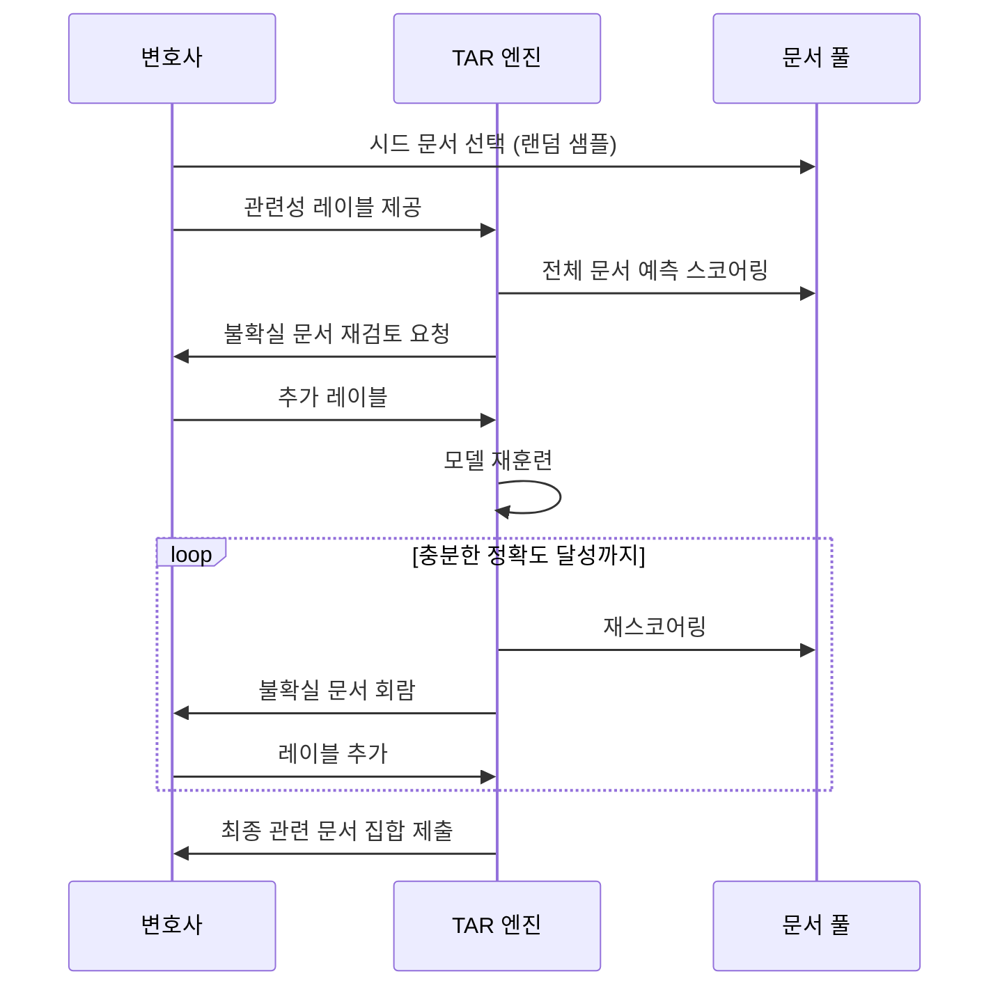
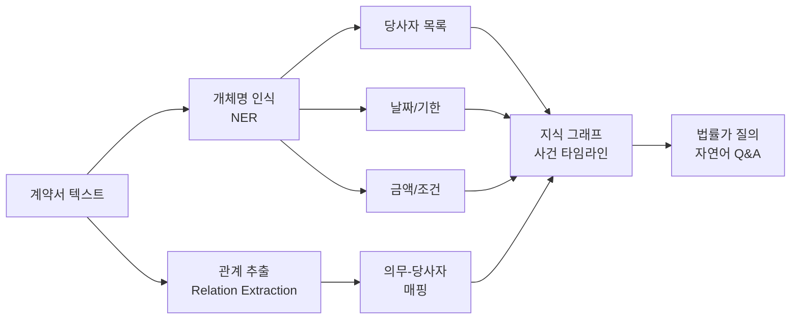

# AI 법률 디스커버리 (AI Legal Discovery)

## 개요

법률 디스커버리(discovery)는 소송에서 양측이 재판 전 상대방의 증거 자료를 열람·교환하는 절차다. 디지털화 이후 전자 디스커버리(eDiscovery, Electronic Discovery)가 핵심 과제로 부상했는데, 단일 소송에서 수백만 건의 이메일·문서·슬랙 메시지를 수작업으로 검토하는 것은 비용과 시간 측면에서 불가능에 가깝다.

AI는 이 문제를 세 가지 방향으로 해결한다: (1) 관련성 있는 문서를 자동으로 분류해 검토 대상을 줄이는 **관련성 판단**, (2) 계약·이메일에서 핵심 사실과 날짜를 추출하는 **정보 추출**, (3) 변호사-의뢰인 특권(attorney-client privilege) 문서를 식별해 공개에서 제외하는 **권한 보호**다.

## 전자 디스커버리 파이프라인



각 단계에서 AI가 담당하는 부분을 강조하면: TAR(기술 보조 검토)이 핵심 AI 구간이며, 이후 권한 보호 분류, PII 레딕션, 핵심 사실 추출까지 연쇄적으로 적용된다.

## 주요 컴포넌트

### 1. 기술 보조 검토 (TAR - Technology Assisted Review)

TAR는 능동 학습(active learning) 기반의 반복적 문서 분류 방법이다. 변호사가 소수의 문서에 관련성 레이블을 부여하면, 모델이 나머지 문서를 예측하고, 불확실한 문서를 다시 변호사에게 회람하는 루프를 반복한다.



**TAR 1.0 (시드 기반)**: 변호사가 제공한 시드로 초기 모델 훈련 후 전체 적용.
**TAR 2.0 (지속 능동 학습)**: 지속적으로 불확실한 문서를 보완하며 루프 반복.

미국 법원(예: Moore v. Publicis Groupe, 2012)은 TAR이 랜덤 샘플링에 비해 비용 효율적이고 정확하다고 인정했다.

### 2. 문서 분류 (Document Classification)

현대 eDiscovery는 단순 관련성/비관련성 이분법을 넘어 다양한 레이블을 동시에 예측하는 멀티레이블 분류가 필요하다.

| 분류 차원 | 레이블 예시 |
|---------|-----------|
| 관련성 | 관련/비관련/잠재적 관련 |
| 권한 보호 | 변호사-의뢰인 특권/업무성과물(Work Product)/공개 가능 |
| 문서 유형 | 이메일/계약서/메모/재무보고서/채팅 |
| 중요도 | 핵심 문서/참고 문서/배경 문서 |
| 주제 클러스터 | 특허 침해/합병 승인/환경 규제 |

BERT (Bidirectional Encoder Representations from Transformers) 계열 모델이 법률 도메인에서 우수한 성능을 보인다. Legal-BERT (Chalkidis et al., 2020)는 법률 텍스트로 파인튜닝한 특화 모델이다.

```python
from transformers import AutoTokenizer, AutoModelForSequenceClassification
import torch

def classify_privilege(document_text: str) -> dict:
    """변호사-의뢰인 특권 분류"""
    tokenizer = AutoTokenizer.from_pretrained("nlpaueb/legal-bert-base-uncased")
    model = AutoModelForSequenceClassification.from_pretrained(
        "nlpaueb/legal-bert-base-uncased",
        num_labels=3  # 공개 가능 / 특권 / 업무성과물
    )
    inputs = tokenizer(
        document_text,
        return_tensors="pt",
        truncation=True,
        max_length=512
    )
    with torch.no_grad():
        logits = model(**inputs).logits
    probs = torch.softmax(logits, dim=-1)
    labels = ["공개 가능", "변호사-의뢰인 특권", "업무성과물"]
    return {label: float(prob) for label, prob in zip(labels, probs[0])}
```

### 3. 핵심 사실 추출 (Key Fact Extraction)

계약서·이메일에서 소송에 중요한 정보를 자동으로 추출한다. Named Entity Recognition (NER)과 관계 추출(Relation Extraction)을 결합한다.

추출 대상 엔티티:
- **당사자**: 기업명, 개인명, 역할
- **날짜/기한**: 계약 체결일, 이행 기한, 통보 기간
- **금액/조건**: 계약 금액, 위약금, 조건부 조항
- **의무/권리**: 당사자별 의무 조항, 면책 조건



LLM 기반 정보 추출 예시:

```python
import anthropic

client = anthropic.Anthropic()

def extract_contract_facts(contract_text: str) -> dict:
    """계약서에서 핵심 사실 추출"""
    response = client.messages.create(
        model="claude-opus-4-5",
        max_tokens=2000,
        messages=[{
            "role": "user",
            "content": f"""다음 계약서에서 핵심 사실을 JSON 형식으로 추출하라.

추출 항목: parties(당사자), effective_date(효력 발생일),
termination_clauses(해지 조건), payment_terms(지급 조건),
governing_law(준거법), dispute_resolution(분쟁 해결)

계약서:
{contract_text}

JSON으로만 응답하라."""
        }]
    )
    import json
    return json.loads(response.content[0].text)
```

### 4. 권한 보호 (Privilege Protection)

변호사-의뢰인 특권(attorney-client privilege)이 있는 문서를 상대방에게 공개하면 특권이 소멸(waiver)될 수 있다. AI를 이용한 클로로백(claw-back) 예방이 중요하다.

특권 문서 식별 규칙:
- **변호사가 발신/수신자에 포함** + **법적 조언 관련 내용**
- 변호사 이메일 도메인 목록 자동 감지
- "privileged and confidential", "attorney-client" 키워드 패턴

단, AI 분류에만 의존하면 새로운 특권 소멸 위험이 생긴다. 고신뢰도 예측 문서도 변호사 샘플 검토를 반드시 거쳐야 한다.

### 5. PII 레딕션 (PII Redaction)

증거 제출 전 사회보장번호, 금융 계좌 번호, 개인 건강 정보(PHI) 등 개인식별정보를 마스킹한다.

| PII 유형 | 패턴 예시 | 처리 방법 |
|---------|---------|---------|
| 사회보장번호 (SSN) | `XXX-XX-XXXX` | 정규식 + NER |
| 신용카드 번호 | 16자리 숫자 패턴 | Luhn 검증 + 마스킹 |
| 의료 기록 번호 | 병원별 패턴 | NER + 규칙 |
| 개인 이름 | 문서 맥락 의존 | NER (맥락 고려) |
| 이메일 주소 | RFC 5322 패턴 | 정규식 |

## 주요 규제 및 법적 프레임워크

- **FRCP Rule 26(b)(2)(B)**: 미국 연방민사소송규칙 - 접근 불능 데이터 소스의 비용 분담
- **Sedona Principles**: eDiscovery 모범 관행 가이드라인 (법적 구속력 없음)
- **GDPR**: EU 소송에서 개인정보 처리 제한
- **FRE Rule 502**: 미국 - 실수로 인한 특권 소멸 규정 (클로로백 조항)

## 실제 사례

### Relativity (구 kCura)
전 세계 대형 로펌과 기업 법무팀이 가장 널리 사용하는 eDiscovery 플랫폼이다. AI 기반 TAR, 이메일 스레드 시각화, 멀티레이블 분류를 통합 제공한다.

### Reveal-Brainspace
딥러닝 기반 문서 클러스터링과 주제 모델링으로 "이야기(narrative)" 구조를 자동 파악한다. 수백만 건 문서에서 사건의 핵심 스토리라인을 도출하는 데 활용된다.

### Harvey AI
OpenAI 기술을 기반으로 구축된 법률 AI 플랫폼이다. 계약서 검토, eDiscovery, 메모 작성 등에 LLM을 통합했으며 대형 로펌들이 파일럿 도입 중이다.

## 한계 및 고려사항

### 샘플링 오류와 리콜 위험
TAR이 관련 문서를 놓치는 경우(낮은 재현율, low recall) 소송에서 치명적 결과를 낳을 수 있다. 통계적으로 유의미한 샘플 검토를 통해 모집단 리콜을 추정해야 한다.

### 다국어/비표준 형식
내부 속어, 두문자어, 다국어 이메일은 표준 NLP 모델의 성능이 저하된다. 특히 M&A 딜에서는 다국어 문서가 혼재한다.

### 모델 투명성과 법원 승인
일부 법관은 AI 기반 분류 방법의 신뢰성 입증을 요구한다. 모델의 정밀도(precision)와 재현율(recall)을 문서화한 검증 보고서가 필요하다.

## 관련 문서

- [[document-qa-agent]] - LLM 기반 문서 질의응답 에이전트
- [[information-extraction]] - NER과 관계 추출 기법
- [[ai-tax-compliance]] - 법률 AI와 연계되는 세무 준수 자동화
- [[ai-legal]] - AI 법률 응용 전반 개요
- [[ai-contract-analysis]] - 계약서 분석 특화 시스템
