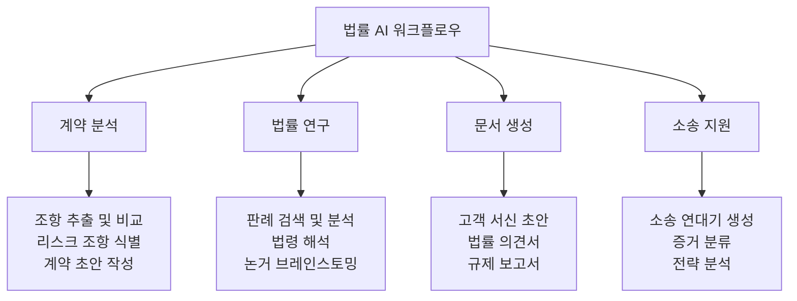
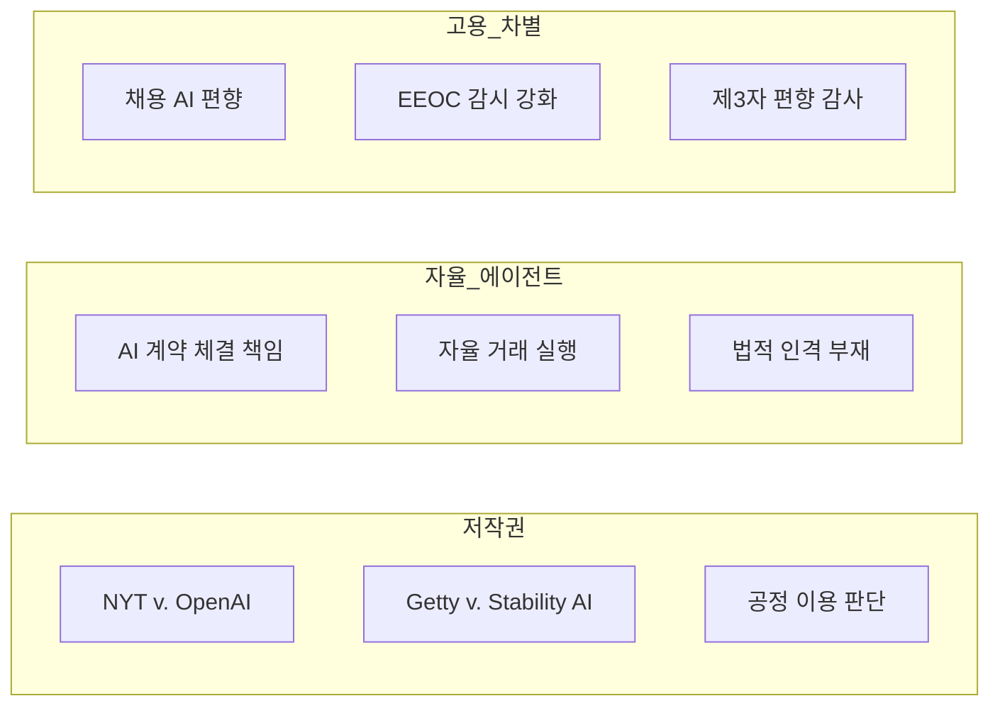

# AI in Legal Industry

법률 전문가의 69%가 GenAI를 정기적으로 사용하며 전년 대비 2배 증가했다. 계약 초안 작성, 법률 연구, 소송 연대기 생성 등 실무 전반에 AI가 침투하는 한편, 할루시네이션 인용 729건 이상이 보고되며 "인간 검증 하 워크플로우"의 중요성이 부각되고 있다.

## 개요

2026년 법률 AI는 실험 단계를 지나 **일상 실무 도구**로 자리잡았다. 법률 전문가의 28%가 매일, 31%가 주 여러 번 AI를 사용하고 있으며, 61%가 주당 1-5시간, 14%가 6-10시간을 절감하고 있다. 그러나 AI 도구의 정확성 한계, 규제 프래그멘테이션, 윤리적 쟁점이 동시에 부각되는 양면적 국면이다.

## 핵심 활용 영역

### 법률 문서 작업

| 활용 영역 | 설명 |
|-----------|------|
| 고객 서신 초안 | 가장 빈번한 활용 -- 초안 생성 후 변호사가 검토/수정 |
| 법률 조사 및 연구 | 판례 검색, 법령 해석, 관련 규정 크로스레퍼런스 |
| 문서 요약 | 대량 문서의 핵심 요점 추출 및 구조화 |
| 아이디어/논거 브레인스토밍 | 법적 논점 도출 및 반론 예상 |
| 텍스트 편집 및 개선 | 문체 통일, 명확성 향상, 오류 교정 |

### 계약 분석 및 관리

AI는 수천 페이지의 계약서에서 핵심 조항을 추출하고, 표준 조항과의 편차를 식별하며, 리스크 조항에 대한 자동 경고를 생성한다. 기존에 수일이 걸리던 계약 검토 작업이 수시간으로 단축되고 있다.

### 소송 지원

- 소송 연대기(litigation timeline) 자동 생성
- eDiscovery에서의 문서 분류 및 관련성 평가
- 과거 판결 패턴 분석을 통한 소송 결과 예측

## 효율성 개선 데이터

| 지표 | 수치 |
|------|------|
| AI 정기 사용 법률 전문가 | 69% (전년 2배) |
| 매일 사용 | 28% |
| 주 여러 번 사용 | 31% |
| 주당 1-5시간 절감 | 61% |
| 주당 6-10시간 절감 | 14% |
| 결과물 품질 향상 경험 | 33% |
| AI를 최고 ROI 기술로 선택 | 29% |
| 장기적 영향에 낙관적 | 54% |

## 규제 및 윤리 쟁점

### 할루시네이션 위기

729건 이상의 AI 할루시네이션(허위 판례 인용) 사건이 보고되었다. 이에 대응하여 법원이 모든 판례/법령 인용 시 공식 법률 데이터베이스(Westlaw, Lexis)로의 **하이퍼링크 의무화 규칙** 도입을 검토 중이다.

### AI 사용 징계

- 변호사 제명에 대해 48.1%가 반대, 19.5%만 찬성
- 금전 처벌이나 변호사협회 징계가 주된 대응 방식
- "공개 AI 도구를 인간 검증 없이 사용하는 것은 명확한 윤리 위반"으로 간주

### 주요 법적 쟁점

### 규제 프레임워크

**EU AI법**: 2025년 8월부터 범용 AI(GPAI) 의무사항 시행. 학습 데이터 공개 필수.

**미국 주 규제** (연방 통일 규제 부재):
- 콜로라도: 2026년 6월 시행 예정
- 텍사스 TRAIGA: 2026년 1월 1일 시행
- 유타: 생성 AI 상호작용 시 명확한 공개 의무

## 향후 전망

### 기술 발전

- AI 정확도 향상으로 할루시네이션 적발이 더 어려워져, "인간 감시 하 워크플로우"가 경쟁력 핵심으로 부상
- AI가 정의된 카테고리의 분쟁에서 최종 의사결정자로 선택받기 시작(AAA 회장 예측)
- CLE(계속법학교육)에서 AI 관련 교육이 필수 과정화 예상

### 훈련 및 거버넌스 격차

법률 전문가의 절반 이상이 소속 조직에서 AI 교육을 받지 못했으며, 법학교육에서도 84%가 학생들의 기술 교육에 "심각한 격차"가 있다고 지적했다. AGI에 대해서는 77.4%가 2026년 달성 불가능으로, 58.3%는 향후 5년 내 AI가 초급 변호사를 대체하지 않을 것으로 전망했다.

## 관련 페이지

- [[ai-regulation-us|AI 규제 (미국)]]
- [[eu-ai-act-enforcement|EU AI법 집행]]
- [[ai-finance|AI 금융]]
- [[enterprise-ai-adoption|엔터프라이즈 AI 도입]]
- [[llm-security-owasp|LLM 보안 OWASP]]

## 참고 자료

- [Baker Donelson: 2026 AI Legal Forecast](https://www.bakerdonelson.com/2026-ai-legal-forecast-from-innovation-to-compliance)
- [National Law Review: 85 Predictions for AI and Law 2026](https://natlawreview.com/article/85-predictions-ai-and-law-2026)
- [SourceForge: The State of Legal AI in 2026](https://sourceforge.net/articles/the-state-of-legal-ai-in-2026-what-the-data-reveals/)
