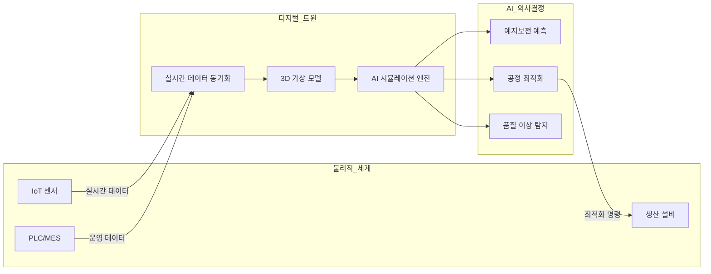
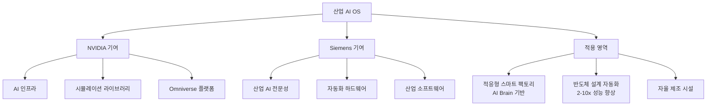

# AI in Manufacturing / Digital Twins

제조업의 에이전틱 AI 채택이 Deloitte 조사 기준 6%에서 24%로 4배 증가했다. Siemens-NVIDIA의 적응형 공장(Adaptive Factory), 산업 AI 운영 체제 구축, 디지털 트윈 기반의 사전 시뮬레이션이 제조 산업의 핵심 경쟁력으로 부상하고 있다.

## 개요

2026년 제조업 AI의 핵심 키워드는 **물리적 AI(Physical AI)**와 **디지털 트윈(Digital Twin)**이다. 물리적 세계를 가상으로 복제하여 실제 설계나 건설 전에 시뮬레이션하고, AI 에이전트가 자율적으로 공정을 최적화하는 패러다임이 산업 현장에 적용되기 시작했다. MIT Technology Review는 물리적 AI를 "제조업의 차세대 경쟁 우위"로 평가했다.

## 핵심 기술

### 디지털 트윈 (Digital Twin)

디지털 트윈은 물리적 자산, 프로세스, 시스템의 실시간 가상 복제본이다. 센서 데이터, IoT, AI를 결합하여 물리적 세계와 동기화된 가상 환경에서 시뮬레이션, 예측, 최적화를 수행한다.

### Siemens Digital Twin Composer

2026년 1월 CES에서 공개된 Siemens Digital Twin Composer는 산업 메타버스 환경을 대규모로 구축하는 소프트웨어다.

**핵심 기능:**
- 산업 AI, 시뮬레이션, 실시간 물리 데이터 결합
- 2D/3D 디지털 트윈과 MES, QMS, PLC, IoT 데이터 연동
- NVIDIA Omniverse 라이브러리 기반 고충실도 3D 렌더링
- 설계, 엔지니어링, 운영 팀 간 사일로 제거

**PepsiCo 사례:**

| 지표 | 개선 효과 |
|------|-----------|
| 처리량(throughput) | 20% 증가 |
| 잠재적 문제 사전 식별 | 90% |
| 설계 검증률 | 거의 100% |
| 자본 지출(CapEx) | 10-15% 감소 |

### Siemens-NVIDIA 산업 AI 운영 체제

두 기업이 공동 구축하는 "산업 AI OS"는 물리적 세계의 설계, 제조, 운영 방식을 재정의한다.

- 2026년부터 Siemens 에를랑겐 전자 공장에서 파일럿 시작
- Foxconn, HD Hyundai, KION Group, PepsiCo 등이 평가 참여
- 반도체 설계에서 검증, 레이아웃, 공정 최적화에 2-10배 성능 향상 목표

## 적용 영역

### 예지보전 (Predictive Maintenance)

디지털 트윈과 센서 데이터를 결합하여 장비 고장을 사전에 예측하고 예방적 정비를 실행한다. 비계획 정지 시간(unplanned downtime)을 최소화하여 생산성과 비용 효율을 동시에 개선한다.

### 품질 관리

컴퓨터 비전과 AI를 결합한 실시간 품질 검사 시스템이 인간 검사원 대비 높은 정확도와 속도로 불량을 탐지한다. 디지털 트윈에서의 시뮬레이션으로 품질 문제의 근본 원인을 분석하고 공정 파라미터를 최적화한다.

### 공급망 최적화

수요 예측, 재고 최적화, 물류 경로 계획에 AI를 적용하여 공급망 전체의 가시성과 민첩성을 향상시킨다. 디지털 트윈을 통해 공급망 교란 시나리오를 사전 시뮬레이션하고 대응 전략을 수립한다.

### 자율 제조

에이전틱 AI가 생산 스케줄링, 자원 배분, 품질 조정을 자율적으로 수행하는 "AI Brain" 기반 공장이 파일럿 단계에 진입했다. 이는 [[agentic-ai-production|에이전틱 AI]] 패러다임의 제조업 적용 사례다.

## 시장 동향

Deloitte 조사에 따르면 제조업의 에이전틱 AI 채택률이 6%에서 24%로 4배 증가하며, 산업 AI가 실험에서 본격 배포 단계로 전환 중이다. NVIDIA의 Jensen Huang은 "산업 메타버스"를 차세대 컴퓨팅 플랫폼으로 포지셔닝하고 있으며, Siemens와의 파트너십은 이 비전의 핵심 축이다.

## 도전 과제

- **레거시 시스템 통합**: 수십 년 된 제조 장비와 최신 AI 시스템 간의 데이터 연동
- **데이터 품질**: 센서 데이터의 노이즈, 결측값, 비표준화 문제
- **인력 전환**: 기존 제조 인력의 AI 리터러시 교육과 역할 재정의
- **사이버보안**: OT(운영 기술) 환경의 [[ai-cybersecurity-defensive|AI 사이버보안]] 위협 증가

## 관련 페이지

- [[agentic-ai-production|에이전틱 AI 프로덕션]]
- [[ai-robotics-physical-ai|AI 로보틱스 & 물리적 AI]]
- [[enterprise-ai-adoption|엔터프라이즈 AI 도입]]
- [[ai-cybersecurity-defensive|AI 사이버보안 (방어적 AI)]]
- [[custom-ai-chips-asic|커스텀 AI 칩 ASIC]]

## 참고 자료

- [Manufacturing Dive: 2026 Agentic AI in Manufacturing](https://www.manufacturingdive.com/spons/2026-the-year-agentic-ai-transforms-industrial-manufacturing/812536/)
- [Siemens: Digital Twin Composer CES 2026](https://news.siemens.com/en-us/digital-twin-composer-ces-2026/)
- [NVIDIA: Siemens-NVIDIA Partnership Expansion](https://nvidianews.nvidia.com/news/siemens-and-nvidia-expand-partnership-industrial-ai-operating-system)
