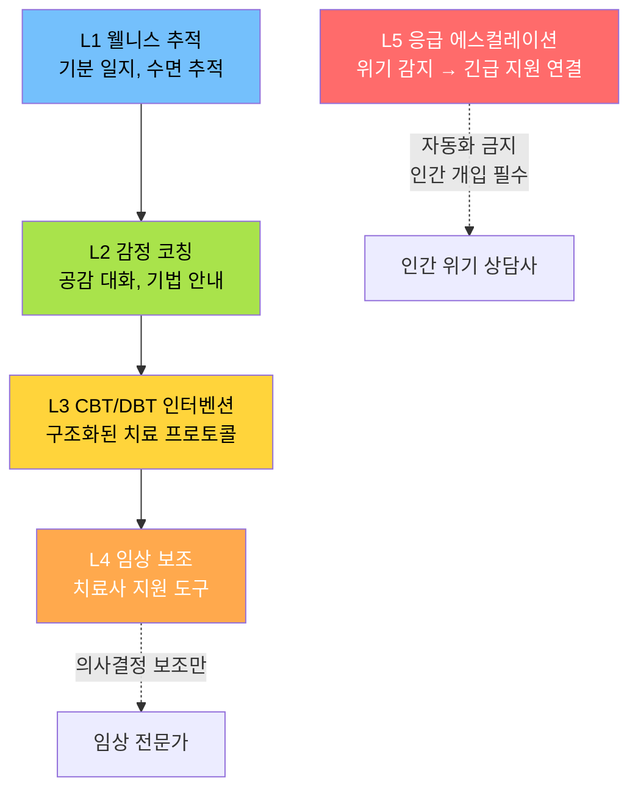
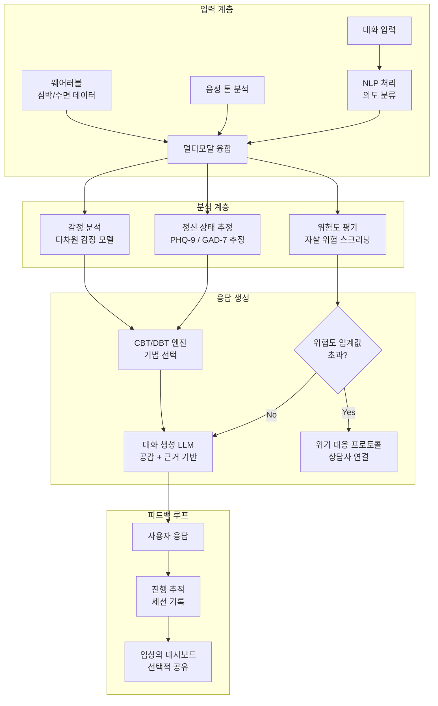
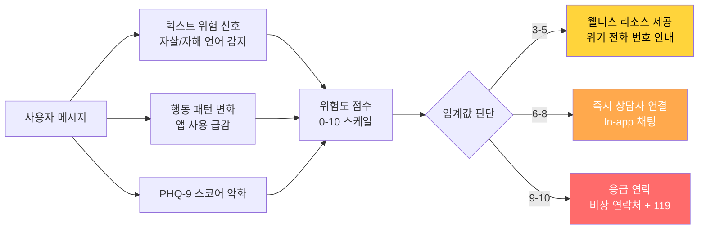
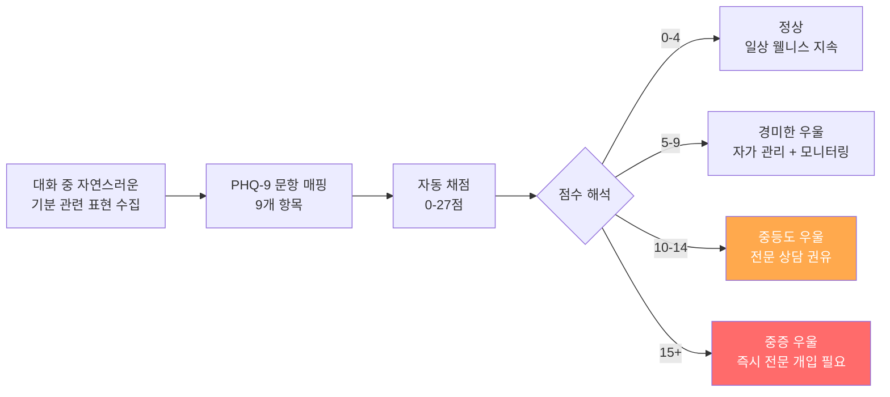
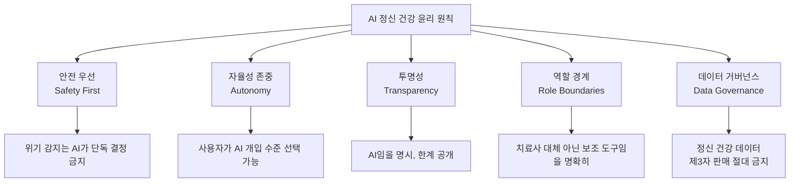

# AI 정신 건강 지원

## 개요

AI 정신 건강 지원은 자연어 처리, 감정 분석, 심리치료 기법을 결합해 정신 건강 서비스에 대한 접근성을 높이는 기술 분야다. WHO에 따르면 전 세계적으로 필요한 정신 건강 서비스의 70-80%가 충족되지 않는다. AI는 상담사 부족, 치료 비용, 낙인(stigma) 문제를 부분적으로 완화할 수 있다.

중요한 전제: AI는 전문 정신 건강 의료인을 대체하는 것이 아니라 **접근성 격차를 메우고 예방·모니터링에서 보조적 역할**을 하는 것이 현재의 윤리적 합의다.

핵심 응용 영역:
- **일상 웰니스**: 스트레스·기분 추적, 수면 분석, 마음챙김 안내
- **경증 증상 지원**: 불안, 경도 우울증의 CBT(인지행동치료) 보조
- **위기 감지**: 자살/자해 위험 신호 조기 감지 및 에스컬레이션
- **임상 보조**: 치료사의 세션 준비, 진행 기록, 회기 요약

## 핵심 아이디어

### 정신 건강 AI의 5계층



### CBT (인지행동치료) 챗봇

인지행동치료(Cognitive Behavioral Therapy, CBT)는 부정적 사고 패턴을 인식하고 재구조화하는 근거 기반 치료법이다. 챗봇은 CBT 기법을 구조화된 대화 형식으로 제공할 수 있다.

**CBT 핵심 기법의 챗봇 구현:**

| CBT 기법 | 챗봇 구현 방식 |
|---------|-------------|
| 사고 기록 (Thought Record) | 상황-감정-생각-증거를 순서대로 입력 안내 |
| 인지 재구조화 | 자동 부정 사고(ANT) 패턴 감지 후 대안 사고 제안 |
| 행동 활성화 | 일일 활동 계획 수립 및 완료 추적 |
| 이완 기법 안내 | 호흡 운동, 근육 이완 시퀀스 유도 |
| 노출 위계 | 불안 상황을 단계적으로 접근하는 계획 수립 |

## 시스템 아키텍처

### AI 정신 건강 앱 아키텍처



### 위기 감지 서브시스템



## 주요 기술 컴포넌트

### 1. 감정 분석 (Sentiment Analysis)

정신 건강 맥락의 감정 분석은 단순한 긍정/부정 분류를 넘어 세밀한 감정 상태를 포착해야 한다.

**다차원 감정 모델:**
- **Valence-Arousal-Dominance (VAD)**: 긍정성-각성도-통제감의 3차원 감정 공간
- **Plutchik 8대 기본 감정**: 기쁨, 신뢰, 공포, 놀라움, 슬픔, 혐오, 분노, 기대
- **혼합 감정**: "슬프지만 기대된다"처럼 복합 감정 표현 처리

정신 건강 특화 감정 분석은 일반 소셜 미디어 텍스트와 언어 패턴이 다르다. "죽고 싶다"는 표현이 일상적 과장인지 실제 위험인지 구분하는 맥락 판단이 핵심이다.

### 2. 음성 감정 분석 (Paralinguistic Analysis)

목소리의 음조, 속도, 에너지가 감정 상태를 반영한다. 우울증은 말 속도 저하, 목소리 단조로움(낮은 F0 변동성)과 연관된다.

**음성 특징과 정신 건강 지표:**

| 음성 특징 | 관련 상태 |
|---------|---------|
| 말 속도 저하 | 우울, 피로 |
| 장기 일시 정지 증가 | 불안, 사고 장애 |
| 음량 저하 | 우울, 무기력 |
| 고주파 성분 감소 | 슬픔 |
| 피치 변동성 감소 | 우울 |

### 3. 치료적 대화 생성

LLM이 생성하는 치료적 응답은 일반 챗봇 응답과 달리 특수한 요건을 충족해야 한다:

- **공감 우선**: 해결책 제시 전에 감정 인정
- **비지시적**: "~해야 합니다" 금지, 선택지 제시
- **전문적 경계**: LLM이 스스로를 치료사로 소개하지 않음
- **안전 우선**: 위험 신호 감지 시 즉시 에스컬레이션
- **근거 기반**: 검증된 심리치료 기법에 기반한 응답

**나쁜 응답 vs 좋은 응답:**

```
나쁜: "다들 그런 감정을 느껴요. 긍정적으로 생각해보세요!"

좋은: "그런 감정이 드시는군요. 정말 힘드셨겠어요. 
      조금 더 말씀해주실 수 있을까요?"
```

### 4. 임상 척도 자동 평가

PHQ-9(우울증 자가 평가), GAD-7(불안 자가 평가) 같은 표준 임상 도구를 자연스러운 대화 흐름 속에서 수집하고 점수화한다.



## 실제 사례

### Woebot Health
CBT 기반 AI 챗봇. 스탠포드 심리학 연구를 기반으로 개발됐으며 Facebook Messenger와 앱을 통해 서비스된다. 2017년 발표된 RCT(무작위 대조 시험) 연구에서 2주 사용 후 불안 증상 유의미한 감소를 보고했다. [교차검증 필요: 장기 효과 및 대규모 임상 증거]

### Wysa
AI 감정 웰니스 채팅봇. 감정 체크인, CBT/DBT/마음챙김 활동, 치료사 연결 옵션을 제공한다. NHS(영국 국가보건서비스)가 정신 건강 지원 도구로 공인했다.

### Youper
AI 가이드 정서 지능 앱. 매일 기분 체크인을 기반으로 CBT 기술을 개인화해 제공한다. 바이어스된 인지 패턴을 대화로 탐색한다.

### Spring Health (직장 정신 건강)
기업용 정신 건강 혜택 플랫폼. AI로 직원의 정신 건강 요구를 평가하고 최적의 치료 방식(자조, 코칭, 치료, 약물 치료)을 매칭한다. 여러 Fortune 500 기업에서 채택했다.

### Crisis Text Line
문자 메시지 기반 위기 상담 서비스. AI가 수십만 건의 위기 대화를 분석해 위험도 예측 모델을 구축했다. 고위험 키워드와 행동 패턴을 학습해 상담사가 가장 위험한 대화에 먼저 집중하도록 라우팅한다.

### Headspace & Calm (마음챙김 앱)
정형화된 명상 앱에서 AI가 개인 수면 패턴, 스트레스 지표를 분석해 맞춤형 명상 및 수면 세션을 추천한다.

## 위기 감지 기술 상세

자살 위험 감지는 AI 정신 건강 기술 중 가장 민감하고 중요한 영역이다.

**언어 기반 위험 신호:**
- 직접적 언급: "죽고 싶다", "사라지고 싶다"
- 간접적 신호: "이제 다 끝났어", "모두에게 짐이다", "잠들면 일어나지 않았으면"
- 계획 관련: 특정 수단, 시간, 장소 언급
- 이별 행동: "모두에게 작별 인사를 해야겠다"

**모델 접근법:**

| 방법 | 정확도 | 주의점 |
|------|--------|--------|
| 키워드 매칭 | 낮음 | 과탐(예: "죽을 정도로 맛있어") |
| BERT 분류기 | 중간 | 영어 중심, 미묘한 표현 놓침 |
| LLM 제로샷 | 높음 | 지연시간, 비용, 일관성 문제 |
| 앙상블 | 가장 높음 | 복잡도 증가 |

**중요 원칙**: 위기 감지 AI는 **false negative(놓침)를 최소화**해야 한다. false positive(오탐)로 불필요한 개입이 생기는 것보다, 진짜 위기를 놓치는 것이 훨씬 더 나쁜 결과를 낳는다.

## 한계 및 트레이드오프

| 항목 | 내용 |
|------|------|
| 임상 근거 부족 | 대부분 앱의 RCT 증거가 약하거나 단기간에 그침 |
| 치료 관계 부재 | 치료적 효과의 핵심인 인간 치료 관계(therapeutic alliance)를 AI가 완전히 대체 불가 |
| 위기 대응 한계 | AI는 진짜 위기 상황에서 물리적 개입을 할 수 없음 |
| 언어·문화 편향 | 영어권 서양 심리치료 모델 중심 |
| 오진 위험 | 증상 과소/과대 평가로 잘못된 안심 제공 위험 |
| 개인정보 민감성 | 정신 건강 데이터는 가장 민감한 개인정보 |

## 윤리적 프레임워크



**주요 가이드라인 문서:**
- WHO Mental Health Gap Action Programme (mhGAP)
- 미국 심리학회(APA) AI 윤리 원칙
- IAMHIST(국제 정신 건강 혁신 이해관계자 협회) 디지털 도구 프레임워크

## 관련 문서

- [[sentiment-analysis-aspect]] - 감정 분석 기법 상세
- [[chatbot-design]] - 대화 시스템 설계 패턴
- [[ai-ethics]] - AI 윤리 프레임워크
- [[ai-elder-care]] - 노인 정신 건강 특화 응용
- [[ai-accessibility-tools]] - 접근성 관점에서의 정신 건강 지원
