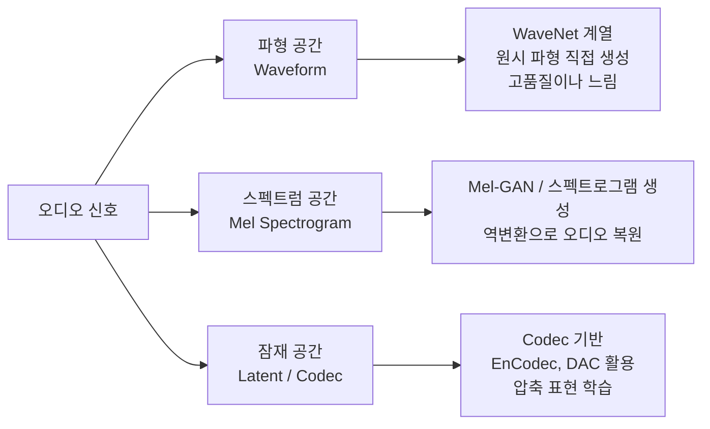
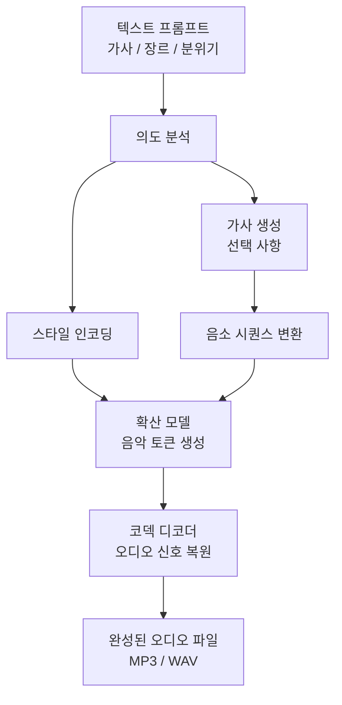

# AI 음악 생성 (Suno, Udio)

## 개요

AI 음악 생성은 텍스트 프롬프트, 장르, 분위기 설명을 입력받아 보컬과 악기 연주가 포함된 완성곡을 자동으로 생성하는 기술이다. 2023-2024년 Suno와 Udio의 등장으로 이 분야가 급격히 대중화되었으며, 음악 지식 없이도 누구나 몇 초 만에 그럴듯한 노래를 만들 수 있게 되었다.

기술적 기반은 [[diffusion-models|확산 모델(Diffusion Models)]]에서 파생되었으나, 오디오 도메인의 시간적 구조와 음악 이론 특성을 반영한 변형 아키텍처를 사용한다. [[ai-image-generation|AI 이미지 생성]]이 시각 예술을 민주화한 것처럼, AI 음악 생성은 음악 창작의 진입 장벽을 근본적으로 낮추고 있다.

## 핵심 기술 아키텍처

### 오디오 표현 방식

AI 음악 모델은 오디오를 어떻게 표현하느냐에 따라 두 가지 계열로 나뉜다.



Suno와 Udio는 뉴럴 오디오 코덱(neural audio codec)을 활용한 잠재 공간 확산 모델로 추정된다. 오디오를 이산 토큰 시퀀스로 압축하고 이 토큰 공간에서 생성을 수행하여 계산 효율성과 품질을 동시에 확보한다.

### 음악 구조 제어

완성도 높은 음악 생성을 위해 다음 구조적 요소가 제어되어야 한다.

| 요소 | 설명 | 제어 방식 |
|------|------|---------|
| 장르/스타일 | 팝, 록, 클래식, 재즈 등 | 텍스트 프롬프트 |
| 템포 | BPM (Beats Per Minute) | 프롬프트 또는 수치 입력 |
| 조성/선법 | 장조/단조, 모달 스케일 | 고급 설정 |
| 구조 | 인트로-버스-코러스-아웃트로 | 섹션 마커 |
| 분위기 | 밝음, 슬픔, 긴장감 등 | 자연어 기술 |
| 악기 구성 | 피아노 솔로, 풀 밴드 등 | 텍스트 프롬프트 |

## 주요 플랫폼 비교

| 플랫폼 | 출시 | 특징 | 요금 |
|--------|------|------|------|
| Suno | 2023 | 가장 자연스러운 보컬, 가사 자동 생성 | 무료 10곡/일, $8/월 |
| Udio | 2024 | 높은 음악 품질, 세밀한 스타일 제어 | 무료 300크레딧/월, $10/월 |
| MusicGen (Meta) | 2023 | 오픈소스, 연구용, 보컬 없음 | 무료 |
| Stable Audio | 2024 | Stability AI, 최대 3분 생성 | 무료 티어 존재 |
| Udio Custom | 2024 | 스타일 참조 오디오 업로드 | Pro 플랜 |

## 프롬프트 엔지니어링: 음악 도메인

음악 AI 프롬프트는 이미지 생성과 다른 특성을 갖는다.

**효과적인 프롬프트 구성 요소**:
```
장르: indie pop
분위기: nostalgic, bittersweet, warm
악기: acoustic guitar, soft piano, light drums
보컬: female vocal, breathy, 80s style
템포: medium, around 90 BPM
주제: [가사 내용 혹은 곡의 서사]
```

**피해야 할 프롬프트 패턴**:
- 추상적 감정만: "슬픈 곡" (구체적 스타일 참조 없이)
- 과도한 요소 나열: 실제로 공존하기 어려운 장르 혼합
- 저작권 있는 아티스트명 직접 사용 (플랫폼 정책 위반 가능)



## 저작권과 법적 쟁점

AI 음악 생성은 저작권 분야에서 가장 뜨거운 논쟁 중 하나다.

**주요 법적 쟁점**:

1. **학습 데이터 저작권**: Suno와 Udio는 라이선스 없이 기존 음악으로 학습했다는 혐의로 음반사들로부터 소송을 받았다 (2024년 RIAA 소송).

2. **생성물 저작권 귀속**: AI가 생성한 음악의 저작권이 플랫폼인지, 프롬프트 작성자인지, 또는 저작권 없음으로 처리될지 각국 법원마다 판결이 엇갈린다.

3. **스타일 모방 vs 표절**: 특정 아티스트의 스타일을 재현하는 것이 합법인지의 경계가 불명확하다. 미국 저작권법은 스타일 자체는 보호하지 않지만, "느낌과 분위기"까지의 범위는 논쟁 중이다.

| 쟁점 | 현재 상황 |
|------|---------|
| 학습 데이터 라이선싱 | 대형 레이블 소송 진행 중 |
| 생성물 상업 이용 | 플랫폼마다 이용약관 상이 |
| 아티스트 목소리 복제 | 대부분 플랫폼에서 금지 |
| 공연권 처리 | 미정립 |

## 창작 워크플로우 통합

AI 음악 생성이 전문 음악 제작에 통합되는 방식:

- **레퍼런스 트랙 프로토타이핑**: 클라이언트 미팅 전 빠른 방향성 제시용 데모 생성
- **배경음악 자동화**: 영상, 팟캐스트, 게임의 BGM을 장면별로 생성
- **영감 도구**: 작곡가가 창작 블록 극복을 위한 자극제로 사용
- **보컬 멜로디 스케치**: 가수가 녹음 전 멜로디 방향 탐색

## 한계

- 3분 이상 장기 구조의 일관성 유지가 어렵다
- 특정 악기의 정밀한 기술적 표현(예: 클래식 바이올린 보잉 기법)에서 부자연스러움
- 다국어 가사 발음 품질의 편차가 크다 (영어 외 언어에서 열위)
- 실제 인간 연주자의 미묘한 표정(음악적 표현)을 완전히 재현하지 못한다

## 관련 문서

- [[diffusion-models|확산 모델]] - AI 음악 생성의 기술적 기반
- [[ai-image-generation|AI 이미지 생성]] - 생성 AI의 시각 영역 대응 기술
- [[ai-video-generation|AI 비디오 생성]] - 멀티미디어 생성 AI 생태계
