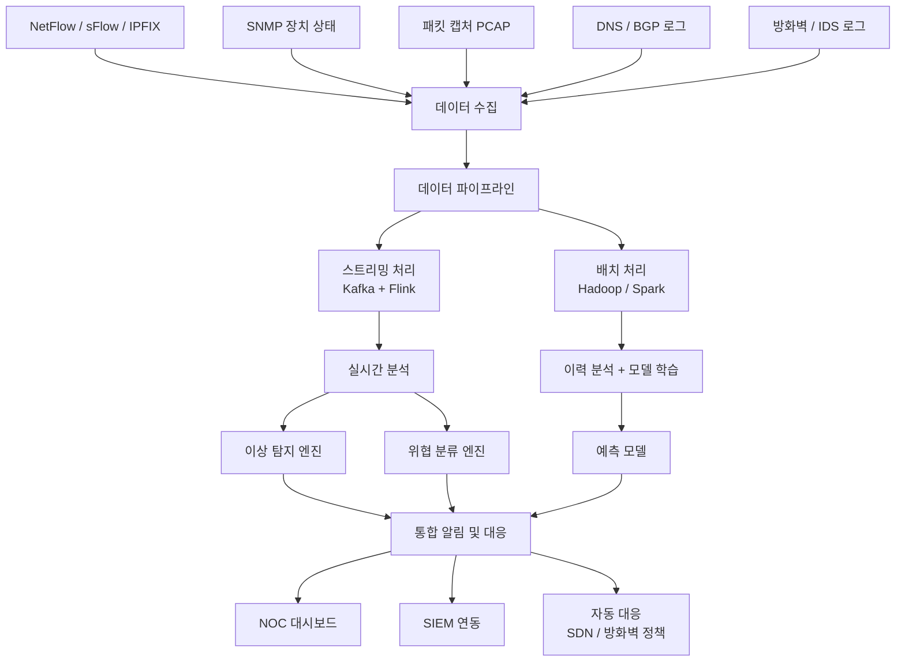
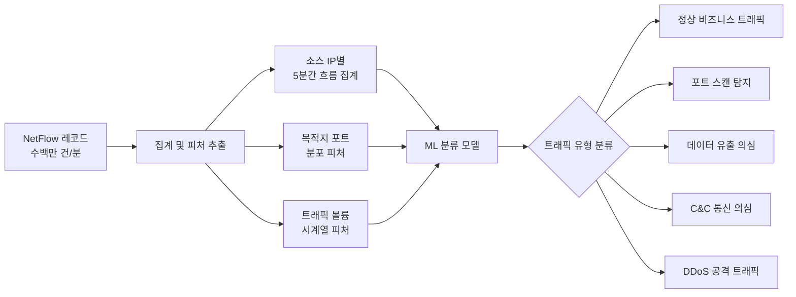
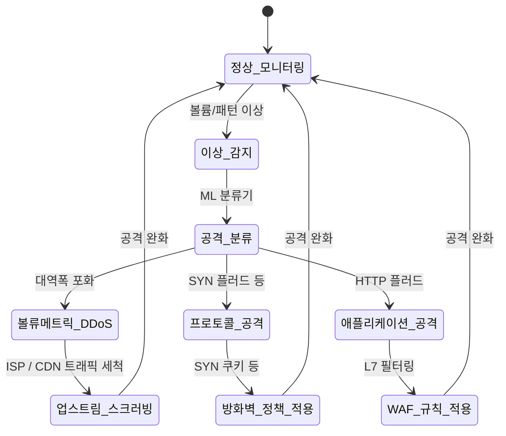
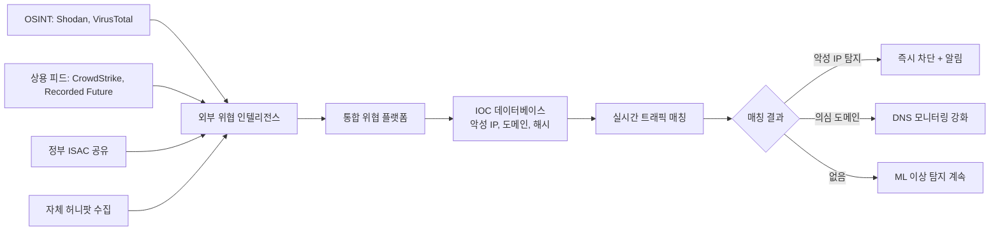
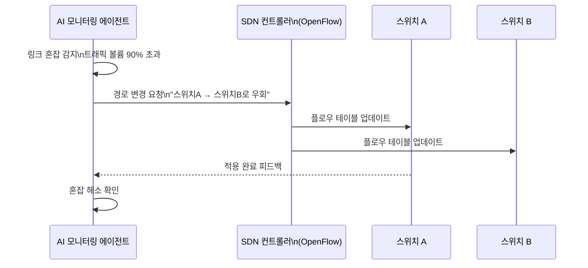
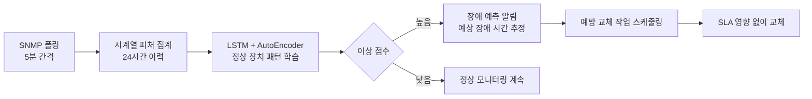

# AI 네트워크 모니터링

## 개요

AI 네트워크 모니터링은 네트워크 트래픽, 흐름 데이터(flow data), 장치 상태를 실시간으로 분석해 성능 저하, 보안 위협, 설정 이상을 탐지하고 자동으로 대응하는 시스템이다.

현대 기업 네트워크는 수천~수만 개 장치, 수십 테라비트의 일일 트래픽, 멀티클라우드 및 하이브리드 환경으로 구성된다. 전통적인 임계값 기반 모니터링으로는 이 복잡성을 다루기 어려우며, AI는 다음을 가능하게 한다.

- **패턴 인식**: 정상 트래픽 기준선 자동 학습 후 이탈 감지
- **이상 트래픽 분류**: DDoS, 포트 스캔, 데이터 유출, C&C 통신 등 위협 유형 식별
- **예측적 유지보수**: 장치 장애 발생 전 조기 감지
- **자동 대응**: 위협 탐지 즉시 경로 조정, 차단 정책 적용

## 전체 아키텍처

---

## 1. NetFlow 및 흐름 기반 분석

### NetFlow란

NetFlow(Cisco 개발, IETF IPFIX로 표준화)는 네트워크 장치가 트래픽 흐름(flow)의 요약 정보를 수집해 전송하는 프로토콜이다. 전체 패킷 캡처보다 훨씬 경량이다.

**흐름 레코드 주요 필드**:
- 출발지/목적지 IP, 포트, 프로토콜
- 패킷 수, 바이트 수, 흐름 시작/종료 시간
- TCP 플래그(SYN, ACK, FIN 등)
- 인터페이스, ToS(Type of Service)

### ML 기반 NetFlow 분석 파이프라인

**피처 엔지니어링 예시**:

| 피처 | 설명 | 탐지 시나리오 |
|------|------|--------------|
| 목적지 포트 엔트로피 | 다양한 포트에 분산 접근 시 높음 | 포트 스캔 |
| 패킷 크기 분산 | 일정한 소형 패킷 → UDP 플러드 의심 | DDoS |
| 흐름 지속 시간 분포 | 매우 짧은 수천 흐름 | SYN 플러드 |
| 바이트 대비 패킷 비율 | 대형 파일 전송 vs. 소규모 요청 | 데이터 유출 |
| 외부 IP 연결 패턴 | 새로운 외부 IP와의 반복 접속 | C&C 통신 |

---

## 2. 이상 트래픽 탐지

### DDoS 탐지 및 경감

DDoS(Distributed Denial of Service) 공격은 대규모 트래픽으로 서비스를 마비시키는 공격이다. AI 기반 탐지는 공격 초기(트래픽이 정상 피크와 구분이 어려운 단계)에 공격을 식별하는 데 집중한다.

**스크러빙 센터(scrubbing center)**: Cloudflare, Akamai 같은 CDN/DDoS 방어 서비스는 공격 트래픽을 스크러빙 센터로 우회시켜 정상 트래픽만 원본 서버로 전달한다. AI는 어떤 트래픽을 우회할지 분류한다.

### 암호화 트래픽의 이상 탐지

TLS(Transport Layer Security) 암호화 확산으로 패킷 페이로드 분석이 어려워졌다. 메타데이터만으로 이상을 탐지한다.

- **TLS 핸드셰이크 피처**: 사용된 사이퍼 스위트(cipher suite), 인증서 체인, SNI(Server Name Indication)
- **흐름 통계**: 패킷 크기 분포, 인터패킷 간격, 흐름 지속 시간
- **호스트 간 통신 패턴**: C&C 통신은 주기적이고 규칙적인 연결 패턴(beaconing)을 보임

**JA3 / JA3S 지문**: TLS 클라이언트와 서버의 핸드셰이크 파라미터로 클라이언트/서버 식별. 동일한 악성코드는 동일한 JA3 지문을 생성하는 경향이 있어 시그니처로 활용.

---

## 3. 위협 인텔리전스 통합

### 외부 위협 피드 연동

### DNS 기반 위협 탐지

DNS 쿼리 패턴은 네트워크 위협의 귀중한 초기 신호다.

- **DGA(Domain Generation Algorithm) 탐지**: 악성코드가 생성한 무작위 도메인명. 엔트로피, N-gram 패턴으로 ML 분류
- **DNS 터널링 탐지**: DNS 쿼리에 데이터를 숨겨 방화벽 우회. 쿼리 크기, 쿼리 빈도, 서브도메인 길이로 탐지
- **싱크홀(sinkhole) 연결**: 이미 차단된 C&C 도메인에 연결 시도는 감염 호스트 식별에 활용

---

## 4. 자동 라우팅 조정 (Adaptive Routing)

### SDN(Software-Defined Networking) 기반 자동화

SDN은 네트워크 제어 평면(control plane)과 데이터 평면(data plane)을 분리해 소프트웨어로 네트워크를 프로그래밍 가능하게 한다. AI와 결합하면 실시간 트래픽 분석에 기반한 자동 경로 조정이 가능하다.

### 강화학습 기반 트래픽 엔지니어링

전통적 트래픽 엔지니어링은 OSPF/ECMP 같은 정적 라우팅 프로토콜에 의존한다. RL 에이전트는 실시간 네트워크 상태를 관측하고 라우팅 결정을 통해 지연, 손실, 활용도를 최적화한다.

- **상태**: 링크 부하, 큐 길이, 연결 요청 흐름 행렬
- **행동**: ECMP 가중치 조정, 트래픽 클래스별 경로 선택
- **보상**: 패킷 손실 최소화, 평균 지연 최소화, 링크 활용도 균형

**Google B4 WANs**: 구글의 소프트웨어 정의 WAN에서 TE(Traffic Engineering) 시스템이 실시간 트래픽에 따라 링크 가중치를 자동 조정. 논문 공개로 업계 참조 아키텍처가 됨.

---

## 5. 예측적 네트워크 유지보수

### 장치 장애 예측

네트워크 장치(라우터, 스위치, 광케이블)의 상태 신호에서 장애 전조를 조기에 탐지한다.

**장애 전조 신호 예시**:
- 오류 카운터 서서히 증가 (CRC 오류, 인터페이스 재설정)
- 광출력(optical power) 저하
- CPU/메모리 사용률 비정상 패턴
- BGP 세션 불안정 (순간적 드롭 후 재연결 반복)

**MTTR(Mean Time To Repair) vs. MTTF(Mean Time To Failure)**: AI 예측 유지보수는 MTTF가 다가오기 전에 교체 작업을 예약해 MTTR을 줄이고 서비스 중단을 방지한다.

---

## 6. 프로덕션 배포 고려사항

### 수집 전략

전체 패킷 캡처(deep packet inspection)는 가장 풍부한 데이터를 제공하지만, 대용량 트래픽에서는 처리 비용이 과도하다. 실용적 전략:

| 방식 | 데이터 밀도 | 활용 |
|------|-----------|------|
| 전체 패킷 캡처 | 최고 | 인시던트 조사, 포렌식 |
| NetFlow/sFlow | 중간 (샘플링) | 상시 이상 탐지 |
| SNMP 폴링 | 낮음 (집계) | 성능 모니터링 |
| 메타데이터 전용 | 최저 | 대규모 ISP 수준 |

### 거짓 양성(FP) 관리

자동 차단(auto-block) 기능을 활성화할 때는 FP로 정상 트래픽을 차단하는 운영 사고를 방지해야 한다.

- **단계적 자동화**: 탐지 → 알림만 → 검증 후 격리 → 자동 차단 순으로 신뢰가 쌓이면 자동화 범위 확대
- **챔피언-챌린저 배포**: 새 모델을 read-only(알림만)로 먼저 배포해 FP 비율 검증
- **White list 자동 적용**: 중요 서비스 IP/도메인은 자동 차단 예외 처리

---

## 한계 및 트레이드오프

### 암호화 확산의 가시성 감소

TLS 1.3의 보급으로 패킷 페이로드 분석이 거의 불가능해졌다. 메타데이터 기반 탐지로 전환하고 있으나 탐지 정확도 한계 존재.

### 고속 네트워크에서의 처리 속도

100Gbps 이상 네트워크에서 패킷 단위 ML 추론은 현재 하드웨어로 어렵다. 흐름 수준 집계를 통해 처리량을 줄이는 것이 현실적 접근.

### 분산 환경의 가시성 분절

멀티클라우드, SD-WAN, 컨테이너 네트워크(Kubernetes CNI) 환경은 가시성이 분절된다. 통합 관찰 가능성(unified observability) 플랫폼 없이는 전체 그림을 보기 어렵다.

---

## 관련 문서

- [[ai-anomaly-detection]] - 이상 탐지 기법 기반
- [[ai-cyber-threat-hunting]] - 사이버 위협 헌팅과의 연계
- [[ai-aiops-log-analysis]] - AIOps 로그 분석
- [[ai-fraud-detection]] - 네트워크 레벨 사기 탐지
