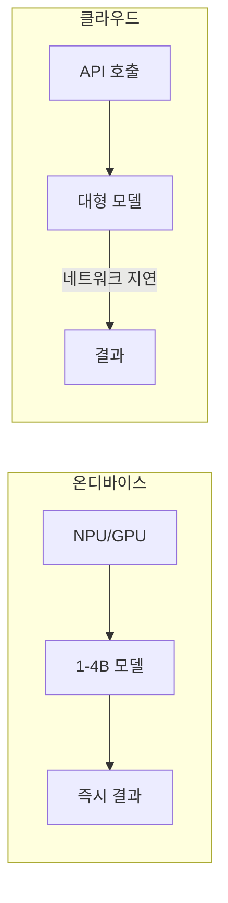

# 온디바이스 AI 추론 응용

스마트폰, 노트북, IoT 디바이스에서 1-4GB 크기의 소형 모델로 **프라이버시 보존 AI**를 실행하는 응용 패턴. 데이터가 디바이스를 떠나지 않아 GDPR/HIPAA 준수가 용이하고, 네트워크 지연이 없다.

## 런타임 스택

| 런타임 | 플랫폼 | 특화 |
|--------|--------|------|
| [[coreml\|CoreML]] | Apple | ANE 자동 가속 |
| [[tflite-litert\|LiteRT]] | Android/iOS | 300KB 바이너리 |
| [[onnx-runtime\|ONNX RT]] | 크로스 플랫폼 | EP 플러그인 |
| [[webgpu-webllm\|WebLLM]] | 브라우저 | WebGPU 가속 |
| [[mlc-llm\|MLC-LLM]] | 범용 | TVM 컴파일 |

## NPU 시대

Apple ANE, Qualcomm Hexagon, Intel NPU가 GPU 대비 40-45% 전력 절감으로 AI 추론 전용 가속. 2026년 출하 PC/스마트폰 대부분이 NPU 탑재.

## 관련 문서

- [[coreml]] -- CoreML
- [[tflite-litert]] -- TFLite/LiteRT
- [[onnx-runtime]] -- ONNX Runtime
- [[gemma-4-local-inference]] -- Gemma 4 로컬 추론
