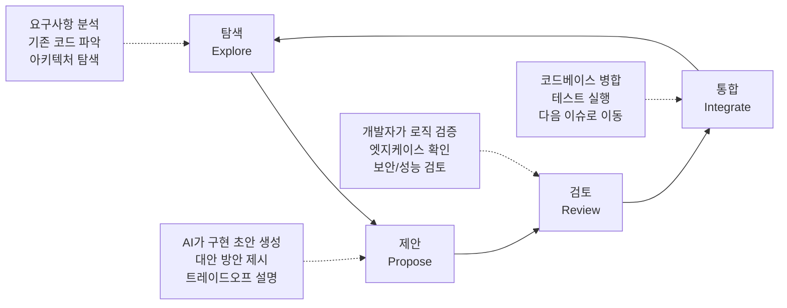

# AI 페어 프로그래밍 (AI Pair Programming)

## 개요

AI 페어 프로그래밍은 개발자가 AI 모델과 실시간으로 협력하여 코드를 작성하고 개선하는 패턴이다. 전통적인 인간 페어 프로그래밍에서 한 명이 타이핑하고 다른 한 명이 검토하는 역할 분담을 AI가 보조자 또는 드라이버 역할 중 하나를 맡는 방식으로 확장한 개념이다.

GitHub Copilot이 2021년 등장하면서 이 패턴이 대중화되었고, [[claude-code|Claude Code]], Cursor, Aider 등 더 강력한 도구의 등장으로 단순 코드 완성을 넘어 탐색-제안-검토-통합의 전체 개발 루프를 AI와 함께 수행하는 워크플로우로 발전했다. [[coding-agent|코딩 에이전트]]의 핵심 활용 패턴이기도 하다.

## 핵심 루프: 탐색-제안-검토-통합

AI 페어 프로그래밍의 이상적인 워크플로우는 4단계 루프로 구성된다.

**탐색(Explore)**: AI에게 기존 코드베이스, 의존성, 관련 파일을 파악하게 한다. "이 함수가 어떤 데이터 구조를 다루는지 설명해줘"처럼 이해 중심의 대화로 시작한다.

**제안(Propose)**: AI가 구현 초안을 생성한다. 단순히 코드를 출력하는 것이 아니라, 왜 이 접근법을 선택했는지, 어떤 트레이드오프가 있는지를 함께 설명하는 것이 고품질 협업의 징표다.

**검토(Review)**: 개발자가 제안을 비판적으로 평가한다. AI는 모든 비즈니스 맥락을 알 수 없으므로, 도메인 지식과 코딩 판단력을 조합한 인간의 검토가 필수다.

**통합(Integrate)**: 승인된 코드를 병합하고 테스트를 실행한다. 실패하면 AI와 함께 디버깅하며 루프를 재시작한다.

## 역할 모드: 드라이버 vs 내비게이터

전통적 페어 프로그래밍의 역할 구분을 AI에 적용하면 두 가지 운용 모드가 나온다.

| 모드 | AI 역할 | 개발자 역할 | 적합한 상황 |
|------|---------|------------|------------|
| AI-드라이버 | 코드 작성, 파일 수정 | 방향 제시, 검토 | 반복적 구현, 보일러플레이트 |
| AI-내비게이터 | 제안, 설명, 예시 제공 | 직접 타이핑 | 학습 목적, 정밀 제어 필요 |

[[claude-code|Claude Code]]는 AI-드라이버 모드의 대표적 구현이다. 개발자가 자연어로 목표를 설명하면 파일 읽기, 수정, 테스트 실행을 자율로 수행한다.

## 프롬프트 전략

AI 페어 프로그래밍의 품질은 프롬프트 설계에 크게 좌우된다.

**컨텍스트 제공**: "이 함수는 결제 플로우 중간에 호출되며, 실패 시 트랜잭션을 롤백해야 한다"처럼 비즈니스 맥락을 먼저 설명한다.

**제약 조건 명시**: 사용 중인 프레임워크, 금지 패턴, 성능 요구사항을 미리 알려준다.

**점진적 확장**: 복잡한 기능을 한번에 구현하지 않고 작은 단위로 나눠 루프를 반복한다.

**비판적 질문 요청**: "이 구현의 잠재적 문제점은?" 처럼 AI가 자신의 제안을 비판하도록 유도한다.

## 대표 도구 비교

| 도구 | 방식 | 컨텍스트 | 자율성 | 강점 |
|------|------|---------|-------|------|
| GitHub Copilot | 인라인 자동완성 | 현재 파일 | 낮음 | IDE 통합, 빠른 응답 |
| Cursor | 채팅 + 인라인 | 전체 프로젝트 | 중간 | 코드베이스 인덱싱 |
| Claude Code | 터미널 에이전트 | 파일시스템 전체 | 높음 | 멀티파일, 테스트 실행 |
| Aider | 터미널 채팅 | Git 저장소 | 중간 | 오픈소스, 모델 선택 자유 |

## 효과적인 활용 패턴

**TDD 연계**: 먼저 테스트를 작성하고 AI에게 통과하는 구현을 생성하게 하면 검토 기준이 명확해진다. [[red-green-tdd|Red-Green TDD]] 패턴과 자연스럽게 결합된다.

**리팩토링 세션**: "이 함수의 순환 복잡도를 낮춰줘"처럼 개선 목표를 지정하면 AI가 기존 기능을 유지하면서 구조를 개선하는 제안을 생성한다.

**디버깅 협력**: 스택 트레이스와 관련 코드를 컨텍스트로 제공하면 AI가 근본 원인 후보를 좁혀준다.

## 한계와 주의사항

AI 페어 프로그래밍은 만능이 아니다.

- **환각(Hallucination)**: AI는 존재하지 않는 API나 라이브러리를 자신 있게 제안할 수 있다. 모든 외부 의존성은 실제 문서에서 검증해야 한다.
- **보안 맹점**: AI는 SQL 인젝션, XSS 같은 보안 취약점을 놓칠 수 있다. 보안 민감 코드는 전문 리뷰를 병행한다.
- **비즈니스 로직 이해 부족**: 도메인 특화 규칙이나 규제 요건은 AI가 추론하기 어렵다.
- **저작권 문제**: 학습 데이터에서 그대로 복사된 코드가 생성될 위험이 있다.

## 관련 문서

- [[coding-agent|코딩 에이전트]] - AI 페어 프로그래밍의 기반 기술
- [[claude-code|Claude Code]] - Anthropic의 코딩 에이전트 구현
- [[red-green-tdd|Red-Green TDD]] - AI 페어 프로그래밍과 결합 가능한 개발 방법론
- [[agentic-engineering|에이전틱 엔지니어링]] - 자율 에이전트 기반 소프트웨어 개발
