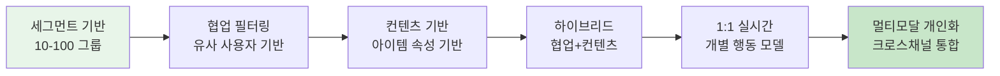
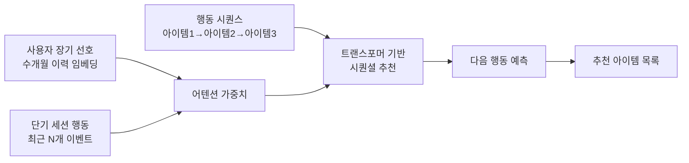
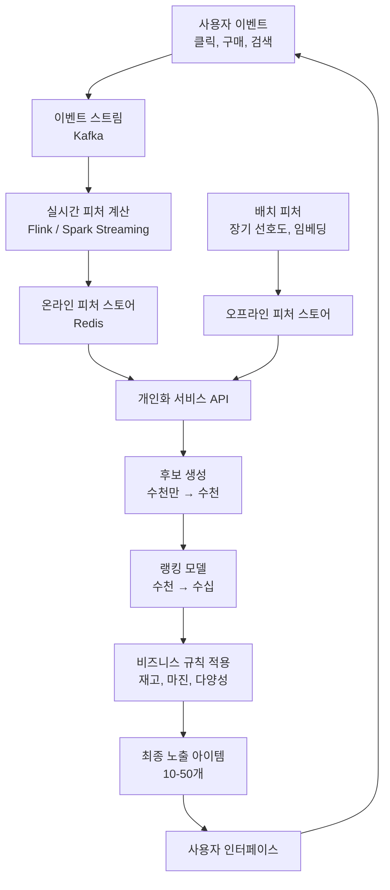
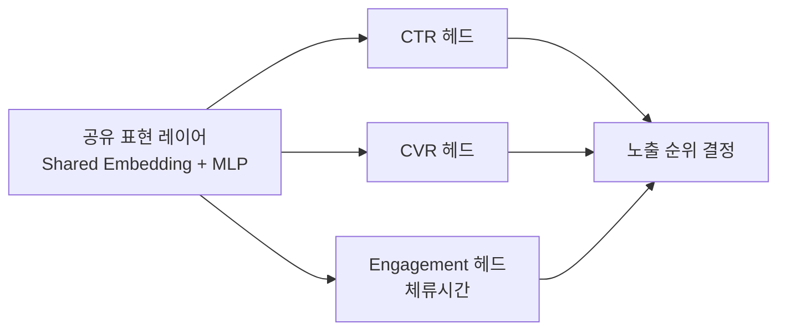
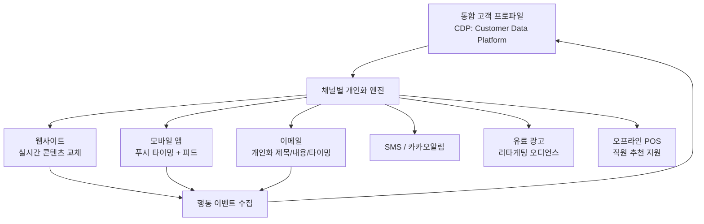
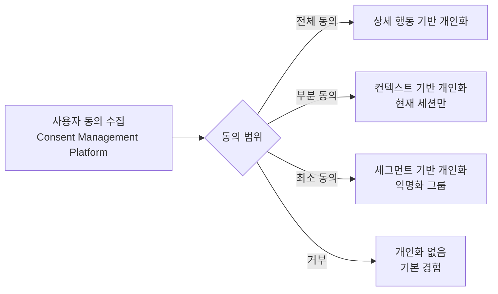

# AI 개인화 엔진

## 개요

개인화 엔진(personalization engine)은 개별 사용자의 컨텍스트, 선호도, 행동 이력을 실시간으로 분석해 1:1 맞춤형 경험을 제공하는 AI 시스템이다. 추천 시스템(recommendation system)보다 넓은 개념으로, 콘텐츠 추천뿐 아니라 UI 레이아웃, 메시지 타이밍, 가격 제시 방식, 검색 결과 순위까지 개인화 범위에 포함된다.

개인화의 핵심 가치는 **연관성(relevance)**이다. 사용자가 보고 싶은 것을 보고 싶은 시점에 제시해 클릭률(CTR), 전환율(CVR), 체류 시간, 재방문율을 높인다.

**콘텐츠 추천([[ai-content-recommendation]])과의 차이**: 콘텐츠 추천은 "어떤 아이템을 보여줄 것인가"에 집중하지만, 개인화 엔진은 여기에 더해 "어떤 채널에서", "언제", "어떤 방식으로", "어떤 인터페이스로" 제시할 것인가까지 아우른다.

## 개인화 스펙트럼

왼쪽에서 오른쪽으로 갈수록 개인화 세밀도가 높아지고, 데이터 및 계산 요구사항도 증가한다.

---

## 1. 사용자 모델링 (User Modeling)

### 사용자 표현

개인화의 핵심은 각 사용자를 수학적으로 표현하는 방법이다.

| 표현 방식 | 설명 | 장단점 |
|-----------|------|--------|
| 명시적 프로파일 | 회원가입 시 입력한 선호도, 설정 | 정확하지만 수집 어렵고 구식화 빠름 |
| 암묵적 행동 신호 | 클릭, 구매, 체류 시간, 검색어 | 풍부하지만 노이즈 많음 |
| 임베딩(embedding) | 행동 시퀀스를 벡터 공간에 매핑 | 고차원 선호도를 압축 표현 |
| 실시간 컨텍스트 | 현재 시간, 위치, 기기, 세션 중 행동 | 즉각적 의도 포착 |
| 생애주기 단계 | 신규/활성/이탈 위험/재활성 | 인게이지먼트 전략에 중요 |

### 시퀀셜 행동 모델링

사용자의 행동을 **시간 순서가 있는 시퀀스**로 처리하면 현재 의도를 더 잘 포착할 수 있다.

**SASRec (Self-Attentive Sequential Recommendation)**: 트랜스포머 아키텍처를 시퀀셜 추천에 적용한 대표 모델. 사용자 행동 시퀀스를 자기어텐션(self-attention)으로 처리해 각 행동 간 의존성을 포착한다.

---

## 2. 실시간 개인화 아키텍처

### 전체 시스템 아키텍처

### 2단계 아키텍처 (Two-Stage Architecture)

대규모 아이템 공간(수백만~수억)을 처리하기 위해 후보 생성과 랭킹을 분리한다. [[ai-content-recommendation]]의 두 타워 모델(two-tower model)과 구조적으로 동일하다.

**후보 생성(Retrieval)**: 가볍고 빠른 모델로 전체 아이템에서 수백~수천 개 후보를 추출. 주로 임베딩 유사도 검색(ANN) 사용.

**랭킹(Ranking)**: 후보에 대해 복잡한 특성(사용자 컨텍스트, 아이템 속성, 상호작용 피처)을 고려해 최종 순위 결정. 더 표현력이 강한 모델(딥 크로스 네트워크, 트랜스포머) 사용.

---

## 3. 행동 예측 및 다음 행동 모델링

### 예측 대상

| 예측 목표 | 활용 |
|-----------|------|
| 클릭 확률(CTR) | 광고, 피드 노출 순위 |
| 구매 확률(CVR) | 이커머스 추천, 업셀링 |
| 이탈 확률(churn) | 프로모션 타이밍 최적화 |
| 장기 가치(LTV) | 고가치 고객 우선 투자 |
| 다음 구매 타이밍 | 마케팅 자동화 트리거 |

### 멀티태스크 학습 (Multi-Task Learning)

단일 모델로 여러 예측 목표를 동시에 학습하면 목표 간 공통 표현을 공유해 데이터 효율이 높아진다.

**ESC (Entire Space Multi-Task Model)**: 알리바바가 제안한 멀티태스크 추천 프레임워크. CTR과 CVR을 분리해 학습하면서 샘플 선택 편향(selection bias)을 해결한다.

---

## 4. 다중 채널 개인화 통합

### 옴니채널 (Omnichannel) 개인화

현대 고객은 웹, 모바일 앱, 이메일, 푸시, SMS, 오프라인 매장 등 여러 채널을 교차한다. 채널 간 일관되고 연속적인 경험을 제공하는 것이 핵심 과제다.

**CDP (Customer Data Platform)**: 여러 소스의 고객 데이터를 통합해 단일 고객 뷰를 생성하는 플랫폼. 개인화 엔진의 사용자 프로파일 소스 역할.

### 채널 귀속(Attribution) 문제

고객이 여러 채널에 노출된 후 구매할 때, 어느 채널이 기여했는지 판단하는 문제. 마케팅 예산 배분과 채널 개인화 피드백에 중요하다.

- **마지막 터치(last touch)**: 구매 직전 채널에 전부 귀속. 단순하지만 보조 채널 과소평가
- **선형 귀속**: 노출된 모든 채널에 균등 배분
- **데이터 기반 귀속**: 통계적 모델로 각 채널의 인과적 기여도 추정 (Shapley value 기반)

---

## 5. 동의 관리 및 프라이버시

### 규제 환경

| 규제 | 지역 | 핵심 요구사항 |
|------|------|--------------|
| GDPR | EU | 명시적 동의, 잊혀질 권리, 데이터 이동성 |
| CCPA / CPRA | 캘리포니아 | 판매 거부 권리, 민감 데이터 제한 |
| PIPL | 중국 | 개인정보 처리 제한, 자동화 결정 거부 권리 |
| 개인정보보호법 | 한국 | 수집 목적 명시, 동의 철회 보장 |

### 프라이버시 보존 개인화 기법

**연합학습(Federated Learning)**: 사용자 데이터를 서버로 전송하지 않고, 모델을 기기에서 학습한 후 그래디언트만 중앙 서버로 전송. Apple이 iOS 키보드 자동완성, 사진 분류에 활용. ([[federated-learning]] 참조)

**차등 프라이버시(Differential Privacy)**: 집계 데이터나 모델 파라미터에 통계적 노이즈를 추가해 개별 사용자 역추적을 수학적으로 방지.

**쿠키리스 대안**: 3rd party 쿠키 폐기 이후 퍼블리셔 자체의 1st party 데이터, 컨텍스트 광고, Privacy Sandbox API(Topics API 등) 기반 접근이 부상.

---

## 6. 개인화 효과 측정

### A/B 테스팅과 실험 설계

개인화 알고리즘의 효과를 정확히 측정하려면 엄격한 실험이 필요하다. 단순 A/B 테스팅만으로는 네트워크 효과(같은 사용자 그룹 간 영향)나 희귀 이벤트(구매 전환) 측정에 한계가 있다.

**인터리빙(Interleaving)**: 두 알고리즘의 추천을 하나의 목록에 섞어서 사용자에게 보여주고 어느 쪽 아이템을 더 많이 클릭하는지 비교. 표준 A/B 대비 훨씬 적은 트래픽으로 통계적 유의성 달성.

**반사실 추정(Counterfactual Estimation)**: "개인화 없었다면 어떤 행동을 했을까"를 추정하는 인과 추론 기법. 실제로 제어군을 만들기 어려울 때 로그 데이터에서 추정.

---

## 한계 및 트레이드오프

### 필터 버블 (Filter Bubble)

지나친 개인화는 사용자를 자신이 이미 좋아하는 콘텐츠의 거품 안에 가두어 새로운 발견을 막는다. 탐색(exploration)과 활용(exploitation)의 균형, 의도적 다양성(serendipity) 주입이 필요하다.

### 개인화 vs. 공정성

개인화 모델이 과거 데이터를 학습하면, 과거에 특정 그룹에게 덜 보여줬던 콘텐츠를 계속 덜 보여주는 편향 강화가 발생한다.

### 콜드 스타트

신규 사용자는 데이터가 없어 의미 있는 개인화가 어렵다. 가입 설문, 인기 아이템, 디바이스/맥락 정보 활용으로 최소한의 초기 개인화를 제공한다.

### 설명 가능성

"왜 이 콘텐츠를 추천받았는가"에 대한 설명은 사용자 신뢰 구축과 일부 규제 요구사항에 필수다. 딥러닝 기반 추천 모델의 결정 과정을 설명하는 것은 기술적으로 어렵다.

---

## 관련 문서

- [[ai-content-recommendation]] - 콘텐츠 추천 시스템 상세
- [[recommendation-systems]] - 추천 시스템 기반 개념
- [[user-modeling]] - 사용자 모델링 이론
- [[federated-learning]] - 프라이버시 보존 학습
- [[ab-testing]] - 개인화 효과 측정 방법론
