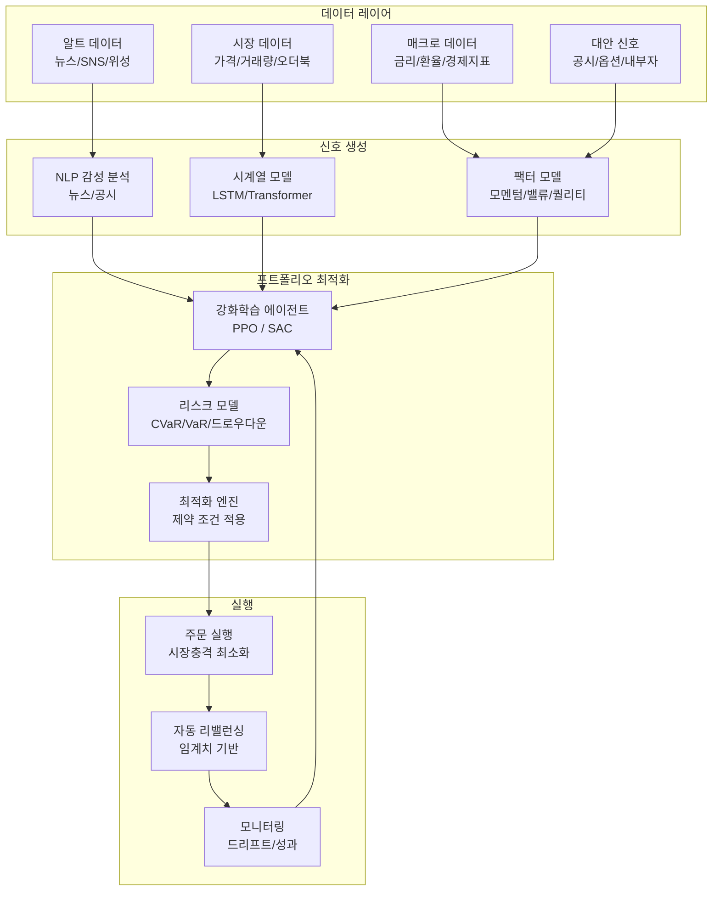
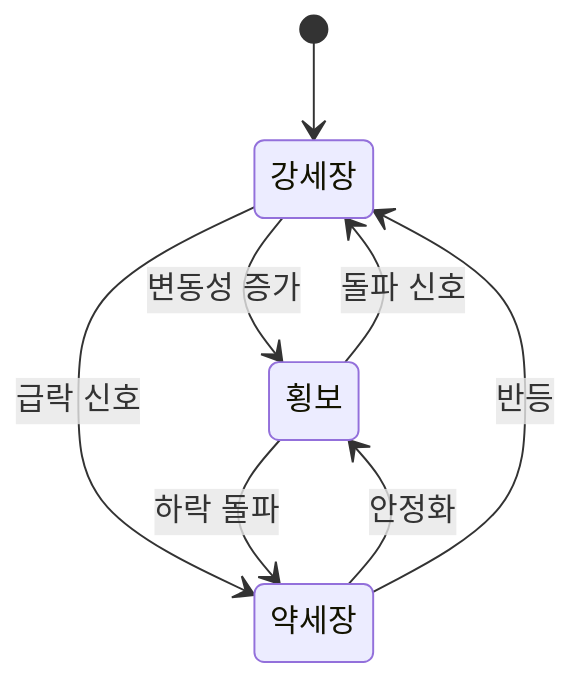
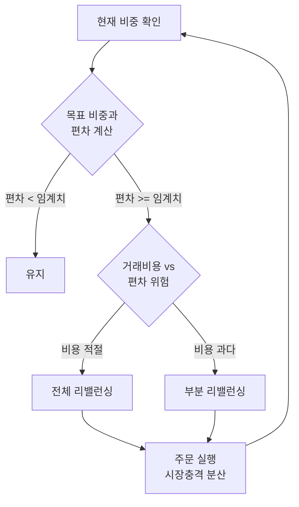

# AI 포트폴리오 관리 (AI Portfolio Management)

## 개요

AI 포트폴리오 관리는 강화학습(Reinforcement Learning), 시계열 예측, 자연어 처리(NLP) 등을 결합하여 자산 배분, 리스크 조정, 자동 리밸런싱을 수행하는 시스템이다. 전통적인 Markowitz 평균-분산 최적화(Mean-Variance Optimization)가 역사적 수익률과 공분산에 의존하는 정적 모델이었다면, AI 기반 접근은 시장 체제(regime) 변화와 비선형 자산 간 상관관계를 동적으로 반영한다.

퀀트 헤지펀드(Renaissance Technologies, Two Sigma 등)가 수십 년간 구축한 알고리즘 트레이딩 기술이 클라우드와 오픈소스 생태계를 통해 일반화되면서, 로보어드바이저부터 기관 투자자의 체계적 전략까지 광범위하게 활용된다.

## 시스템 아키텍처



## 주요 컴포넌트

### 1. 강화학습 트레이딩 (RL Trading)

포트폴리오 관리를 순차적 의사결정 문제로 모델링하면 강화학습이 자연스럽게 적용된다.

- **상태(State)**: 현재 포트폴리오 비중, 가격 변동률, 기술적 지표, 매크로 변수
- **행동(Action)**: 각 자산의 목표 비중 벡터 $a_t \in \mathbb{R}^n$, $\sum a_i = 1$
- **보상(Reward)**: 위험 조정 수익률 (예: 샤프 비율(Sharpe Ratio), CVaR 페널티 포함)

$R_t = r_t^{portfolio} - \lambda \cdot \text{CVaR}_\alpha(r_t) - c \cdot \|\Delta w_t\|_1$

여기서 $\lambda$는 리스크 회피 계수, $c$는 거래 비용, $\Delta w_t$는 포지션 변화다.

주요 RL 알고리즘:

| 알고리즘 | 특징 | 포트폴리오 적합성 |
|---------|------|----------------|
| PPO (Proximal Policy Optimization) | 안정적인 정책 업데이트 | 일반 자산 배분 |
| SAC (Soft Actor-Critic) | 탐색-활용 자동 조정, 연속 행동 공간 | 연속 비중 최적화에 유리 |
| DDPG (Deep Deterministic Policy Gradient) | 연속 행동 공간 전용 | 선물/옵션 포함 포트폴리오 |
| TD3 (Twin Delayed DDPG) | DDPG의 과추정 편향 보정 | 고변동성 시장 |

```python
import gymnasium as gym
import numpy as np

class PortfolioEnv(gym.Env):
    """포트폴리오 관리 강화학습 환경"""

    def __init__(self, returns: np.ndarray, window: int = 20):
        self.returns = returns  # shape: (T, N) - T 시점, N 자산
        self.window = window
        n_assets = returns.shape[1]
        # 관찰: 윈도우 내 수익률 + 현재 비중
        self.observation_space = gym.spaces.Box(
            low=-np.inf, high=np.inf,
            shape=(window * n_assets + n_assets,)
        )
        # 행동: 각 자산의 목표 비중 (소프트맥스로 정규화)
        self.action_space = gym.spaces.Box(
            low=0, high=1, shape=(n_assets,)
        )

    def step(self, action):
        weights = action / action.sum()  # 비중 정규화
        portfolio_return = (self.returns[self.t] * weights).sum()
        reward = portfolio_return - 0.001 * np.abs(weights - self.prev_weights).sum()
        self.prev_weights = weights
        self.t += 1
        done = self.t >= len(self.returns)
        return self._get_obs(), reward, done, False, {}
```

### 2. 리스크 모델링 (Risk Modeling)

단순 분산(variance)이 아닌 꼬리 위험(tail risk)을 포착하는 지표가 필요하다.

**VaR (Value at Risk)**: 신뢰수준 $\alpha$에서 최대 손실
$\text{VaR}_\alpha = \inf\{x : P(L > x) \leq 1 - \alpha\}$

**CVaR (Conditional Value at Risk, Expected Shortfall)**: VaR를 초과하는 손실의 기대값. VaR의 단점인 꼬리 무시 문제를 해결하는 일관된(coherent) 리스크 측도다.
$\text{CVaR}_\alpha = E[L \mid L > \text{VaR}_\alpha]$

**최대 낙폭(Maximum Drawdown)**:
$\text{MDD} = \max_{t \in [0,T]} \left[\max_{s \in [0,t]} W_s - W_t\right]$

**시장 체제 감지(Regime Detection)**:
Hidden Markov Model (HMM)으로 "강세장(bull)", "약세장(bear)", "횡보(sideways)" 체제를 자동 감지하고 체제별로 다른 포트폴리오 전략을 적용한다.



### 3. 알트 데이터 (Alternative Data)

전통 시장 데이터를 보완하는 비정형 정보 소스들이 알파(초과 수익) 원천으로 활용된다.

| 알트 데이터 유형 | 데이터 소스 | 활용 신호 |
|---------------|-----------|---------|
| 위성 이미지 | Planet Labs, Maxar | 주차장 혼잡도로 소매 매출 예측 |
| 신용카드 거래 | Second Measure, Yodlee | 기업 매출 선행 지표 |
| 소셜 미디어 | Twitter/X, Reddit | 감성 지표, 밈 주식 이상 신호 |
| 웹 스크래핑 | 채용 공고, 가격 변화 | 기업 성장/비용 시그널 |
| 특허/공시 | USPTO, EDGAR | 혁신 사이클, 이벤트 드리븐 |
| 날씨/기상 | 농업/에너지 섹터 | 원자재 공급 충격 예측 |

NLP를 활용한 뉴스 감성 분석:
```python
from transformers import pipeline

sentiment_model = pipeline(
    "text-classification",
    model="ProsusAI/finbert"  # 금융 도메인 특화 BERT
)

def compute_sentiment_score(headlines: list[str]) -> float:
    """뉴스 헤드라인의 집합 감성 점수 계산"""
    results = sentiment_model(headlines, truncation=True)
    score_map = {"positive": 1.0, "neutral": 0.0, "negative": -1.0}
    scores = [score_map[r["label"]] * r["score"] for r in results]
    return float(np.mean(scores))
```

### 4. 자동 리밸런싱 (Automatic Rebalancing)

목표 비중과 실제 비중의 편차가 임계값을 초과할 때 자동으로 재조정한다.



리밸런싱 임계값 설정 시 고려 요소:
- 거래 비용 (수수료, 스프레드, 시장 충격)
- 세금 효율성 (실현 손익 인식 시점 최적화)
- 유동성 (유동성이 낮은 자산은 점진적 실행 필요)

## 성능 평가 지표

| 지표 | 수식 | 해석 |
|------|------|------|
| 샤프 비율 (Sharpe Ratio) | $(R_p - R_f) / \sigma_p$ | 위험 단위당 초과 수익 |
| 소르티노 비율 (Sortino Ratio) | $(R_p - R_f) / \sigma_{down}$ | 하방 리스크만 고려 |
| 캘마 비율 (Calmar Ratio) | $R_p / \text{MDD}$ | 낙폭 대비 수익 |
| 알파 (Alpha) | $R_p - \beta \cdot R_m - R_f$ | 벤치마크 초과 성과 |
| 인포메이션 비율 (IR) | $(R_p - R_b) / \text{Tracking Error}$ | 벤치마크 대비 일관성 |

## 실제 사례

### Wealthfront / Betterment (로보어드바이저)
세금 손실 수확(Tax-Loss Harvesting), 자동 리밸런싱, 목표 기반 자산 배분을 제공하는 소비자 대상 AI 포트폴리오 서비스다. ETF(상장지수펀드) 기반 인덱스 전략을 낮은 비용으로 구현한다.

### Two Sigma / Man AHL (퀀트 헤지펀드)
대규모 알트 데이터와 머신러닝을 결합한 시스템적 전략을 운용한다. 인간 포트폴리오 매니저의 직관보다 통계적 신호의 일관된 실행을 중시한다.

### BlackRock Aladdin
기관 자산운용사가 사용하는 리스크 관리 플랫폼이다. 전 세계 약 21조 달러 규모 자산의 리스크를 모니터링하며, 스트레스 테스트와 시나리오 분석에 ML을 통합했다.

## 한계 및 윤리적 고려사항

### 과적합과 백테스팅 편향
풍부한 과거 데이터에서 훈련된 모델은 과거 패턴에 과적합하기 쉽다. "선견지명 편향(Look-ahead bias)"과 "생존 편향(Survivorship bias)"이 백테스팅 성과를 실제보다 낙관적으로 만든다.

### 시장 체제 전환
2020년 코로나 충격, 2022년 금리 급등처럼 역사적으로 전례 없는 체제 전환이 발생하면 훈련 데이터가 없어 모델이 무력화된다.

### 플래시 크래시 위험
다수의 AI 시스템이 유사한 신호를 학습하면 같은 방향으로 일제히 매도/매수해 시장 충격을 증폭시키는 "플래시 크래시(Flash Crash)" 위험이 있다.

### 모델 해석 불가능성
강화학습 에이전트의 의사결정 근거는 해석하기 어렵다. 금융 규제 당국은 점점 더 AI 투자 시스템의 설명 가능성을 요구하는 추세다.

## 관련 문서

- [[reinforcement-learning]] - PPO, SAC 등 RL 알고리즘 상세
- [[risk-modeling]] - VaR, CVaR, 리스크 측도 이론
- [[time-series-forecasting]] - LSTM, Transformer 기반 금융 시계열 예측
- [[ai-fraud-detection]] - 이상 거래 탐지와 포트폴리오 모니터링의 연계
- [[ai-finance]] - AI 금융 응용 전반 개요
