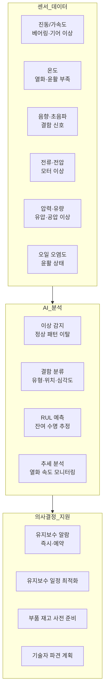
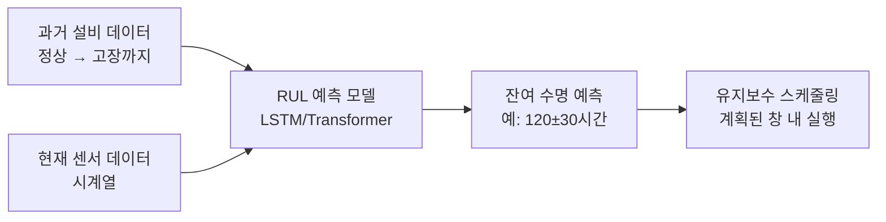
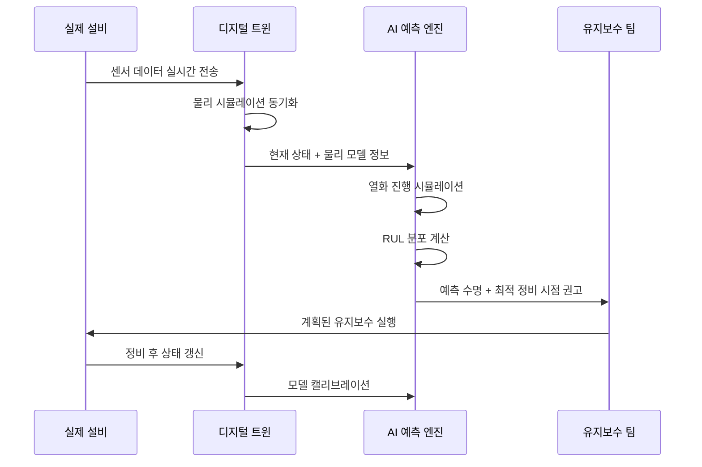
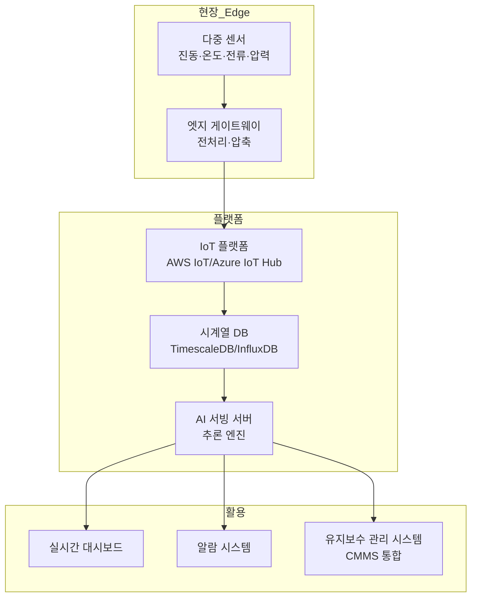

# AI 예측 유지보수

## 개요

AI 예측 유지보수(AI Predictive Maintenance, PdM)는 기계·설비의 센서 데이터를 머신러닝으로 분석하여 고장이 발생하기 전에 징후를 감지하고 최적 유지보수 시점을 예측하는 응용 분야다. 계획하지 않은 정지(unplanned downtime)와 불필요한 예방 유지보수 비용을 동시에 줄이는 것이 목표다.

전통적인 유지보수 전략은 두 가지다. **사후 유지보수(reactive maintenance)**는 고장이 발생한 후 수리하는 방식으로 긴급 수리 비용과 생산 중단이 크다. **예방 유지보수(preventive maintenance)**는 일정 주기로 부품을 교체하는데, 아직 충분히 사용할 수 있는 부품을 조기 교체하는 낭비가 발생한다. AI 기반 예측 유지보수는 **실제 설비 상태를 기반으로** 필요한 시점에 유지보수를 수행한다.

## 핵심 아이디어

예측 유지보수는 두 핵심 문제로 나뉜다:

1. **고장 감지(Fault Detection)**: 설비가 비정상 상태인지 탐지
2. **RUL 예측(Remaining Useful Life)**: 설비가 얼마나 더 운행할 수 있는지 추정

이 두 문제의 답이 함께 있어야 의미 있는 유지보수 일정을 계획할 수 있다. 고장이 임박한 것을 알아도 "언제" 고장날지 모르면 유지보수 창을 잡기 어렵다.



## 주요 응용 영역

### 진동·음향 분석

회전 기계(전동기, 펌프, 기어박스, 터빈)의 이상은 진동 패턴에 가장 먼저 나타난다. 주파수 분석(FFT, 고속 푸리에 변환)으로 특정 주파수의 에너지 증가를 감지한다.

**베어링 결함 주파수:**
베어링의 각 부위(외륜, 내륜, 볼, 리테이너)가 손상되면 회전 속도와 기하학적 파라미터에 의해 결정되는 특징 주파수(BPFO, BPFI, BSF, FTF)에서 진동 에너지가 증가한다.

```
BPFO (외륜 결함 주파수) = (n/2) × RPM/60 × (1 - d/D × cos(α))
```

- $n$: 볼 개수, $d$: 볼 직경, $D$: 피치 직경, $\alpha$: 접촉각

딥러닝 기반 방법은 이런 물리적 공식 없이도 시계열 진동 데이터에서 결함 패턴을 직접 학습한다.

**진동 특징 추출:**
- 시간 영역: RMS(제곱평균제곱근), 첨도(kurtosis), 크레스트 팩터
- 주파수 영역: FFT 스펙트럼, 피크 주파수 에너지
- 시간-주파수: 단시간 푸리에 변환(STFT), 웨이블릿 변환

**1D CNN과 LSTM의 결합:**
시계열 진동 데이터를 1D CNN으로 로컬 패턴을 추출하고, LSTM으로 시간적 의존성을 학습하는 하이브리드 모델이 주류다.

### 온도 기반 모니터링

온도 이상은 여러 결함 유형의 공통 증상이다. 마찰 증가, 윤활 부족, 과부하, 냉각 시스템 고장이 모두 온도 상승으로 나타난다.

**열화상(Infrared Thermography):**
- 전기 패널, 변압기, 전선 연결 부위의 과열 탐지
- 산업용 카메라로 주기적 스캔 또는 설비에 고정 장착
- 컴퓨터 비전으로 열화상 이미지의 이상 영역 자동 탐지

**온도 추세 분석:**
단순 임계값 초과 알람보다 온도 추세(상승 기울기, 패턴 변화)를 모니터링하는 것이 더 유효하다. 점진적인 열화는 임계값 초과 전에 추세로 먼저 나타난다.

### RUL(잔여 수명) 예측

잔여 수명(Remaining Useful Life) 예측은 현재 설비 상태에서 몇 시간(또는 사이클) 후에 고장이 발생할지 예측한다. 이 정보가 있어야 비계획 정지를 유발하지 않는 최적 유지보수 창을 선택할 수 있다.

**물리 기반 모델:**
설비 열화 메커니즘(균열 성장, 마모, 부식)을 수학 방정식으로 모델링한다. Paris' Law (균열 성장), Coffin-Manson (피로 수명) 같은 공식이 있다. 정확하지만 복잡한 물리적 메커니즘을 모두 모델링하는 것은 어렵다.

**데이터 기반 모델:**
- **회귀(Regression)**: 현재 상태 지표에서 RUL 값을 직접 예측
- **생존 분석(Survival Analysis)**: 시간에 따른 고장 확률 분포 모델링
- **LSTM**: 시계열 상태 이력에서 열화 추세를 학습하여 RUL 예측



**C-MAPSS 벤치마크 데이터셋:**
NASA의 CMAPSS(Commercial Modular Aero-Propulsion System Simulation) 데이터셋은 항공기 터빈 엔진의 RUL 예측 표준 벤치마크다. 21개 센서에서 수집된 시계열 데이터로 다양한 알고리즘이 비교된다.

**불확실성 정량화:**
RUL 예측의 불확실성을 정량화하는 것이 안전 결정에 중요하다. 점 추정(예: 120시간) 대신 분포(예: 100~140시간, 95% 신뢰구간)를 제공하면 유지보수 의사결정자가 리스크를 적절히 관리할 수 있다. 베이즈 심층신경망(Bayesian Deep Learning), MC Dropout이 활용된다.

### 디지털 트윈 기반 예측 유지보수

디지털 트윈([[digital-twin]])은 물리적 설비의 실시간 디지털 복제본이다. 예측 유지보수와 디지털 트윈이 결합되면 단순한 데이터 분석을 넘어 시뮬레이션 기반 수명 예측이 가능해진다.



디지털 트윈 + AI의 장점은 센서가 직접 측정하기 어려운 내부 상태(응력, 온도 분포)를 물리 시뮬레이션으로 추정하고, AI가 이를 보완하여 더 정확한 RUL을 예측한다는 점이다.

### IoT 센서 융합

현대 예측 유지보수 시스템은 여러 종류의 센서 데이터를 통합하여 더 정확한 진단을 수행한다.

**센서 융합의 이점:**
- 단일 센서의 고장이나 노이즈를 보완
- 결함 유형에 따라 민감한 센서가 다름 (베어링 결함 → 진동, 윤활 부족 → 온도+오일 오염도)
- 다차원 특징 공간에서 정상/비정상 분리가 더 명확

**데이터 수집 아키텍처:**



**엣지 AI의 역할:**
대역폭과 지연 시간이 제한된 환경에서 모든 원시 데이터를 클라우드로 전송할 수 없다. 엣지 게이트웨이에서 1차 전처리(특징 추출, 이상 사전 필터링)를 수행하고, 중요한 이벤트 데이터만 클라우드로 전송한다.

## 주요 기술 컴포넌트

### 시계열 딥러닝 모델

**LSTM(Long Short-Term Memory):**
게이트 메커니즘으로 장기 의존성을 학습한다. 진동·전류 등 순차적 센서 데이터에서 시간에 따른 열화 패턴을 추출하는 데 효과적이다.

**Temporal Convolutional Network(TCN):**
시계열에 1D 인과적(causal) 컨볼루션을 적용한다. LSTM보다 병렬화가 쉽고 학습이 빠르다. 수용 필드(receptive field) 크기를 팽창(dilated) 컨볼루션으로 효율적으로 늘린다.

**Transformer 기반 시계열:**
Informer, Autoformer, PatchTST 같은 Transformer 변형이 장기 시계열 예측에 강점을 보인다. 멀티헤드 어텐션(multi-head attention)이 센서 채널 간 상호작용을 자동으로 학습한다.

### 물리 정보 학습(Physics-Informed Machine Learning)

순수 데이터 기반 모델은 물리 법칙을 위반하는 예측을 할 수 있다. 물리 방정식을 손실 함수에 제약으로 통합하면 물리적으로 타당한 예측을 보장할 수 있다.

**PINN(Physics-Informed Neural Networks):**
신경망의 출력이 지배 방정식(균열 성장 방정식, 피로 방정식)을 만족하도록 손실 함수에 물리적 잔차(residual)를 추가한다. 데이터가 적을 때도 물리 지식이 정규화 역할을 한다.

### 모델 설명 가능성

유지보수 기술자가 AI의 진단 결과를 신뢰하려면 근거가 명확해야 한다.

**SHAP(SHapley Additive exPlanations):**
각 센서 피처가 예측 결과에 얼마나 기여했는지 정량화한다. "이번 알람은 주로 베어링 하우징 진동(46%)과 온도(31%)의 이상 증가 때문입니다" 같은 설명을 제공할 수 있다.

**시간적 어텐션 시각화:**
LSTM + Attention 모델에서 어느 시점의 데이터가 현재 예측에 가장 큰 영향을 미쳤는지 시각화하여, 기술자가 이상 발생 시점을 직관적으로 이해하게 돕는다.

## 실제 사례

### GE - Predix 플랫폼

General Electric의 Predix 플랫폼은 항공기 엔진, 가스 터빈, 풍력 발전기 등 산업 자산의 예측 유지보수를 위한 클라우드 플랫폼이다. 수십만 개의 센서 데이터를 실시간으로 분석하여 유지보수 일정을 최적화한다. GE는 Predix 기반 예측 유지보수로 항공사 고객의 계획외 엔진 정지를 크게 줄였다고 발표했다.

### SKF - 베어링 진단

스웨덴 베어링 제조사 SKF는 자사 베어링에 IoT 센서를 내장하고 AI 기반 상태 모니터링 서비스를 제공한다. 진동, 온도, 속도 데이터를 SKF 클라우드에서 분석하여 베어링 교체 시점을 사전 통보한다. 제품 판매에서 서비스 모델로의 전환(Product-as-a-Service) 사례이기도 하다.

### Bosch - 생산 설비 모니터링

Bosch는 자사 제조 공장에 AI 예측 유지보수를 배치했다. 모터, 로봇, CNC 기계의 센서 데이터를 분석하여 계획외 정지를 20-30% 줄이는 성과를 달성했다고 보고했다. 이 솔루션을 외부 고객에게도 Bosch Connected Industry 브랜드로 공급한다.

### Rolls-Royce - 항공기 엔진 건강 모니터링

Rolls-Royce의 TotalCare 프로그램은 고객 항공사의 엔진을 지속적으로 모니터링하고 예측 유지보수 서비스를 제공한다. 엔진당 수백 개의 센서 데이터가 실시간으로 Rolls-Royce 데이터 센터로 전송되며 AI로 분석된다. 엔진 결함을 사전에 감지하여 항공 안전을 향상시키면서 항공사의 정비 비용을 최적화한다.

### 풍력 발전소 예측 유지보수

풍력 터빈은 높은 곳에 설치되어 접근이 어렵고 교체 부품이 비싸다. SCADA(감시 제어 및 데이터 취득) 시스템의 데이터를 AI로 분석하여 기어박스, 발전기, 블레이드의 이상을 조기 감지한다. Siemens Gamesa, Vestas 등 주요 터빈 제조사들이 예측 유지보수를 핵심 서비스로 제공한다.

## 한계와 트레이드오프

### 결함 레이블 데이터 부족

실제 고장 데이터는 드물다. 잘 관리된 설비는 거의 고장하지 않으므로, 학습 데이터에는 정상 데이터는 풍부하지만 고장 직전 데이터와 고장 데이터는 매우 적다. 이 불균형은 RUL 예측 모델의 고장 케이스 학습을 어렵게 한다.

**완화 방안:**
- 시뮬레이션과 가속 수명 시험(ALT)으로 고장 데이터 생성
- 유사 설비나 이전 설비의 고장 데이터 전이 학습
- 준지도 학습(semi-supervised learning)으로 미레이블 데이터 활용

### 다양한 운영 조건의 복잡성

같은 설비도 부하, 속도, 온도, 환경 조건이 다르면 "정상" 신호가 달라진다. 특정 운영 조건에서 학습한 모델이 다른 조건에서 오경보(false alarm)를 내거나 결함을 놓칠 수 있다. 운영 조건을 입력으로 포함하거나 조건별 모델을 분리 운용해야 한다.

### 유지보수 가능성 창(Maintenance Window)

RUL 예측이 정확해도 실제 유지보수를 실행할 수 있는 창이 제한적이다. 생산 일정, 인력 가용성, 부품 재고가 동시에 충족되어야 유지보수가 가능하다. AI 예측을 실행 계획으로 연결하는 운영 최적화가 필요하다.

### 센서 신뢰성과 노이즈

센서 자체의 고장이나 배선 불량이 AI에 잘못된 신호를 제공하면 오진단(misdiagnosis)이 발생한다. 센서 고장을 AI가 설비 결함으로 잘못 해석하는 경우가 실무에서 빈번하다. 센서 데이터 품질 모니터링이 선행되어야 한다.

### 모델 이식성

특정 설비에서 학습한 모델을 유사하지만 다른 설비에 바로 적용하기 어렵다. 설비마다 구조, 크기, 제조사가 다르면 재학습이 필요하다. 도메인 적응(domain adaptation)과 전이 학습이 이 문제를 부분적으로 해결한다.

### ROI 측정의 어려움

예측 유지보수의 효과 측정이 어렵다. "AI 덕분에 고장을 예방했다"를 증명하려면 AI 없이 고장이 났을 것이라는 반사실적(counterfactual) 가정이 필요하다. A/B 테스트 설계가 현실적으로 어렵다.

## 실무 적용 관점

예측 유지보수 시스템 구축 시 핵심 교훈:

1. **설비 이해가 먼저**: AI 모델보다 모니터링 대상 설비의 고장 모드(FMEA, 고장 모드 및 영향 분석)를 먼저 파악한다. "어떤 고장이 발생하면 어떤 센서에 어떻게 나타나는가"를 도메인 전문가와 정의한다.

2. **단계적 접근**: 연결(Connect) → 수집(Collect) → 가시화(Visualize) → 감지(Detect) → 예측(Predict) 순서로 단계를 밟는다. 데이터 수집 인프라 없이 예측 모델부터 시작하면 실패한다.

3. **알람 품질 관리**: 오경보(false alarm)가 많으면 운영자가 알람을 무시하기 시작한다(alarm fatigue). 알람 정밀도(precision)를 높게 유지하는 것이 재현율(recall) 극대화보다 중요할 수 있다.

4. **기존 CMMS 통합**: 예측 유지보수 AI의 권고사항이 CMMS(컴퓨터화 유지보수 관리 시스템)에 자동으로 작업 지시로 생성되어야 실제 실행으로 이어진다.

5. **지속적 모델 재학습**: 설비 노후화, 운영 조건 변화, 부품 교체로 데이터 분포가 변한다. 신규 데이터로 정기적인 모델 재학습과 성능 재검증을 사이클로 구축한다.

6. **운전원 교육과 신뢰 구축**: AI 시스템이 아무리 정확해도 현장 기술자가 신뢰하지 않으면 권고사항이 무시된다. 초기에는 AI 판정을 설명하고 기술자의 검토를 거치는 과정을 통해 신뢰를 쌓는다.

## 관련 문서

- [[ai-anomaly-detection]] - 이상 탐지 알고리즘 상세 기술
- [[time-series-forecasting]] - 센서 시계열 데이터 예측 모델
- [[digital-twin]] - 설비 디지털 트윈을 통한 시뮬레이션 기반 수명 예측
- [[ai-quality-inspection]] - 품질 검사와 설비 상태의 연계 분석
- [[ai-energy-grid]] - 에너지 설비의 예측 유지보수 적용
