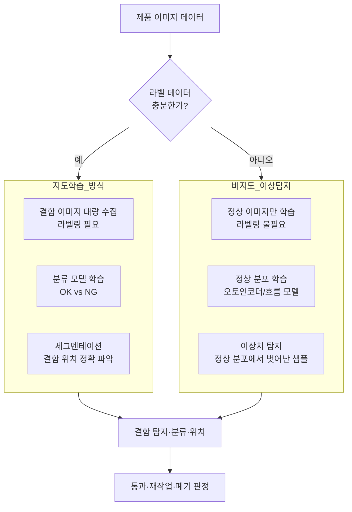
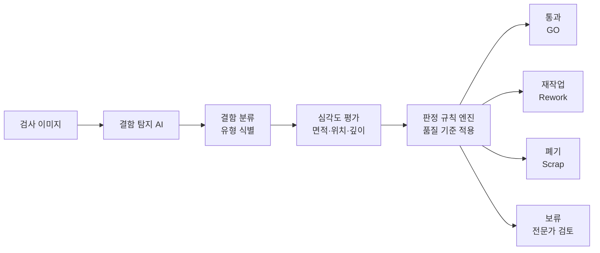
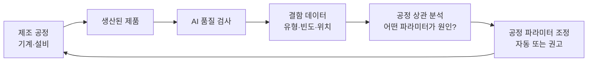

# AI 품질 검사 (제조)

## 개요

AI 품질 검사(AI Quality Inspection)는 제조 공정에서 컴퓨터 비전과 머신러닝을 활용하여 제품 결함을 자동으로 탐지하고 분류하는 응용 분야다. 기존의 인간 육안 검사나 단순 규칙 기반 머신 비전(machine vision)을 AI가 대체하거나 보완하여 검사 정확도, 속도, 일관성을 획기적으로 향상시킨다.

제조업에서 불량품 탈루(escape)는 리콜 비용, 브랜드 손상, 안전사고로 이어질 수 있다. 반대로 과도한 불량 판정(false positive)은 양품을 폐기하여 원가를 높인다. AI 품질 검사는 이 두 오류를 동시에 최소화하는 것을 목표로 한다.

## 핵심 아이디어

AI 품질 검사의 핵심은 **"정상"과 "비정상"의 경계를 데이터에서 학습**하는 것이다. 인간 검사원이 오랜 경험으로 직관적으로 알아보는 결함 패턴을 AI 모델이 수백만 장의 이미지에서 추출한다.

접근 방식은 라벨 가용성에 따라 크게 두 가지로 나뉜다:



이 결정 트리는 라벨 데이터 가용성에 따라 지도학습과 비지도 이상 탐지 중 적절한 방법을 선택하는 프로세스를 보여준다.

## 주요 응용 영역

### 시각 결함 탐지

시각 결함 탐지(visual defect detection)는 AI 품질 검사의 가장 기본적인 형태다. 제품 표면의 스크래치, 균열, 오염, 변형, 누락 부품 등을 이미지에서 자동으로 탐지한다.

**검사 대상 유형과 대표 결함:**

| 산업 | 제품 | 주요 결함 유형 |
|------|------|--------------|
| 반도체 | 웨이퍼·PCB | 단선, 단락, 이물질, 리드 결함 |
| 자동차 | 차체 패널 | 도장 결함, 덴트, 용접 불량 |
| 식품 | 포장 식품 | 이물질, 부패, 포장 불량 |
| 직물 | 원단·의류 | 실밥, 오염, 색상 불균일 |
| 유리 | 디스플레이 패널 | 기포, 크랙, 얼룩 |
| 금속 | 주조·단조 부품 | 기공, 균열, 치수 미달 |

**딥러닝 결함 탐지 접근:**

1. **이미지 분류(classification)**: 이미지 전체에 대해 OK/NG를 판정. 가장 단순하지만 결함 위치 정보가 없다.

2. **객체 탐지(object detection)**: YOLO, Faster R-CNN 등으로 결함의 위치(바운딩 박스)와 유형을 동시에 탐지. 여러 결함이 한 이미지에 있을 때 유용하다.

3. **의미론적 세그멘테이션(semantic segmentation)**: 픽셀 단위로 결함 영역을 정확히 분류. 결함 면적 계산과 심각도 등급화에 활용.

4. **인스턴스 세그멘테이션(instance segmentation)**: Mask R-CNN 등으로 개별 결함 인스턴스를 분리하여 각각 분석.

### 이상 탐지(Anomaly Detection)

많은 제조 환경에서 결함 이미지가 충분하지 않다. 불량률이 낮으면 정상 이미지는 수만 장이지만 결함 이미지는 수십 장에 불과하다. 이 극심한 클래스 불균형(class imbalance) 문제를 해결하는 것이 이상 탐지 방식이다.

**오토인코더(Autoencoder) 기반:**
정상 이미지만으로 오토인코더를 학습한다. 정상 이미지는 낮은 재구성 오차, 비정상 이미지는 높은 재구성 오차를 보이는 원리를 활용하여 이상을 탐지한다.

```python
# 오토인코더 기반 이상 탐지 예시
import torch
import torch.nn as nn

class AnomalyDetector(nn.Module):
    def __init__(self, latent_dim: int = 128):
        super().__init__()
        # 인코더: 이미지 → 잠재 표현
        self.encoder = nn.Sequential(
            nn.Conv2d(3, 32, 3, padding=1), nn.ReLU(),
            nn.Conv2d(32, 64, 3, padding=1), nn.ReLU(),
            nn.AdaptiveAvgPool2d(8),
            nn.Flatten(),
            nn.Linear(64 * 8 * 8, latent_dim)
        )
        # 디코더: 잠재 표현 → 재구성 이미지
        self.decoder = nn.Sequential(
            nn.Linear(latent_dim, 64 * 8 * 8),
            nn.Unflatten(1, (64, 8, 8)),
            nn.Upsample(scale_factor=4),
            nn.Conv2d(64, 32, 3, padding=1), nn.ReLU(),
            nn.Conv2d(32, 3, 3, padding=1), nn.Sigmoid()
        )

    def forward(self, x: torch.Tensor) -> tuple[torch.Tensor, torch.Tensor]:
        z = self.encoder(x)
        x_recon = self.decoder(z)
        # 재구성 오차가 이상 점수
        anomaly_score = ((x - x_recon) ** 2).mean(dim=(1, 2, 3))
        return x_recon, anomaly_score
```

**PatchCore:**
ImageNet에 사전 학습된 모델의 중간 특징 맵(feature map)을 정상 이미지에서 추출하여 메모리 뱅크에 저장한다. 테스트 이미지의 특징이 메모리 뱅크의 정상 패턴에서 얼마나 떨어졌는지로 이상을 판정한다. 추가 학습 없이도 높은 성능을 보여 산업 현장에서 널리 사용된다.

**정규화 흐름(Normalizing Flows) - FastFlow:**
정상 이미지의 특징 분포를 정규화 흐름 모델로 학습하여, 밀도가 낮은(low-likelihood) 영역을 이상으로 판정한다. 픽셀 수준의 이상 위치 맵(anomaly map)을 생성할 수 있다.

**MVTec Anomaly Detection 데이터셋:**
이상 탐지 방법의 표준 벤치마크. 15가지 산업 제품(텍스처, 물체 포함)에 대한 정상과 다양한 결함 이미지를 포함한다.

### 자동 분류와 합격/불합격 판정

탐지에서 그치지 않고 결함을 유형별로 분류하고 심각도를 등급화하여 처리 방법(통과, 재작업, 폐기)을 자동으로 결정한다.



**계층적 결함 분류:**
표면 결함을 유형별(스크래치, 덴트, 오염, 균열 등)로 먼저 분류한 다음, 각 유형별 심각도(깊이, 면적, 위치)를 평가하여 최종 판정한다. 위치도 중요하다. 기능적으로 중요한 부위의 결함은 동일한 크기라도 더 심각하게 판정해야 한다.

### 산업 4.0(Industry 4.0) 통합

AI 품질 검사가 단독 시스템이 아닌 스마트 공장의 일부로 통합될 때 가치가 극대화된다.

**데이터 폐루프(Closed-Loop Quality Control):**
검사 결과가 생산 공정 파라미터 조정에 실시간으로 피드백된다. 불량률이 증가 추세를 보이면 AI가 자동으로 공정 파라미터(온도, 압력, 속도)를 조정하여 불량 발생을 예방한다.



**OPC-UA / MQTT 통합:**
AI 검사 시스템이 공장 자동화 표준 프로토콜(OPC-UA, MQTT)을 통해 PLC(프로그래머블 로직 컨트롤러), MES(제조실행시스템), ERP와 실시간으로 데이터를 교환한다.

**엣지 AI 배포:**
검사 속도가 중요한 고속 라인에서는 결과를 클라우드로 보내는 지연 없이 카메라 내장 또는 라인 사이드 엣지 컴퓨터에서 직접 AI 추론을 수행한다. NVIDIA Jetson, Hailo 등 엣지 AI 칩이 사용된다.

## 주요 기술 컴포넌트

### 이미징 시스템과 AI

AI 모델 성능은 입력 이미지 품질에 크게 의존한다. 최적의 이미징 조건 설계가 AI 정확도만큼 중요하다.

**조명 기법:**
- **동축 조명(coaxial)**: 표면 반사율 차이를 강조, 스크래치·먼지 탐지에 적합
- **암시야(dark field)**: 표면 돌기나 균열에서 산란광 증가, 미세 결함 강조
- **분기 형광(structured light)**: 깊이 정보 획득, 3D 결함 분석
- **스트로보(strobe)**: 고속 이동 중 선명한 이미지 획득

**카메라 종류:**
- **선형 스캔(line scan) 카메라**: 고속 이동 제품을 연속으로 스캔, 웹/필름 검사에 적합
- **3D 카메라**: 점군(point cloud) 데이터로 치수 측정과 형상 결함 탐지
- **하이퍼스펙트럴(hyperspectral)**: 가시광선 외 적외선/근적외선 파장 분석, 소재 이물질 탐지

### 적은 학습 데이터 처리 (Few-Shot Learning)

산업 현장에서는 새 제품 출시 시 결함 이미지가 거의 없는 상태에서 검사 시스템을 빠르게 구축해야 한다.

**데이터 증강(Data Augmentation):**
회전, 뒤집기, 밝기 조정, 컷아웃 같은 변환으로 제한된 결함 이미지에서 학습 데이터를 늘린다.

**생성 모델 활용:**
GAN(생성적 적대 신경망)이나 Diffusion Model로 실제와 유사한 결함 이미지를 합성하여 학습 데이터를 보강한다.

**전이 학습(Transfer Learning):**
ImageNet 사전 학습 모델(ResNet, EfficientNet, ViT)의 특징 추출 능력을 활용하여 적은 도메인 특화 데이터로도 높은 성능을 달성한다.

**메타러닝(Meta-Learning):**
Few-shot 설정에서 새 결함 유형을 몇 장의 예시만으로 빠르게 학습하는 능력을 목표로 한다.

### 설명 가능한 AI(XAI) 적용

품질 검사 시스템의 판정 근거를 인간이 이해할 수 있어야 한다. 엔지니어가 AI의 결함 탐지 근거를 검토하고 신뢰성을 검증할 수 있어야 한다.

**Grad-CAM(Gradient-weighted Class Activation Mapping):**
분류 모델이 어느 영역에 주목하여 판정을 내렸는지 시각화한다. 모델이 실제 결함 위치를 보고 판정했는지, 아니면 배경의 노이즈를 보고 판정했는지 확인할 수 있다.

**이상 위치 맵(Anomaly Map):**
이상 탐지 모델이 이미지의 어느 픽셀이 정상에서 얼마나 벗어났는지를 히트맵으로 표시한다. 검사원이 어디를 집중적으로 재확인해야 하는지 안내한다.

## 실제 사례

### BMW - 자동차 차체 도장 검사

BMW는 AI 기반 도장 검사 시스템을 도입하여 차체 패널의 핀홀, 먼지 입자, 흐름 결함을 자동으로 탐지한다. 기존 인간 검사 대비 처리 속도가 빠르고 밤낮 없이 일관된 기준으로 검사한다. 독일 딩골핑(Dingolfing) 공장에서 여러 라인에 적용됐다.

### Intel - 반도체 웨이퍼 검사

반도체 웨이퍼 검사는 AI 품질 검사의 가장 정밀한 적용 사례다. Intel은 웨이퍼 결함 분류에 딥러닝을 활용하여 수십 종의 결함 패턴을 자동으로 분류하고 공정 개선에 피드백한다. 마이크론(Micron), TSMC 같은 반도체 기업들도 AI 기반 결함 분류를 핵심 경쟁력으로 개발했다.

### Foxconn - 전자 부품 검사

Foxconn(홍하이)은 스마트폰, 컴퓨터 등 전자 제품 조립 라인에 AI 비전 검사를 대규모로 배치했다. 납땜 결함, 부품 오배치, PCB 불량을 실시간으로 탐지한다. Foxconn은 AI 품질 검사를 등대공장(Lighthouse Factory) 인증의 핵심 요소로 활용한다.

### Henkel - 접착제 도포 검사

접착제 제조사 Henkel은 자동차 조립 라인에서 접착제 도포 품질을 AI로 검사한다. 도포 경로 이탈, 끊김, 기포를 카메라로 실시간 감지하고 불량 발생 즉시 라인을 정지한다.

### Instrumental - 스타트업 AI 검사 솔루션

Instrumental은 제조업체가 AI 품질 검사를 빠르게 도입할 수 있는 SaaS(서비스형 소프트웨어) 플랫폼을 제공한다. 스마트폰, 의료기기, 소비 가전 제조업체에서 사용된다.

## 한계와 트레이드오프

### 기준의 모호성

"불량"의 기준은 절대적이지 않다. 고객 요구, 제품 용도, 가격대에 따라 동일한 표면 결함이 불량일 수도, 양품일 수도 있다. 이 모호한 경계를 AI에 정확히 가르치기 어렵다. 특히 등급 경계(borderline) 샘플은 인간 검사원도 판단을 달리하는 경우가 많다.

### 클래스 불균형과 희귀 결함

생산 라인의 불량률이 0.1% 미만인 경우, 불량 이미지는 양품 이미지의 1000분의 1도 안 된다. 이 극심한 불균형에서 AI 모델은 모든 것을 양품으로 판정하면 높은 정확도를 달성할 수 있어, 올바른 평가 지표(재현율, F1)와 학습 전략(오버샘플링, 가중치 조정)이 필수다.

### 모델 드리프트(Model Drift)

생산 환경은 시간이 지남에 따라 변한다. 소재 공급업체 변경, 기계 노후화, 계절적 환경 변화가 이미지 통계를 서서히 바꾼다. AI 모델 성능이 배포 이후 천천히 저하되는 드리프트 문제를 지속적으로 모니터링하고 재학습해야 한다.

### 이미지 조건 변화

조명 변화, 카메라 더러움, 렌즈 초점 이탈, 생산 속도 변화가 이미지 품질에 영향을 미친다. 실제 조건 변화에 강인한(robust) 모델 개발과 이미징 시스템의 정기적 교정이 필요하다.

### 설명 가능성과 규제

의료기기, 항공우주, 원자력 등 안전 중요 산업에서는 AI 판정 근거를 규제 기관에 설명해야 한다. "딥러닝 모델이 불량이라고 했다"는 답변은 충분하지 않다. 설명 가능한 AI(XAI)가 이 요구를 부분적으로 충족하지만, 완전한 설명은 여전히 어렵다.

### 비용 대비 효과

고정밀 AI 품질 검사 시스템(카메라, 조명, 컴퓨팅, 소프트웨어, 통합)의 초기 비용이 상당하다. 낮은 처리량이나 충분한 인력이 있는 공정에서는 ROI가 나오지 않을 수 있다.

## 실무 적용 관점

AI 품질 검사 도입 시 권장 접근법:

1. **이미징 시스템 먼저**: AI 모델보다 이미징 조건(조명, 카메라, 광학계)이 성능에 더 큰 영향을 미치는 경우가 많다. 충분한 데이터 수집 전에 이미징 설계를 최적화한다.

2. **기준 명확화**: 양품/불량 기준을 명확한 문서로 정의하고, 경계 케이스(greyzone)에 대한 합의된 판정 기준을 수립한다. AI 학습보다 이 프로세스가 더 어렵고 중요하다.

3. **레이블링 품질**: 불일치한 레이블은 AI 성능을 심각하게 훼손한다. 레이블링 가이드라인을 수립하고 검사원 간 일관성(inter-rater reliability)을 측정한다.

4. **탈루 비용 vs 과검사 비용**: 불량 탈루(false negative)와 양품 불합격(false positive)의 비용이 다르다. 이를 손실 함수에 명시적으로 반영하고, 비용에 맞는 판정 임계값을 설정한다.

5. **인간 검사원 병행 운용**: AI 도입 초기에는 AI와 인간 검사원이 병렬로 운영하며 AI 판정 결과를 인간이 검토한다. AI 신뢰도가 충분히 높아진 후 점진적으로 자동화 수준을 높인다.

## 관련 문서

- [[ai-anomaly-detection]] - 이상 탐지 알고리즘 상세 기술
- [[image-classification]] - 이미지 분류 모델 기초
- [[ai-predictive-maintenance]] - 품질 이슈와 설비 상태의 연관 분석
- [[ai-warehouse-robotics]] - 창고에서의 시각 기반 자동화
