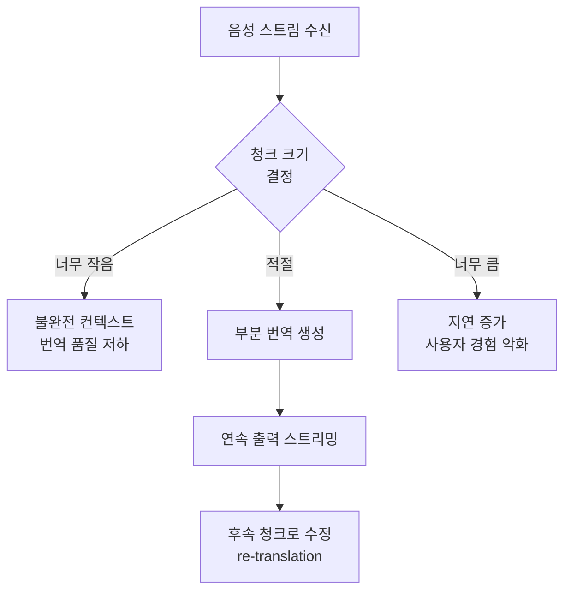
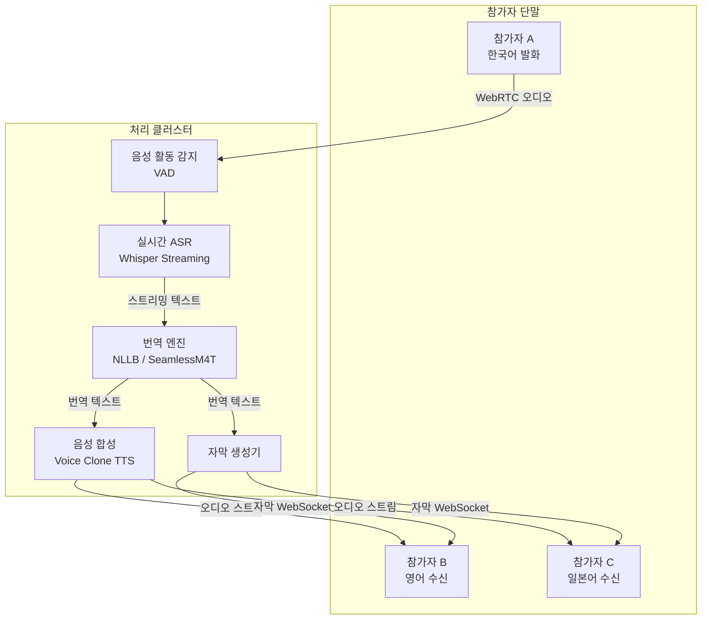
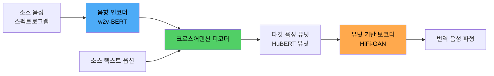
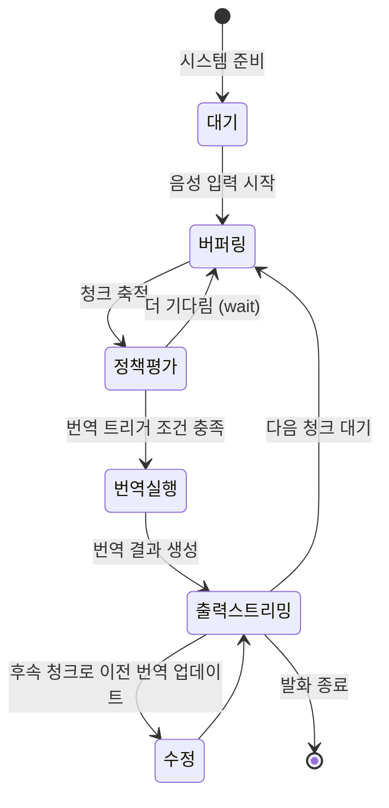
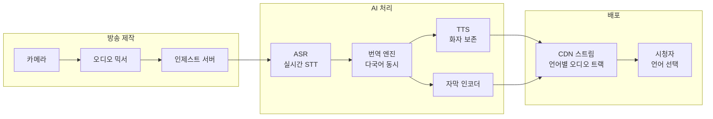

# AI 실시간 번역

## 개요

AI 실시간 번역은 발화(speech) 또는 텍스트 입력을 수백 밀리초 지연으로 다른 언어로 변환해 사람들이 언어 장벽 없이 소통할 수 있게 한다. 전통적 기계 번역(Machine Translation, MT)이 문서 단위 처리에 최적화됐다면, 실시간 번역은 스트리밍 입력, 낮은 지연시간, 불완전한 문장 처리라는 추가 제약을 다룬다.

핵심 응용 영역:
- **회의/컨퍼런스**: 다국어 참가자가 동시에 자국어로 발언하고 청취
- **방송/라이브 스트리밍**: 자막 및 더빙 실시간 생성
- **고객 지원**: 상담원과 고객이 서로 다른 언어를 사용하는 콜 센터
- **여행/현장**: 모바일 기기에서 즉석 대화 번역

## 핵심 아이디어

### 전통적 파이프라인 vs 엔드-투-엔드

**캐스케이드(Cascade) 방식:**

각 단계의 오류가 누적되고, ASR + NMT + TTS를 순차 처리해 총 지연이 2-4초에 달한다.

**엔드-투-엔드(S2ST) 방식:**

중간 텍스트 표현 없이 음성 스펙트로그램에서 직접 번역 음성을 생성한다. 오류 누적이 없고 화자 목소리 특성을 보존하기 쉽다.

### 스트리밍과 지연시간

실시간 시스템의 핵심 제약은 **완전한 문장이 끝나기 전에 번역을 시작해야 한다**는 점이다. 이를 **동시 통역(Simultaneous Interpretation, SI)** 이라 부른다.

**정책(Policy) 기반 동시 번역:**
- **Wait-k Policy**: k개 소스 토큰을 먼저 받고 번역 시작. k가 작을수록 빠르지만 품질 저하
- **Adaptive Policy**: 모델이 스스로 "지금 번역해야 하는가, 더 기다려야 하는가"를 학습
- **CIF(Continuous Integrate-and-Fire)**: 음향 신호의 에너지가 임계값에 달하면 번역 트리거

## 시스템 아키텍처

### 회의 플랫폼 실시간 번역 아키텍처

### 음성-음성 직접 번역 (S2ST) 아키텍처

Meta AI의 SeamlessM4T는 이 구조를 100개 이상 언어로 확장해 음성 인식, 번역, 합성을 단일 모델로 처리한다.

## 주요 모델 및 기술

### Whisper (OpenAI, 2022)
68만 시간 다국어 음성 데이터로 학습한 ASR 모델. 노이즈에 강하고 99개 언어를 지원한다. `whisper-streaming` 등 서드파티 구현으로 청크 기반 실시간 추론이 가능하다. 그러나 공식 Whisper 자체는 배치 처리를 가정해 실시간 스트리밍에는 추가 엔지니어링이 필요하다.

### NLLB (No Language Left Behind, Meta, 2022)
200개 언어를 지원하는 다국어 번역 모델. 특히 저자원 언어(low-resource language) 번역 성능이 획기적으로 개선됐다. 3B, 54B 파라미터 버전이 있으며, 소형 버전은 온디바이스 배포도 가능하다.

### SeamlessM4T (Meta, 2023)
음성-텍스트, 텍스트-음성, 음성-음성 번역을 통합한 파운데이션 모델. 100개 언어에서 음성 입력을 받아 96개 언어로 음성/텍스트를 출력한다. SeamlessStreaming 버전은 동시 번역(simultaneous interpretation)에 특화됐다.

### Translatotron 2 (Google, 2022)
소스 음성에서 직접 타깃 음성을 생성하는 엔드-투-엔드 S2ST 모델. 화자 목소리 특성을 유지하는 "speaker encoder"를 포함해, 번역 후에도 원래 화자처럼 들리게 한다.

### Universal-1 (ElevenLabs, 2024)
32개 언어를 지원하는 ElevenLabs의 다국어 STT(Speech-to-Text) 모델. 비음성 소리(웃음, 박수)도 텍스트로 표시하는 기능을 포함한다.

## 동시 번역 전략 상세

**번역 품질-지연 트레이드오프:**

| 전략 | 지연시간 | BLEU 점수 | 적용 상황 |
|------|----------|-----------|-----------|
| Wait-k=3 | 낮음 (~500ms) | 낮음 | 비공식 대화 |
| Wait-k=7 | 중간 (~1.5s) | 중간 | 일반 회의 |
| Full-sentence | 높음 (~3s) | 높음 | 정확성 중요 (법정, 의료) |
| Adaptive | 가변 | 높음 | 발화 속도 자동 적응 |

## 실제 사례

### Google Meet 실시간 자막
Google Meet은 Whisper 계열 ASR과 자체 번역 모델을 결합해 70개 이상 언어로 실시간 자막을 제공한다. 2023년부터 자막의 자동 번역을 기본 기능으로 제공하며 지연시간은 약 1-2초다.

### Microsoft Teams 실시간 번역
Teams는 Azure Cognitive Services를 기반으로 실시간 자막과 회의 중 채팅 번역을 제공한다. Azure의 Custom Neural Voice를 이용해 TTS 음성을 조직 맞춤형으로 커스터마이징할 수 있다.

### Zoom AI Companion 번역
Zoom은 2024년 이후 실시간 자막 번역과 회의 요약의 다국어 지원을 강화했다. 특히 웨비나(webinar) 환경에서 대규모 다국어 참가자 지원에 초점을 맞췄다.

### Kudo 동시 통역 플랫폼
리모트 동시 통역사(human interpreter)와 AI 보조 번역을 결합한 하이브리드 플랫폼. 인간 통역사의 피로도를 AI가 보조 번역으로 줄이는 "AI Assistance" 모드를 제공한다.

### Meta의 Universal Speech Translator
Meta는 Hokkien(호키엔어)과 같이 문자 체계가 없는 언어를 음성-음성으로 직접 번역하는 시스템을 공개했다. 텍스트 중간 표현 없이 음성 유닛(HuBERT discrete units)을 이용한다.

## 방송/라이브 스트리밍 응용

스포츠 중계, 뉴스 방송, 국제 행사에서 사용된다. 지연시간은 일반적으로 1-3초 허용 (방송 자체의 방송 지연이 있어 실시간 대화보다 여유 있음).

## 온디바이스 번역

스마트폰에서 서버 왕복 없이 번역을 처리하면 프라이버시와 오프라인 가용성이 보장된다.

**온디바이스 번역 모델 크기 비교:**

| 모델 | 언어 쌍 | 모델 크기 | 지연(모바일) |
|------|---------|---------|------------|
| Google MLKit 번역 | 58개 언어 | ~30MB/언어 | < 100ms |
| Apple 번역 앱 | 18개 언어 | ~200MB | < 200ms |
| NLLB-200 distil 600M | 200개 언어 | ~1.2GB | ~500ms |
| SeamlessM4T Small | 96개 언어 | ~470MB | ~300ms |

## 한계 및 트레이드오프

| 항목 | 내용 |
|------|------|
| 전문 어휘 | 의료, 법률, 기술 용어에서 번역 오류율이 높음 |
| 방언 / 억양 | ASR 단계에서 비표준 발음 인식률이 크게 낮아짐 |
| 코드 스위칭 | 문장 중간에 다른 언어가 섞이는 경우 처리 어려움 |
| 문화적 맥락 | 유머, 관용어, 경어법은 기계 번역이 여전히 취약 |
| 실시간 수정 | 앞에서 잘못 번역한 내용을 나중 청크로 수정하면 혼란 |
| 화자 분리 | 여러 사람이 동시에 말할 때 (diarization) 오류 급증 |

## 윤리 이슈

- **번역 정확성의 책임**: 의료 통역, 법정 통역에서 기계 번역 오류는 치명적 결과로 이어질 수 있다. 인간 검수 없이 AI 번역만 사용하는 것은 고위험 상황에서 위험하다.
- **저자원 언어 소외**: 주요 언어(영어, 중국어, 스페인어)에 편중된 데이터로 인해 소수 언어의 번역 품질은 현저히 낮다.
- **목소리 복제 악용**: S2ST 시스템의 화자 음성 보존 기능은 딥페이크 목소리 생성에 악용될 수 있다.
- **개인정보**: 실시간 대화 처리를 위해 음성이 클라우드로 전송되는 구조에서 민감한 대화 내용의 보안이 문제된다.

## 관련 문서

- [[whisper]] - OpenAI 다국어 ASR 모델
- [[machine-translation]] - 기계 번역 기법 전반
- [[speech-to-speech]] - S2ST 아키텍처 심층
- [[fastspeech-2-tts]] - 빠른 TTS 아키텍처
- [[hubert-speech-representation]] - 음성 자기지도 표현 학습
- [[conformer-speech-recognition]] - ASR Conformer 아키텍처
- [[ai-accessibility-tools]] - 실시간 번역의 접근성 응용
