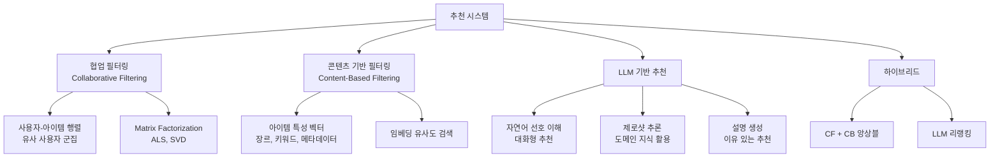
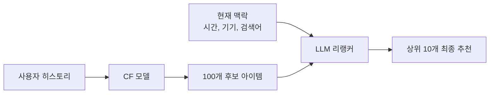

# AI 추천 시스템 (AI Recommendation Systems)

## 개요

추천 시스템(Recommendation System)은 사용자의 과거 행동, 선호, 아이템 특성을 기반으로 개인화된 콘텐츠나 상품을 제안하는 기술이다. 넷플릭스의 영화 추천, 아마존의 상품 추천, 유튜브의 다음 영상 자동재생이 모두 추천 시스템이다.

전통적 추천 알고리즘(협업 필터링, 콘텐츠 기반 필터링)은 각각 콜드 스타트 문제와 다양성 부족이라는 한계를 지녔다. LLM 기반 추천은 자연어 이해를 통해 복잡한 선호를 파악하고, 설명 가능하며(explainable), 대화형 상호작용을 지원하는 새로운 패러다임을 열었다. [[embedding-layers|임베딩 레이어]] 기술이 핵심 표현 학습을 담당하며, [[semantic-search|시맨틱 검색]]과 기술적 토대를 공유한다.

## 세 가지 추천 패러다임



### 협업 필터링 (Collaborative Filtering)

"당신과 비슷한 사람들이 좋아하는 것"이라는 원리다. 사용자-아이템 상호작용 행렬(평점, 클릭, 구매)을 기반으로 잠재 요인(latent factor)을 추출한다.

| 방식 | 알고리즘 | 강점 | 약점 |
|------|---------|------|------|
| 사용자 기반 | KNN | 직관적 | 확장성 부족 |
| 아이템 기반 | 코사인 유사도 | 안정적 | 다양성 부족 |
| 행렬 분해 | ALS, SVD++ | 확장성 우수 | 해석 어려움 |
| 신경망 | NCF, DeepFM | 비선형 패턴 | 훈련 비용 |

**콜드 스타트 문제**: 신규 사용자나 신규 아이템은 충분한 상호작용 데이터가 없어 추천이 불가능하다는 근본적 한계가 있다.

### 콘텐츠 기반 필터링 (Content-Based Filtering)

아이템의 특성(장르, 설명, 태그)을 벡터로 표현하고 사용자가 과거에 좋아한 아이템과 유사한 것을 추천한다. 신규 아이템에도 즉시 적용 가능하나, 사용자의 취향 변화나 다양성 탐색에 취약하다.

### LLM 기반 추천

LLM은 자연어로 표현된 복잡한 선호("공포스럽지 않고 서스펜스는 있는 영화")를 이해하고, 도메인 지식을 활용한 추론으로 추천한다.

```
사용자: "요즘 번아웃 상태인데, 가볍게 볼 수 있는 힐링 드라마 추천해줘. 
         한국 드라마는 아니었으면 좋겠고, 20분 내외 에피소드면 좋겠어."

LLM: "Ted Lasso (애플TV+)를 추천해요. 각 에피소드가 약 30분이고,
      미식축구를 전혀 몰라도 웃음과 따뜻함을 느낄 수 있어요.
      주인공의 긍정적 에너지가 번아웃 해소에 도움이 된다는 후기가 많아요."
```

## LLM 추천의 구현 패턴

### 패턴 1: 리랭킹 (Re-ranking)

기존 CF/CB 추천 결과를 후보군으로 생성하고, LLM이 사용자 프로필과 현재 맥락을 고려해 순위를 재조정한다.



### 패턴 2: 임베딩 유사도 검색

아이템 설명을 LLM 임베딩으로 변환하여 벡터 DB에 저장하고, 사용자의 자연어 쿼리를 임베딩하여 [[semantic-search|시맨틱 검색]]으로 유사 아이템을 찾는다.

### 패턴 3: 대화형 선호 수집

멀티턴 대화를 통해 사용자의 세밀한 선호를 점진적으로 파악하고, 대화 컨텍스트를 요약하여 추천 파라미터로 변환한다.

## 평가 지표

| 지표 | 설명 | 측정 대상 |
|------|------|---------|
| NDCG@K | 상위 K개 추천의 관련성 순위 가중 점수 | 정확도 |
| Hit Rate@K | 관련 아이템이 상위 K에 포함될 비율 | 정확도 |
| Precision@K | 상위 K개 중 실제 관련 아이템 비율 | 정밀도 |
| Diversity | 추천 목록의 다양성 (평균 아이템 간 거리) | 다양성 |
| Coverage | 전체 아이템 중 추천 가능한 비율 | 범위 |
| Novelty | 사용자에게 새로운 아이템의 비율 | 탐색성 |

## 주요 과제

**필터 버블(Filter Bubble)**: 사용자가 이미 좋아하는 콘텐츠만 계속 추천받아 시야가 좁아지는 현상. 다양성 강제 삽입(serendipity injection)으로 완화한다.

**프라이버시**: 개인화는 본질적으로 사용자 데이터 수집을 요구한다. 연합 학습(federated learning)이나 차등 프라이버시 기법이 대안으로 연구된다.

**편향(Bias)**: 인기 아이템 편향(popularity bias)으로 롱테일 아이템이 추천에서 소외된다. 역확률 가중치(IPW) 등의 디바이어싱 기법이 적용된다.

## 관련 문서
- [[dcn-deep-crossing-network]] -- DCN-v2 - 심층 교차 네트워크

- [[embedding-layers|임베딩 레이어]] - 아이템/사용자 표현 학습의 핵심 기술
- [[semantic-search|시맨틱 검색]] - 임베딩 기반 유사도 검색 기반 기술
- [[ai-search-engine|AI 기반 검색 엔진]] - 추천과 검색의 융합 패턴
