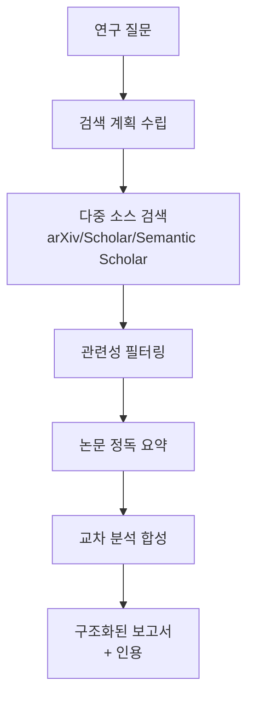

# AI 연구 보조 시스템

논문 검색, 요약, 비교, 인용 생성을 자율 수행하는 딥리서치 에이전트의 실제 적용 패턴. [[deep-research-agents-roadmap|딥 리서치 에이전트]]의 프로덕션 구현.

## 핵심 구성요소

| 컴포넌트 | 역할 |
|---------|------|
| 쿼리 분해 | 연구 질문을 하위 질문들로 분해 |
| 멀티소스 검색 | arXiv, Semantic Scholar, Google Scholar 병렬 검색 |
| 논문 요약 | 핵심 기여/방법/결과 자동 추출 |
| 교차 비교 | 여러 논문의 접근법/결과 비교표 생성 |
| 인용 관리 | 출처 추적, 참고문헌 자동 생성 |

## 주요 구현체

- **Claude Research**: [[anthropic-multi-agent-research-system|Anthropic 멀티에이전트]] 오케스트레이터-워커
- **Perplexity Pro**: 실시간 웹 검색 기반 연구 보조
- **Elicit**: 논문 특화 검색+요약

## 관련 문서

- [[deep-research-agents-roadmap]] -- 딥 리서치 로드맵
- [[anthropic-multi-agent-research-system]] -- Anthropic 멀티에이전트
- [[rag-pipeline]] -- RAG 파이프라인
- [[grounding-attribution]] -- 그라운딩과 출처 귀속
