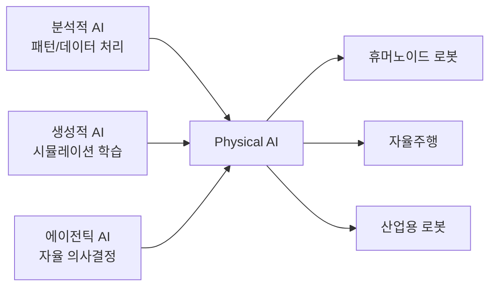

## 개요

Physical AI는 로봇이 물리적 세계를 실시간으로 인식하고, 학습하며, 자율적으로 행동할 수 있도록 하는 기술 패러다임이다. [[agentic-ai-foundation|에이전틱 AI]]의 물리 세계 확장이다. 분석적 AI(패턴 인식), 생성적 AI(시뮬레이션 기반 학습), 에이전틱 AI(복잡한 환경에서의 독립적 운영)를 결합하여 로봇이 비정형 환경에서도 작업을 수행할 수 있게 한다. Tesla Optimus, Figure AI 등 휴머노이드 로봇의 공장 투입이 확대되면서 [[ai-manufacturing|AI 제조업]]이 새로운 단계에 진입하고 있으며 산업 현장의 자동화 수준이 새로운 단계에 진입하고 있다. [[ai-scientific-discovery|과학 연구]]에서의 로봇 자동화도 빠르게 진전되고 있다.

## 핵심 개념

**Vision-Language-Action(VLA) 모델**: 컴퓨터 비전, 자연어 처리, 모터 제어를 통합하는 멀티모달 모델로 Physical AI의 핵심 아키텍처이다. 인간의 두뇌가 시각 정보를 해석하고 행동을 결정하는 과정과 유사하게, 로봇이 주변 환경을 해석하고 적절한 액션을 선택할 수 있게 한다.

**시뮬레이션-현실 격차(Sim-to-Real Gap)**: 시뮬레이션 환경에서 학습한 로봇이 현실 세계의 뉘앙스를 처리하지 못하는 문제. 강화학습(trial-and-error + 보상/페널티)과 모방학습(전문가 시연 복제)을 하이브리드로 결합하여 물리 법칙을 시뮬레이션에서 습득하지만, 현실 환경은 물리 근사치와 정확히 일치하지 않는다. Deloitte 분석에 따르면 "로봇이 시뮬레이션에서 물체를 잡는 법을 배웠더라도, 물리 공간에 진입하면 1:1 매칭이 되지 않는다"는 점이 지속적 과제이다.

**엣지 AI 프로세싱**: 신경 처리 장치(NPU)를 통해 클라우드 의존 없이 로봇 내부에서 저지연, 에너지 효율적인 실시간 AI 추론을 수행한다. 자율주행, 산업용 시스템, 원격 수술 등 네트워크 지연이 허용되지 않는 애플리케이션에서 필수적이다.

**NVIDIA Cosmos 월드 파운데이션 모델**: 로봇/자율주행을 위한 물리 AI 기초모델로, 9,000조 토큰으로 학습되었다. Predict 2.5(미래 예측), Reason 2(물리 추론), Transfer 2.5(도메인 전이) 세 가지 모듈로 구성된다.

## 학습 접근법

Physical AI의 학습 방식은 세 가지 축으로 구성된다:

| 접근법 | 원리 | 장점 | 한계 |
|---|---|---|---|
| 강화학습 | Trial-and-error + 보상/페널티 시스템 | 복잡한 행동 패턴 자율 발견 | 실환경 학습 시 안전 문제 |
| 모방학습 | 전문가 시연 복제 | 빠른 초기 학습 | 시연 범위 밖 상황 대응 어려움 |
| 하이브리드 | 시뮬레이션 강화학습 + 현실 파인튜닝 | 연속 학습 루프 형성 | Sim-to-Real 격차 잔존 |

## 현황 (2026)

- 글로벌 산업용 로봇 설치 규모 **167억 달러**로 사상 최고치 기록 (IFR, 2026.01)
- UBS 전망: 2035년까지 작업 현장 200만 대 휴머노이드 배치, 2050년 3억 대 가능성
- 총 시장 규모 2035년 300-500억 달러, 2050년 1.4-1.7조 달러 예상
- 휴머노이드 제조 비용 2025년 35,000달러에서 향후 10년 내 **13,000-17,000달러**로 하락 전망 (2023-2024 사이 40% 하락)
- Amazon: DeepFleet AI 조율로 플릿 효율 10% 개선, 로봇 **100만 대** 배치 달성
- Waymo 유료 로보택시 **1,000만 건** 완료
- Aurora Innovation: 댈러스-휴스턴 간 최초 상용 자율주행 트럭 서비스 개시
- BMW 사우스캐롤라이나 공장에서 정밀 작업용 휴머노이드 테스트 진행

## IFR 5대 글로벌 로보틱스 트렌드 (2026)

1. **AI & 자율성**: 분석적/생성적/에이전틱 AI 결합으로 로봇 자율성 향상
2. **IT/OT 융합**: 실시간 데이터 교환 기반 스마트 팩토리/물류 고도화
3. **휴머노이드 로봇**: 프로토타입에서 창고/제조 현장 실배치로 전환 -- 사이클 타임, 에너지 소비, 유지보수 비용이 산업 표준 충족 필수
4. **안전 & 보안**: AI 기반 자율성이 안전 패러다임 근본적 변화. ISO 준수 + 명확한 책임 프레임워크 필요. 로봇 컨트롤러/클라우드 해킹 시도 증가
5. **노동력 격차 해소**: 인력 부족 보완 + 단순 반복 업무 대체 + 새로운 커리어 기회 창출

## 전망/과제

**기술적 과제**: Sim-to-Real 격차 해소, 비정형 환경에서의 안전성 확보, 이종 멀티벤더 로봇 플릿 조율이 핵심 난제이다. 작은 오류율이 물리 시스템 전체로 전파되어 생산 폐기물, 장비 손상, 안전 사고로 이어질 수 있으며, AI 환각이 전체 생산 라인에 전파되면 후속 비용이 증폭된다.

**보안/규제**: 커넥티드 로봇 플릿의 사이버보안 취약점, 관할권 간 중첩되는 규제 요건, 센서 데이터 프라이버시 문제가 산적해 있다. 로봇 컨트롤러와 클라우드 플랫폼을 표적으로 한 해킹 시도가 보고되고 있어 보안 프레임워크 강화가 시급하다.

**적용 확산**: 현재 주도 영역은 창고/물류(Amazon, 자율 배송), 자율주행(Waymo, Aurora), 스마트 제조(BMW 휴머노이드)이며, 향후 의료(로봇 수술, 환자 보조), 인프라 점검(교량, 전력망 드론), 라스트마일 배송, 가정용(노인 돌봄, 청소, 식사 준비) 등으로 확대될 전망이다. 비용 하락과 에이전틱 AI 통합 성숙이 가정용 로봇 보급의 전제 조건이다.

## 주요 기업/프로젝트

| 기업/프로젝트 | 영역 | 현황 (2026) |
|---|---|---|
| **Tesla Optimus** | 휴머노이드 | 공장 내부 작업 테스트 확대 |
| **Figure AI** | 휴머노이드 | BMW 등 제조 파트너십 |
| **Amazon Robotics** | 물류 | DeepFleet AI, 100만 대 배치 |
| **Waymo** | 자율주행 | 유료 로보택시 1,000만 건 |
| **Aurora Innovation** | 자율주행 트럭 | 댈러스-휴스턴 상용 서비스 |
| **NVIDIA Cosmos** | 기초모델 | 9,000조 토큰 학습, Predict/Reason/Transfer |
| **Boston Dynamics** | 산업용 로봇 | Spot/Stretch 상용 배치 |

## 관련 문서
- [[digital-twin-composer]] -- Siemens Digital Twin Composer

- [[enterprise-ai-adoption]] - 기업 AI 도입과 에이전틱 배치
- [[ai-healthcare]] - 의료 분야 AI 적용
- [[mlops-llmops-2026]] - AI 프로덕션 시스템 인프라
- [[nvidia-cosmos]] - 로봇/자율주행 물리 AI 기초모델
