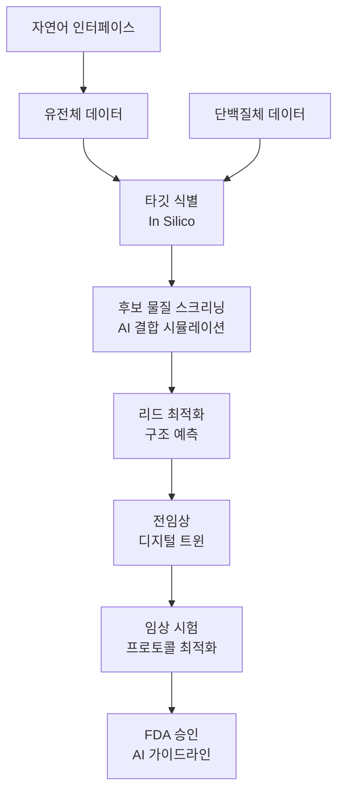

# AI for Scientific Discovery & Drug Design

## 개요

2026년은 AI가 신약 발견과 과학 연구에서 선택 사항이 아닌 필수 인프라로 전환되는 해로 평가된다. [[ai-healthcare|의료 AI]]와의 연결이 깊어지며 바이오·헬스 AI 생태계를 형성한다. AI 설계 바이오의약품이 임상 시험에 진입하고, FDA의 AI 가이드라인 확정이 임박하며, 약물 발견 초기 단계(타깃 식별, 후보 물질 선별, 결합 시뮬레이션)에서 AI가 전통적 실험 방식을 근본적으로 변화시키고 있다.

기존 신약 개발 과정이 평균 10-15년, 20억 달러 이상의 비용이 소요되던 것에 비해, AI 기반 접근법은 가설 검증 주기를 크게 단축하고 후보 물질의 조기 확신도를 높여 전체 파이프라인의 효율성을 개선한다. [[enterprise-ai-adoption|엔터프라이즈 AI 도입]]이 제약사와 연구기관으로 확산되고 있다.

## 핵심 개념

### 4대 전환 축 (2026)

**1. AI 주도 타깃 식별 (In Silico Exploration)**
2026년부터 질병 타깃 식별이 _in silico_ 탐색으로 시작된다. 웻랩(wet-lab) 검증 이전에 컴퓨테이셔널 분석이 선행되며, AI 플랫폼이 유전체(genomic), 단백질체(proteomic), 전사체(transcriptomic) 데이터셋을 통합 분석하여 기존에 발견하지 못한 질병 메커니즘을 드러낸다.

**2. 구조 예측 및 결합 시뮬레이션의 실험실 통합**
단백질 구조 예측과 결합 시뮬레이션 도구가 실험실 시스템에 직접 내장된다. 과학자들이 실험 전에 친화도(affinity)와 특이성(specificity)을 컴퓨테이셔널하게 평가하여 시행착오를 줄인다.

**3. 대규모 유전체 데이터 분석의 민주화**
유전체 데이터 분석에 필요한 방대한 연산 수요를 자연어 인터페이스로 접근할 수 있게 된다. [[ai-data-analysis|에이전틱 애널리틱스]] 도구들이 이 접근성 확대를 주도한다. 전문 코딩 기술 없이도 복잡한 유전체 데이터를 질의하고 분석할 수 있어 분석 접근성이 확대된다.

**4. 디지털 트윈의 임상 개발 실전 투입**
디지털 트윈이 파일럿에서 임상 개발 실전으로 이동한다. FDA 등 규제 기관의 명확한 가이드라인이 뒷받침하며, 프로토콜 최적화와 임상 시험 가속에 활용된다.

### AI 신약 발견 파이프라인

## 기술 상세

### FDA AI 가이드라인 동향

FDA는 AI 기반 의약품 개발에 대한 규제 프레임워크를 적극적으로 확장하고 있다:

- **2025.01**: AI 모델의 임상 활용에 대한 위험 기반 신뢰성 평가(credibility assessment) 프레임워크 초안 발표. "사용 맥락(context of use)"과 지속적 성능 평가를 강조
- **2025.04**: 많은 의약품 유형에 대한 의무 동물 실험 단계적 폐지를 발표 -- in silico 방법론으로의 패러다임 전환 신호
- **2026**: 리스크 기반 가이드라인 확정 임박. 디지털 트윈의 임상 시험 적용, AI 생성 후보 물질의 승인 경로에 대한 규제 명확성 제고

### 구체적 사례와 진전

**AI 설계 후보 물질의 임상 진입**: Insilico의 ISM6200(난소암 및 코르티솔 장애)이 AI 설계 의약품 후보로 발표되었으며, 복수의 AI 유래 소분자 후보가 Phase I 임상 시험에 진입했다. 전통적 방식으로 약 5년이 소요되는 발견-전임상 단계를 일부 사례에서 2년 이내로 단축한 것이 주목할 만하다. 다만 2026년 4월 기준 AI가 발견한 의약품 중 정식 승인을 받은 것은 아직 없으며, 대부분 초기 임상 단계에 머무르고 있다.

**Boltz-2 구조 예측**: MIT와 Recursion이 공동 발표한 Boltz-2는 단백질 구조와 결합 친화도를 수 초 내에 예측하는 차세대 AI 모델로, NVIDIA NIM/BioNeMo 플랫폼에서 활용 가능하다.

### AI가 변화시키는 구체적 영역

| 기존 방식 | AI 기반 방식 | 효과 |
|----------|-----------|------|
| 웻랩 우선 타깃 탐색 | In silico 선행 탐색 | 탐색 범위 확대, 비용 절감 |
| 시행착오 기반 결합 실험 | 컴퓨테이셔널 친화도 예측 (Boltz-2 등) | 후보 물질 조기 필터링 |
| 수동 프로토콜 설계 | 디지털 트윈 최적화 | 임상 시험 기간 단축, 프로토콜 수정 감소 |
| 전문 코딩 필요 유전체 분석 | 자연어 기반 분석 | 분석 접근성 민주화 |
| 의무 동물 실험 | In silico 독성/약동학 예측 | 윤리적 개선 + 비용/시간 절감 |

### 디지털 트윈의 실전 투입

디지털 트윈은 개별 세포부터 인체 전체에 이르는 다양한 복잡도의 가상 표현으로, in silico 시뮬레이션과 실험을 가능하게 한다. 2026년에는 파일럿에서 임상 개발 실전으로 이동하며:

- **프로토콜 최적화**: 임상 시험 프로토콜을 사전 시뮬레이션하여 수정(amendment) 횟수 감소
- **환자 모집 효율화**: 가상 코호트를 통해 적절한 환자군 식별
- **용량-반응 모델링**: 최적 투여량을 in silico에서 탐색

### 과제와 한계

- AI 설계 후보 물질의 임상 실패율은 여전히 높으며, 실험적 검증의 대체가 아닌 보완 도구로 보는 것이 현실적이다
- 학습 데이터의 편향이 발견되지 않은 메커니즘에 대한 탐색을 제한할 수 있다
- 규제 프레임워크가 AI 발전 속도를 따라가지 못하는 격차가 존재하지만, FDA의 적극적 가이드라인 개발로 간극이 좁혀지는 추세
- AI 유래 의약품의 Phase II/III 성공률 데이터가 아직 충분하지 않아, AI의 실제 ROI에 대한 근본적 검증이 향후 수년간 진행될 전망

## 관련 문서

- [[ai-hot-topics-2026-04]] -- 2026년 AI 핫토픽 종합
- [[ai-data-analysis]] -- AI 데이터 분석 및 에이전틱 애널리틱스
