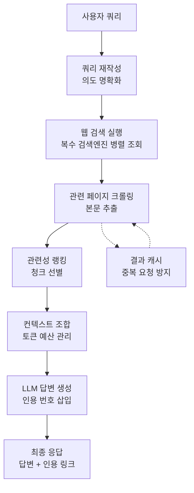
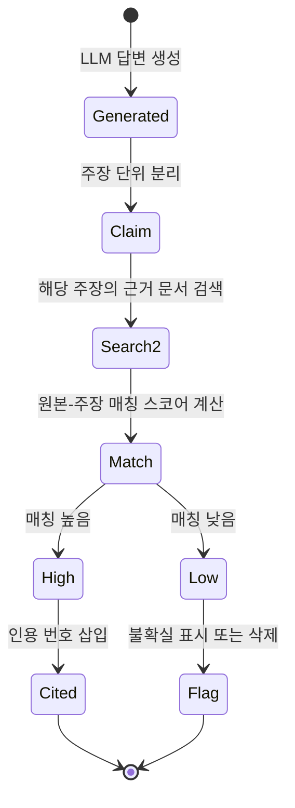

# AI 기반 검색 엔진 (AI-Powered Search Engine)

## 개요

AI 기반 검색 엔진은 전통적인 키워드 검색 결과 목록 대신, 검색 쿼리에 대한 직접적인 답변을 자연어로 생성하고 원본 출처를 인용하는 대화형 정보 탐색 시스템이다. Perplexity AI가 이 카테고리를 대중화했으며, Google의 AI Overviews, Microsoft Bing Copilot이 주요 검색 엔진에서 이 패턴을 채택했다.

핵심 기술 스택은 [[rag-pipeline|RAG 파이프라인(Retrieval-Augmented Generation)]]이다. 웹 검색으로 최신 문서를 가져오고 LLM이 이를 합성하여 답변을 생성한다. [[grounding-attribution|그라운딩과 어트리뷰션]] 기술이 AI 생성 답변과 원본 출처를 연결하여 검증 가능성을 보장한다.

## 아키텍처: 검색-합성-인용 파이프라인

## 핵심 구성 요소

### 1. 쿼리 이해와 재작성

원시 쿼리를 그대로 검색 API에 전달하는 것보다 의도를 파악하여 복수의 서브쿼리로 분해하거나 검색 최적화된 형태로 재작성하면 검색 품질이 높아진다.

예시:
- 원본: "파이썬 빠른 거"
- 재작성: "파이썬 성능 최적화 기법", "파이썬 속도 향상 방법 2024"

### 2. 멀티소스 검색과 신선도 관리

| 소스 유형 | 특징 | 신선도 |
|----------|------|-------|
| 범용 웹 검색 | 광범위한 커버리지 | 실시간 |
| 학술 데이터베이스 | 신뢰도 높음, 최신 연구 | 주 단위 |
| 뉴스 API | 속보, 최신 사건 | 시간 단위 |
| 도메인 특화 DB | 깊이 있는 전문 정보 | 도메인별 상이 |

### 3. 그라운딩과 인용 생성

LLM이 생성한 각 문장을 특정 원본 문서와 연결하는 과정이다. 인용 품질의 세 가지 차원:

- **정확성(Faithfulness)**: 생성 내용이 인용한 원본과 실제로 일치하는가
- **관련성(Relevance)**: 가장 권위 있는 출처를 인용하는가
- **완전성(Coverage)**: 주요 출처를 빠뜨리지 않았는가

### 4. 대화형 후속 질문 처리

단발성 검색과 달리 AI 검색 엔진은 멀티턴 대화를 지원한다. 이전 대화 맥락을 유지하여 "그 중 셋째 방법은 파이썬에서 어떻게 구현해?"처럼 참조 표현을 이해한다.

## Perplexity 스타일 UX 패턴

Perplexity AI가 정립한 AI 검색 UX의 핵심 요소:

| 요소 | 설명 |
|------|------|
| 직접 답변 우선 | 링크 목록 대신 자연어 요약 먼저 제시 |
| 인라인 인용 | 각 문장 말미에 [1][2][3] 형태로 출처 표시 |
| 출처 패널 | 우측 사이드바에 원본 링크와 미리보기 |
| 후속 질문 제안 | 관련 탐색 방향을 하단에 제시 |
| 최신성 표시 | 정보 생성 날짜 및 검색 실행 시각 표시 |

## 전통적 검색 vs AI 검색 비교

| 측면 | 키워드 검색 | AI 검색 |
|------|----------|--------|
| 결과 형태 | 링크 목록 | 합성된 자연어 답변 |
| 탐색 방식 | 사용자가 문서 읽고 판단 | AI가 1차 합성 후 제공 |
| 최신성 | 인덱스 기준 최신 | 실시간 크롤링 |
| 복잡한 질문 | 분해 필요 | 자연어 그대로 처리 |
| 출처 신뢰성 | 사용자가 직접 판단 | AI가 일부 필터링 |
| 오류 위험 | 낮음 (원본 그대로) | 환각 위험 존재 |

## 주요 제품 현황 (2026년 기준)

| 제품 | 개발사 | 특징 |
|------|-------|------|
| Perplexity AI | Perplexity | AI 검색 선구자, Pro Search 기능 |
| Google AI Overviews | Google | 기존 검색과 통합, 대규모 트래픽 |
| Bing Copilot | Microsoft | GPT-4 기반, Edge 통합 |
| You.com | You.com | 멀티모달 검색, 앱 생태계 |
| Kagi | Kagi Systems | 광고 없는 유료 AI 검색 |

## 기술적 과제

**환각(Hallucination)**: AI가 실제 검색 결과에 없는 내용을 생성할 위험. 엄격한 그라운딩과 팩트 체크 레이어로 완화한다.

**출처 편향**: 상위 검색 결과에 편향되어 다양한 관점이 소외될 수 있다. 멀티소스 에이전트 탐색으로 보완한다.

**SEO 교란**: AI 합성 답변이 트래픽을 흡수하면서 원본 출처 사이트의 방문자가 감소하는 미디어 생태계 문제가 부상하고 있다.

**실시간 정보 처리 비용**: 모든 쿼리마다 웹 크롤링과 LLM 추론을 실행하면 전통적 키워드 검색 대비 비용이 10-100배 증가한다.

## 관련 문서

- [[rag-pipeline|RAG 파이프라인]] - AI 검색의 핵심 기술 기반
- [[grounding-attribution|그라운딩과 어트리뷰션]] - 인용 생성과 팩트 연결
- [[semantic-search|시맨틱 검색]] - 의미 기반 문서 검색 기술
- [[ai-recommendation-systems|AI 추천 시스템]] - 개인화 검색과의 교차점
