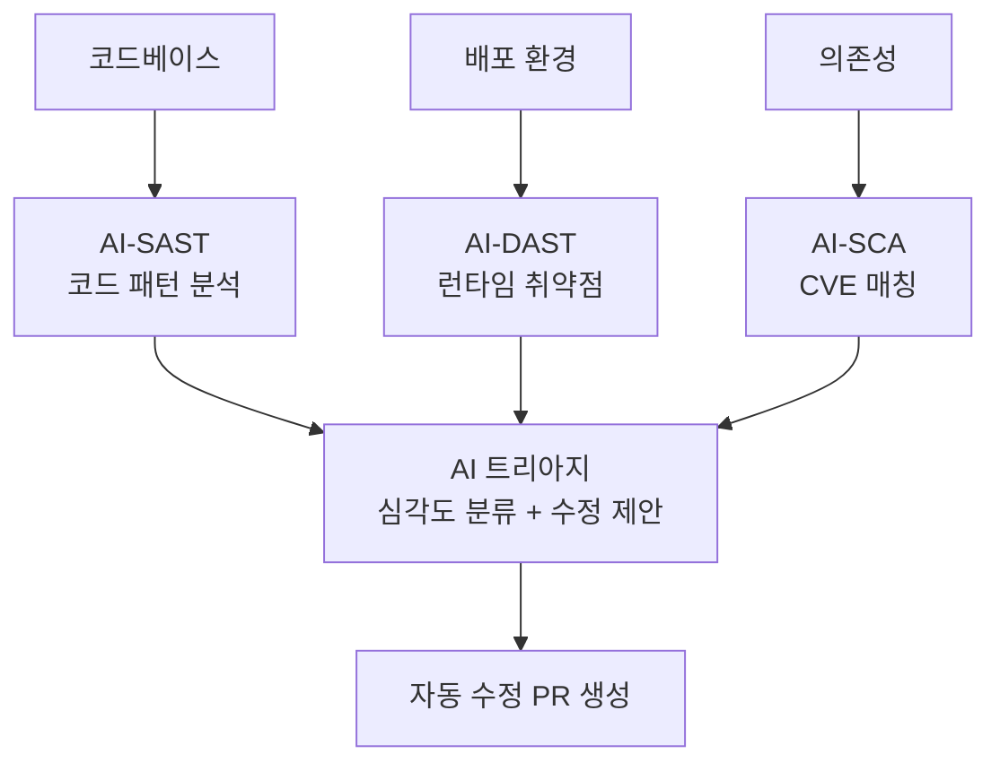

# AI 보안 취약점 스캐닝

SAST(정적 분석), DAST(동적 분석), SCA(소프트웨어 구성 분석)를 AI로 강화하여 코드베이스, 의존성, 인프라의 취약점을 자율 탐지하는 패턴.

## AI가 강화하는 영역

| 기존 도구 | AI 강화 |
|----------|---------|
| 규칙 기반 패턴 매칭 | LLM 의미 이해로 컨텍스트 인지 탐지 |
| 높은 오탐률 | AI 트리아지로 실제 위험 우선순위화 |
| 탐지만 | **자동 수정 코드 제안/PR 생성** |
| 알려진 패턴만 | 제로데이 패턴 추론 |

## [[ai-code-review-automation|코드 리뷰 자동화]]와의 관계

코드 리뷰는 PR 단위 품질 검토, 보안 스캐닝은 전체 코드베이스의 취약점 탐색. 보안 스캐닝 결과를 코드 리뷰에 통합하는 것이 이상적 CI/CD 파이프라인.

## 관련 문서

- [[ai-code-review-automation]] -- AI 코드 리뷰 자동화
- [[agent-prompt-injection-defense]] -- 프롬프트 인젝션 방어
- [[ai-devops-cicd]] -- AI DevOps
- [[vibe-coding-security-horror-story]] -- 바이브 코딩 보안 참사
