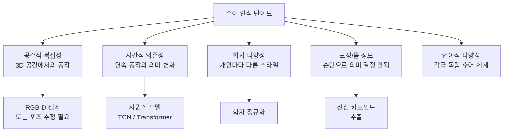
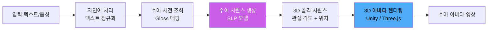
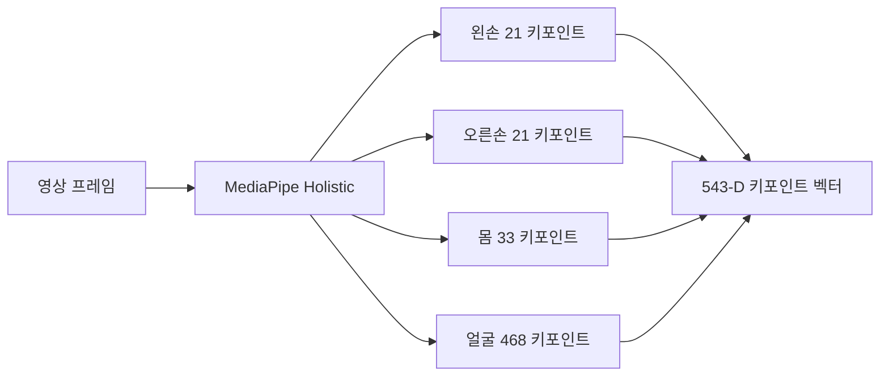
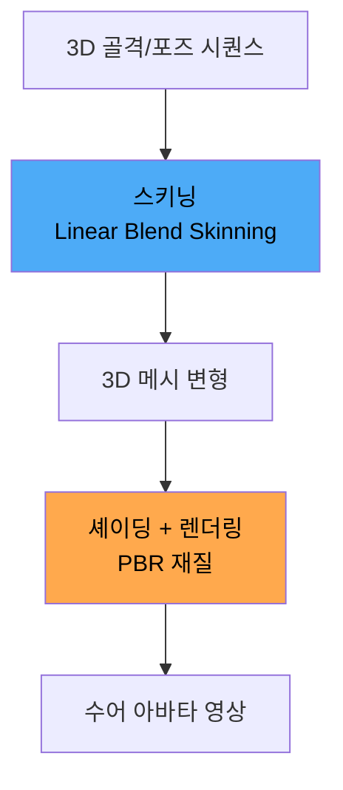

# AI 수어 인식 및 생성

## 개요

AI 수어(Sign Language) 기술은 청각 장애인이 사용하는 수화(手話)를 자동으로 인식하고 생성하는 기술이다. 수어는 단순한 손 모양(수형)만이 아니라 손의 위치(수위), 움직임(수동), 표정, 몸의 방향이 결합된 시각 언어로, 각 국가·지역마다 독립적인 문법을 가진다. AI는 이 복잡한 시각 신호를 처리해 청각 장애인과 비청각 장애인 간 의사소통 장벽을 낮춘다.

두 가지 주요 방향:
- **수어 인식(SLR, Sign Language Recognition)**: 수어 동작을 텍스트/의미로 변환
- **수어 생성(SLP, Sign Language Production)**: 텍스트/음성을 수어 동작(아바타)으로 변환

## 핵심 아이디어

### 수어가 어려운 이유



일반 이미지 분류와 달리 수어는 **시공간적(spatio-temporal)** 신호다. 같은 손 모양이라도 위치와 움직임이 다르면 다른 의미다.

### 수어 인식 레벨

| 레벨 | 정의 | 예시 |
|------|------|------|
| 수지(手指) 문자 인식 | 알파벳을 손으로 표현한 정적 제스처 | 지문자 A-Z |
| 고립 단어 인식 (ISLR) | 단일 수어 단어 분류 | "사랑해", "감사합니다" |
| 연속 수어 인식 (CSLR) | 자연스럽게 이어지는 수어 문장 | 분할 경계 없이 인식 |
| 수어 번역 (SLT) | 수어 영상 -> 자연어 텍스트 | 음성 인식과 유사 |

## 시스템 아키텍처

### 수어 인식 파이프라인

```mermaid
flowchart TD
    subgraph 입력
        V[RGB 영상] --> PP[전처리\n배경 제거, 정규화]
        D[깊이(Depth) 맵] --> PP
    end

    subgraph 특징 추출
        PP --> POSE[전신 포즈 추정\nMediaPipe Holistic\nOpenPose]
        PP --> VISUAL[시각 특징 추출\nCNN / ViT]
        POSE --> KP[키포인트 시퀀스\n손 21점 × 2 + 몸 33점 + 얼굴 468점]
    end

    subgraph 시퀀스 모델링
        KP --> TCN[시간적 합성곱\nTCN]
        VISUAL --> TRANS[Transformer\n시공간 어텐션]
        TCN & TRANS --> FUSE[특징 융합]
    end

    subgraph 디코딩
        FUSE -->|ISLR| CLS[분류기\nSoftmax]
        FUSE -->|CSLR| CTC[CTC 디코딩\nConnectionist Temporal]
        FUSE -->|SLT| SEQ2SEQ[Seq2Seq\n번역 디코더]
        CLS & CTC & SEQ2SEQ --> OUT[인식 결과\n텍스트 출력]
    end
```

### 수어 생성 (아바타 렌더링) 파이프라인



## 주요 기술 컴포넌트

### 1. RGB-D 센서와 깊이 정보

RGB 카메라만으로는 손의 3D 위치를 정확히 파악하기 어렵다. 깊이(Depth) 카메라(Intel RealSense, Azure Kinect)를 추가하면 각 픽셀의 깊이 정보를 얻어 3D 포즈 추정 정확도가 크게 향상된다.

**깊이 정보의 장점:**
- 손이 겹치는 상황(폐색, occlusion)에서도 분리 가능
- 3D 궤적 추출로 이동 방향 벡터 정확도 향상
- 배경과 전경 분리 용이

단점: 실외에서 일광 간섭, 야간 성능 저하, 고가의 하드웨어.

### 2. 전신 키포인트 추출

MediaPipe Holistic은 CPU에서 실시간으로 손(21점 × 2), 포즈(33점), 얼굴(468점) 키포인트를 추출한다. 총 **543개 키포인트**가 하나의 수어 프레임을 기술한다.



### 3. 시공간 그래프 합성곱 (ST-GCN)

수어의 신체 관절을 그래프로 모델링한다. 노드는 관절, 엣지는 신체 연결이다. 시간 축과 공간 축에서 동시에 합성곱을 수행해 동작 패턴을 학습한다. 액션 인식(action recognition) 분야에서 발전한 기법을 수어에 적용한 것이다.

### 4. CTC (Connectionist Temporal Classification)

연속 수어 인식에서 수어 동작과 글로스(Gloss, 수어 단어의 표기) 간 얼라인먼트(alignment)를 자동 학습한다. 음성 인식의 CTC와 동일한 원리로, 레이블이 없는 시간 위치에서도 학습이 가능하다.

### 5. 생성 모델 (SLP)

텍스트에서 수어 동작 시퀀스를 생성하는 것은 더 어렵다. 포즈 시퀀스 생성에는 다음 방법들이 쓰인다:

| 방법 | 접근 | 장점 | 단점 |
|------|------|------|------|
| 검색 기반 | 사전에서 글로스 조회 후 접합 | 빠름, 정확 | 자연스러운 전환 어려움 |
| 회귀 기반 | 트랜스포머로 포즈 직접 예측 | 유연함 | 학습 데이터 부족 |
| 확산 모델 기반 | Diffusion으로 포즈 시퀀스 생성 | 자연스러운 동작 | 느린 추론 |
| GAN 기반 | 생성자-판별자로 학습 | 다양성 | 학습 불안정 |

## 3D 아바타 생성

수어 동작을 실제 영상처럼 렌더링하는 것은 별도 기술 영역이다.



**아바타 유형:**
- **카툰 아바타**: 단순화된 그래픽, 실시간 렌더링 용이, 수어 전달력은 낮을 수 있음
- **포토리얼 아바타**: NeRF/3DGS 기반 고품질 렌더링, 계산 비용 높음
- **실제 영상 기반**: 실제 수어 통역사 영상을 활용해 자연스러운 표현 유지

## 실제 사례

### Google SignSpeech / Google Translate 수어
Google은 ASL(American Sign Language) 인식을 Google Translate 앱에 통합하는 프로젝트를 진행해 왔다. 스마트폰 카메라로 수어를 인식해 텍스트로 변환하는 기능이다.

### Microsoft Azure AI 수어 인식
Azure Cognitive Services에 수어 인식 API를 포함하는 방향으로 개발이 진행 중이다. 미국 수어(ASL), 영국 수어(BSL) 등 주요 수어 지원을 추진한다.

### SignAll
헝가리 스타트업 SignAll은 3D 카메라 + AI를 이용해 ASL 수어를 인식하고 텍스트로 변환한다. 청각 장애인의 취업 면접, 의료 상담 등 전문적 환경에서 활용을 목표로 한다.

### Knovation / Signly
텍스트/영상 콘텐츠에 자동으로 수어 아바타 번역을 추가하는 서비스다. 웹사이트 접근성 향상을 위해 HTML 자막 위에 수어 오버레이를 실시간 제공한다.

### KETI (한국전자기술연구원) - 한국 수어 데이터셋
한국에서는 KETI가 구축한 한국 수어 데이터셋(KSL 데이터셋)이 연구 기반을 제공한다. 약 40만 문장 규모의 수어 영상 데이터를 포함한다.

## 데이터셋

수어 AI 연구의 가장 큰 병목은 데이터 부족이다.

| 데이터셋 | 수어 | 규모 | 특징 |
|---------|------|------|------|
| PHOENIX-14T | 독일 수어(DGS) | 8,000 문장 | 날씨 방송 도메인 |
| CSL-Daily | 중국 수어 | 20,000 문장 | 일상 대화 |
| How2Sign | ASL | 35,000 발화 | RGB-D + 포즈 |
| BOBSL | BSL | 1,400시간 | 방송 자막 정렬 |
| KSL 데이터셋 | 한국 수어 | 40만 문장 | KETI 구축 |

데이터 수집의 어려움: 전문 수어 통역사 섭외, 촬영 환경 통제, 어노테이션 비용.

## 한계 및 트레이드오프

| 항목 | 내용 |
|------|------|
| 데이터 부족 | 소수 언어 수어는 데이터가 극히 적음 |
| 폐색 처리 | 손이 서로 겹치거나 몸에 가려지면 인식률 급락 |
| 실시간 처리 | 3D 포즈 추정 + 딥러닝 추론을 실시간(< 100ms)으로 처리하기 어려움 |
| 아바타 자연스러움 | 생성 수어 아바타가 어색하면 오히려 소통 방해 (불쾌한 골짜기) |
| 표현 다양성 | 같은 단어도 화자마다, 지역마다 다르게 표현 |
| 비수동 신호 | 표정과 입 모양도 문법적 요소인데 현재 모델은 손에 집중 |

## 윤리 이슈

- **청각 장애 커뮤니티 참여**: 수어 AI 개발에 실제 수어 사용자가 참여하지 않으면 당사자 요구와 괴리된 기술이 만들어진다. "우리 없이 우리에 대해(Nothing About Us Without Us)" 원칙이 중요하다.
- **수어 다양성 존중**: ASL이 전 세계 수어를 대표하지 않는다. 각국·지역마다 별개의 수어 체계가 있고, AI는 이 다양성을 존중해야 한다.
- **의존성 위험**: AI 번역에 의존하게 되면 인간 수어 통역사 직종 위협이라는 우려가 있다. 고위험 환경(의료, 법정)에서는 여전히 전문 인간 통역사가 필요하다.
- **프라이버시**: 실시간 카메라 처리는 사용자 영상 데이터 수집·저장 우려를 수반한다.

## 관련 문서

- [[ai-accessibility-tools]] - 수어를 포함한 전반적 접근성 AI
- [[video-understanding]] - 비디오 이해 모델 기반 기술
- [[3d-avatar]] - 3D 아바타 생성 기술
- [[ai-realtime-translation]] - 음성 번역과의 통합
- [[pose-estimation]] - 포즈 추정 기술
